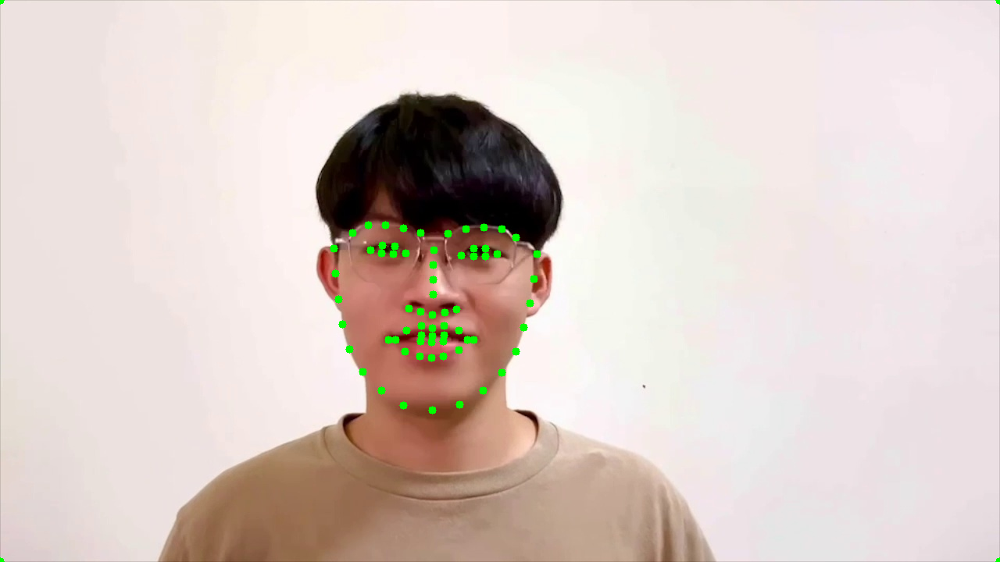
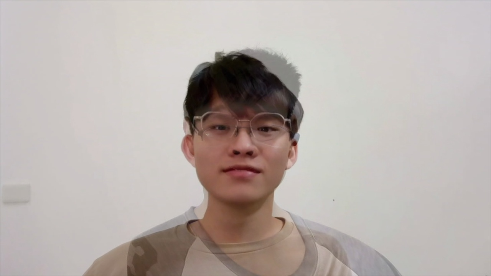

**Computer Vision Final Project: Face Morphing, CSIE 4B, 408410120 鍾博丞**

---

# Environment Requirements

- Python 3.0 or newer: for formatting string `f""`.
  - `dlib`: for the key points labeling
  - `numpy`: for image saving data structure
  - `opencv-python`==4.5.5.62
    - For reading, writing images and videos.
    - Get video information, such as total frame, fps, etc.
    - The version 4.5.5.62 is the newest that support type hinting in Pycharm. You can install the newer version if you don't need hint.
  - `scipy`: for implementing Delaunay Triangulation.
  - `tqdm`: for showing morphing progress.
- Linux
  - `wget`: for downloading the face landmarks detector of `dlib`.
  - `tar`: for unzip the download file.
  - <font color=#FF0000>`cmake`: for installing `dlib`</font>
    - Note that if you are in Windows environment, `cmake` may fail to install `dlib`. We strongly suggest to use Linux instead.

# Usage

The entire pipeline of algorithms are implemented in `main.py`, all you need to do is to configure your own parameters, which will describe latter, put your source video into folder `Source_Video`  and run

```bash
python main.py
```

Then, you'll get morphing frames. Go ahead to edit and create your own video. You can use `kdenlive` or `Adobe Premiere`, etc. to complete this project.

## Parameters

The beginning of the `main.py` has the following settings.

```python
filename = {
    "former": "A.mp4",
    "latter": "B.mp4"
}
path = {
    "source": "./Source_Video/",
    "extraction": "./Frame_Extraction/",
    "result": "./Result_Frame/"
}
name = {
    0: "A",
    1: "B"
}
num_frame = 15
```

- `filename` specifies the former and latter source videos you want to concatenate. These two videos must put in the folder `Source_Video`.
- `path` specifies the folder paths. The `extraction` and `result` will be deleted and recreated automatically.
- `name` specifies the name of extracted frames, the former frames are 0 and the latter frames are 1. You can modify to your favorite name.
  - The name of extracted frames will be like `A_0001.jpg`.
- `num_frame` specifies the frames you want to extract.

# Methods

1. First of all, we extract the frames from the two videos, the function `frame_extration.frameEx(src, savedir, name, frame)` extracts the video `src` for given `frame`

   - If the frame is positive, then this function will extract the first few `frame`.
   - If the frame is negative, then this function will extract the last few `frame`.

   Therefore, we set `frame` for the former video to be negative and that for the latter video to be positive.

2. Next, we create the dictionary mapping two associated frames. e.g. `A_0001.jpg: B_0001.jpg`.

3. For each frame in frame list, we create the key points of each frame, then we use `scipy.spatial.Delaunay()` to calculate the Delaunay Triangulation relationship based on the key points of the first frame image.

4. Once we have the key points and the Delaunay Triangulation relationship, we can do the image morphing and write the result into `Result_Frame`. The alpha value depends on `num_frame`. Take the setting shown above for example, the alpha of the first morphing frame is $\dfrac{1}{15}$ and the second morphing frame is $\dfrac{2}{15}$.

5. The filename of the results will be like `R_0001.jpg`.

# Experiment Results

Below shows the label predicted by `dlib`.



We add the 4 boundary points for image morphing and thus you can see 4 points at the corners of the image.


Next, we show the 7th morphing frame in the below.




# Discussion

I am very bad at dancing, please forgive me.

Our result is pretty good, we use multiple frame pairs to morphing instead of just taking 1 frame pair. Therefore, you can see actions of two people during morphing stage.


# Reference

https://github.com/spmallick/learnopencv/tree/master/FaceMorph

http://dlib.net/face_landmark_detection.py.html

https://hardliver.blogspot.com/2017/07/dlib-dlib.html
