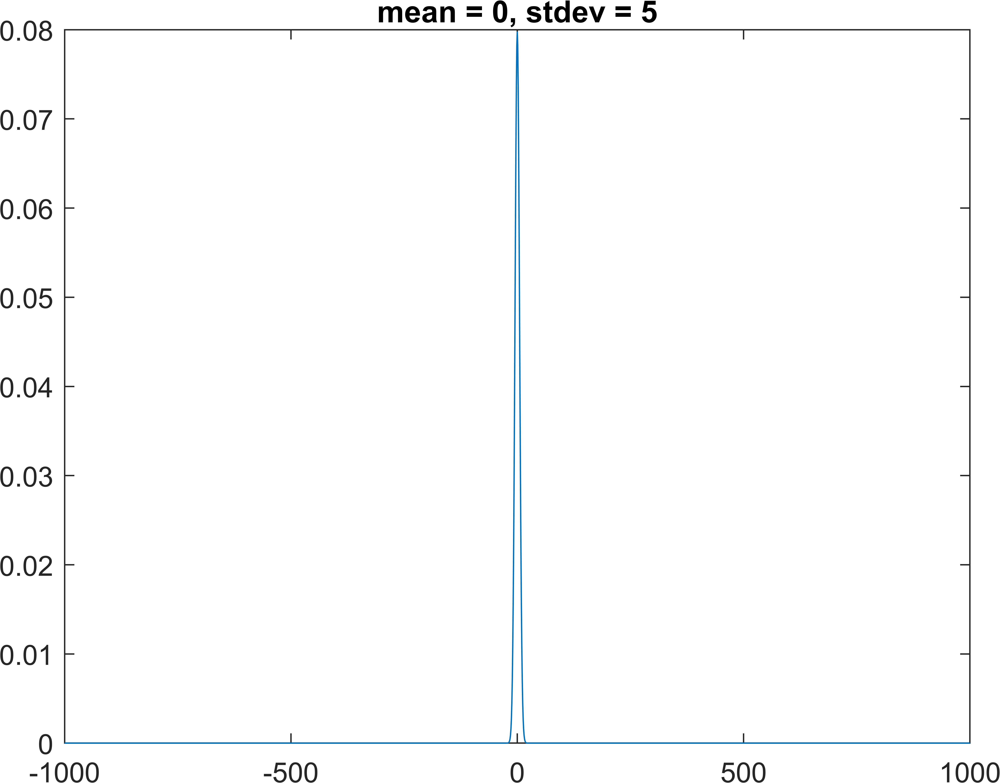
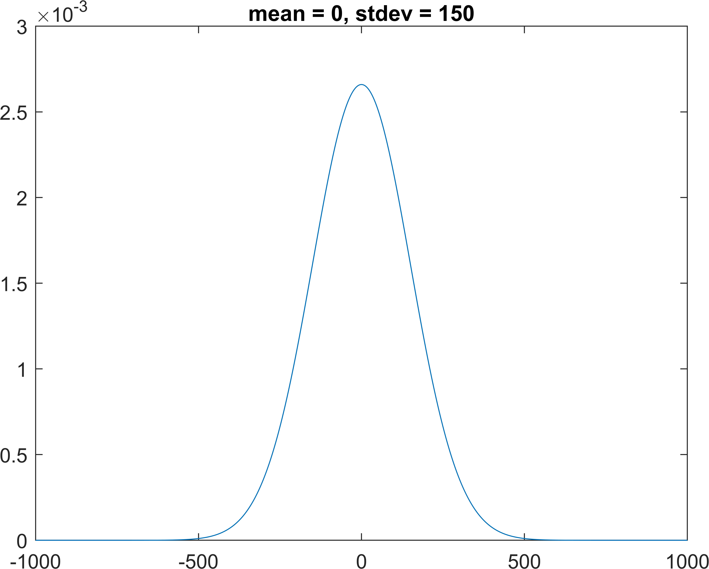
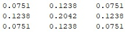
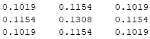

**Computer Vision HW01 \-  CSIE 4B 408410120  鍾博丞**

---

**Environment Requirements**

MATLAB R2020a \- for `exportgraphics()`

Statistics and Machine Learning Toolbox \- for `normpdf()`, `mvnpdf()`, ..., etc.

*This MarkDown file is edited by Typora*

## Plot Gaussian Distribution using MATLAB

Plot the 1D Gaussian curve for x = -1000 to 1000 with step size = 1 (-1000, -999, -998, ..., 998, 999, 1000) and the following $\mu$ and $\sigma$:

a) $\mu = 0$, $\sigma = 5$

b) $\mu = 0$, $\sigma = 150$

---

Produce the 3\*3 Gaussian filter by 2-D Gaussian formula with

a) $\mu = 0$, $\sigma = 1$ and

$$
\begin{bmatrix}
    0.0751 & 0.1238 & 0.0751 \\
    0.1238 & 0.2042 & 0.1238 \\
    0.0751 & 0.1238 & 0.0751
\end{bmatrix}
$$

b) $\mu = 0$, $\sigma = 4$

$$
\begin{bmatrix}
    0.1019 & 0.1154 & 0.1019 \\
    0.1154 & 0.1308 & 0.1154 \\
    0.1019 & 0.1154 & 0.1019
\end{bmatrix}
$$

---

Implement the CONVOLUTION operation and apply the two masks a) 3\*3, $\mu = 0$, $\sigma = 1$, b) 7\*7, $\mu = 0$, $\sigma = 1$ to 柴犬飛飛.jpeg. Compare the results of a) and b) and draw your conclusion.

The original picture is

a)

b)

The result shows that the former convolution looks clearer than the latter.

