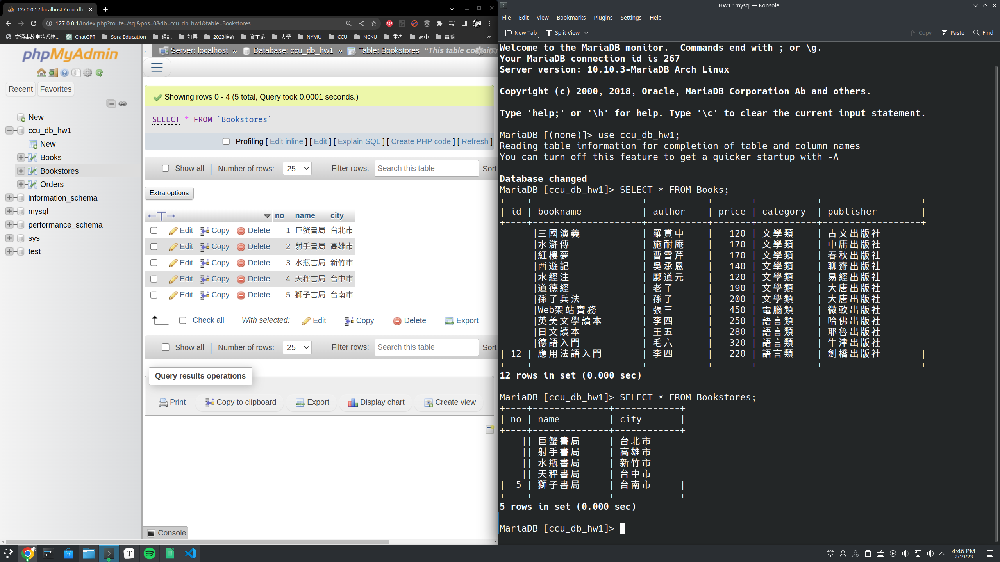

**Database HW1**

---
## Author Information

- Name: 鍾博丞

- Student ID: 408410120

- E-mail: my072814638@csie.io


## Environment

- Operating System: Arch Linux 6.1.12-arch1-1 using KDE plasma


[TOC]

 ## SQL

In the early 1970's, SQL is initially called SEQUEL, which means Structured English Query Language, and based on their original language called SQUARE (Specifying Queries As Relational Expressions). SEQUEL was later renamed to SQL by dropping the vowels, because SEQUEL was a trade mark registered by the Hawker Siddeley aircraft company.

Ref: https://stackoverflow.com/questions/18523040/what-is-the-difference-between-sequel-and-sql


## MySQL Installation Guide

MySQL is a widely spread, multi-threaded, multi-user SQL database, developed by Oracle.

Arch Linux favors **MariaDB**, a community-developed fork of MySQL, aiming for drop-in compatibility. Oracle's MySQL was dropped to the AUR `mysql`.


### MariaDB Installation Guide

1. Install `mariadb`.

2. Run the following command:

   ```bash
   sudo mariadb-install-db --user=mysql --basedir=/usr --datadir=/var/lib/mysql
   ```

3. Enable and start `mariadb.service`.


### phpMyAdmin Installation Guide: The Front-End Administration Tool

`phpMyAdmin` is a web-based tool to help manage MariaDB or MySQL databases, written primarily in PHP and distributed under the GNU GPL.


Install the `phpmyadmin` package.


#### PHP

Make sure the PHP mariadb and `iconv` extensions have been enabled.

Optionally you can enable `extension=bz2` and `extension=zip` for compression support.

Uncomment `pdo_mysql` and `mysqli` to use MySQL/MariaDB.

```
/etc/php/php.ini

;;;;;;;;;;;;;;;;;;;;;;
; Dynamic Extensions ;
;;;;;;;;;;;;;;;;;;;;;;

extension=bz2
extension=curl
extension=iconv
extension=mysqli
extension=pdo_mysql
extension=zip
```

Ref: https://wiki.archlinux.org/title/PHP#Extensions


#### Running by Nginx

We first introduce FastCGI.


##### FastCGI

FastCGI, also FCGI, is a protocol for interfacing interactive programs with a web server. FastCGI is a variation on the earlier Common Gateway Interface (CGI); FastCGI's main aim is to reduce the overhead associated with interfacing the web server and CGI programs, allowing servers to handle more web page requests at once.

FastCGI technology is introduced into nginx to work with many external tools, e.g. Perl, PHP and Python.


##### PHP Implementation

PHP-FPM is the recommended solution to run as FastCGI server for PHP.

Install `php-fpm` and make sure PHP has been installed and configured correctly. The main configuration file of PHP-FPM is `/etc/php/php-fpm.conf`. For basic usage the default configuration should be sufficient.

Finally, enable and start `php-fpm.service`.


By preference, access phpMyAdmin by subdomain, e.g. `https://pma.conf`:

```
/etc/nginx/sites-available/pma.conf

server {
    server_name pma.domain.tld;
    listen 80;
    listen [::]:80;
    # listen 443 ssl http2;
    # listen [::]:443 ssl http2;
    index index.php;
    access_log /var/log/nginx/pma.access.log;
    error_log /var/log/nginx/pma.error.log;

    # Allows limiting access to certain client addresses.
    ; allow 192.168.1.0/24;
    ; allow my-ip;
    ; deny all;

    root /usr/share/webapps/phpMyAdmin;
    location / {
        try_files $uri $uri/ =404;
    }

    error_page 404 /index.php;

    location ~ \.php$ {
        try_files $uri $document_root$fastcgi_script_name =404;

        fastcgi_split_path_info ^(.+\.php)(/.*)$;
        fastcgi_pass unix:/run/php-fpm/php-fpm.sock;
        fastcgi_index index.php;
        fastcgi_param SCRIPT_FILENAME $document_root$fastcgi_script_name;
        include fastcgi_params;

        fastcgi_param HTTP_PROXY "";
        fastcgi_param HTTPS on;
        fastcgi_request_buffering off;
   }
}
```

We have written the FastCGI rule in `pma.conf`, then we don't need the default server rule in `/etc/nginx/nginx.conf`. Edit the file, command/remove the default server rule and include our rule in `pma.conf`.

```
/etc/nginx/nginx.conf

http {
	include       mime.types;
    default_type  application/octet-stream;

    #log_format  main  '$remote_addr - $remote_user [$time_local] "$request" '
    #                  '$status $body_bytes_sent "$http_referer" '
    #                  '"$http_user_agent" "$http_x_forwarded_for"';

    #access_log  logs/access.log  main;

    sendfile        on;
    #tcp_nopush     on;

    #keepalive_timeout  0;
    keepalive_timeout  65;

    #gzip  on;

    include /etc/nginx/sites-available/*.conf;

    # server {
	# ...
	# }
}
```

Ref: https://wiki.archlinux.org/title/phpMyAdmin


## Start Using MySQL/MariaDB

### MariaDB Configuration

Once you have started the MariaDB server and added a root account, you may want to change the default configuration.

To log in as `root` on the MariaDB server, use the following command:

```bash
sudo mariadb -u root -p
```

**Note that the default password is empty. Press `Enter` to log in.**


Once you enter the MySQL's console, you'll need to **add user** by the following command:

```sql
CREATE USER '<your_username>'@'localhost' IDENTIFIED BY '<your_password>';
```

This will create user **at local host**.

Then, you'll need to grant full permissions to your database by the following command:

```sql
GRANT ALL PRIVILEGES ON <your_database>.* TO '<your_username>'@'localhost';
```


Note: The mariadb package already uses `utf8mb4` as charset and `utf8mb4_unicode_ci` as collation. UTF8MB4 is recommended over UTF-8 since it allows full Unicode support.


Ref: https://wiki.archlinux.org/title/MariaDB


### 1. Create Database

Now, let's try to create a database called "ccu_db_hw1". Log in as root and type the following comands.

```sql
CREATE DATABASE ccu_db_hw1;
```

Type the following command to show if the databases are created properly.

```sql
SHOW DATABASES;
```


### Grant Privileges to Users

```sql
GRANT ALL PRIVILEGES ON ccu_db_hw1.* TO '<your_username>'@'localhost';
```


### Switch to Normal User

Now, we can use the database without root privilege.

Type the following command and **don't enter your password here**.

```bash
mysql -u <username> -p
```

Type your password after prompting `Enter password: `


### 2. Add Tables to Database

Suppose we need to create 3 tables called "Books", "Bookstores", and "Orders". We can use the following SQL command.

```sql
CREATE TABLE `ccu_db_hw1`.`Books` (
    `id` INT NOT NULL AUTO_INCREMENT,
    `bookname` VARCHAR(255) NOT NULL,
    `author` VARCHAR(255) NOT NULL,
    `price` INT NOT NULL,
    `category` VARCHAR(255) NOT NULL,
    `publisher` VARCHAR(255) NOT NULL,
    PRIMARY KEY (`id`)
)
COMMENT = 'This table contain multiple books';
```

```sql
CREATE TABLE `ccu_db_hw1`.`Bookstores` (
    `no` INT NOT NULL AUTO_INCREMENT,
    `name` VARCHAR(255) NOT NULL,
    `city` VARCHAR(255) NOT NULL,
    PRIMARY KEY (`no`)
)
COMMENT = 'This table contain multiple bookstores';
```

```sql
CREATE TABLE `ccu_db_hw1`.`Orders` (
    `no` INT NOT NULL,
    `id` INT NOT NULL,
    `quantity` INT NOT NULL
)
COMMENT = 'This table contain orders';
```


Type `SHOW TABLES [FROM <your_database>];` to show tables in database.


### Load csv Data into Table

Ref: https://stackoverflow.com/questions/3635166/how-do-i-import-csv-file-into-a-mysql-table

Note that you need to add `LOCAL` statement to access local files.

```sql
LOAD DATA LOCAL INFILE '/home/otischung/DATA/workspace/CCU_private_workspace/Database/HW1/Books.csv'
INTO TABLE ccu_db_hw1.Books
FIELDS TERMINATED BY ','
ENCLOSED BY '"'
LINES TERMINATED BY '\n'
IGNORE 1 ROWS;
```

```sql
LOAD DATA LOCAL INFILE '/home/otischung/DATA/workspace/CCU_private_workspace/Database/HW1/Bookstores.csv'
INTO TABLE ccu_db_hw1.Bookstores
FIELDS TERMINATED BY ','
ENCLOSED BY '"'
LINES TERMINATED BY '\n'
IGNORE 1 ROWS;
```

```sql
LOAD DATA LOCAL INFILE '/home/otischung/DATA/workspace/CCU_private_workspace/Database/HW1/Orders.csv'
INTO TABLE ccu_db_hw1.Orders
FIELDS TERMINATED BY ','
ENCLOSED BY '"'
LINES TERMINATED BY '\n'
IGNORE 1 ROWS;
```

Note that we specify the line terminater to `'\n'`, be careful to deal with the difference between CRLF and LF.


### 3. Check the instances of table

Type the following command to get instances.

```sql
use ccu_db_hw1;
SELECT * FROM Books;
SELECT * FROM Bookstores;
SELECT * FROM Orders;
```





## 4. Query from MySQL/MariaDB

1. Find the prices of all distinct books sorted by **decreasing order**.

   ```sql
   SELECT DISTINCT Books.price
   FROM Books
   ORDER BY price DESC;
   ```

   

2. Find the amount of all categories. List the category and the amount in the category.

   ```sql
   SELECT Books.category, COUNT(Books.id)
   FROM Books
   GROUP BY category;
   ```

   

3. Find the bookstores that order all books. List the bookstores' name and the city where this bookstore is located.

   ```sql
   SELECT Bookstores.name, Bookstores.city
   FROM Bookstores
   WHERE NOT EXISTS (
   	SELECT *
   	FROM Books
   	WHERE NOT EXISTS (
           SELECT *
           FROM Orders
           WHERE Bookstores.no = Orders.no
           AND Orders.id = Books.id
       )
   );
   ```

   

4. Find the bookstores that order more than 20 books of a specific single book. List the name of the book and the name of the bookstore.

   ```sql
   SELECT Books.bookname, Bookstores.name
   FROM Books
   INNER JOIN Orders ON Books.id = Orders.id
   INNER JOIN Bookstores ON Orders.no = Bookstores.no
   WHERE Orders.quantity >= 20;
   ```

   

   

---

## MongoDB Installation Guide

MongoDB (from hu**mongo**us) is an open source document-oriented database system developed and supported by MongoDB Inc. (formerly 10gen). It is part of the NoSQL family of database systems. Instead of storing data in tables as is done in a "classical" relational database, MongoDB stores structured data as JSON-like documents with dynamic schemas (MongoDB calls the format BSON), making the integration of data in certain types of applications easier and faster.


MongoDB has been removed from the official repositories due to its re-licensing issues [1].

Install one of the following for the latest version available:

`mongodb` - builds from source.
`mongodb-bin` - prebuilt MongoDB binary extracted from official MongoDB Ubuntu repository packages. Compilation options used are unknown.


After installation, start/enable the `mongodb.service` daemon.

Note: During the first startup of the mongodb service, it will **pre-allocate space**, by creating large files (for its journal and other data). This step may take a while, during which the MongoDB shell is unavailable.


To access the MongoDB shell:

```bash
mongosh
```

Or, if authentication is configured:

```bash
mongosh -u <username>
```

 Ref: https://wiki.archlinux.org/title/MongoDB


### Robomongo - A Useful MongoDB GUI manager

Install `robo3t-bin`. Enter `robot3t` in command line to use the program.


## Start Using MongoDB

### 5. Create Database

Now, let's try to create a database called "ccu_db_hw1". Log in as root and type the following comands.

```sql
use ccu_db_hw1
```


### 6. Add Tables/Collections to Database

Suppose we need to create 3 tables called "Books", "Bookstores", and "Orders". We can use the following SQL command.

```sql
db.createCollection("Books")
db.createCollection("Bookstores")
db.createCollection("Orders")
```


After **inserting the first record the database will be listed**. Type the following command to show if the databases are created properly.

```sql
show dbs
```


### Create Instances in Tables

We can use `insertMany` to insert multiple instances at once.

```sql
db.Books.insertMany([
    {id:1, bookname:"三國演義", author:"羅貫中", price:120, category:"文學類", publisher:"古文出版社"},
    {id:2, bookname:"水滸傳", author:"施耐庵", price:170, category:"文學類", publisher:"中庸出版社"},
    {id:3, bookname:"紅樓夢", author:"曹雪芹", price:170, category:"文學類", publisher:"春秋出版社"},
    {id:4, bookname:"西遊記", author:"吳承恩", price:140, category:"文學類", publisher:"聊齋出版社"},
    {id:5, bookname:"水經注", author:"酈道元", price:120, category:"文學類", publisher:"易經出版社"},
    {id:6, bookname:"道德經", author:"老子", price:190, category:"文學類", publisher:"大唐出版社"},
    {id:7, bookname: "孫子兵法", author:"孫子", price:200, category:"文學類", publisher:"大唐出版社"},
    {id:8, bookname: "Web架站實務", author:"張三", price:450, category:"電腦類", publisher:"微軟出版社"},
    {id:9, bookname:"英美文學讀本", author:"李四", price:250,category:"語言類", publisher:"哈佛出版社"},
    {id:10, bookname:"日文讀本", author:"王五", price:280, category:"語言類", publisher:"耶魯出版社"},
    {id:11, bookname:"德語入門", author:"毛六", price:320, category:"語言類", publisher:"牛津出版社"},
    {id:12, bookname:"應用法語入門", author:"李四", price:220, category:"語言類", publisher:"劍橋出版社"}
])

db.Bookstores.insertMany([
    {no:1, name:"巨蟹書局", city:"台北市"},
    {no:2, name:"射手書局", city:"高雄市"},
    {no:3, name:"水瓶書局", city:"新竹市"},
    {no:4, name:"天秤書局", city:"台中市"},
    {no:5, name:"獅子書局", city:"台南市"}
])

db.Orders.insertMany([
    {no:1, id:2, quantity:20},
    {no:1, id:3, quantity:40},
    {no:2, id:4, quantity:5},
    {no:3, id:1, quantity:25},
    {no:3, id:2, quantity:20},
    {no:3, id:3, quantity:15},
    {no:3, id:4, quantity:30},
    {no:3, id:5, quantity:40},
    {no:3, id:6, quantity:20},
    {no:3, id:7, quantity:50},
    {no:3, id:8, quantity:30},
    {no:3, id:9, quantity:20},
    {no:3, id:10, quantity:10},
    {no:3, id:11, quantity:40},
    {no:3, id:12, quantity:50},
    {no:4, id:3, quantity:20},
    {no:4, id:5, quantity:30},
    {no:5, id:1, quantity:10},
    {no:5, id:2, quantity:20},
    {no:5, id:5, quantity:30},
    {no:5, id:8, quantity:10},
    {no:5, id:9, quantity:15},
    {no:5, id:10, quantity:30},
    {no:5, id:12, quantity:10}
])
```


### 7. Check the instances of table

Type the following command to get instances.

```sql
db.getCollection('Books').find({})
db.getCollection('Bookstores').find({})
db.getCollection('Orders').find({})
```


## 8. Query from MongoDB

1. Find the prices of all distinct books sorted by **decreasing order**.

   ```sql
   db.Books.aggregate([
       {
           $sort: {
               price: -1
           }
       },
       {
           $project: {
               _id: 0,
               price: 1
           }
       }
   ])
   ```

   

2. Find the amount of all categories. List the category and the amount in the category.

   ```sql
   db.Books.aggregate([
       {
       	$match : {}
       },
       {
       	$group : {
       		_id: "$category",
       		count: {$sum: 1}
       	}
       }
   ])
   ```

   

3. Find the bookstores that order all books. List the bookstores' name and the city where this bookstore is located.

   ```sql
   db.Orders.aggregate([
   	{
   		$group: {
   			_id: "$no",
   			books: { $addToSet: "$id" }
       	}
       },
       {
       	$match: {
         		books: {
           		$all: db.Books.distinct("id")
         		}
       	}
     	},
     	{
       	$lookup: {
         		from: "Bookstores",
         		localField: "_id",
         		foreignField: "no",
         		as: "bookstore"
       	}
     	},
     	{
       	$project: {
         		_id: 0,
         		name: { $arrayElemAt: ["$bookstore.name", 0] },
         		city: { $arrayElemAt: ["$bookstore.city", 0] }
       	}
     	}
   ])
   ```

   

4. Find the bookstores that order more than 20 books of a specific single book. List the name of the book and the name of the bookstore.

   ```sql
   db.Books.aggregate([
   	{
   		$lookup: {
   			from: "Orders",
   			localField: "id",
   			foreignField: "id",
   			as: "orderDetails"
       	}
     	},
     	{
       	$unwind: "$orderDetails"
     	},
     	{
       	$lookup: {
         		from: "Bookstores",
         		localField: "orderDetails.no",
         		foreignField: "no",
         		as: "storeDetails"
       	}
     	},
     	{
       	$unwind: "$storeDetails"
     	},
     	{
       	$match: {
         		"orderDetails.quantity": {
           		$gte: 20
         		}
       	}
     	},
     	{
       	$project: {
         		"bookname": 1,
         		"name": "$storeDetails.name",
         		"_id": 0
       	}
     	}
   ])
   ```
   
   

