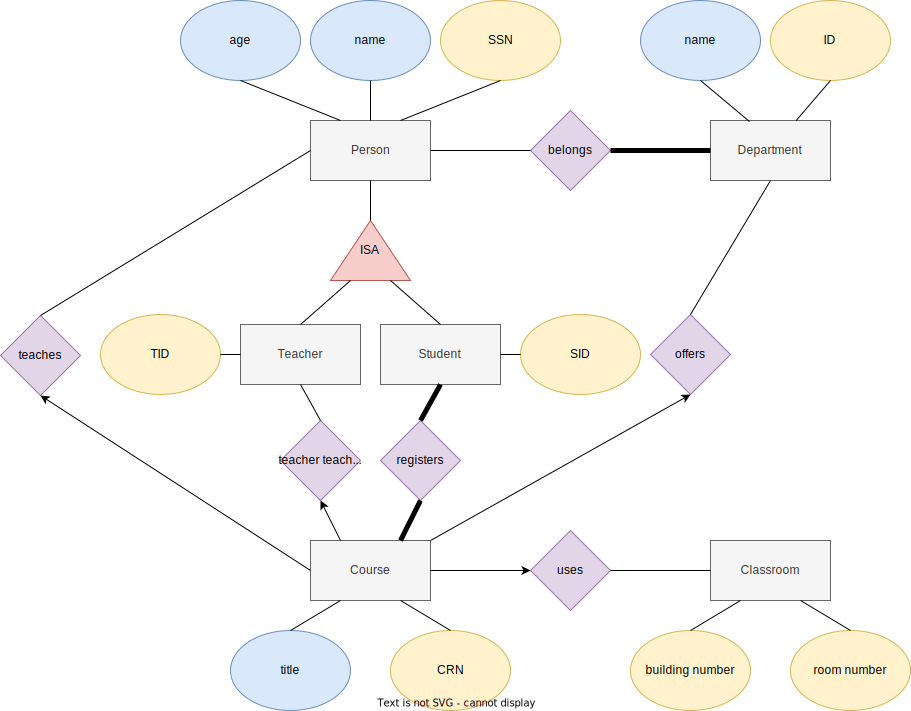
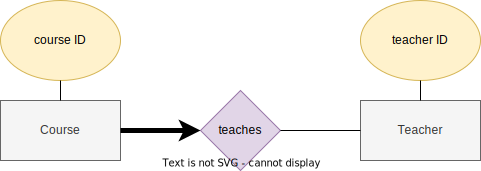
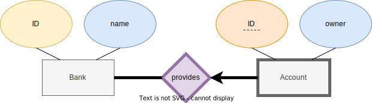

**Database HW2A**

---
## Author Information

- Name: 鍾博丞

- Student ID: 408410120

- E-mail: my072814638@csie.io

## Part 1

### Relationships

#### Person

- Both students and teachers belong to Person and have their own unique Student ID (SID) and Teacher ID (TID), respectively.

#### Person = Course

- **We exclude drop-out (休學) conditions here.**
- (*Requirement*) Each student can register for multiple courses.
  - (*Hypothesis*) (**Total Participation**) No student has zero courses. If you are a college student at CCU, you are required to study at least 16 credits except for senior students, who are required to study at least 8 credits.

- (*Requirement*) A course has many students registered for it.
  - (*Hypothesis*) (**Total Participation**) A course must have at least one student registered for it.

- (*Requirement*) A teacher can teach many courses, which means a teacher may not teach any course.
- (*Requirement*) (**One-to-many**) A course is taught by at most one **person**.
  - TA courses are included.

- (*Hypothesis*) A person may teach zero, one, or multiple courses.
- (*Hypothesis*) (**One-to-many**) A course must have at most one teacher.

#### Person = Department

- (*Requirement*) Each person can belong to multiple departments. It means that a person may not belong to any department.
- (*Requirement*) Every department also has many people associated with it.
  - (*Hypothesis*) (**Total Participation**) Every department must have at least one person associated with it.

#### Course = Department

- (*Requirement*) A department can offer many courses, which means a department may not offer any course.
- (*Requirement*) (**One-to-many**) A course is offered by at most one department.

#### Course = Classroom

- (*Requirement*) (**One-to-many**) A course uses at most one classroom.
  - Some courses may not use any classroom. e.g. PE class.

- (*Requirement*) A classroom can be used for more than one course, which means that a classroom may not be used for any course.

## Part 2A

**Total participation** and **one-to-may** constraints.

- (**Total Participation**) (**One-to-many**) A course must be taught by exactly one teacher.
- A teacher may not teach any courses and may teach multiple courses.

## Part 2B

- (**Total Participation**) (**One-to-many**) Any accounts are provided by exactly one bank.
- (**Total Participation**) A bank provides at least one account.
- A bank account cannot be distinguished by the account number. Perhaps there is another same account number provided by another bank.
- A bank account is dependent on the existence of the particular provider.
- Every particular bank account is distinguished by both the bank ID and the account number. e.g. 700 (post office in Taiwan) \- 004xxxx xxxxxxx (bank account).

## Part 2C

- (*Requirement*) Both talk shows and drama are TV shows.
- (*Requirement*) Both hosts and actors are people.
- (*Requirement*) (**One-to-many**) Every talk show has **at most one** host.
- (*Requirement*) A drama has many actors.

  (*Hypothesis*) (**Total Participation**) A drama must have at least one actor.

## Part 5A

### Design Pattern

- (*Requirement*) The reservation system will create a unique ID for identifying a single reservation.
- (**Total Participation**) Each reservation contains at least one ticket.
  - (**Total Participation**) (**One-to-many**) Each ticket contains exactly one departure and one arrival.
  - If your flight requires a layover at an intermediate airport, you will receive two tickets.
    - For example: TPE to GOT (瑞典 \- 哥德堡 \- 蘭德維特機場). You'll get two tickets: TPE to FRA (德國 \- 法蘭克福機場), and FRA to GOT.
- (*Requirement*) Each seat records reservation ID.
  - (*Requirement*) For each flight, the system should store a list of available seats.
    - If the reservation ID of a record in the table Seat is NULL, then it means that the seat has not been reserved by anyone yet.
  - The reservation system can retrieve seat information by matching the seat's reservation ID with the desired reservation ID to be queried.
- (*Requirement*) Each flight has three seat classes: First Class, Business Class, and Economy class. We set the "class" attribute in the "Seat" entity.
- The seat is a weak entity because it is meaningless without being assigned by an aircraft.

### Relationship

#### Reservation = Ticket

- (*Requirement*) Customers can make reservations without reserving seats.
  - Again, transfer flights cause multiple tickets.
- (*Hypothesis*) (**Total Participation**) (**One-to-many**) Each ticket belongs to exactly one reservation.

#### Ticket = Aggregation[Aircraft, Flight, Airport, Seat]

- (*Requirement*) (**Total Participation**) (**One-to-many**) Each seat can only be reserved for one customer and thus each ticket is assigned by exactly one aggregation of flight, aircraft, departure, arrival, and seat, and *vice versa*.

#### Company = Flight

- (*Requirement*) Each company has many flights.
  - (*Hypothesis*) (**Total Participation**) There is no airline that has zero flights.
- (*Hypothesis*) (**Total Participation**) (**One-to-many**) Each flight belongs to exactly one airline.

#### Company = Aircraft

- (*Requirement*) Each company has an ID and owns many aircraft.
  - (*Hypothesis*) (**Total Participation**) There is no airline that owns zero aircraft.
- (*Hypothesis*) (**Total Participation**) (**One-to-many**) Each aircraft belongs to exactly one airline.

#### Flight = Aircraft

- (*Hypothesis*) Each aircraft can be used for different flights, or not be used for any flight.
- (*Hypothesis*) (**Total Participation**) (**One-to-many**) Each flight uses exactly one aircraft.

#### Aircraft = Seat

- (*Requirement*) (**Total Participation**) (**One-to-many**) The seat arrangements are associated with aircraft.
- (*Hypothesis*) (**Total Participation**) Each aircraft has multiple seats and has at least one seat.

#### Flight = Airport

- (*Requirement*) (**Total Participation**) (**One-to-many**) Each flight departs from and arrives at registered airports.
  - Here we define that each ticket contains only a one-way trip, which means there is only exactly one departure and one arrival.

- (*Hypothesis*) An airport may be used for many flights, or not be used for any flight.

## Part 6A

### Design Pattern

#### Customer = Viewing Transaction = Movie

- A unique viewing transaction is created when a customer views a movie.
  - (*Requirement*) Each customer can view movies from a video server.
  - (*Hypothesis*) (**Total Participation**) (**One-to-many**) Each view transaction streams exactly one movie.
  - (*Hypothesis*) A movie may be viewed by one, multiple, or zero customers.
  - (*Hypothesis*) (**Total Participation**) (**One-to-many**) Each view transaction is created for exactly one customer.
  - (*Hypothesis*) A customer may view one, multiple, or zero movies.

#### Customer = Viewing Transaction = Billing Statement

- (*Requirement*) Each customer receives one bill statement after each viewing transaction.
- (*Requirement*) (**Weak Entity**) A billing number is unique for a particular customer. It is not unique across different customers.

#### Release Charge Information

- (*Requirement*) We define a new attribute "is new release" to mark the movie.
  - We then further use this information to determine the fee.
- (*Requirement*) We have to check the "view" relation table if the customer *has seen this movie* when creating a new viewing transaction in order to determine the fee.

### Relationship

#### Movie = Critic

- (*Requirement*) Each movie could be viewed by one or more critics, which means a movie may not be viewed by any critics.
- (*Hypothesis*) A critic may evaluate zero, one, or multiple movies.

#### Movie = Award

- (*Requirement*) A movie may have won one or more academy awards, which means a movie may not win any awards.
- (*Hypothesis*) (**Total Participation**) An award must be given to at least one movie.

#### Movie = Server

- (*Requirement*) Each movie is stored on a number of different video servers.
- (*Hypothesis*) (**Total Participation**) A video server must store at least one movie.

#### Movie = Distributor

- (*Requirement*) Each movie can be supplied by only one distributor, which means that a movie can be supplied by multiple distributors or no distributors.
- (*Requirement*) One distributor might provide several movies, which means that a distributor might not provide any movies.

#### Movie = Actor

- (*Requirement*) (**Total Participation**) A movie has one or more actors.
- (*Hypothesis*) An actor may act in one, multiple, or zero movies.

#### Server = Empolyee

- (*Requirement*) (**Total Participation**) (**One-to-many**) An employee works at the location of one of the video servers.
- (*Hypothesis*) (**Total Participation**) A video server must have at least one employee.

#### Distributor = Address

- (*Hypothesis*) (**Total Participation**) (**One-to-many**) A distributor is located at exactly one address.
- (*Hypothesis*) (**Total Participation**) The table "Address" is created for the table "Distributor". Thus, an address must contain at least one distributor.

#### Customer = Credit Card

- (*Requirement*) (**Total Participation**) Each customer must have one or more credit cards.
- (*Hypothesis*) (**Total Participation**) (**One-to-many**) A credit card belongs to exactly one customer.

## Part 7

We redraw the figure as follows:

There is only a *one\-to\-many* constraint. Thus, 1 instance in entity U contains 0 or 1 instance in entity S and T within 1 relation R.

### 7A

- Since $r = 1$, then there is only one relation for U, S, and T.
- The number of instances of $u = 4$, $s = 3$, and $t = 2$ is all greater than 1.

Answer: Yes (Valid)

### 7B

- Since $s = 1$, $t = 1$, and entity U has a *one\-to\-many* constraint to S and T, all possible combinations are {None, s, t, {s, t}}, 4 kinds of possibilities.
- We know that $u = 50$, which means there are $50 \times 4 = 200$ different relations.
- $r = 100 \le 200$.

Answer: Yes (Valid)

## Part 8

### Relationship

#### Team = Player

- (*Hypothesis*) (**Total Participation**) A team has at least one player.
- (*Requirement*) (**Total Participation**) (**One-to-many**) Each player belongs to only one team.

#### Team

- (*Requirement*) (**Total Participation**) (**One-to-many**) There must have exactly two different teams joining a match.

#### Player

- (*Requirement*) A team captain is also a player.
  - (*Hypothesis*) (**Total Participation**) A captain leads at least one player.
  - (*Hypothesis*) (**Total Participation**) (**One-to-many**) A player has exactly one captain.

#### Player = Injury

- (*Requirement*) (**Weak Entity**) An injury record is owned by a particular player.

## Part 9

### Design Pattern

- (*Hypothesis*) For each patient, we have an attribute called "admit", which describes whether this patient is the first visit or not.
- (*Requirement*) (**Total Participation**) (**One-to-many**) If this patient is the first visit to this hospital, then this patient is examined by exactly one doctor.
- (*Requirement*) (**Total Participation**) Otherwise, this patient is treated by at least one doctor.

### Relationship

#### Doctor = Patient

- (*Hypothesis*) A doctor may examine zero, one, or multiple patients.
- (*Hypothesis*) A doctor may treat zero, one, or multiple patients.

#### Patient = Test

- (*Requirement*) (**Weak Entity**) A test is owned by a particular patient.
