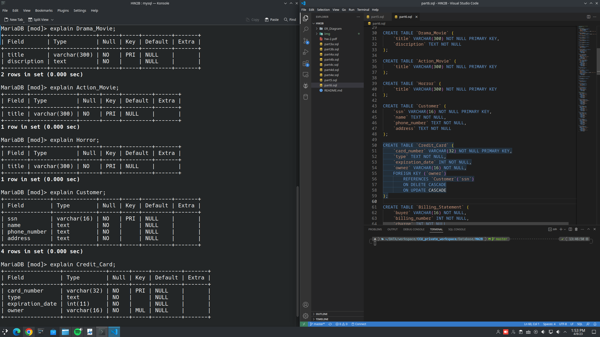
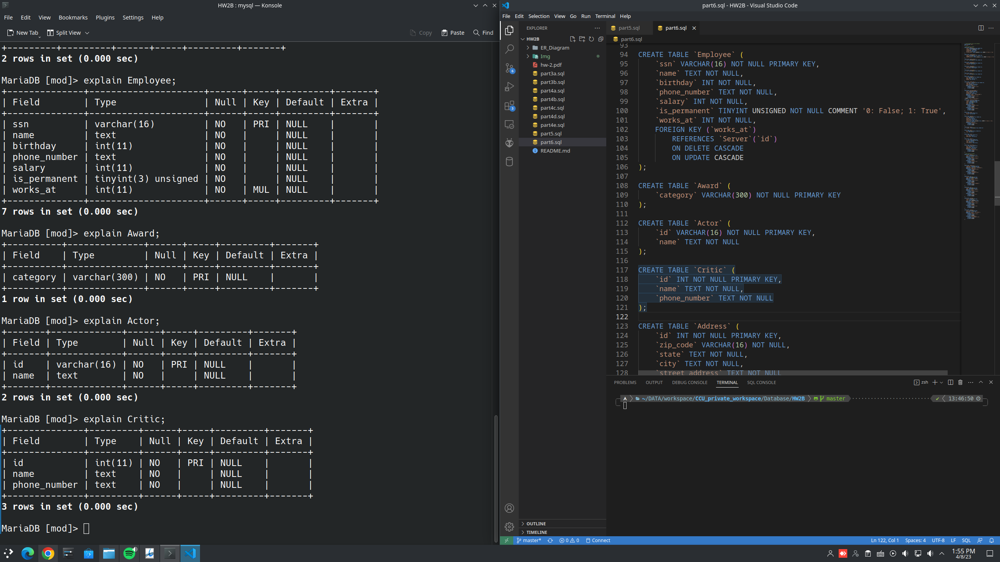

**Database HW2B**

---
## Author Information

- Name: 鍾博丞

- Student ID: 408410120

- E-mail: my072814638@csie.io

## Part 3A

## Part 3B

## Part 4A

## Part 4B

## Part 4C

## Part 4D, 4E

After insert values and delete table "Movie". The table "act" has a foreign key pointing to the table "Movie". Thus, we also have to drop the table "act".

## Part 5B

### ER Digram

### Design Pattern

- (*Requirement*) The reservation system will create a unique ID for identifying a single reservation.
- (**Total Participation**) Each reservation contains at least one ticket.
  - (**Total Participation**) (**One-to-many**) Each ticket contains exactly one departure and one arrival.
  - If your flight requires a layover at an intermediate airport, you will receive two tickets.
    - For example: TPE to GOT (瑞典 \- 哥德堡 \- 蘭德維特機場). You'll get two tickets: TPE to FRA (德國 \- 法蘭克福機場), and FRA to GOT.
- (*Requirement*) Each seat records reservation ID.
  - (*Requirement*) For each flight, the system should store a list of available seats.
    - If the reservation ID of a record in the table Seat is NULL, then it means that the seat has not been reserved by anyone yet.
  - The reservation system can retrieve seat information by matching the seat's reservation ID with the desired reservation ID to be queried.
- (*Requirement*) Each flight has three seat classes: First Class, Business Class, and Economy class. We set the "class" attribute in the "Seat" entity.
- The seat is a weak entity because it is meaningless without being assigned by an aircraft.

### Relationship

#### Reservation = Ticket

- (*Requirement*) Customers can make reservations without reserving seats.
  - Again, transfer flights cause multiple tickets.
- (*Hypothesis*) (**Total Participation**) (**One-to-many**) Each ticket belongs to exactly one reservation.

#### Ticket = Aggregation[Aircraft, Flight, Airport, Seat]

- (*Requirement*) (**Total Participation**) (**One-to-many**) Each seat can only be reserved for one customer and thus each ticket is assigned by exactly one aggregation of flight, aircraft, departure, arrival, and seat, and *vice versa*.

#### Company = Flight

- (*Requirement*) Each company has many flights.
  - (*Hypothesis*) (**Total Participation**) There is no airline that has zero flights.
- (*Hypothesis*) (**Total Participation**) (**One-to-many**) Each flight belongs to exactly one airline.

#### Company = Aircraft

- (*Requirement*) Each company has an ID and owns many aircraft.
  - (*Hypothesis*) (**Total Participation**) There is no airline that owns zero aircraft.
- (*Hypothesis*) (**Total Participation**) (**One-to-many**) Each aircraft belongs to exactly one airline.

#### Flight = Aircraft

- (*Hypothesis*) Each aircraft can be used for different flights, or not be used for any flight.
- (*Hypothesis*) (**Total Participation**) (**One-to-many**) Each flight uses exactly one aircraft.

#### Aircraft = Seat

- (*Requirement*) (**Total Participation**) (**One-to-many**) The seat arrangements are associated with aircraft.
- (*Hypothesis*) (**Total Participation**) Each aircraft has multiple seats and has at least one seat.

#### Flight = Airport

- (*Requirement*) (**Total Participation**) (**One-to-many**) Each flight departs from and arrives at registered airports.
  - Here we define that each ticket contains only a one-way trip, which means there is only exactly one departure and one arrival.

- (*Hypothesis*) An airport may be used for many flights, or not be used for any flight.

### SQL Explaination

## Part 6B

### ER Digram

### Design Pattern

#### Customer = Viewing Transaction = Movie

- A unique viewing transaction is created when a customer views a movie.
  - (*Requirement*) Each customer can view movies from a video server.
  - (*Hypothesis*) (**Total Participation**) (**One-to-many**) Each view transaction streams exactly one movie.
  - (*Hypothesis*) A movie may be viewed by one, multiple, or zero customers.
  - (*Hypothesis*) (**Total Participation**) (**One-to-many**) Each view transaction is created for exactly one customer.
  - (*Hypothesis*) A customer may view one, multiple, or zero movies.

#### Customer = Viewing Transaction = Billing Statement

- (*Requirement*) Each customer receives one bill statement after each viewing transaction.
- (*Requirement*) (**Weak Entity**) A billing number is unique for a particular customer. It is not unique across different customers.

#### Release Charge Information

- (*Requirement*) We define a new attribute "is new release" to mark the movie.
  - We then further use this information to determine the fee.
- (*Requirement*) We have to check the "view" relation table if the customer *has seen this movie* when creating a new viewing transaction in order to determine the fee.

### Relationship

#### Movie = Critic

- (*Requirement*) Each movie could be viewed by one or more critics, which means a movie may not be viewed by any critics.
- (*Hypothesis*) A critic may evaluate zero, one, or multiple movies.

#### Movie = Award

- (*Requirement*) A movie may have won one or more academy awards, which means a movie may not win any awards.
- (*Hypothesis*) (**Total Participation**) An award must be given to at least one movie.

#### Movie = Server

- (*Requirement*) Each movie is stored on a number of different video servers.
- (*Hypothesis*) (**Total Participation**) A video server must store at least one movie.

#### Movie = Distributor

- (*Requirement*) Each movie can be supplied by only one distributor, which means that a movie can be supplied by multiple distributors or no distributors.
- (*Requirement*) One distributor might provide several movies, which means that a distributor might not provide any movies.

#### Movie = Actor

- (*Requirement*) (**Total Participation**) A movie has one or more actors.
- (*Hypothesis*) An actor may act in one, multiple, or zero movies.

#### Server = Empolyee

- (*Requirement*) (**Total Participation**) (**One-to-many**) An employee works at the location of one of the video servers.
- (*Hypothesis*) (**Total Participation**) A video server must have at least one employee.

#### Distributor = Address

- (*Hypothesis*) (**Total Participation**) (**One-to-many**) A distributor is located at exactly one address.
- (*Hypothesis*) (**Total Participation**) The table "Address" is created for the table "Distributor". Thus, an address must contain at least one distributor.

#### Customer = Credit Card

- (*Requirement*) (**Total Participation**) Each customer must have one or more credit cards.
- (*Hypothesis*) (**Total Participation**) (**One-to-many**) A credit card belongs to exactly one customer.

### SQL Explaination

