**Database HW3**

---
## Author Information

- Name: 鍾博丞

- Student ID: 408410120

- E-mail: my072814638@csie.io


## Part 甲

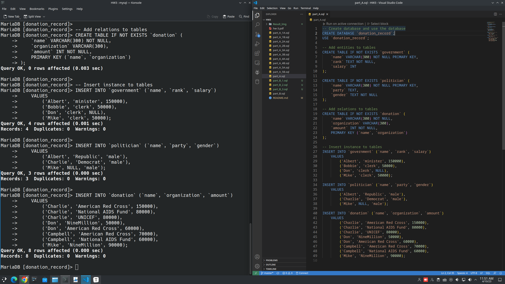

```sql
-- Create database and use the database
CREATE DATABASE `donation_record`;
USE `donation_record`;

-- Add entities to tables
CREATE TABLE IF NOT EXISTS `government` (
    `name` VARCHAR(300) NOT NULL PRIMARY KEY,
    `rank` TEXT NOT NULL,
    `salary` INT
);

CREATE TABLE IF NOT EXISTS `politician` (
    `name` VARCHAR(300) NOT NULL PRIMARY KEY,
    `party` TEXT,
    `gender` TEXT NOT NULL
);

-- Add relations to tables
CREATE TABLE IF NOT EXISTS `donation` (
    `name` VARCHAR(300) NOT NULL,
    `organization` VARCHAR(300),
    `amount` INT NOT NULL,
    PRIMARY KEY (`name`, `organization`)
);

-- Insert instance to tables
INSERT INTO `government` (`name`, `rank`, `salary`)
    VALUES
        ('Albert', 'minister', 150000),
        ('Bobbie', 'clerk', 50000),
        ('Don', 'clerk', NULL),
        ('Mike', 'clerk', 50000);

INSERT INTO `politician` (`name`, `party`, `gender`)
    VALUES
        ('Albert', 'Republic', 'male'),
        ('Charlie', 'Democrat', 'male'),
        ('Mike', NULL, 'male');

INSERT INTO `donation` (`name`, `organization`, `amount`)
    VALUES
        ('Charlie', 'American Red Cross', 150000),
        ('Charlie', 'National AIDS Fund', 80000),
        ('Charlie', 'UNICEF', 80000),
        ('Don', 'NineMillion', 50000),
        ('Don', 'American Red Cross', 60000),
        ('Campbell', 'American Red Cross', 70000),
        ('Campbell', 'National AIDS Fund', 60000),
        ('Mike', 'NineMillion', 90000);

```


### 1A

```sql
SELECT `name`
FROM `donation` A
WHERE NOT EXISTS (
    SELECT *
    FROM `donation` B
    WHERE `name` = 'Campbell'
    AND NOT EXISTS (
        SELECT *
        FROM `donation` C
        WHERE C.`organization` = B.`organization`
        AND C.`name` = A.`name`
    )
);
```


The outer query selects the `name` column from the `donation` table and assigns it an alias `A`. The WHERE clause of the outer query uses a NOT EXISTS condition to filter the results.


Donation A:

| name     | organization       | amount |
| -------- | ------------------ | ------ |
| Charlie  | American Red Cross | 150000 |
| Charlie  | National AIDS Fun  | 80000  |
| Charlie  | UNICEF             | 80000  |
| Don      | NineMillion        | 50000  |
| Don      | American Red Cross | 60000  |
| Campbell | American Red Cross | 70000  |
| Campbell | National AIDS Fund | 60000  |
| Mike     | NineMillion        | 90000  |


The NOT EXISTS condition is used to exclude rows from the result set. In this case, it is used to exclude donors who have not donated to all the organizations that Campbell has donated to.

The subquery inside the NOT EXISTS condition selects all rows from the `donation` table and assigns it an alias `B`. The WHERE clause of the subquery filters the rows to only include those where the `name` column is equal to ‘Campbell’.


Donation B:

| name     | organization       | amount |
| -------- | ------------------ | ------ |
| Campbell | American Red Cross | 70000  |
| Campbell | National AIDS Fund | 60000  |


The subquery then uses another NOT EXISTS condition with another subquery. This subquery selects all rows from the `donation` table and assigns it an alias `C`. The WHERE clause of this subquery filters the rows to only include those where the `organization` column is equal to the `organization` column of alias `B` and where the `name` column is equal to the `name` column of alias `A`.


Donation C:

| name     | organization       | amount |
| -------- | ------------------ | ------ |
| Campbell | American Red Cross | 70000  |
| Charlie  | American Red Cross | 150000 |
| Don      | American Red Cross | 60000  |
| Campbell | National AIDS Fund | 60000  |
| Charlie  | National AIDS Fund | 80000  |


In other words, for each donor in the outer query, the subquery checks if there exists an organization that Campbell has donated to but the donor has not. If such an organization exists, then the NOT EXISTS condition returns true and the donor is excluded from the result. If no such organization exists, then the NOT EXISTS condition returns false and the donor is included in the result.


1. For Charlie in Donation A, we explore all possible organization in Donation B, which are American Red Cross and National AIDS Fund.

   a. In Donation C, we know that Charlie has donated to American Red Cross and thus the NOT EXIST returns false.

   b. In Donation C, we know that Charlie has also donated to National AIDS Fund and thus the NOT EXIST returns false.

   c. Both a.) and b.) return false, the first NOT EXIST condition for Charlie in Donation A returns true.

2. Don

   a. False.

   b. True.

   c. False. Therefore, we remove Don in donation A.

3. Campbell

   a. False.

   b. False.

   c. True.


Finally, the donation A contains only instances which name are Campbell and Charlie and lists name column only.

```
+----------+
| name     |
+----------+
| Campbell |
| Campbell |
| Charlie  |
| Charlie  |
| Charlie  |
+----------+
```


### 1B

```sql
SELECT `name`
FROM `donation` A
WHERE NOT EXISTS (
    SELECT *
    FROM `donation`
    WHERE `name` = 'Campbell'
    AND `organization` NOT IN (
        SELECT `organization`
        FROM `donation` B
        WHERE B.`name` = A.`name`
    )
);
```


The outer query selects the `name` column from the `donation` table and assigns it an alias `A`. The WHERE clause of the outer query uses a NOT EXISTS condition to filter the results.


Donation A:

| name     | organization       | amount |
| -------- | ------------------ | ------ |
| Charlie  | American Red Cross | 150000 |
| Charlie  | National AIDS Fun  | 80000  |
| Charlie  | UNICEF             | 80000  |
| Don      | NineMillion        | 50000  |
| Don      | American Red Cross | 60000  |
| Campbell | American Red Cross | 70000  |
| Campbell | National AIDS Fund | 60000  |
| Mike     | NineMillion        | 90000  |


The WHERE clause of the outer query uses a NOT EXISTS condition to filter the results. The subquery inside the NOT EXISTS condition selects all rows from the `donation` table. The WHERE clause of the subquery filters the rows to only include those where the `name` column is equal to ‘Campbell’.


Donation:

| name     | organization       | amount |
| -------- | ------------------ | ------ |
| Campbell | American Red Cross | 70000  |
| Campbell | National AIDS Fund | 60000  |


The subquery then uses a NOT IN condition with another subquery. This subquery selects the `organization` column from the `donation` table and assigns it an alias `B`. The WHERE clause of this subquery filters the rows to only include those where the `name` column is equal to the `name` column of alias `A` (‘Charlie’). This returns three rows: one where `organization` is ‘American Red Cross’, one where `organization` is ‘National AIDS Fund’, and one where `organization` is ‘UNICEF’.


Donation B:

| name     | organization       | amount |
| -------- | ------------------ | ------ |
| Charlie  | American Red Cross | 150000 |
| Charlie  | National AIDS Fun  | 80000  |
| Charlie  | UNICEF             | 80000  |
| Don      | NineMillion        | 50000  |
| Don      | American Red Cross | 60000  |
| Campbell | American Red Cross | 70000  |
| Campbell | National AIDS Fund | 60000  |
| Mike     | NineMillion        | 90000  |


The NOT IN condition checks if each organization that Campbell has donated to is in this list of organizations that Charlie has donated to. In this case, both ‘American Red Cross’ and ‘National AIDS Fund’ are in this list.


Since all organizations that Campbell has donated to are in this list, the NOT EXISTS condition returns false and Charlie is included in the result.


The next row from alias `A` that is evaluated is the one where `name` is ‘Don’. The same process as above is repeated for this row.


In this case, when evaluating if Don has donated to ‘National AIDS Fund’, it is found that this organization is not in the list of organizations that Don has donated to.


Since an organization that Campbell has donated to is not in this list, the NOT EXISTS condition returns true and Don is excluded from the result.


The same process as above is repeated for all other rows in alias `A`. In this case, no other donors have donated to all organizations that Campbell has donated to.


Therefore, after evaluating all rows in alias `A`, only Charlie and Campbell himself remain in the result.

```
+----------+
| name     |
+----------+
| Campbell |
| Campbell |
| Charlie  |
| Charlie  |
| Charlie  |
+----------+
```


### Answer 1

**<font color=#0000FF>True</font>**

The two SELECT statements you provided are equivalent. Both statements retrieve the names of donors from the `donation` table who have donated to all the organizations that Campbell has donated to.


### 2A

```sql
SELECT `name`
FROM `government`
WHERE `salary` >= 100000
UNION
SELECT `name`
FROM `government`
WHERE `salary` < 100000;
```


The first SELECT statement retrieves the `name` column from the `government` table where the `salary` column is greater than or equal to 100000.

The second SELECT statement retrieves the `name` column from the `government` table where the `salary` column is less than 100000.

The UNION operator combines the results of these two SELECT statements into a single result set. This result set will contain all rows from both SELECT statements, but **any duplicate rows will be removed**.

In this case, since the two SELECT statements have mutually exclusive conditions in their WHERE clauses, there will be no duplicate rows and all rows from both SELECT statements will be included in the result.

With the given data, this query will return all rows from the `government` table, since all rows have a `salary` that is either greater than or equal to 100000 or less than 100000.


```
+--------+
| name   |
+--------+
| Albert |
| Bobbie |
| Mike   |
+--------+
```


### 2B

```sql
SELECT `name`
FROM `government`;
```


This is a simple SQL SELECT statement that retrieves the `name` column from the `government` table.

Since there is no WHERE clause in this statement, all rows from the `government` table will be included in the result.

With the given data, this query will return all rows from the `government` table where the `name` column is not NULL.

```
+--------+
| name   |
+--------+
| Albert |
| Bobbie |
| Don    |
| Mike   |
+--------+
```


### Answer 2

**<font color=#FF0000>False</font>**

The first statement uses the UNION operator to combine the results of two SELECT statements. The first SELECT statement retrieves the `name` column from the `government` table where the `salary` column is greater than or equal to 100000. The second SELECT statement retrieves the `name` column from the `government` table where the `salary` column is less than 100000. The UNION operator combines the results of these two SELECT statements into a single result set.

The second statement is a simple SELECT statement that retrieves the `name` column from the `government` table. Since there is no WHERE clause in this statement, all rows from the `government` table will be included in the result.

These two statements will not return the same result given the same data. The first statement will only return rows where *the `salary` column is not NULL*, while the second statement will return *all rows* from the `government` table.

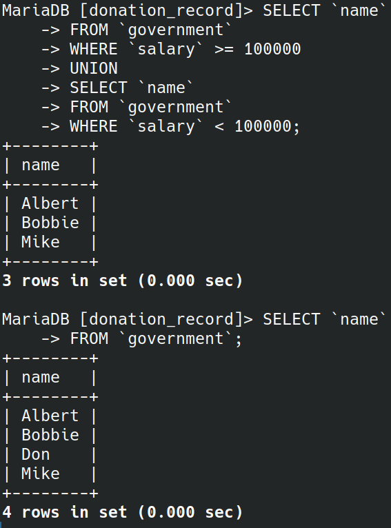


### 3A

```sql
SELECT `name`
FROM `government`
WHERE `rank` = 'minister'
UNION
SELECT `name`
FROM `donation`
WHERE `amount` >= 100000;
```


The first subquery selects the `name` column from the `government` table where the `rank` is equal to ‘minister’. The second subquery selects the `name` column from the `donation` table where the `amount` is greater than or equal to 100000. The `UNION` operation combines the results of these two subqueries and removes any duplicate rows. The final result will be a list of names from both the `government` and `donation` tables that meet the specified conditions.


```
+---------+
| name    |
+---------+
| Albert  |
| Charlie |
+---------+
```


### 3B

```sql
SELECT `government`.`name`
FROM `government`, `donation`
WHERE
    `government`.`name` = `donation`.`name`
    AND (
        `rank` = 'minister'
        OR
        `amount` >= 100000
    );
```


The given SQL statement performs a `JOIN` operation between the `government` and `donation` tables using the `name` column as the join condition. The `WHERE` clause filters the rows based on two conditions: the `rank` in the `government` table is equal to ‘minister’ or the `amount` in the `donation` table is greater than or equal to 100000. The final result will be a list of names from the `government` table that meet either of these conditions.


```
Empty set
```


### Answer 3

**<font color=#FF0000>False</font>**

The first statement uses a `UNION` operation to combine the results of two subqueries, while the second statement performs a `JOIN` operation between two tables. The first statement returns a list of names from both the `government` and `donation` tables that meet the specified conditions, while the second statement returns a list of names from the `government` table that meet either of the specified conditions.

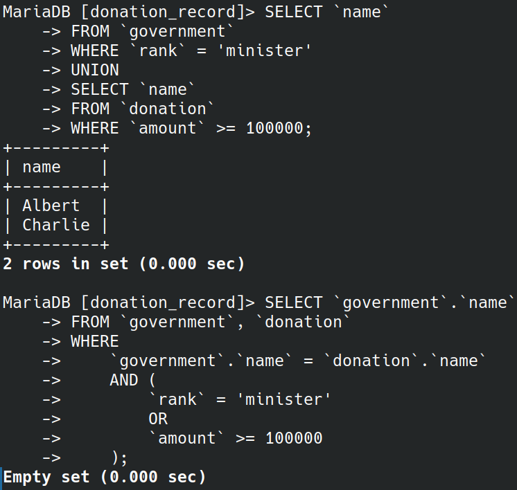


### 4A

```sql
SELECT `name`
FROM `politician`
WHERE `name` NOT IN (
    SELECT `name`
    FROM `government`
);
```


The given SQL statement is used to find the names of politicians who are not in the government.

1. The inner query `SELECT name FROM government` selects the names of all individuals in the `government` table.
2. The outer query `SELECT name FROM politician WHERE name NOT IN (...)` selects the names of all individuals in the `politician` table who are not in the result of the inner query.
3. The final result is a list of names of politicians who are not in the government.

In this case, based on the data provided, the result would be ‘Charlie’ since he is the only politician who is not in the government table.


```
+---------+
| name    |
+---------+
| Charlie |
+---------+
```


### 4B

```sql
SELECT `name`
FROM `politician`
WHERE NOT EXISTS (
    SELECT *
    FROM `government`
    WHERE `government`.`name` = `politician`.`name`
);
```


The given SQL statement is used to find the names of politicians who are not in the government. Here’s how it works step by step:

1. The inner query `SELECT * FROM government WHERE government.name = politician.name` checks if there is a row in the `government` table that has the same `name` value as the current row in the `politician` table being evaluated by the outer query.
2. The outer query `SELECT name FROM politician WHERE NOT EXISTS (...)` selects the names of all individuals in the `politician` table for which the inner query returns no rows.
3. The final result is a list of names of politicians who are not in the government.

In this case, based on the data provided, the result would be ‘Charlie’ since he is the only politician who is not in the government table.


```
+---------+
| name    |
+---------+
| Charlie |
+---------+
```


### Answer 4

**<font color=#0000FF>True</font>**

The two statements are equivalent in terms of the result they produce. Both statements return the names of politicians who are not in the government table.


### 5A

It is same as 4A.


### 5B

```sql
SELECT `politician`.`name`
FROM `politician`, `government`
WHERE NOT `politician`.`name` = `government`.`name`;
```


The given SQL statement is used to finds all combinations of names from the `politician` and `government` tables where the names are not equal.

1. The `FROM politician, government` clause performs a cross join between the `politician` and `government` tables, which produces a Cartesian product of the two tables.
2. The `WHERE NOT politician.name = government.name` clause filters out rows where the `name` value in the `politician` table is equal to the `name` value in the `government` table.
3. The final result is a list of names of politicians who are not in the government.


### Answer 5

**<font color=#FF0000>False</font>**

This statement is not equivalent to the previous two statements and will not produce the same result. In this case, based on the data provided, the result would be a list of all combinations of politicians and government officials where their names are not equal.

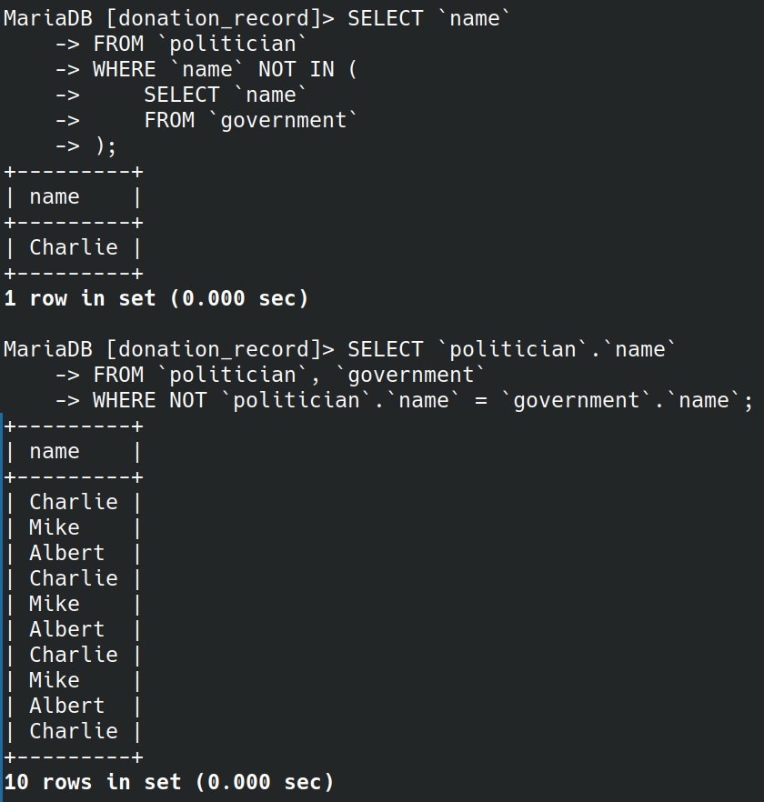


## Part 乙

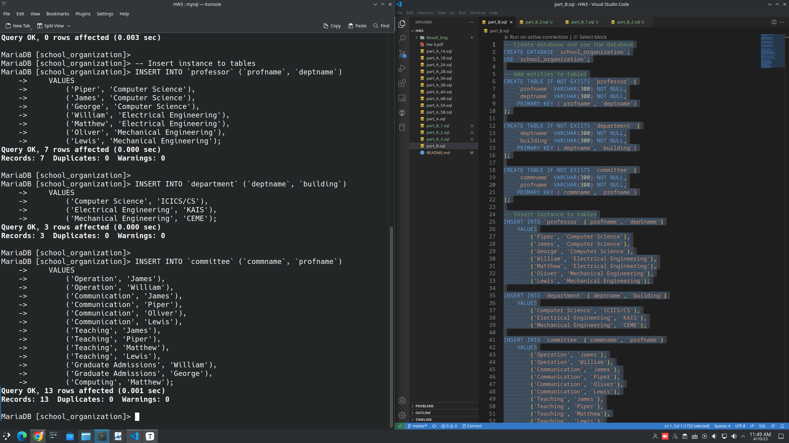

```sql
-- Create database and use the database
CREATE DATABASE `school_organization`;
USE `school_organization`;

-- Add entities to tables
CREATE TABLE IF NOT EXISTS `professor` (
    `profname` VARCHAR(300) NOT NULL,
    `deptname` VARCHAR(300) NOT NULL,
    PRIMARY KEY (`profname`, `deptname`)
);

CREATE TABLE IF NOT EXISTS `department` (
    `deptname` VARCHAR(300) NOT NULL,
    `building` VARCHAR(300) NOT NULL,
    PRIMARY KEY (`deptname`, `building`)
);

CREATE TABLE IF NOT EXISTS `committee` (
    `commname` VARCHAR(300) NOT NULL,
    `profname` VARCHAR(300) NOT NULL,
    PRIMARY KEY (`commname`, `profname`)
);

-- Insert instance to tables
INSERT INTO `professor` (`profname`, `deptname`)
    VALUES
        ('Piper', 'Computer Science'),
        ('James', 'Computer Science'),
        ('George', 'Computer Science'),
        ('William', 'Electrical Engineering'),
        ('Matthew', 'Electrical Engineering'),
        ('Oliver', 'Mechanical Engineering'),
        ('Lewis', 'Mechanical Engineering');

INSERT INTO `department` (`deptname`, `building`)
    VALUES
        ('Computer Science', 'ICICS/CS'),
        ('Electrical Engineering', 'KAIS'),
        ('Mechanical Engineering', 'CEME');

INSERT INTO `committee` (`commname`, `profname`)
    VALUES
        ('Operation', 'James'),
        ('Operation', 'William'),
        ('Communication', 'James'),
        ('Communication', 'Piper'),
        ('Communication', 'Oliver'),
        ('Communication', 'Lewis'),
        ('Teaching', 'James'),
        ('Teaching', 'Piper'),
        ('Teaching', 'Matthew'),
        ('Teaching', 'Lewis'),
        ('Graduate Admissions', 'William'),
        ('Graduate Admissions', 'George'),
        ('Computing', 'Matthew');
```


### 1

```sql
SELECT DISTINCT c1.`profname`
FROM `committee` c1
JOIN `committee` c2
ON c1.`commname` = c2.`commname`
WHERE c2.`profname` = 'Piper'
AND c1.`profname` != 'Piper';
```


1. The query starts by selecting the `profname` column from the `committee` table and giving it an alias `c1` for easier reference in the rest of the query.
2. Next, the query performs an inner join with the `committee` table again, this time giving it an alias `c2`. The join condition is that the `commname` columns from both tables must match.
3. The query then adds a `WHERE` clause to filter the results. The first condition is that the `profname` column from the `c2` table must be equal to `'Piper'`. This means that only rows where professor Piper is in the same committee as the professor in the `c1` table will be returned.
4. The second condition in the `WHERE` clause is that the `profname` column from the `c1` table must not be equal to `'Piper'`. This means that professor Piper will not be included in the results.
5. Finally, the `DISTINCT` keyword is used to ensure that each professor is only returned once, even if they are in multiple committees with professor Piper.


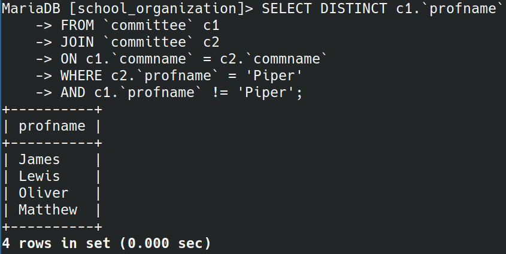


### 2

```sql
SELECT c1.`profname`
FROM `committee` c1
WHERE NOT EXISTS (
    SELECT c2.`commname`
    FROM `committee` c2
    WHERE c2.`profname` = 'Piper'
    AND NOT EXISTS (
        SELECT c3.`commname`
        FROM `committee` c3
        WHERE c3.`profname` = c1.`profname`
        AND c3.`commname` = c2.`commname`
    )
)
AND c1.`profname` != 'Piper'
GROUP BY c1.`profname`;
```


1. The query starts by selecting the `profname` column from the `committee` table and giving it an alias `c1` for easier reference in the rest of the query.
2. Next, the query adds a `WHERE NOT EXISTS` clause. This clause will filter out any rows where the subquery inside it returns any rows.
3. The subquery inside the `WHERE NOT EXISTS` clause selects the `commname` column from the `committee` table and gives it an alias `c2`. It then adds a `WHERE` clause with two conditions.
4. The first condition is that the `profname` column from the `c2` table must be equal to `'Piper'`. This means that *only committees that professor Piper is in will be considered*.
5. The second condition is another `NOT EXISTS` clause. This clause will filter out any rows where the subquery inside it returns any rows.
6. The subquery inside this second `NOT EXISTS` clause selects the `commname` column from the `committee` table and gives it an alias `c3`. It then adds a `WHERE` clause with two conditions.
7. The first condition is that the `profname` column from the `c3` table must be equal to the `profname` column from the `c1` table. This means that only committees that the professor in the outer query is in will be considered.
8. The second condition is that the `commname` column from the `c3` table must be equal to the `commname` column from the `c2` table. This means that only committees that both professor Piper and the professor in the outer query are in will be considered.
9. Going back to the outer query, another condition is added to the outermost `WHERE` clause to ensure that professor Piper is not included in the results.
10. Finally, a `GROUP BY` clause is added to group the results by professor name.


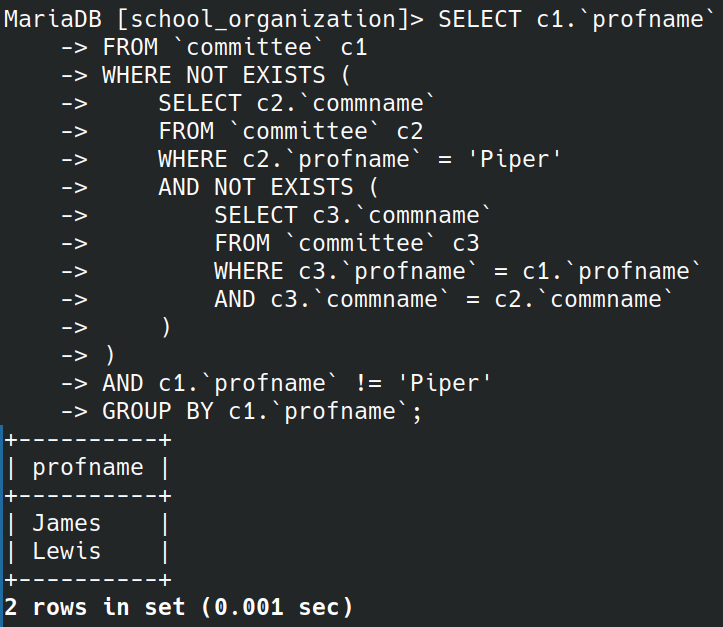


### 3

```sql
SELECT DISTINCT p.`profname`
FROM `professor` p
JOIN `department` d ON p.`deptname` = d.`deptname`
WHERE d.`building` NOT IN (
    SELECT d.`building`
    FROM `professor` p
    JOIN `department` d ON p.`deptname` = d.`deptname`
    WHERE p.`profname` = 'Piper'
);
```


1. The main query selects the `profname` column from the `professor` table and renames it as `p` for convenience.
2. The `JOIN` statement combines rows from the `professor` and `department` tables based on the condition that the `deptname` column matches in both tables. This means that for each row in the `professor` table, the query will find all rows in the `department` table where the `deptname` is the same and combine them into a single row.
3. The `WHERE` clause filters the rows returned by the `JOIN` statement. It only keeps rows where the value of the `building` column in the `department` table is not in the list of buildings returned by the subquery.
4. The subquery is used to find all buildings that professor Piper has offices in. It selects the `building` column from the `department` table and renames it as `d` for convenience.
5. The subquery also uses a `JOIN` statement to combine rows from the `professor` and `department` tables based on the condition that the `deptname` column matches in both tables.
6. The subquery’s `WHERE` clause filters the rows returned by its `JOIN` statement. It only keeps rows where the value of the `profname` column in the `professor` table is ‘Piper’.
7. Finally, the main query’s `SELECT DISTINCT` statement ensures that only unique values of `profname` are returned.


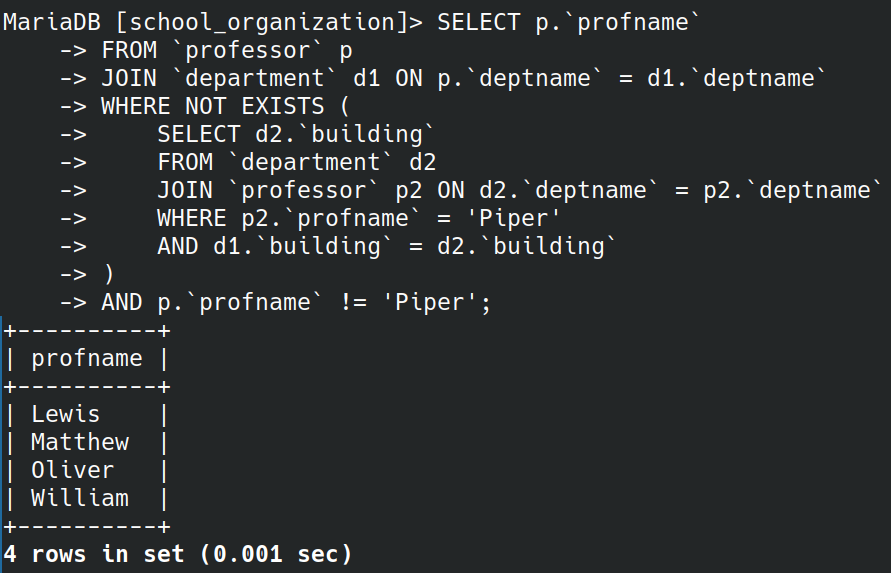


## Part 丙

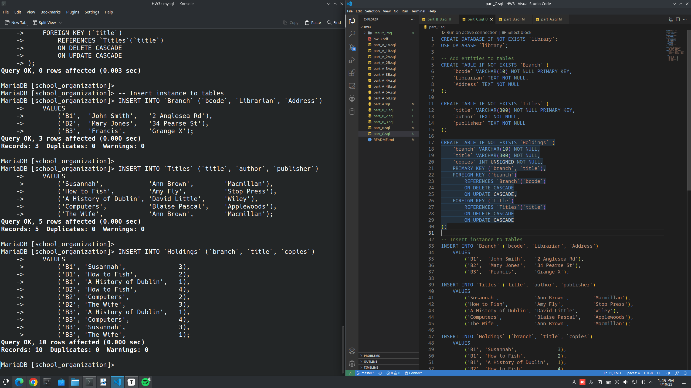

```sql
CREATE DATABASE IF NOT EXISTS `library`;
USE DATABASE `library`;

-- Add entities to tables
CREATE TABLE IF NOT EXISTS `Branch` (
    `bcode` VARCHAR(10) NOT NULL PRIMARY KEY,
    `Librarian` TEXT NOT NULL,
    `Address` TEXT NOT NULL
);

CREATE TABLE IF NOT EXISTS `Titles` (
    `title` VARCHAR(300) NOT NULL PRIMARY KEY,
    `author` TEXT NOT NULL,
    `publisher` TEXT NOT NULL
);

CREATE TABLE IF NOT EXISTS `Holdings` (
    `branch` VARCHAR(10) NOT NULL,
    `title` VARCHAR(300) NOT NULL,
    `copies` INT UNSIGNED NOT NULL,
    PRIMARY KEY (`branch`, `title`),
    FOREIGN KEY (`branch`)
        REFERENCES `Branch`(`bcode`)
        ON DELETE CASCADE
        ON UPDATE CASCADE,
    FOREIGN KEY (`title`)
        REFERENCES `Titles`(`title`)
        ON DELETE CASCADE
        ON UPDATE CASCADE
);

-- Insert instance to tables
INSERT INTO `Branch` (`bcode`, `Librarian`, `Address`)
    VALUES
        ('B1',  'John Smith',   '2 Anglesea Rd'),
        ('B2',  'Mary Jones',   '34 Pearse St'),
        ('B3',  'Francis',      'Grange X');

INSERT INTO `Titles` (`title`, `author`, `publisher`)
    VALUES
        ('Susannah',            'Ann Brown',        'Macmillan'),
        ('How to Fish',         'Amy Fly',          'Stop Press'),
        ('A History of Dublin', 'David Little',     'Wiley'),
        ('Computers',           'Blaise Pascal',    'Applewoods'),
        ('The Wife',            'Ann Brown',        'Macmillan');

INSERT INTO `Holdings` (`branch`, `title`, `copies`)
    VALUES
        ('B1', 'Susannah',              3),
        ('B1', 'How to Fish',           2),
        ('B1', 'A History of Dublin',   1),
        ('B2', 'How to Fish',           4),
        ('B2', 'Computers',             2),
        ('B2', 'The Wife',              3),
        ('B3', 'A History of Dublin',   1),
        ('B3', 'Computers',             4),
        ('B3', 'Susannah',              3),
        ('B3', 'The Wife',              1);
```


### 1

```sql
SELECT DISTINCT `title`
FROM `Titles`
WHERE `Publisher` = 'Macmillan';
```

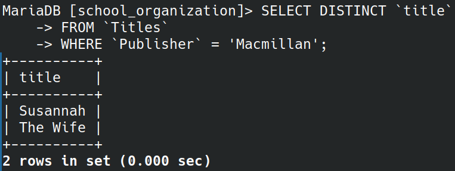


### 2

```sql
SELECT DISTINCT b.`librarian`
FROM `Branch` b
JOIN `Holdings` h ON b.`bcode` = h.`branch`
JOIN `Titles` t ON h.`title` = t.`title`
WHERE t.`author` = 'Ann Brown';
```


1. `SELECT DISTINCT b.librarian`: This line specifies the columns that we want to retrieve from the `Branch` table. The `DISTINCT` keyword ensures that we only get unique rows in our result.
2. `FROM Branch`: This line specifies the main table we are querying from, which is the `Branch` table.
3. `JOIN Holdings h ON b.bcode = h.branch`: This line performs an inner join between the `Branch` and `Holdings` tables. The join condition is that the `bcode` column in the `Branch` table must match the `branch` column in the `Holdings` table.
4. `JOIN Titles t ON h.title = t.title`: This line performs another inner join, this time between the `Holdings` and `Titles` tables. The join condition is that the `title` column in the `Holdings` table must match the `title` column in the `Titles` table.
5. `WHERE t.author = 'Ann Brown'`: This line specifies a condition that must be met for a row to be included in the result. In this case, we only want rows where the `author` column in the `Titles` table is equal to `'Ann Brown'`.

The result of this query will be a table containing the unique combinations of `bcode`, `Librarian`, and `Address` from the `Branch` table where there exists a book by Ann Brown in their holdings.


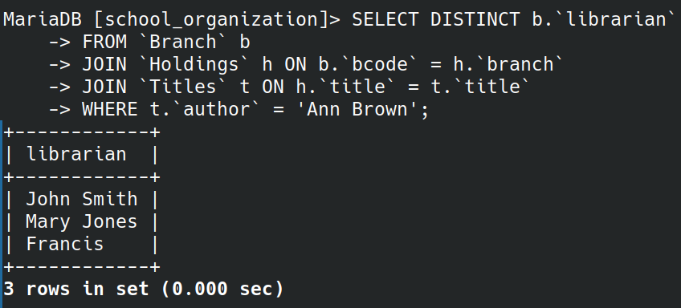


### 3

```sql
SELECT b.`Librarian`, SUM(`Holdings`.`copies`) AS `Total Books`
FROM `Branch` b
JOIN `Holdings` ON b.`bcode` = `Holdings`.`branch`
GROUP BY b.`bcode`;
```


1. `SELECT b.Librarian, SUM(Holdings.copies) AS Total Books`: This line specifies the columns that we want to retrieve from the `Branch` and `Holdings` tables. The `SUM(Holdings.copies)` function calculates the total number of books held at each branch by summing up the `copies` column in the `Holdings` table for each branch. The `AS Total Books` clause renames the resulting column to `Total Books`.
2. `FROM Branch b`: This line specifies the main table we are querying from, which is the `Branch` table. The `b` after the table name is an alias that we can use to refer to the `Branch` table in other parts of the query.
3. `JOIN Holdings ON b.bcode = Holdings.branch`: This line performs an inner join between the `Branch` and `Holdings` tables. The join condition is that the `bcode` column in the `Branch` table must match the `branch` column in the `Holdings` table.
4. `GROUP BY b.bcode`: This line groups the results by branch so that we get one row per branch in our result. The grouping is done on the `bcode` column in the `Branch` table.


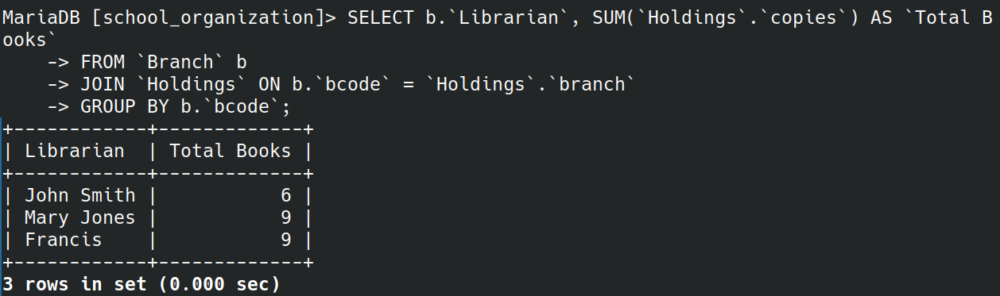


## Part 丁

### 1

```SQL
SELECT S.A
FROM S
WHERE S.B NOT IN (
    SELECT R.B
    FROM R
    WHERE R.B > 5
);
```

```sql
SELECT S.A
FROM S
WHERE S.B <> ALL (
    SELECT R.B
	FROM R
    WHERE R.B > 5
);
```

```SQL
SELECT S.A
FROM S
WHERE NOT EXISTS (
    SELECT R.B
    FROM R
    WHERE R.B > 5 AND R.B = S.B
);
```

The three SQL statements are equivalent. They all retrieve the same data from the database, which is the values of column `A` from table `S` where the value of column `B` in table `S` does not appear in column `B` of table `R` where `B` is greater than 5.

*Ans: D*


### 2

```SQL
SELECT S.A
FROM S
WHERE S.B <= ANY (
    SELECT R.B
    FROM R
    WHERE R.B > 5
);
```

```sql
SELECT S.A
FROM S
WHERE S.B <= ALL (
    SELECT R.B
    FROM R
    WHERE R.B > 5
);
```

```sql
SELECT S.A
FROM S
WHERE EXISTS (
    SELECT R.B
    FROM R
    WHERE R.B > 5 AND R.B >= S.B
);
```

The first SQL statement retrieves the values of column `A` from table `S` where the value of column `B` in table `S` is less than or equal to **any** value of column `B` in table `R` where `B` is greater than 5.

The second SQL statement retrieves the values of column `A` from table `S` where the value of column `B` in table `S` is less than or equal to **all** values of column `B` in table `R` where `B` is greater than 5.

The third SQL statement retrieves the values of column `A` from table `S` where there exists a value of column `B` in table `R` where `B` is greater than 5 and **greater than or equal to** the value of column `B` in table `S`.

There are no two SQL statements that are equivalent among the six statements provided.

*Ans: A*


### 3

```sql
SELECT S.A
FROM S
WHERE S.B IN (
    SELECT R.B
    FROM R
    WHERE R.B > 5
);
```

```sql
SELECT S.A
FROM S
WHERE S.B = ANY (
    SELECT R.B
    FROM R
    WHERE R.B > 5
);
```

```sql
SELECT S.A
FROM S
WHERE S.B >= ALL (
    SELECT R.B
    FROM R
    WHERE R.B > 5
);
```

They all retrieve the values of the column `A` from the table `S` where the corresponding value in column `B` is also found in the values of column `B` in table `R` that satisfy the condition `B > 5`.

Let's say the attribute `B` is `INT` in `range(0, 11)`. The subquery must return `R.B > 5`, e.g. `6, 7, 9, 10`.

1. Suppose that we check if `S.B = 5` matches the subquery. Since 5 is not greater than 5, 5 will not in `R.B` and thus `S.B` is **not in, not equals to any, and not greater than or equals to all elements in R.B**.
2. Suppost that we check if `S.B = 10` matches the subquery. Since 10 is greater than 5 and 10 is in `6, 7, 9, 10`, `S.B` is **in, equals to any, and greater than or equals to all elements in R.B**.
3. Suppose that we check if `S.B = 8` matches the subquery. Since 8 is greater than 5 but 8 is **not** in `6, 7, 9, 10`, `S.B` is **not in, not equals to any, and not greater than or equals to all elements in R.B**.

*Ans: D*


# Caution

We have downloaded the sample csv files into `samples` and <font color=#FF0000>changed them into LF format using in Linux.</font> The `part_E_sample.sql` and `part_F_sample.sql` use the following setting.

```sql
LINES TERMINATED BY '\n'
```


You have to <font color=#FF0000>check your own csv file if it is CRLF or LF</font> by yourself if you want to use your own csv file.

You also have to change your own <font color=#FF0000>absolute path</font> for your own csv file.


## part 戊

<font color=#FF0000>IMPORTANT: We add additional entity "Computer" to be the base entity of "Desktop" and "Laptop".</font> The reason is we want to add foreign key constraints correctly.

<font color=#FF0000>IMPORTANT: This may cause error when you add the default data directly into our definition.</font>


```sql
CREATE DATABASE IF NOT EXISTS `computer_products`;
USE `computer_products`;

-- Entities
CREATE TABLE IF NOT EXISTS `Manufacturer` (
    `name` VARCHAR(100) NOT NULL PRIMARY KEY,
    `country` TEXT NOT NULL,
    `phone` TEXT NOT NULL
);

CREATE TABLE IF NOT EXISTS `Computer` (
    `model` VARCHAR(100) NOT NULL PRIMARY KEY
) COMMENT 'Base Table';

CREATE TABLE IF NOT EXISTS `Desktop` (
    `model` VARCHAR(100) NOT NULL PRIMARY KEY,
    `speed` REAL NOT NULL,
    `ram` INT UNSIGNED NOT NULL COMMENT 'Unsigned int in GB',
    `hd` INT UNSIGNED NOT NULL COMMENT 'Hard Disk size, unsigned int in GB',
    `list_price` REAL UNSIGNED NOT NULL
) COMMENT 'Derived Table from Computer';

CREATE TABLE IF NOT EXISTS `Laptop` (
    `model` VARCHAR(100) NOT NULL PRIMARY KEY,
    `speed` REAL NOT NULL,
    `ram` INT UNSIGNED NOT NULL COMMENT 'Unsigned int in GB',
    `hd` INT UNSIGNED NOT NULL COMMENT 'Hard Disk size, unsigned int in GB',
    `screen` REAL UNSIGNED NOT NULL COMMENT 'Unsigned real in inch',
    `list_price` REAL UNSIGNED NOT NULL
) COMMENT 'Derived Table from Computer';

-- Relations
CREATE TABLE IF NOT EXISTS `Product` (
    `manu_name` VARCHAR(100) NOT NULL,
    `model` VARCHAR(100) NOT NULL,
    `style` VARCHAR(100) NOT NULL,
    PRIMARY KEY (`manu_name`, `model`, `style`),
    FOREIGN KEY (`manu_name`)
        REFERENCES `Manufacturer`(`name`)
        ON DELETE CASCADE
        ON UPDATE CASCADE,
    FOREIGN KEY (`model`)
        REFERENCES `Computer`(`model`)
        ON DELETE CASCADE
        ON UPDATE CASCADE
);
```

```sql
-- Insert rows to tables
INSERT INTO `Manufacturer` (`name`, `country`, `phone`) VALUES
    ('ASUS',    'Taiwan R.O.C', '+886-0800-093-456'),
    ('ACER',    'Taiwan R.O.C', '+886-0800-258-222'),
    ('MSI',     'Taiwan R.O.C', '+886-0800-018-880'),
    ('GIGABYTE','Taiwan R.O.C', '+886-2-8912-4000'),
    ('LENOVO',  'China',        '+886-0800-000-702'),
    ('DELL',    'U.S.A',        '+886-0080-1861-015'),
    ('RAZER',   'Singapore',    '+886-2-2793-1520'),
    ('FUJITSU', 'Japan',        '+886-2-2788-8099#2'),
    ('HP',      'U.S.A',        '+886-0800-010-055'),
    ('APPLE',   'U.S.A',        '+886-0800-020-021'),
    ('TOSHIBA', 'Japan',        '+886-0800-278-000');

INSERT INTO `Computer` (`model`) VALUES
    ('H-S500SD-71270015W'),
    ('H-S501MD-51240F022W'),
    ('H-S700TA-51040F0010'),
    ('H-S500SD-0G6900011W'),
    ('MAG Trident S 5M'),
    ('MEG, Trident X2 13NUI'),
    ('V3020T-R1308STW'),
    ('V3020T-R3718STW'),
    ('13-5320-R1808STW'),
    ('G15-5525-R1848ATW');

INSERT INTO `Desktop` (`model`, `speed`, `ram`, `hd`, `list_price`) VALUES
    ('H-S500SD-71270015W',    4.9, 16,  512,  900),  -- ASUS
    ('H-S501MD-51240F022W',   4.4, 8,   1280, 730),  -- ASUS
    ('H-S700TA-51040F0010',   4.3, 8,   512,  630),  -- ASUS
    ('H-S500SD-0G6900011W',   3.4, 4,   1024, 396),  -- ASUS
    ('MAG Trident S 5M',      4.6, 16,  1024, 963),  -- MSI
    ('MEG, Trident X2 13NUI', 5.8, 128, 6144, 6633), -- MSI
    ('V3020T-R1308STW',       4.5, 8,   1280, 630),  -- DELL
    ('V3020T-R3718STW',       5.2, 16,  512,  1550); -- DELL

INSERT INTO `Laptop` (`model`, `speed`, `ram`, `hd`, `screen`, `list_price`) VALUES
    ('13-5320-R1808STW', 2.1, 16, 512, 13.3, 1130), -- DELL
    ('G15-5525-R1848ATW', 3.3, 8, 512, 15.6, 1266); -- DELL

INSERT INTO `Product` (`manu_name`, `model`, `style`) VALUES
    ('ASUS', 'H-S500SD-71270015W',      'Intel i7-12700 12C20T'),
    ('ASUS', 'H-S501MD-51240F022W',     'Intel i5-12400F 6C12T'),
    ('ASUS', 'H-S700TA-51040F0010',     'Intel i5-10400F 6C12T'),
    ('ASUS', 'H-S500SD-0G6900011W',     'Intel Celeron G6900 2C2T'),
    ('MSI',  'MAG Trident S 5M',        'AMD R7-5700G 8C16T'),
    ('MSI',  'MEG, Trident X2 13NUI',   'Intel i9-13900KF 24C32T'),
    ('DELL', 'V3020T-R1308STW',         'Intel i3-13100 4C4T'),
    ('DELL', 'V3020T-R3718STW',         'Intel i7-13700F 16C24T'),
    ('DELL', '13-5320-R1808STW',        'Intel i7-1360P 12C16T'),
    ('DELL', 'G15-5525-R1848ATW',       'AMD R7-6800H 8C16T');
```


### 1

Find the average HD size of the Desktop PCs.

```sql
SELECT AVG(`hd`) AS `avg_hd_size`
FROM `Desktop`;
```

This query calculates the average of the `hd` column in the `Desktop` table and returns it as `avg_hd_size`.

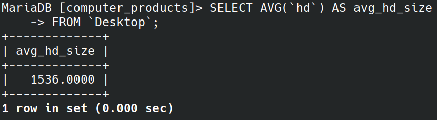


### 2

Find the average price of laptops with a speed of at least 3.0.

```sql
SELECT AVG(`list_price`) AS `avg_price`
FROM `Laptop`
WHERE `speed` >= 3.0;
```

This query selects the `list_price` column from the `Laptop` table and calculates the average using the `AVG()` function. The `WHERE` clause filters the results to only include laptops with a speed of at least 3.0.

Note that we only need to query the `Laptop` table, since the `Desktop` table is not relevant to this question. Additionally, we do not need to join any tables since all the necessary information is contained within the `Laptop` table.

Also, note that we assume the `list_price` column represents the price of the laptop and not the manufacturer's suggested retail price (MSRP) or any other price.

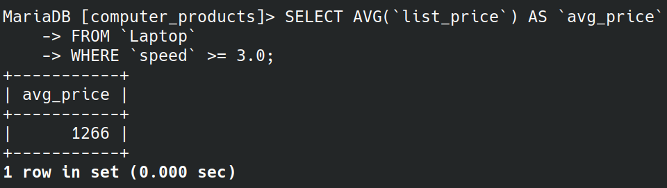


### 3

Find the average price of desktop and laptops made by DELL.

```sql
SELECT AVG(`price`) AS `avg_price`
FROM (
    SELECT d.`list_price` AS `price`
    FROM `Product` p
    INNER JOIN `Desktop` d ON p.`model` = d.`model`
    INNER JOIN `Manufacturer` m ON p.`manu_name` = m.`name`
    WHERE m.`name` = 'DELL'
    UNION ALL
    SELECT l.`list_price` AS `price`
    FROM `Product` p
    INNER JOIN `Laptop` l ON p.`model` = l.`model`
    INNER JOIN `Manufacturer` m ON p.`manu_name` = m.`name`
    WHERE m.`name` = 'DELL'
) AS `subquery`;
```

In this query, we use a subquery to combine the `list_price` column from both the `Desktop` and `Laptop` tables, and then compute the average using the `AVG()` function in the outer query.

We join the `Product`, `Desktop`, `Laptop`, and `Manufacturer` tables to retrieve the `list_price` attribute for both desktops and laptops made by DELL. We use the `UNION ALL` operator to combine the `list_price` values from the `Desktop` and `Laptop` tables into a single column, and then compute the average of the combined values using the `AVG()` function in the outer query.

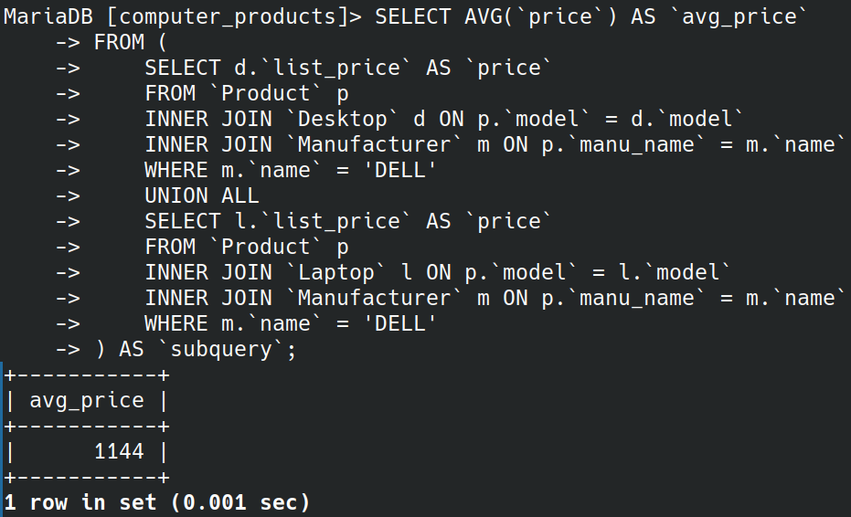


### 4

Find, for each different price, the average speed of a PC.

<font color=#FF0000>PC includes Desktop and Laptop.</font>

```sql
SELECT pc.`list_price`, AVG(pc.`speed`) AS avg_speed
FROM (
    SELECT `model`, `speed`, `list_price`
    FROM `Desktop`
    UNION ALL
    SELECT `model`, `speed`, `list_price`
    FROM `Laptop`
) pc
INNER JOIN `Product` p ON pc.`model` = p.`model`
GROUP BY pc.`list_price`;
```

In this query, we create a subquery `pc` which selects the `model`, `speed`, and `list_price` columns from both the `Desktop` and `Laptop` tables and combines them using the `UNION ALL` statement. We then join this subquery with the `Product` table on the `model` column and group by the `list_price` column. Finally, we calculate the average speed of desktop and laptop computers for each distinct price in the `list_price` column.

This query will return a table with two columns - `list_price` and `avg_speed`. The `list_price` column will have distinct prices from both the `Desktop` and `Laptop` tables, and the `avg_speed` column will have the average speed of all computers with that particular price from the `Desktop`, `Laptop`, and `Product` tables.

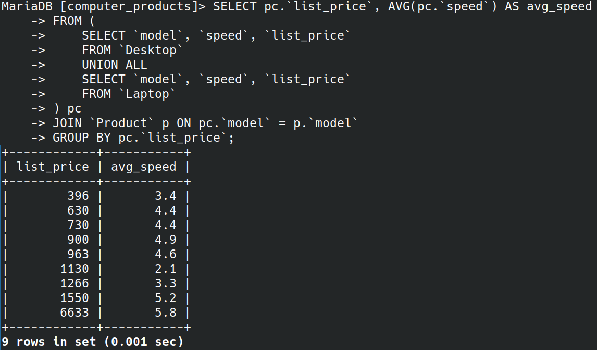


### 5

Find the manufacturers that make at least 3 different models of desktop PCs.

```sql
SELECT m.`name`
FROM `Manufacturer` m
INNER JOIN `Product` p ON m.`name` = p.`manu_name`
INNER JOIN `Desktop` d ON p.`model` = d.`model`
GROUP BY m.`name`
HAVING COUNT(DISTINCT d.`model`) >= 3;
```

- We start by selecting the `name` column from the `Manufacturer` table.
- We join the `Manufacturer`, `Product`, and `Desktop` tables on the `manu_name` and `model` columns to get the manufacturer, product, and desktop information for each manufacturer that makes desktop PCs.
- We group the results by the `name` column.
- We use the `HAVING` clause to filter the results to only those manufacturers that have at least 3 distinct models of desktop PCs in the `Desktop` table. The `COUNT` function with the `DISTINCT` keyword is used to count the number of distinct desktop PC models for each manufacturer.

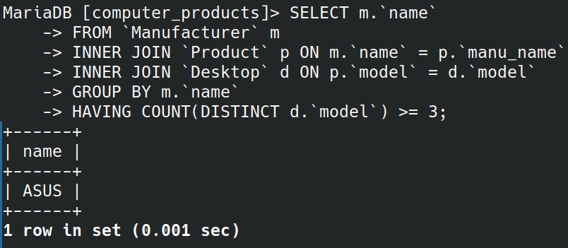


### 6

Find for each manufacturer that makes desktop the maximum speed of a desktop.

```sql
SELECT m.`name`, MAX(d.`speed`) AS max_speed
FROM `Manufacturer` m
INNER JOIN `Product` p ON m.`name` = p.`manu_name`
INNER JOIN `Desktop` d ON p.`model` = d.`model`
GROUP BY m.`name`;
```

- We start by selecting the `name` column from the `Manufacturer` table and the `speed` column from the `Desktop` table.
- We join the `Manufacturer`, `Product`, and `Desktop` tables on the `manu_name` and `model` columns to get the manufacturer and desktop information for each desktop PC.
- We group the results by the `manu_name` column.
- We use the `MAX` function to calculate the maximum speed for each manufacturer in the `Desktop` table.

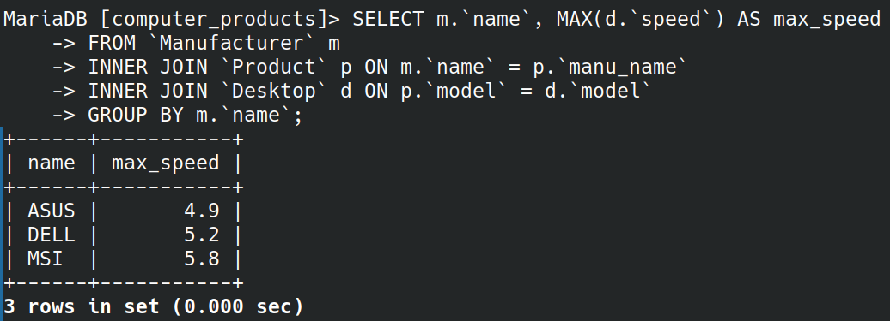


### 7

Find the for each speed of desktop PC above 2.5, the average hard-disk size.

```sql
SELECT `speed`, AVG(`hd`) AS `avg_hard_disk`
FROM `Desktop`
WHERE `speed` > 2.5
GROUP BY `speed`;
```

- We start by selecting the `speed` column and the `hd` column from the `Desktop` table.
- We filter the results to only include desktop PCs with a speed above 2.5 using the `WHERE` clause.
- We group the results by the `speed` column.
- We use the `AVG` function to calculate the average hard-disk size for each speed of desktop PC above 2.5.

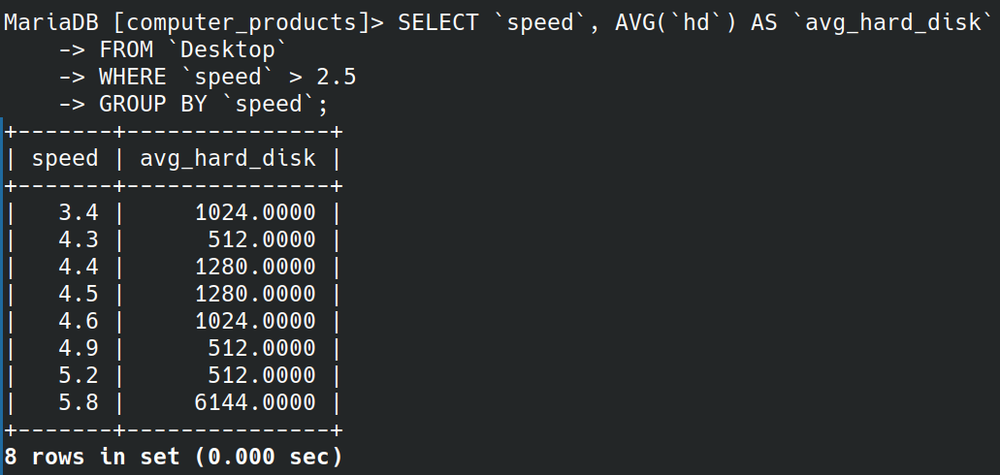


### 8

Find for each manufacturer, the average speed of its laptops.

```sql
SELECT p.`manu_name`, AVG(l.`speed`) AS `avg_speed`
FROM `Product` p
INNER JOIN `Laptop` l ON p.`model` = l.`model`
GROUP BY p.`manu_name`;
```

- We start by selecting the `manu_name` column from the `Product` table and the `speed` column from the `Laptop` table.
- We join the `Product` and `Laptop` tables on the `model` column to get the laptop information for each manufacturer.
- We group the results by the `manu_name` column.
- We use the `AVG` function to calculate the average speed for each manufacturer in the `Laptop` table.

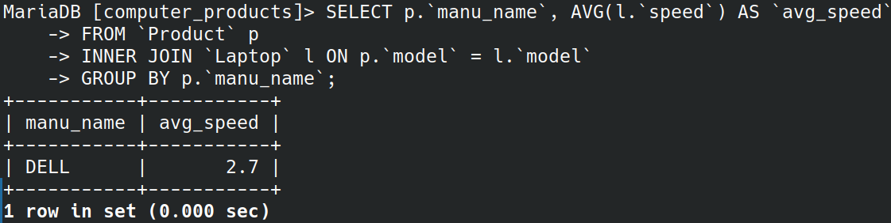


### 9

Find the average hard-disk size of a desktop PC for all those manufacturers that make laptops.

```sql
SELECT p.`manu_name`, AVG(d.`hd`)
FROM `Desktop` d
INNER JOIN `Product` p ON d.`model` = p.`model`
WHERE p.`manu_name` IN (
    SELECT DISTINCT p2.`manu_name`
    FROM `Product` p2
    INNER JOIN `Laptop` l ON p2.`model` = l.`model`
);
```

- We start by selecting the `manu_name` column from the `Product` table (aliased as `p`) and the average `hd` column from the `Desktop` table (aliased as `d`).
- We join the `Desktop` and `Product` tables using an inner join on the `model` column, so we only include desktop models that are also listed in the `Product` table.
- We add a WHERE clause to filter only the manufacturers that also produce laptops. This is done by using a subquery that selects the distinct `manu_name` values from the `Product` table (aliased as `p2`) that have corresponding entries in the `Laptop` table (aliased as `l`). This subquery is used to filter the results of the outer query.

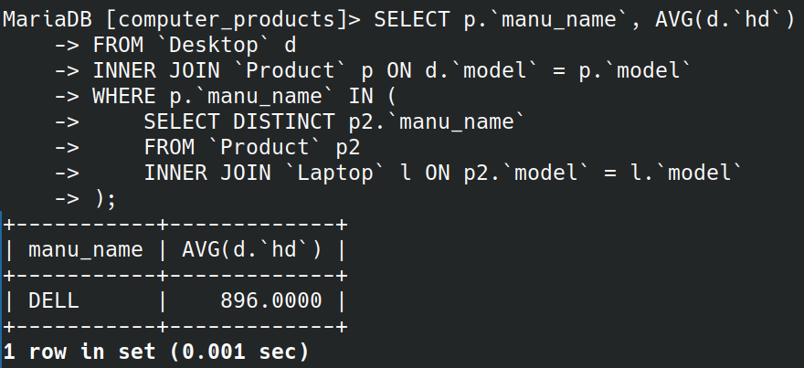


### 10

Delete all desktop PCs with less than 400GB of HD.

```sql
DELETE FROM `Desktop` 
WHERE `hd` < 400;
```

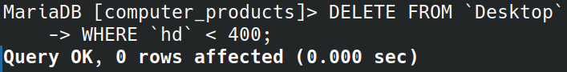


### 11

Using 2 insert statements, insert the following data in the DB: desktop PC model 1500 is made by Acer, has speed 3.1, RAM 2048, HD 300, and sells for $799.

```sql
INSERT INTO `Computer` (`model`) VALUES
    ('1500');

INSERT INTO `Desktop` (`model`, `speed`, `ram`, `hd`, `list_price`) VALUES
    ('1500', 3.1, 2048, 300, 799);

INSERT INTO `Product` (`manu_name`, `model`, `style`) VALUES
    ('ACER', '1500', 'N/A');
```

We've added addtional entity `Computer` to be the base entity of `Desktop` and `Laptop`. Thus, we also have to add this product into `Computer`.

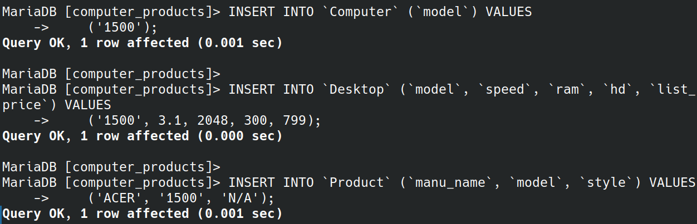


### 12

Delete all laptops made by a manufacturer that does not make **<font color=#FF0000>Desktop</font>** PCs.

```sql
DELETE FROM `Laptop`
WHERE `model` IN (
    SELECT p.`model`
    FROM `Product` p
    INNER JOIN `Desktop` l ON p.`model` = l.`model`
    WHERE p.`manu_name` NOT IN (
        SELECT DISTINCT `name`
        FROM `Manufacturer` m
        INNER JOIN `Product` p2 ON m.`name` = p2.`manu_name`
    )
);
```

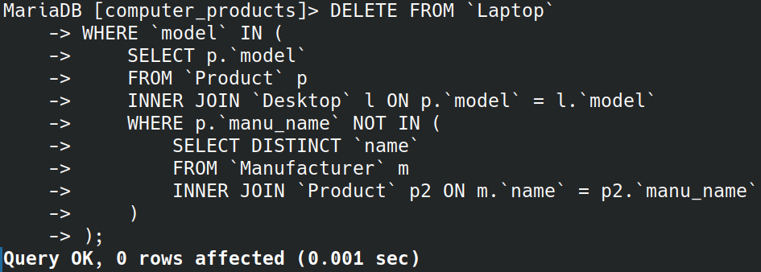


### 13

For each PC, double the amount of HD and add 2048 to the amount of RAM.

```sql
UPDATE `Desktop`
SET `hd` = `hd` * 2,
    `ram` = `ram` + 2048;
```

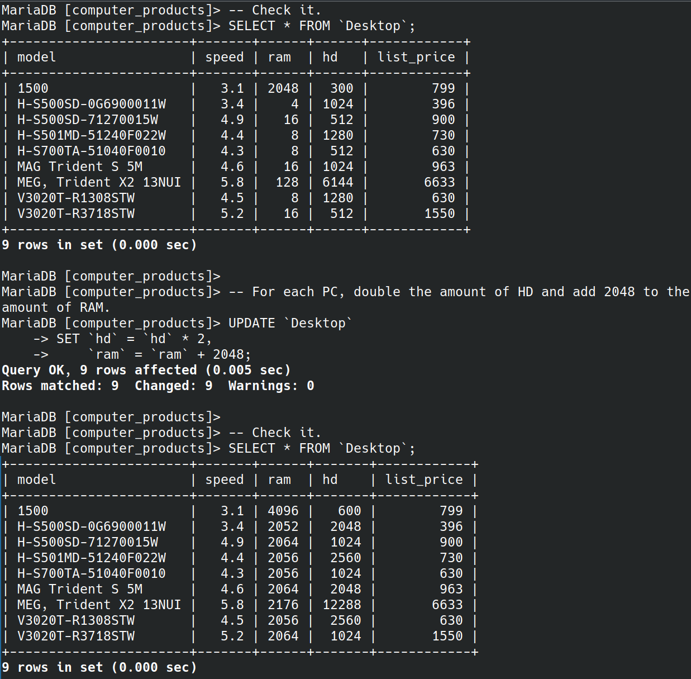


### 14

For each laptop made by Dell, add one inch to the screen size and subtract $200 from the price.

```sql
UPDATE `Laptop`
SET `screen` = `screen` + 1,
    `list_price` = `list_price` - 200
WHERE `model` IN (
    SELECT `model`
    FROM `Product`
    WHERE `manu_name` = 'DELL'
);
```

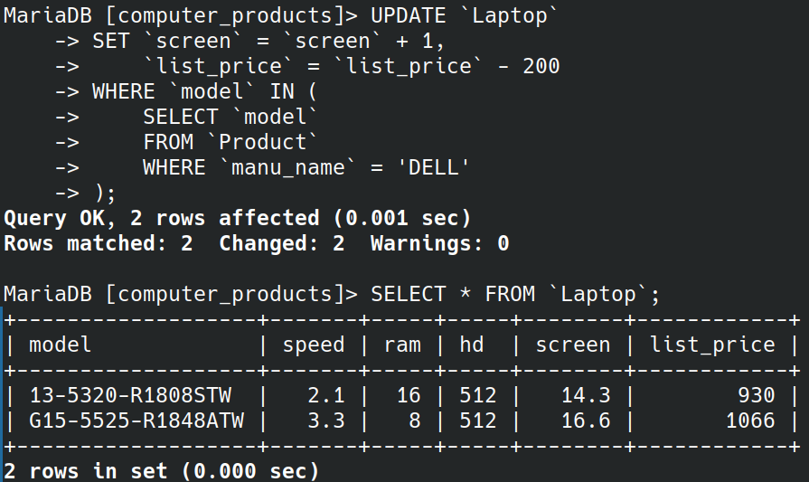


## part 己


```sql
CREATE DATABASE IF NOT EXISTS `booking_record`;
USE `booking_record`;

-- Entities
CREATE TABLE IF NOT EXISTS `Books` (
    `bid` INT UNSIGNED NOT NULL PRIMARY KEY COMMENT 'book unique id',
    `btitle` TEXT NOT NULL COMMENT 'book title',
    `author` TEXT NOT NULL COMMENT 'name of book author',
    `year` SMALLINT UNSIGNED NOT NULL COMMENT 'book publication year',
    `price` INT NOT NULL COMMENT 'unit price per copy'
);

CREATE TABLE IF NOT EXISTS `Customers` (
    `cid` INT UNSIGNED NOT NULL PRIMARY KEY COMMENT 'unique customer identifier',
    `cname` TEXT NOT NULL COMMENT 'customer name',
    `zipcode` TEXT NOT NULL COMMENT 'customer address zipcode'
);

-- Relations
CREATE TABLE IF NOT EXISTS `Orders` (
    `cid` INT UNSIGNED NOT NULL,
    `bid` INT UNSIGNED NOT NULL,
    `quantity` INT NOT NULL COMMENT 'number of book copies purchased with an order',
    PRIMARY KEY (`cid`, `bid`),
    FOREIGN KEY (`cid`)
        REFERENCES `Customers`(`cid`)
        ON DELETE CASCADE
        ON UPDATE CASCADE,
    FOREIGN KEY (`bid`)
        REFERENCES `Books`(`bid`)
        ON DELETE CASCADE
        ON UPDATE CASCADE
);
```

```sql
USE `booking_record`;

-- Delete all rows for every tables.
DELETE FROM `Books`;
DELETE FROM `Customers`;
DELETE FROM `Orders`;

-- This is generated by ChatGPT.
INSERT INTO `Books` (`bid`, `btitle`, `author`, `year`, `price`) VALUES
(1, 'I am Cody 1', 'Cody', 1990, 10),
(2, 'I am Cody 2', 'Codey', 2000, 20),
(3, 'I am Cody 3', 'Codie', 1990, 30),
(4, 'I am Cody 4', 'Codi', 2000, 40),
(5, 'I am Cody 5', 'Codrick', 1990, 100),
(6, 'I am Co', 'Co', 1990, 150),
(7, 'I am not Cody', 'BCody', 2000, 200),
(8, 'I hate DB', 'William', 1990, 300),
(9, 'DB is horrible', 'Elizabeth', 2000, 450),
(10, 'What is MySQL', 'John', 2000, 500),
(11, 'What is PostgreSQL', 'Sarah', 1990, 550);

INSERT INTO `Customers` (`cid`, `cname`, `zipcode`) VALUES
(1,  'Alice Smith',     '12345'),
(2,  'Bob Johnson',     '23456'),
(3,  'Charlie Brown',   '02125'),
(4,  'David Lee',       '02125'),
(5,  'Emily Davis',     '56789'),
(6,  'Frank Hernandez', '12345'),
(7,  'Grace Kim',       '02125'),
(8,  'Henry Nguyen',    '89012'),
(9,  'Isabella Perez',  '90123'),
(10, 'Jack Taylor',     '02125');

INSERT INTO `Orders` (`cid`, `bid`, `quantity`) VALUES
(1, 1, 100),
(1, 3, 50),
(1, 5, 4),
(1, 7, 3),
(1, 9, 2),
(1, 11, 1),
(2, 1, 1),
(2, 5, 75),
(2, 7, 150),
(3, 1, 2),
(3, 9, 200),
(3, 2, 25),
(4, 4, 50),
(4, 6, 75),
(5, 1, 3),
(5, 8, 150),
(5, 10, 25),
(6, 1, 100),
(6, 6, 50),
(6, 8, 100),
(7, 10, 25),
(7, 4, 50),
(8, 1, 50),
(9, 1, 75),
(9, 2, 100),
(10, 9, 50),
(10, 11, 25);
```


### 1

Find the titles of books that were ordered only in quantities of at least 100.

```sql
SELECT b.`btitle`
FROM `Books` b
INNER JOIN `Orders` o ON b.`bid` = o.`bid`
GROUP BY o.`bid`
HAVING SUM(o.`quantity`) >= 100;
```


### 2

Find the authors of books that cost at most $40 and were ordered from zipcode 12345.

```sql
SELECT DISTINCT `author`
FROM `Books`
INNER JOIN `Orders` ON `Books`.`bid` = `Orders`.`bid`
INNER JOIN `Customers` ON `Orders`.`cid` = `Customers`.`cid`
WHERE `price` <= 40 AND `zipcode` = '12345';
```


### 3

Find the names of customers who ordered some book published in year 2000 and also ordered at least 10 copies of some book that costs more than $100.

```sql
SELECT DISTINCT `cname`
FROM `Customers`
JOIN `Orders` ON `Customers`.`cid` = `Orders`.`cid`
JOIN `Books` ON `Orders`.`bid` = `Books`.`bid`
WHERE `year` = 2000 AND `price` > 100 AND `quantity` >= 10;
```


### 4

Find the authors of books for which there are at least two orders placed.

```sql
SELECT `author`
FROM `Books`
JOIN `Orders` ON `Books`.`bid` = `Orders`.`bid`
GROUP BY `author`
HAVING COUNT(DISTINCT `Orders`.`cid`) >= 2;
```


### 5

Find the titles of books ordered by those customers who are the only registered customers in their particular zipcode area (i.e., there is no other customer with the same zipcode in the Customers table).

```sql
SELECT DISTINCT `btitle`
FROM `Books`
JOIN `Orders` ON `Books`.`bid` = `Orders`.`bid`
JOIN `Customers` ON `Orders`.`cid` = `Customers`.`cid`
WHERE `zipcode` IN (
    SELECT `zipcode`
    FROM `Customers`
    GROUP BY `zipcode`
    HAVING COUNT(*) = 1
);
```


### 6

Find the authors of the books that were ordered only from zipcode 02125.

```sql
SELECT DISTINCT `author`
FROM `Books`
JOIN `Orders` ON `Books`.`bid` = `Orders`.`bid`
JOIN `Customers` ON `Orders`.`cid` = `Customers`.`cid`
WHERE `zipcode` = '02125'
    AND `Books`.`bid` NOT IN (
            SELECT DISTINCT `Books`.`bid`
            FROM `Books`
            JOIN `Orders` ON `Books`.`bid` = `Orders`.`bid`
            JOIN `Customers` ON `Orders`.`cid` = `Customers`.`cid`
            WHERE `zipcode` != '02125'
    );
```


### 7

Find the zipcodes of customers who ordered at least 10 copies (in a single order) of a book written by an author whose name starts with “Cod”.

```sql
SELECT DISTINCT `zipcode`
FROM `Customers`
JOIN `Orders` ON `Customers`.`cid` = `Orders`.`cid`
JOIN `Books` ON `Orders`.`bid` = `Books`.`bid`
WHERE `author` LIKE 'Cod%'
    AND `quantity` >= 10;
```


### 8

For each customer who ordered at least 5 distinct books (regardless of publication year), find the price of the most expensive book published in 1990 which was ordered by that customer. In the output, the costumer should be listed by name.

```sql
SELECT c.`cname`, MAX(b.`price`) AS `max_price`
FROM (
    SELECT o.`cid`
    FROM `Orders` o
    GROUP BY o.`cid`
    HAVING COUNT(DISTINCT o.`bid`) >= 5
) AS `subq`
JOIN `Customers` c ON `subq`.`cid` = c.`cid`
JOIN `Orders` o2 ON `subq`.`cid` = o2.`cid`
JOIN `Books` b ON o2.`bid` = b.`bid`
WHERE b.`year` = 1990
GROUP BY c.`cname`;
```


### 9

Find the title(s) of the book(s) that were ordered from every zipcode present in the customers table.

```sql
SELECT b.`btitle`
FROM `Books` b
JOIN `Orders` o ON b.`bid` = o.`bid`
JOIN `Customers` c ON o.`cid` = c.`cid`
JOIN (
    SELECT c.`zipcode`, COUNT(DISTINCT b.`bid`) AS `book_count`
    FROM `Customers` c
    JOIN `Orders` o ON c.`cid` = o.`cid`
    JOIN `Books` b ON o.`bid` = b.`bid`
    GROUP BY c.`zipcode`
) AS `subq` ON c.`zipcode` = `subq`.`zipcode`
GROUP BY b.`bid`
HAVING COUNT(DISTINCT c.`zipcode`) =
    (SELECT COUNT(DISTINCT `zipcode`) FROM `Customers`);
```


### 10

Find the total dollar amount of purchases for every customer in zipcode 02125; list customer name in the output along with the amount.

```sql
SELECT c.`cname`, SUM(b.`price` * o.`quantity`) AS `total_purchase`
FROM `Customers` c
JOIN `Orders` o ON c.`cid` = o.`cid`
JOIN `Books` b ON o.`bid` = b.`bid`
WHERE c.`zipcode` = '02125'
GROUP BY c.`cname`;
```


### 11

Find the zipcode(s) that generated the highest revenue for the store (i.e., the largest combined dollar amount for orders originating in that zipcode).

```sql
SELECT c.`zipcode`, SUM(b.`price` * o.`quantity`) AS `total_revenue`
FROM `Customers` c
JOIN `Orders` o ON c.`cid` = o.`cid`
JOIN `Books` b ON o.`bid` = b.`bid`
GROUP BY c.`zipcode`
ORDER BY `total_revenue` DESC
LIMIT 1;
```

