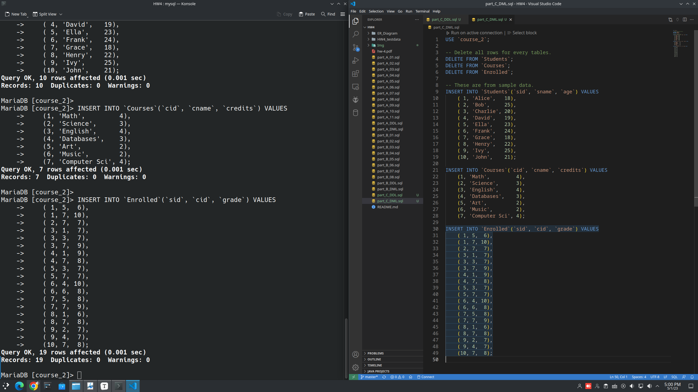

**Database HW4**

---
## Author Information

- Name: 鍾博丞

- Student ID: 408410120

- E-mail: my072814638@csie.io


## Part A

### E\-R Diagram


### DDL

```sql
CREATE DATABASE IF NOT EXISTS `courses`;
USE `courses`;

-- Entities
CREATE TABLE IF NOT EXISTS `Students` (
    `PID` VARCHAR(100) NOT NULL PRIMARY KEY,
    `Name` TEXT NOT NULL,
    `Address` TEXT NOT NULL
);

CREATE TABLE IF NOT EXISTS `Professors` (
    `PID` VARCHAR(100) NOT NULL PRIMARY KEY,
    `Name` TEXT NOT NULL,
    `Age` TEXT NOT NULL,
    `DepartmentName` VARCHAR(100) NOT NULL
);

CREATE TABLE IF NOT EXISTS `Departments` (
    `Name` VARCHAR(100) NOT NULL PRIMARY KEY,
    `ChairmanPID` VARCHAR(100) DEFAULT NULL COMMENT 'there are times when a department may not have a chairperson'
);

-- Circular References
ALTER TABLE `Professors`
ADD CONSTRAINT `FK_DepartmentName`
FOREIGN KEY (`DepartmentName`)
    REFERENCES `Departments`(`Name`)
    ON DELETE CASCADE
    ON UPDATE CASCADE;

ALTER TABLE `Departments`
ADD CONSTRAINT `FK_ChairmanPID`
FOREIGN KEY (`ChairmanPID`)
    REFERENCES `Professors`(`PID`)
    ON DELETE CASCADE
    ON UPDATE CASCADE;


CREATE TABLE IF NOT EXISTS `Courses` (
    `Number` INT NOT NULL PRIMARY KEY,
    `DeptName` VARCHAR(100) NOT NULL,
    `CourseName` TEXT NOT NULL,
    `MaxEnrollment` INT NOT NULL,
    `ActualEnrollment` INT NOT NULL DEFAULT 0,
    CONSTRAINT `check_enrollment`
        CHECK (`ActualEnrollment` <= `MaxEnrollment`),
    FOREIGN KEY (`DeptName`)
        REFERENCES `Departments`(`Name`)
        ON DELETE CASCADE
        ON UPDATE CASCADE
) COMMENT 'The actual enrollment must be at most the maximum enrollment.';

-- Relations
CREATE TABLE IF NOT EXISTS `Take` (
    `StudentPID` VARCHAR(100) NOT NULL,
    `Number` INT NOT NULL COMMENT 'Course Number',
    `DeptName` VARCHAR(100) NOT NULL,
    `Grade` TEXT DEFAULT NULL,
    `ProfessorEvaluation` INT DEFAULT NULL,
    PRIMARY KEY (`StudentPID`, `Number`, `DeptName`),
    FOREIGN KEY (`StudentPID`)
        REFERENCES `Students`(`PID`)
        ON DELETE CASCADE
        ON UPDATE CASCADE,
    FOREIGN KEY (`Number`)
        REFERENCES `Courses`(`Number`)
        ON DELETE CASCADE
        ON UPDATE CASCADE,
    FOREIGN KEY (`DeptName`)
        REFERENCES `Departments`(`Name`)
        ON DELETE CASCADE
        ON UPDATE CASCADE
);

CREATE TABLE IF NOT EXISTS `Teach` (
    `ProfessorPID` VARCHAR(100) NOT NULL,
    `Number` INT NOT NULL COMMENT 'Course Number',
    `DeptName` VARCHAR(100) NOT NULL,
    PRIMARY KEY (`ProfessorPID`, `Number`, `DeptName`),
    FOREIGN KEY (`ProfessorPID`)
        REFERENCES `Professors`(`PID`)
        ON DELETE CASCADE
        ON UPDATE CASCADE,
    FOREIGN KEY (`Number`)
        REFERENCES `Courses`(`Number`)
        ON DELETE CASCADE
        ON UPDATE CASCADE,
    FOREIGN KEY (`DeptName`)
        REFERENCES `Departments`(`Name`)
        ON DELETE CASCADE
        ON UPDATE CASCADE
);

CREATE TABLE IF NOT EXISTS `PreReq` (
    `Number` INT NOT NULL COMMENT 'Course Number',
    `DeptName` VARCHAR(100) NOT NULL,
    `PreReqNumber` INT NOT NULL COMMENT 'PreReq Course Number',
    `PreReqDeptName` VARCHAR(100) NOT NULL,
    PRIMARY KEY (`Number`, `DeptName`, `PreReqNumber`, `PreReqDeptName`),
    FOREIGN KEY (`Number`)
        REFERENCES `Courses`(`Number`)
        ON DELETE CASCADE
        ON UPDATE CASCADE,
    FOREIGN KEY (`DeptName`)
        REFERENCES `Departments`(`Name`)
        ON DELETE CASCADE
        ON UPDATE CASCADE,
    FOREIGN KEY (`PreReqNumber`)
        REFERENCES `Courses`(`Number`)
        ON DELETE CASCADE
        ON UPDATE CASCADE,
    FOREIGN KEY (`PreReqDeptName`)
        REFERENCES `Departments`(`Name`)
        ON DELETE CASCADE
        ON UPDATE CASCADE
);

-- Trigger
-- A course cannot be a pre-requisite for itself.
DELIMITER $$
CREATE TRIGGER `trg_check_prereq_self`
BEFORE INSERT ON `PreReq`
FOR EACH ROW BEGIN
    IF NEW.`Number` = NEW.`PreReqNumber` AND NEW.`DeptName` = NEW.`PreReqDeptName` THEN
        SIGNAL SQLSTATE '45000'
            SET MESSAGE_TEXT = 'A course cannot be a pre-requisite for itself.';
    END IF;
END $$
DELIMITER ;

-- A student enrolled in a course must have
-- enrolled in all its pre-requisites.
DELIMITER //
CREATE TRIGGER `enforce_prereq` BEFORE INSERT ON `Take`
FOR EACH ROW BEGIN
    DECLARE num_prereqs INT;
    DECLARE num_completed_prereqs INT;
    SET num_prereqs = (
        SELECT COUNT(*) FROM `PreReq`
        WHERE `Number` = NEW.`Number` 
        AND `DeptName` = NEW.`DeptName`
    );
    SET num_completed_prereqs = (
        SELECT COUNT(*)
        FROM `Take`
        WHERE `StudentPID` = NEW.`StudentPID`
            AND `DeptName` = NEW.`DeptName`
            AND `Number` IN (
                SELECT `PreReqNumber` FROM `PreReq`
                WHERE `Number` = NEW.`Number`
                AND `DeptName` = NEW.`DeptName`
            )
            AND `Grade` IS NOT NULL
    );
    IF num_completed_prereqs < num_prereqs THEN
        SIGNAL SQLSTATE '45000'
            SET MESSAGE_TEXT = 'Cannot enroll in course without completing all pre-requisites.';
    END IF;
END //
DELIMITER ;
```


### DML

```sql
USE `courses`;

-- Delete all rows for every tables.
DELETE FROM `Students`;
DELETE FROM `Professors`;
DELETE FROM `Departments`;
DELETE FROM `Courses`;
DELETE FROM `Take`;
DELETE FROM `Teach`;
DELETE FROM `PreReq`;

INSERT INTO `Students`(`PID`, `Name`, `Address`) VALUES
    ('Zadeh',       'Lofti',    'Seattle, WA'),
    ('Patterson',   'David',    'Los Angeles, CA'),
    ('Smith',       'Alan',     'San Francisco, CA'),
    ('Feiner',      'Steven',   'Boston, MA'),
    ('Kuck',        'David',    'Bloomington, IN'),
    ('Kender',      'John',     'Los Angeles, CA'),
    ('Huang',       'Thomas',   'Atlanta, GA'),
    ('Fischer',     'Michael',  'Madison, WI'),
    ('Appel',       'Andrew',   'Miami, FL'),
    ('Dobkin',      'David',    'Salt Lake City, UT'),
    ('Li',          'Kai',      'Las Vegas, NV'),
    ('Peterson',    'Larry',    'Chicago, IL');

INSERT INTO `Departments`(`Name`, `ChairmanPID`) VALUES
    ('CS',   NULL),
    ('EE',   NULL),
    ('ME',   NULL),
    ('BIO',  NULL),
    ('PHY',  NULL),
    ('MATH', NULL);

INSERT INTO `Professors`(`PID`, `Name`, `Age`, `DepartmentName`) VALUES
    ('Widom',   'Jennifer', 'old',          'BIO'),
    ('Canny',   'John',     'very old',     'EE'),
    ('Ullman',  'Jeff',     'still alive',  'CS'),      -- Chairman
    ('Reiss',   'Steve',    'very old',     'PHY'),     -- Chairman
    ('Karp',    'Richard',  'still alive',  'MATH'),
    ('Lam',     'Monica',   'old',          'ME'),      -- Chairman
    ('Chien',   'Andrew',   'old',          'PHY'),
    ('Wegner',  'Peter',    'still alive',  'MATH'),    -- Chairman
    ('Hart',    'John',     'very old',     'BIO'),
    ('Katz',    'Randy',    'very old',     'CS'),
    ('Knuth',   'Don',      'still alive',  'EE'),      -- Chairman
    ('Barsky',  'Brian',    'old',          'EE');

UPDATE `Departments` SET `ChairmanPID` = 'Ullman' WHERE `Name` = 'CS';
UPDATE `Departments` SET `ChairmanPID` = 'Knuth' WHERE `Name` = 'EE';
UPDATE `Departments` SET `ChairmanPID` = 'Lam' WHERE `Name` = 'ME';
UPDATE `Departments` SET `ChairmanPID` = 'Reiss' WHERE `Name` = 'PHY';
UPDATE `Departments` SET `ChairmanPID` = 'Wegner' WHERE `Name` = 'MATH';

INSERT INTO `Courses`(`Number`, `DeptName`, `CourseName`, `MaxEnrollment`, `ActualEnrollment`) VALUES
    (132, 'ME',   'Dynamic Systems',      120, 118),
    (61,  'CS',   'Data Structure',       100,  90),
    (1,   'MATH', 'Calculus',             150, 132),
    (123, 'EE',   'Digital Signal Proc',   80,  72),
    (111, 'PHY',  'Modern Physics',        40,  39),
    (109, 'ME',   'Heat Transfer',         10,   8),
    (54,  'MATH', 'Linear Algebra',        50,  50),
    (162, 'CS',   'Operating Systems',     50,  32),
    (137, 'PHY',  'Quantum Mech',          10,   3),
    (145, 'BIO',  'Genomics',               5,   2),
    (186, 'CS',   'Database Systems',      50,  48),
    (224, 'EE',   'Digital Comm',          30,  22);


INSERT INTO `Teach`(`ProfessorPID`, `Number`, `DeptName`) VALUES
    ('Knuth',  123, 'EE'),
    ('Reiss',   54, 'MATH'),
    ('Widom',  145, 'BIO'),
    ('Ullman',  61, 'CS'),
    ('Karp',   224, 'EE'),
    ('Lam',    132, 'ME'),
    ('Reiss',  111, 'PHY'),
    ('Wegner',   1, 'MATH'),
    ('Ullman', 186, 'CS'),
    ('Reiss',  137, 'PHY'),
    ('Chien',  109, 'ME'),
    ('Barsky', 162, 'CS');

INSERT INTO `PreReq`(`Number`, `DeptName`, `PreReqNumber`, `PreReqDeptName`) VALUES
    (111, 'PHY',    1, 'MATH'),
    (137, 'PHY',    1, 'MATH'),
    (123, 'EE',    54, 'MATH'),
    (186, 'CS',    54, 'MATH'),
    (224, 'EE',    54, 'MATH'),
    (186, 'CS',    61, 'CS'),
    (224, 'EE',    61, 'CS'),
    (111, 'PHY',  132, 'ME'),
    (145, 'BIO',  132, 'ME'),
    (132, 'ME',   145, 'BIO'),
    ( 54, 'MATH', 162, 'CS'),
    (162, 'CS',   186, 'CS'),
    (109, 'ME',   224, 'EE');
    

INSERT INTO `Take`(`StudentPID`, `Number`, `DeptName`, `Grade`, `ProfessorEvaluation`) VALUES
    ('Appel',     111, 'PHY',  'B', 2),
    ('Patterson', 186, 'CS',   'B', 3),
    ('Li',        137, 'PHY',  'A', 3),
    ('Huang',     186, 'CS',   'A', 4),
    ('Smith',     109, 'ME',   'A', 3),
    ('Appel',       1, 'MATH', 'C', 2),
    ('Huang',     123, 'EE',   'A', 4),
    ('Fischer',   145, 'BIO',  'A', 2),
    ('Zadeh',      61, 'CS',   'A', 1),
    ('Dobkin',    123, 'EE',   'B', 4),
    ('Huang',     111, 'PHY',  'B', 3),
    ('Li',        162, 'CS',   'A', 3),
    ('Kender',     54, 'MATH', 'B', 4);
```


### Usage

#### Circular Dependency

[Circular Dependency in FK](https://stackoverflow.com/questions/12652152/mysql-circular-dependency-in-foreign-key-constraints)

The attribute "DepartmentName" in table "Professors" references the attribute "Name" in table "Departments".

The attribute "ChairmanPID" in table "Departments" references the attribute "PID" in table "Professors".


This will cause circular dependency in foreign key constraint.

To solve it, first insert new departments with NULL chairman, then insert professors. Finally, update the chairmans of departments.


#### Prerequest Trigger

Since there are cycle dependencies in prerequest, you have to disable the trigger before you want to insert a new row into table "Take".


### 1

What are the PIDs of the students whose name is “David”?

```sql
SELECT `PID`
FROM `Students`
WHERE `name` = 'David';
```

Ans: Dobkin, Kuck, Patterson.


### 2

Which pairs of students live at the same address? It is enough to return the names of such students pairs.

```sql
SELECT s1.`PID`, s1.`Name`, s2.`PID`, s2.`Name`
FROM `Students` s1
INNER JOIN `Students` s2 ON s1.`Address` = s2.`Address`
WHERE s1.`PID` < s2.`PID`;
```

Ans: Kender John and Patterson David.


### 3

Which department have course that have pre-requisites in other departments?

```sql
SELECT DISTINCT d.`Name` AS 'Department Name'
FROM `Departments` d
INNER JOIN `Courses` c ON d.`Name` = c.`DeptName`
INNER JOIN `PreReq` p ON c.`Number` = p.`Number` AND c.`DeptName` = p.`DeptName`
INNER JOIN `Departments` dp ON p.`PreReqDeptName` = dp.`Name`
WHERE dp.`Name` <> d.`Name`;
```

Ans: BIO, CS, EE, MATH, ME, PHY.


### 4

[Stack Overflow Recursive Query](https://stackoverflow.com/questions/20215744/how-to-create-a-mysql-hierarchical-recursive-query), [MySQL Recursive CTE](https://www.mysqltutorial.org/mysql-recursive-cte/), [MySQL Blog Archive](https://dev.mysql.com/blog-archive/mysql-8-0-1-recursive-common-table-expressions-in-mysql-ctes-part-four-depth-first-or-breadth-first-traversal-transitive-closure-cycle-avoidance/)

Compute the set of all courses that are their own pre-requisites? (have cycles)

```sql
WITH RECURSIVE `descendants` AS (
    SELECT p.`DeptName`, p.`Number`, CONCAT(CAST(p.`DeptName` AS CHAR(1000000)), ' ', CAST(p.`Number` AS CHAR(500))) AS `Path`, 0 AS `is_cycle`
    FROM `PreReq` p
    WHERE p.`PreReqNumber` = 54 AND p.`PreReqDeptName` = 'MATH'
    UNION ALL
    SELECT p.`DeptName`, p.`Number`, CONCAT(CAST(p.`DeptName` AS CHAR(1000000)), ' ', CAST(p.`Number` AS CHAR(500))) AS `Path`, 0 AS `is_cycle`
    FROM `PreReq` p
    WHERE p.`PreReqNumber` = 61 AND p.`PreReqDeptName` = 'CS'
    UNION ALL
    SELECT p.`DeptName`, p.`Number`, CONCAT(CAST(p.`DeptName` AS CHAR(1000000)), ' ', CAST(p.`Number` AS CHAR(500))) AS `Path`, 0 AS `is_cycle`
    FROM `PreReq` p
    WHERE p.`PreReqNumber` = 1 AND p.`PreReqDeptName` = 'MATH'
    UNION ALL
    SELECT p.`DeptName`, p.`Number`, CONCAT(CAST(p.`DeptName` AS CHAR(1000000)), ' ', CAST(p.`Number` AS CHAR(500))) AS `Path`, 0 AS `is_cycle`
    FROM `PreReq` p
    WHERE p.`PreReqNumber` = 132 AND p.`PreReqDeptName` = 'ME'
    UNION ALL
    SELECT p2.`DeptName`, p2.`Number`, CONCAT(d.`Path`, ', ', p2.`DeptName`, ' ', p2.`Number`), FIND_IN_SET(CONCAT(p2.`DeptName`, ' ', p2.`Number`), d.`Path`) != 0
    FROM `PreReq` p2, `descendants` d
    WHERE p2.`PreReqNumber` = d.`Number` AND p2.`PreReqDeptName` = d.`DeptName`
    AND `is_cycle` = 0
)
SELECT * FROM `descendants`;
```

Ans:

```
+----------+--------+-----------------------------------------+----------+
| DeptName | Number | Path                                    | is_cycle |
+----------+--------+-----------------------------------------+----------+
| EE       |    123 | EE 123                                  |        0 |
| CS       |    186 | CS 186                                  |        0 |
| EE       |    224 | EE 224                                  |        0 |
| CS       |    186 | CS 186                                  |        0 |
| EE       |    224 | EE 224                                  |        0 |
| PHY      |    111 | PHY 111                                 |        0 |
| PHY      |    137 | PHY 137                                 |        0 |
| PHY      |    111 | PHY 111                                 |        0 |
| BIO      |    145 | BIO 145                                 |        0 |
| CS       |    162 | CS 186, CS 162                          |        0 |
| ME       |    109 | EE 224, ME 109                          |        0 |
| CS       |    162 | CS 186, CS 162                          |        0 |
| ME       |    109 | EE 224, ME 109                          |        0 |
| ME       |    132 | BIO 145, ME 132                         |        0 |
| MATH     |     54 | CS 186, CS 162, MATH 54                 |        0 |
| MATH     |     54 | CS 186, CS 162, MATH 54                 |        0 |
| PHY      |    111 | BIO 145, ME 132, PHY 111                |        0 |
| BIO      |    145 | BIO 145, ME 132, BIO 145                |        1 |
| EE       |    123 | CS 186, CS 162, MATH 54, EE 123         |        0 |
| CS       |    186 | CS 186, CS 162, MATH 54, CS 186         |        1 |
| EE       |    224 | CS 186, CS 162, MATH 54, EE 224         |        0 |
| EE       |    123 | CS 186, CS 162, MATH 54, EE 123         |        0 |
| CS       |    186 | CS 186, CS 162, MATH 54, CS 186         |        1 |
| EE       |    224 | CS 186, CS 162, MATH 54, EE 224         |        0 |
| ME       |    109 | CS 186, CS 162, MATH 54, EE 224, ME 109 |        0 |
| ME       |    109 | CS 186, CS 162, MATH 54, EE 224, ME 109 |        0 |
+----------+--------+-----------------------------------------+----------+
```

There are 2 cycle dependencies.

1. MATH 54, CS 186, CS 162, MATH 54
2. ME 132, BIO 145, ME 132


### 5

What are the names and address of the students who are taking “CS186”?

```sql
SELECT s.`PID`, s.`Name`, s.`Address`
FROM `Students` s
INNER JOIN `Take` t ON s.`PID` = t.`StudentPID`
WHERE t.`Number` = 186 AND t.`DeptName` = 'CS';
```

Ans: 

```
+-----------+--------+-----------------+
| PID       | Name   | Address         |
+-----------+--------+-----------------+
| Huang     | Thomas | Atlanta, GA     |
| Patterson | David  | Los Angeles, CA |
+-----------+--------+-----------------+
```


### 6

What are the courses that the head of the CS department is teaching?

```sql
SELECT c.`CourseName`
FROM `Teach` t
INNER JOIN `Courses` c ON t.`Number` = c.`Number` AND t.`DeptName` = c.`DeptName`
INNER JOIN `Departments` d ON t.`DeptName` = d.`Name`
LEFT JOIN `Professors` p ON d.`ChairmanPID` = p.`PID`
WHERE t.`DeptName` = 'CS' AND p.`PID` IS NOT NULL AND d.`ChairmanPID` = p.`PID`;
```

Ans: Operating Systems, Data Structure, and Database Systems.


### 7

Is there any department head who teaches a course in another department?

```sql
SELECT DISTINCT p.`PID`, p.`Name`
FROM `Professors` p
INNER JOIN `Departments` d ON p.`PID` = d.`ChairmanPID`
INNER JOIN `Teach` t ON p.`PID` = t.`ProfessorPID`
WHERE p.`DepartmentName` <> t.`DeptName`;
```

<font color=#0000FF>Ans: Yes.</font> Reiss Steve is the chairman for department of physics, and he teaches "MATH 54".


### 8

Are there any students who are taking at least two courses taught by department heads?

```sql
SELECT `Result`.`PID`, `Result`.`Name`
FROM (
    SELECT s.`PID`, s.`Name`, COUNT(*) AS `Amount`
    FROM `Students` s
    INNER JOIN `Take` t ON s.`PID` = t.`StudentPID`
    INNER JOIN `Teach` te ON t.`Number` = te.`Number` AND t.`DeptName` = te.`DeptName`
    INNER JOIN `Departments` d ON te.`ProfessorPID` = d.`ChairmanPID`
    GROUP BY s.`PID`
) AS `Result`
WHERE `Result`.`Amount` >= 2;
```

<font color=#0000FF>Ans: Yes.</font> There are Appel Andrew and Huang Thomas.


### 9

Is there any professor whose age is “still alive” and who receives an average evaluation above 2.5?

```sql
SELECT p.`PID`, p.`Name`, AVG(ta.`ProfessorEvaluation`) AS `Average_Evaluation`
FROM `Take` ta
INNER JOIN `Teach` te ON ta.`Number` = te.`Number` AND ta.`DeptName` = te.`DeptName`
INNER JOIN `Professors` p ON te.`ProfessorPID` = p.`PID`
WHERE p.`Age` = 'still alive'
GROUP BY p.`PID`;
```

<font color=#0000FF>Ans: Yes.</font>

```
+--------+-------+--------------------+
| PID    | Name  | Average_Evaluation |
+--------+-------+--------------------+
| Knuth  | Don   |             4.0000 |
| Ullman | Jeff  |             2.6667 |
| Wegner | Peter |             2.0000 |
+--------+-------+--------------------+
```


### 10

Is there any “straight A” student?

We define straight\-A student to be the student who gets all A in his/her courses.

```sql
SELECT DISTINCT s.`PID`, s.`Name`
FROM `Students` s
INNER JOIN `Take` t ON s.`PID` = t.`StudentPID`
WHERE EXISTS (
    SELECT *
    FROM `Take` t1
    WHERE t.`StudentPID` = t1.`StudentPID` AND NOT EXISTS (
        SELECT *
        FROM `Take` t2
        WHERE t2.`StudentPID` = s.`PID` AND t2.`Grade` <> 'A'
    )
);
```

<font color=#0000FF>Ans: Yes.</font> There are Fischer Michael, Li Kai, Smith Alan, Zadeh Lofti


### 11

Are there any students who are taking courses and receiving more grade A than grade B?

```sql
SELECT s.`PID`, s.`Name`, `ResultA`.`Amount_of_A`, `ResultB`.`Amount_of_B`
FROM `Students` s
INNER JOIN (
    SELECT t.`StudentPID`, COUNT(*) AS `Amount_of_A`
    FROM `Take` t
    WHERE t.`Grade` = 'A'
    GROUP BY t.`StudentPID`
) AS `ResultA` ON s.`PID` = `ResultA`.`StudentPID`
LEFT JOIN (
    SELECT t.`StudentPID`, COUNT(*) AS `Amount_of_B`
    FROM `Take` t
    WHERE t.`Grade` = 'B'
    GROUP BY t.`StudentPID`
) AS `ResultB` ON s.`PID` = `ResultB`.`StudentPID`
WHERE `ResultA`.`Amount_of_A` > `ResultB`.`Amount_of_B`
OR (`ResultA`.`Amount_of_A` IS NOT NULL AND `ResultB`.`Amount_of_B` IS NULL);
```

<font color=#0000FF>Ans: Yes.</font> 

```
+---------+---------+-------------+-------------+
| PID     | Name    | Amount_of_A | Amount_of_B |
+---------+---------+-------------+-------------+
| Fischer | Michael |           1 |        NULL |
| Huang   | Thomas  |           2 |           1 |
| Li      | Kai     |           2 |        NULL |
| Smith   | Alan    |           1 |        NULL |
| Zadeh   | Lofti   |           1 |        NULL |
+---------+---------+-------------+-------------+
```

NULL means 0 here.


## Part B

### DDL

```sql
-- Entities
CREATE TABLE IF NOT EXISTS `Emp` (
    `eid` INT NOT NULL PRIMARY KEY,
    `ename` TEXT NOT NULL,
    `age` INT NOT NULL,
    `salary` REAL NOT NULL
);

CREATE TABLE IF NOT EXISTS `Dept` (
    `did` INT NOT NULL PRIMARY KEY,
    `dname` TEXT NOT NULL,
    `budget` REAL NOT NULL,
    `managerid` INT NOT NULL
);

-- Relations
CREATE TABLE IF NOT EXISTS `Works` (
    `eid` INT NOT NULL,
    `did` INT NOT NULL,
    `pct_time` INT NOT NULL,
    PRIMARY KEY (`eid`, `did`),
    FOREIGN KEY (`eid`)
        REFERENCES `Emp`(`eid`)
        ON DELETE CASCADE
        ON UPDATE CASCADE,
    FOREIGN KEY (`did`)
        REFERENCES `Dept`(`did`)
        ON DELETE CASCADE
        ON UPDATE CASCADE
);
```


### DML

These are from sample data.

```sql
INSERT INTO `Emp`(`eid`, `ename`, `age`, `salary`) VALUES
    ( 1, 'Alice',    28,  55000.0),
    ( 2, 'Bob',      32,  62000.0),
    ( 3, 'Charlie',  45,  75000.0),
    ( 4, 'David',    22, 100000.0),
    ( 5, 'Emily',    36,  80000.0),
    ( 6, 'Frank',    50,  95000.0),
    ( 7, 'George',   29,  56000.0),
    ( 8, 'Henry',    41,  68000.0),
    ( 9, 'Isabelle', 27,  50000.0),
    (10, 'Jack',     31,  61000.0);

INSERT INTO `Dept`(`did`, `dname`, `budget`, `managerid`) VALUES
    (1, 'Software', 3000000.0, 3),
    (2, 'Marketing',  75000.0, 5),
    (3, 'Hardware', 4000001.0, 6),
    (4, 'Finance',  1000000.0, 7),
    (5, 'HR',         90000.0, 9),
    (6, 'Sales',    1000000.0, 6);

INSERT INTO `Works`(`eid`, `did`, `pct_time`) VALUES
    ( 1, 1, 100),
    ( 2, 1, 100),
    ( 3, 1,  33),
    ( 3, 3,  33),
    ( 3, 4,  34),
    ( 4, 1,  30),
    ( 4, 2,  70),
    ( 5, 1,  30),
    ( 5, 2,  70),
    ( 6, 3,  70),
    ( 6, 6,  30),
    ( 7, 1,  70),
    ( 7, 4,  30),
    ( 8, 1,  70),
    ( 8, 4,  30),
    ( 9, 1,  70),
    ( 9, 5,  30),
    (10, 1,  70),
    (10, 5,  30);
```


### 1

Print the names and ages of each employee who works in both the Hardware department and the Software department.

```sql
SELECT e.`ename`, e.`age`
FROM `Emp` e
INNER JOIN `Works` w ON e.`eid` = w.`eid`
INNER JOIN `Dept` d ON w.`did` = d.`did`
WHERE d.`dname` = 'Hardware'
INTERSECT
SELECT e.`ename`, e.`age`
FROM `Emp` e
INNER JOIN `Works` w ON e.`eid` = w.`eid`
INNER JOIN `Dept` d ON w.`did` = d.`did`
WHERE d.`dname` = 'Software';
```

Ans:

```
+---------+-----+
| ename   | age |
+---------+-----+
| Charlie |  45 |
+---------+-----+
```


### 2

For each department with more than 20 full\-time\-equivalent employees (i.e., where the part-time and full-time employees add up to at least that many full-time employees), print the “did” together with the number of employees that work in that department.

```sql
SELECT `Result`.`did`, `Result`.`num_emp`
FROM (
    SELECT w.`did`, SUM(w.`pct_time`) AS `sum_time`, COUNT(*) AS `num_emp`
    FROM `Works` w
    GROUP BY w.`did`
) AS `Result`
WHERE `Result`.`sum_time` > 20;
```

Ans:

```
+-----+---------+
| did | num_emp |
+-----+---------+
|   1 |       9 |
|   2 |       2 |
|   3 |       2 |
|   4 |       3 |
|   5 |       2 |
|   6 |       1 |
+-----+---------+
```


### 3

Print the names of each employee whose salary exceeds the budget of all of the departments that he or she works in.

```sql
SELECT e.`ename`
FROM `Emp` e
INNER JOIN `Works` w ON e.`eid` = w.`eid`
INNER JOIN `Dept` d ON w.`did` = d.`did`
WHERE e.`salary` > ALL (
    SELECT d2.`budget`
    FROM `Works` w2
    JOIN `Dept` d2 ON w2.`did` = d2.`did`
    WHERE w2.`eid` = e.`eid`
);
```

Ans: Empty set.


### 4

Find the “managerids” of managers who manage only departments with budgets greater than \$1 million.

```sql
SELECT DISTINCT d.`managerid`
FROM `Dept` d
WHERE d.`budget` > 1000000
AND NOT EXISTS (
    SELECT 1
    FROM `Dept` d2
    WHERE d2.`managerid` = d.`managerid`
    AND d2.`budget` <= 1000000
);
```

Using `SELECT 1` can be a more efficient way to write a subquery that checks for the existence of rows in a table, as the database only needs to return a single constant value instead of all the columns in the table. For example, in the subquery used in the previous answer, we only need to check if there exists any department with a budget less than or equal to $1 million for a given manager, so we can use `SELECT 1` instead of `SELECT *` to save computation resources.

Ans: 3


### 5

Find the “enames” of managers who manage the departments with the largest budgets.

```sql
SELECT e.`ename`
FROM `Emp` e
INNER JOIN `Dept` d ON e.`eid` = d.`managerid`
WHERE d.`budget` = (
    SELECT MAX(`budget`)
    FROM `Dept`
);
```

Ans: Frank


### 6

If a manager manages more than one department, he or she “controls” the sum of all the budgets for those departments. Find the “managerids” of managers who control more than $5 million.

```sql
SELECT e.`ename`
FROM (
    SELECT d.`managerid`, SUM(d.`budget`) AS `tot_budget`
    FROM `Dept` d
    GROUP BY d.`managerid`
) AS `result`
INNER JOIN `Emp` e ON `result`.`managerid` = e.`eid`
WHERE `result`.`tot_budget` > 5000000;
```

Ans: Frank


### 7

Find the “managerids” of managers who control the largest amounts.

```sql
SELECT e.`ename`
FROM (
    SELECT d.`managerid`, SUM(d.`budget`) AS `tot_budget`
    FROM `Dept` d
    GROUP BY d.`managerid`
) AS `result`
INNER JOIN `Emp` e ON `result`.`managerid` = e.`eid`
WHERE `result`.`tot_budget` = (
    SELECT MAX(`result2`.`tot_budget`)
    FROM (
        SELECT d2.`managerid`, SUM(d2.`budget`) AS `tot_budget`
        FROM `Dept` d2
        GROUP BY d2.`managerid`
    ) AS `result2`
);
```

Ans: Frank


### 8

Find the “enames” of managers who manage only departments with budgets larger than \$1 million, but at least one department with budget less than \$5 million.

```sql
SELECT DISTINCT e.`ename`
FROM `Emp` e
JOIN `Dept` d ON e.`eid` = d.`managerid`
WHERE d.`budget` > 1000000
AND EXISTS (
    SELECT 1
    FROM `Dept` d2
    WHERE d2.`managerid` = d.`managerid`
    AND d2.`budget` < 5000000
)
AND NOT EXISTS (
    SELECT 1
    FROM `Dept` d3
    WHERE d3.`managerid` = d.`managerid`
    AND d3.`budget` <= 1000000
);
```

Ans: Charlie


## Part C

### DDL

```sql
CREATE DATABASE IF NOT EXISTS `course_2`;
USE `course_2`;

-- Entities
CREATE TABLE IF NOT EXISTS `Students` (
    `sid` INT NOT NULL PRIMARY KEY,
    `sname` TEXT NOT NULL,
    `age` INT NOT NULL
);

CREATE TABLE IF NOT EXISTS `Courses` (
    `cid` INT NOT NULL PRIMARY KEY,
    `cname` TEXT NOT NULL,
    `credits` INT NOT NULL
);

-- Relations
CREATE TABLE IF NOT EXISTS `Enrolled` (
    `sid` INT NOT NULL,
    `cid` INT NOT NULL,
    `grade` INT NOT NULL,
    PRIMARY KEY (`sid`, `cid`),
    FOREIGN KEY (`sid`)
        REFERENCES `Students`(`sid`)
        ON DELETE CASCADE
        ON UPDATE CASCADE,
    FOREIGN KEY (`cid`)
        REFERENCES `Courses`(`cid`)
            ON DELETE CASCADE
            ON UPDATE CASCADE
);
```


### DML

```sql
INSERT INTO `Students`(`sid`, `sname`, `age`) VALUES
    ( 1, 'Alice',   18),
    ( 2, 'Bob',     25),
    ( 3, 'Charlie', 20),
    ( 4, 'David',   19),
    ( 5, 'Ella',    23),
    ( 6, 'Frank',   24),
    ( 7, 'Grace',   18),
    ( 8, 'Henry',   22),
    ( 9, 'Ivy',     25),
    (10, 'John',    21);

INSERT INTO `Courses`(`cid`, `cname`, `credits`) VALUES
    (1, 'Math',         4),
    (2, 'Science',      3),
    (3, 'English',      4),
    (4, 'Databases',    3),
    (5, 'Art',          2),
    (6, 'Music',        2),
    (7, 'Computer Sci', 4);

INSERT INTO `Enrolled`(`sid`, `cid`, `grade`) VALUES
    ( 1, 5,  6),
    ( 1, 7, 10),
    ( 2, 7,  7),
    ( 3, 1,  7),
    ( 3, 3,  7),
    ( 3, 7,  9),
    ( 4, 1,  9),
    ( 4, 7,  8),
    ( 5, 3,  7),
    ( 5, 7,  7),
    ( 6, 4, 10),
    ( 6, 6,  8),
    ( 7, 5,  8),
    ( 7, 7,  9),
    ( 8, 1,  6),
    ( 8, 7,  8),
    ( 9, 2,  7),
    ( 9, 4,  7),
    (10, 7,  8);
```




### 1

Write a statement to create the table **Enrolled**. You do **not** need to provide create table statements for the other tables. Include necessary key constraints.

```sql
CREATE TABLE IF NOT EXISTS `Enrolled` (
    `sid` INT NOT NULL,
    `cid` INT NOT NULL,
    `grade` INT NOT NULL,
    PRIMARY KEY (`sid`, `cid`),
    FOREIGN KEY (`sid`)
        REFERENCES `Students`(`sid`)
        ON DELETE CASCADE
        ON UPDATE CASCADE,
    FOREIGN KEY (`cid`)
        REFERENCES `Courses`(`cid`)
            ON DELETE CASCADE
            ON UPDATE CASCADE
);
```


### 2

Find the name(s) of students(s) with the youngest age.

```sql
SELECT s.`sname`
FROM `Students` s
WHERE s.`age` = (
    SELECT MIN(s2.`age`)
    FROM `Students` s2
);
```

Ans: Alice and Grace.


### 3

Find the ages of students who take only courses with less than four credits (implies they take at least one course).

```sql
SELECT `Result`.`age`
FROM (
    SELECT DISTINCT s.`sid`, s.`age`
    FROM `Students` s
    INNER JOIN `Enrolled` e ON s.`sid` = e.`sid`
    WHERE e.`cid` IN (
        SELECT e2.`cid`
        FROM `Enrolled` e2
    ) AND s.`sid` NOT IN (
        SELECT e3.`sid`
        FROM `Enrolled` e3
        INNER JOIN `Courses` c ON e3.`cid` = c.`cid`
        WHERE c.`credits` >= 4
    )
) AS `Result`;
```

Ans: 24 and 25.


### 4

Find the ages of students who got grade 10 in a course named 'Databases'.

```sql
SELECT s.`age`
FROM `Students` s
INNER JOIN `Enrolled` e ON s.`sid` = e.`sid`
INNER JOIN `Courses` c ON e.`cid` = c.`cid`
WHERE e.`grade` = 10 AND c.`cname` = 'Databases';
```

Ans: 24


### 5

Find the course identifier cid and the average age over enrolled students who are 20 or older for each course that has at least 50 enrolled students (of any age).

```sql
SELECT e.`cid`, AVG(s.`age`) AS `students_avg_age`
FROM `Enrolled` e
INNER JOIN `Students` s ON e.`sid` = s.`sid`
GROUP BY e.`cid`
HAVING COUNT(*) >= 50;
```

Ans: Empty Set.


### 6

Find the names of students who take all the four-credit courses offered and obtained at least grade 7 in every such course.

```sql
SELECT s.`sname`
FROM `Students` s
INNER JOIN `Enrolled` e ON s.`sid` = e.`sid`
INNER JOIN `Courses` c ON e.`cid` = c.`cid`
WHERE c.`credits` = 4 AND e.`grade` >= 7
GROUP BY s.`sid`
HAVING COUNT(DISTINCT e.`cid`) = (
    SELECT COUNT(*) 
    FROM `Courses` 
    WHERE `credits` = 4
);
```

Ans: Charlie.


### 7

Find the name(s) of students(s) who have the highest GPA (assume the GPA is computed only based on grades available in **Enrolled**).

```sql
SELECT s.`sname`
FROM (
    SELECT *, `weight_sum_grade` / `cnt_courses` AS `GPA`
    FROM (
        SELECT r.`sid`, SUM(r.`weight_grade`) AS `weight_sum_grade`,
        COUNT(r.`sid`) AS `cnt_courses`
        FROM (
            SELECT e.`sid`, e.`grade` * c.`credits` AS `weight_grade`
            FROM `Enrolled` e
            INNER JOIN `Courses` c ON e.`cid` = c.`cid`
        ) AS r
        GROUP BY r.`sid`
    ) AS r2
) AS r3
INNER JOIN `Students` s ON r3.`sid` = s.`sid`
WHERE r3.`GPA` = (
    SELECT MAX(r6.`GPA`)
    FROM (
        SELECT *, `weight_sum_grade` / `cnt_courses` AS `GPA`
        FROM (
            SELECT r4.`sid`, SUM(r4.`weight_grade`) AS `weight_sum_grade`,
            COUNT(r4.`sid`) AS `cnt_courses`
            FROM (
                SELECT e2.`sid`, e2.`grade` * c2.`credits` AS `weight_grade`
                FROM `Enrolled` e2
                INNER JOIN `Courses` c2 ON e2.`cid` = c2.`cid`
            ) AS r4
            GROUP BY r4.`sid`
        ) AS r5
    ) AS r6
);
```

Ans: David.


### 8

Find the ages of students who take some course with 3 credits.

```sql
SELECT `Result`.`age`
FROM (
    SELECT DISTINCT s.`sid`, s.`age`
    FROM `Students` s
    INNER JOIN `Enrolled` e ON s.`sid` = e.`sid`
    WHERE e.`cid` IN (
        SELECT c.`cid`
        FROM `Courses` c
        WHERE c.`credits` = 3
    )
) AS `Result`;
```

Ans: 24, 25.


### 9

Find the names of students who obtained grade at least 8 in some course that has less than 4 credits.

```sql
SELECT `Result`.`sname`
FROM (
    SELECT DISTINCT s.`sid`, s.`sname`
    FROM `Students` s
    INNER JOIN `Enrolled` e ON s.`sid` = e.`sid`
    WHERE e.`cid` IN (
        SELECT c.`cid`
        FROM `Courses` c
        WHERE c.`credits` < 4
    ) AND e.`grade` >= 8
) AS `Result`;
```

Ans: Frank, Grace.


### 10

Find the names of students who obtained only grades of 10 (implies that they took at least one course).

```sql
SELECT s.`sname`
FROM `Students` s
INNER JOIN `Enrolled` e ON s.`sid` = e.`sid`
WHERE NOT EXISTS (
    SELECT 1
    FROM `Enrolled` e2
    WHERE e.`sid` = e2.`sid`
    AND e2.`grade` <> 10
);
```

Ans: Empty Set.


### 11

Find the names of students who took a course with three credits or who obtained grade 10 in some course.

```sql
SELECT `Result`.`sname`
FROM (
    SELECT DISTINCT s.`sid`, s.`sname`
    FROM `Students` s
    INNER JOIN `Enrolled` e ON s.`sid` = e.`sid`
    WHERE e.grade = 10
    UNION
    SELECT DISTINCT s2.`sid`, s2.`sname`
    FROM `Students` s2
    INNER JOIN `Enrolled` e2 ON s2.`sid` = e2.`sid`
    WHERE e2.`cid` IN (
        SELECT c.`cid`
        FROM `Courses` c
        WHERE c.`credits` = 3
    )
) AS `Result`;
```

Ans: Alice, Frank, Ivy.


### 12

Find the names of students who are enrolled in a single course.

```sql
SELECT s.`sname`
FROM `Students` s
INNER JOIN (
    SELECT e.`sid`, COUNT(*) AS `cnt_courses`
    FROM `Enrolled` e
    GROUP BY e.`sid`
    HAVING `cnt_courses` = 1
) AS r ON s.`sid` = r.`sid`;
```

Ans: Bob, John.


## Part D

### DDL

```sql
CREATE DATABASE IF NOT EXISTS `recipes`;
USE `recipes`;

-- Enitites
CREATE TABLE IF NOT EXISTS `Dishes` (
    `did` INT NOT NULL PRIMARY KEY,
    `dname` TEXT NOT NULL,
    `origin` TEXT NOT NULL,
    `popularity` INT NOT NULL
);

CREATE TABLE IF NOT EXISTS `Ingredients` (
    `iid` INT NOT NULL PRIMARY KEY,
    `iname` TEXT NOT NULL,
    `unitprice` INT NOT NULL
);

-- Relations
CREATE TABLE IF NOT EXISTS `Recipes` (
    `did` INT NOT NULL,
    `iid` INT NOT NULL,
    `quantity` INT NOT NULL,
    PRIMARY KEY (`did`, `iid`),
    FOREIGN KEY (`did`)
        REFERENCES `Dishes`(`did`)
        ON DELETE CASCADE
        ON UPDATE CASCADE,
    FOREIGN KEY (`iid`)
        REFERENCES `Ingredients`(`iid`)
        ON DELETE CASCADE
        ON UPDATE CASCADE
);
```


### DML

```sql
INSERT INTO `Dishes`(`did`, `dname`, `origin`, `popularity`) VALUES
    (1, 'Spaghetti', 'Italy',        8),
    (2, 'Sushi',     'Japan',        9),
    (3, 'Tacos',     'Mexico',       7),
    (4, 'Paella',    'Spain',        6),
    (5, 'Pad Thai',  'Thailand',     8),
    (6, 'Burger',    'USA',      10001);

INSERT INTO `Ingredients`(`iid`, `iname`, `unitprice`) VALUES
    ( 1, 'Pasta',     2),
    ( 2, 'Tomatoes',  3),
    ( 3, 'saffron',  50),
    ( 4, 'Rice',      1),
    ( 5, 'sugar',     4),
    ( 6, 'butter',    6),
    ( 7, 'Beef',     55),
    ( 8, 'Chicken',   7),
    ( 9, 'starch',    4),
    (10, 'Potatoes',  2);

INSERT INTO `Recipes`(`did`, `iid`, `quantity`) VALUES
    (1, 1, 200),
    (1, 2,  50),
    (1, 3, 100),
    (2, 5,  10),
    (2, 6,  20),
    (3, 2,  30),
    (3, 8,  50),
    (4, 4, 100),
    (5, 1, 150),
    (5, 2,  30),
    (5, 9,  50),
    (6, 7,  50);
```


### 1

Find the dish names that do NOT contain any of the following ingredients: sugar, butter, starch.

```sql
SELECT `Result`.`dname`
FROM (
    SELECT DISTINCT d.`did`, d.`dname`
    FROM `Dishes` d
    INNER JOIN `Recipes` r ON d.`did` = r.`did`
    INNER JOIN `Ingredients` i ON r.`iid` = i.`iid`
    WHERE i.`iname` <> 'sugar'
    AND i.`iname` <> 'butter'
    AND i.`iname` <> 'starch'
) AS `Result`;
```

Ans: Spaghetti, Tacos, Paella, Pad Thai, Burger.


### 2

Find the ingredient names that cost at least \$10 per unit and that appear in at least one dish with popularity higher than 10,000.

```sql
SELECT `Result`.`iname`
FROM (
    SELECT DISTINCT i.`iid`, i.`iname`
    FROM `Ingredients` i
    INNER JOIN `Recipes` r ON i.`iid` = r.`iid`
    INNER JOIN `Dishes` d ON r.`did` = d.`did`
    WHERE i.`unitprice` >= 10
    AND d.`popularity` > 10000
) AS `Result`;
```

Ans: Beef.


### 3

Find the origin of dishes that use at least one unit of an ingredient called ‘saffron’.

```sql
SELECT `Result`.`origin`
FROM (
    SELECT DISTINCT d.`did`, d.`origin`
    FROM `Dishes` d
    INNER JOIN `Recipes` r ON d.`did` = r.`did`
    INNER JOIN `Ingredients` i ON r.`iid` = i.`iid`
    WHERE i.`iname` = 'saffron'
    AND r.`quantity` >= 1
) AS `Result`;
```

Ans: Italy.


### 4

List the popularity of “exclusive” dishes, defined as dishes that contain only ingredients costing at least \$50 per unit.

```sql
SELECT `Result`.`popularity`
FROM (
    SELECT d.`did`, d.`popularity`
    FROM `Dishes` d
    WHERE NOT EXISTS (
        SELECT 1
        FROM `Recipes` r
        WHERE d.`did` = r.`did`
        AND EXISTS (
            SELECT 1
            FROM `Ingredients` i
            WHERE r.`iid` = i.`iid`
            AND i.`unitprice` < 50
        )
    )
) AS `Result`;
```

Ans: 10001.


### 5

Find the name and unit price of rare ingredients, i.e., those that appear in a single dish.

```sql
SELECT i.`iname`, i.`unitprice`
FROM `Ingredients` i
INNER JOIN (
    SELECT r.`iid`, COUNT(*) AS `cnt_dishes`
    FROM `Recipes` r
    GROUP BY r.`iid`
    HAVING `cnt_dishes` = 1
) AS `Result` ON i.`iid` = `Result`.`iid`;
```

Ans:

```
+---------+-----------+
| iname   | unitprice |
+---------+-----------+
| saffron |        50 |
| Rice    |         1 |
| sugar   |         4 |
| butter  |         6 |
| Beef    |        55 |
| Chicken |         7 |
| starch  |         4 |
+---------+-----------+
```

