**Database HW6**

---
## Author Information

- Name: 鍾博丞

- Student ID: 408410120

- E-mail: my072814638@csie.io

## Part A

We **omit the doubly-linked list** between all nearby data leaf nodes. They indeed actually exist.

### A1

This is an SVG picture so please be free to zoom in.

### A2

## Part B

### B1

Find the names of students who got grade 10 in some courses.

$$
\Pi_{\text{sname}} (\sigma_{\text{grade}=10}(\text{Enrolled}) \bowtie_{\text{Students}.\text{sid} = \text{Enrolled}.\text{sid}} \text{Students})
$$

### B2

Find the ages of students who take some courses with 3 credits.

$$
\begin{aligned}
    \Pi_{\text{age}}
    \text{[Courses} &\bowtie_{\text{Courses}.\text{cid} = \text{Enrolled}.\text{cid}} (\text{Enrolled}) \\
    -
    \sigma_{\text{credits} \neq 3}(\text{Courses}) &\bowtie_{\text{Courses}.\text{cid} = \text{Enrolled}.\text{cid}} (\text{Enrolled})\text{}] \\
    &\bowtie_{\text{Enrolled}.\text{sid} = \text{Students}.\text{sid}} (\text{Students})
\end{aligned}
$$

### B3

Find the names of students who take a course named 'Calculus'.

$$
\begin{aligned}
    \Pi_{\text{sname}}\text{[}
    \sigma_{\text{cname='Calculus'}} (\text{Courses})
    &\bowtie_{\text{Courses}.\text{cid} = \text{Enrolled}.\text{cid}} (\text{Enrolled}) \\
    &\bowtie_{\text{Enrolled}.\text{sid} = \text{Students}.\text{sid}} (\text{Students})
    \text{]}
\end{aligned}
$$

### B4

Find the names of students who obtained grades of at least 8 in some course that has less than 4 credits.

$$
\Pi_{\text{sname}}[\sigma_{\text{grade >= 8}}\text{Enrolled} \bowtie \sigma_{\text{credits < 4}}\text{Courses} \bowtie \text{Students}]
$$

### B5

Find the names of students who obtained only grades of 10 (which implies that they took at least one course).

$$
\begin{aligned}
    \Pi_{\text{sname}}\{\Pi_{\text{sid, sname}}[\text{Enrolled}
    \bowtie_{\text{Students}.\text{sid} = \text{Enrolled}.\text{sid}} \text{Students}] \\
    -
    \Pi_{\text{sid, sname}}[\sigma_{\text{grade} \neq 10}(\text{Enrolled})
    \bowtie_{\text{Students}.\text{sid} = \text{Enrolled}.\text{sid}} (\text{Students})]\}
\end{aligned}
$$

### B6

Find the names of students who took a course with three credits or who obtained grade 10 in some course.

$$
\begin{aligned}
	\Pi_{\text{sname}}\{\{\Pi_{\text{sid}}[\sigma_{\text{grade} = 10}(\text{Enrolled})] \\
	\cup
	\Pi_{\text{sid}}[\text{Enrolled} \bowtie_{\text{Enrolled.cid=Courses.cid} \wedge \text{Courses.credits=3}}\text{Courses}]\} \\
	\bowtie_{\text{sid=Students.sid}}\text{Students}\}
\end{aligned}
$$

### B7

Find the ages of students who attend 'Calculus' but never took any 4-credit course (assume there is a course 'Calculus' with 3 credits).

$$
\Pi_{\text{age}}[(\sigma_{\text{cname='Calculus'}}\text{Courses}
\cap
\sigma_{\text{credits} \neq 4}\text{Courses})
\bowtie_{\text{Enrolled.cid=Courses.cid}}\text{Enrolled} \\
\bowtie_{\text{Enrolled.sid=Students.sid}}\text{Students}]
$$

### B8

Find the names of students who have the lowest grades.

$$
\Pi_{\text{sname}}[\sigma_{\text{Enrolled.grade=min(Enrolled.grade)}}(\text{Enrolled} \bowtie \text{Students})]
$$

### B9

Find the names of students who are enrolled in a **single** course.

$$
\Pi_{\text{sname}}[\sigma_{\text{count(cid)=1}}(\text{Enrolled} \bowtie \text{Students}) \bowtie \text{Courses}]
$$

### B10

Find the grades of students who are enrolled in the course(s) with the highest number of credits.

$$
\Pi_{\text{grade}}[\text{Enrolled} \bowtie (\Pi_{\text{cid, credits}}\text{Courses}) \div \text{max}_{\text{credits}}\text{Courses}] \bowtie \text{Students}
$$

## Part C

### C1

### C2

Every time when data leaf node overflows, the key in its parent will increase by 1 amount. In this case, the internal node already has 2 keys. If there happen 3 times of data leaf overflow, then the keys in this internal node will increase to 5 keys and thus overflow.

We observe that all these 3 data leaf nodes are full now. Therefore, we insert data into each data leaf node.

Insert the first data $x_1 < 14$, the second data $14 \le x_2 < 22$, and the third data $x_3 \ge 22$.

For example, insert 7, 16, 23.

## Part D

### D1

The result of bulk loading is shown below.

The last data leaf node is underflow, we have to deal with this issue.

### D2

The height of this tree is 3.

### D3

We need to delete **5** keys to make the tree decrease its height.

Delete 49, 47, 45, 43, 41

Try to let underflow occurs as many times as possible when deletion.

1. Delete 49

2. Delete 47, 45, 43

3. Delete 41

## Part E

### E1

First, we insert records a to i.

We then insert record j, and this will cause overflow.

Now we insert records k, l, and m.

We then insert record n, and this will cause overflow.

### E2

There are **4** buckets that have local depth 3, which are the same as the global depth.
