**Image Processing HW03 \- Color Image Enhancement \- CSIE 4B 408410120 鍾博丞**

---

Given four color images, enhance the four color images in the RGB, HSI, and L\*a\*b\* color spaces.

Note that the hue (H) component will not be changed and all the final resulting images should be transformed back to the RGB color space for displaying.

# Date Information

- Due: 2022.12.23
- Last Modified: 2022.12.19


# Environment Requirement

- python 3.5 or newer \- for f-strings `f"Something {variable}"` and type hinting.
- Another requirements are written in `requirements.txt`, just type `pip install -r requirements.txt`  in the terminal. 
  - matplotlib
  - numpy
  - opencv-python == 4.5.5.62 (for auto\-complete working on pycharm)
    - https://stackoverflow.com/questions/73174194/opencv-autocomplete-not-working-on-pycharm
  - tqdm


# Execution

The main python code is `main.py`, type the following command and then you can run the program.

```bash
python main.py
```

There are some parameters in `main.py`.

Note that the program will always save all images in `Img`. 

<font color=#FF9F00>Warning: The program will always ask user whether user want to delete the existing folder `Img` and recreate it or not. The default behavior is **No**. You can only press **Enter** into the console, which also means No.</font>

- `is_show`: Tell the program if you want to show the result on the screen or not. 
  - `True`: Show the result on the screen.
  - `False`: Don't show. Save it only.
- `gamma`: The dictionary tells the program 
  


All the methods are implemented in `spatial_image_enhancement.py`, `frequency_image_enhancement.py` and `color_space_transformation.py` and import in main as `sie`, `fie` and `cst`, respectively.


# Technical Description

## RGB to HSV

For each pixel, do the following conversion.

1. Normalize the RGB values to [0, 1].
2. Compute color maximum (cmax), cmin and difference (d) by cmax \- cmin.
3. Define the Hue as follows:
   - If cmax is equal to cmin, then $h = 0$.
   - If cmax is red, then $h = \left[ 60 \times \dfrac{g - b}{d} + 360 \right] \mod 360$
   - If cmax is green, then $h = \left[ 60 \times \dfrac{b - r}{d} + 120 \right] \mod 360$
   - If cmax is blue, then $h = \left[ 60 \times \dfrac{r - g}{d} + 240 \right] \mod 360$
   - The domain of hue is $[0\degree, 360\degree)$
4. Define the Saturation as follows:
   - If cmax = 0, then $s = 0$
   - Otherwise, $s = \dfrac{d}{cmax}$.
   - The domain of saturation is [0, 1].
5. Define the Value (Intensity) as follows:
   - $v = cmax$
   - The domain of Value (Intensity)  is [0, 1].

## HSV to RGB

For each pixel, do the following conversion.

1. If the saturation is 0, then assign the RGB values to its intensity value. Skip the following assignment and continue to deal with the next pixel.
2. Divide the hue by 60 degree to get the real number "hd" in $[0, 6)$.
3. Calculate the floor of hd to get the integer "hdi" in $\{0, 1, 2, 3, 4, 5\}$.
4. Calculate the difference between "hd" and "hdi" to get the real number "hdid" in $[0, 1)$.
5. Calculate $p, q, t$ as follows.
   - $p = v \times (1 - s)$.
   - $q = v \times[1 - (s \times hdid)]$
   - $t = v \times \{1 - [s \times (1 - hdid)]\}$
6. Assign the RGB value as follows.
   - If hdi = 0, then
     - R = v
     - G = t
     - B = p
   - If hdi = 1, then
     - R = q
     - G = v
     - B = p
   - If hdi = 2, then
     - R = p
     - G = v
     - B = t
   - If hdi = 3, then
     - R = p
     - G = q
     - B = v
   - If hdi = 4, then
     - R = t
     - G = p
     - B = v
   - If hdi = 5, then
     - R = v
     - G = p
     - B = q
7. Convert the RGB values to [0, 255].

## RGB to CIE L\*a\*b\* D65 Standard

1. Normalize the RGB values to [0, 1].
2. Convert RGB to XYZ by multiplying the matrix shown below.
   - $\begin{bmatrix} X \\ Y \\ Z \end{bmatrix} = \begin{bmatrix} 0.412453 & 0.357580 & 0.180423 \\ 0.212671 & 0.715160 & 0.072169 \\ 0.019334 & 0.119193 & 0.950227 \end{bmatrix} \begin{bmatrix} R \\ G \\ B \end{bmatrix}$
3. For each X, Y and Z, calculate the L\*a\*b\* as follows.
   - Given $X_n = 0.9515$, $Y_n = 1$ and $Z_n = 1.0886$.
   - $f(x) = \begin{cases} x^{\frac{1}{3}} & \text{, if } x > \left( \dfrac{6}{29} \right)^3 \approx 0.008856 \\ 7.787x + \dfrac{16}{116} & \text{, otherwise} \end{cases}$
   - $L = \begin{cases} 116 \times \left(\dfrac{Y}{Y_n}\right)^{\frac{1}{3}} - 16 & \text{, if } \dfrac{Y}{Y_n} > 0.008856 \\ 903.3 \times \dfrac{Y}{Y_n} & \text{, otherwise.} \end{cases}$
   - $a = 500 \times \left[ f\left( \dfrac{X}{X_n} \right) - f\left( \dfrac{Y}{Y_n} \right) \right]$
   - $b = 200 \times \left[ f\left( \dfrac{Y}{Y_n} \right) - f\left( \dfrac{Z}{Z_n} \right) \right]$

## CIE L\*a\*b\* D65 Standard to RGB

1. For each L, a, and b, calculate the XYZ as follows.
   - $f_y = \dfrac{L + 16}{116}$
   - $f_x = f_y + \dfrac{a}{500}$
   - $f_z = f_y - \dfrac{b}{200}$
   - $Y = \begin{cases} Y_n \times f_y^3 & \text{, if } f_y > 0.008856 \\ \dfrac{f_y - 16}{116} \times 3 \times 0.008856 ^ 2 \times y_n & \text{, otherwise.} \end{cases}$
   - $X = \begin{cases} X_n \times f_x^3 & \text{, if } f_x > 0.008856 \\ \dfrac{f_x - 16}{116} \times 3 \times 0.008856 ^ 2 \times x_n & \text{, otherwise.} \end{cases}$
   - $Z = \begin{cases} Z_n \times f_z^3 & \text{, if } f_z > 0.008856 \\ \dfrac{f_z - 16}{116} \times 3 \times 0.008856 ^ 2 \times z_n & \text{, otherwise.} \end{cases}$

2. Convert XYZ to RGB by multiplying the matrix shown below.

   $\begin{bmatrix} R \\ G \\ B \end{bmatrix} = \begin{bmatrix} 3.240479 & -1.537150 & -0.498535 \\ -0.969256 & 1.875992 & 0.041556 \\ 0.055648 & -0.204043 & 1.057311 \end{bmatrix} \begin{bmatrix} X \\ Y \\ Z \end{bmatrix}$

3. Transfer the RGB values back to [0, 255].

# Experimental results

The permutation of methods is shown by the table below.

| Origin                |             |
| --------------------- | ----------- |
| HSV, gamma correction | HSV, histeq |
| CIE, gamma correction | CIE, histeq |

## aloe, $\gamma$ = 0.4

|            |                                               |
| --------------------------------------------------- | --------------------------------------------- |
| 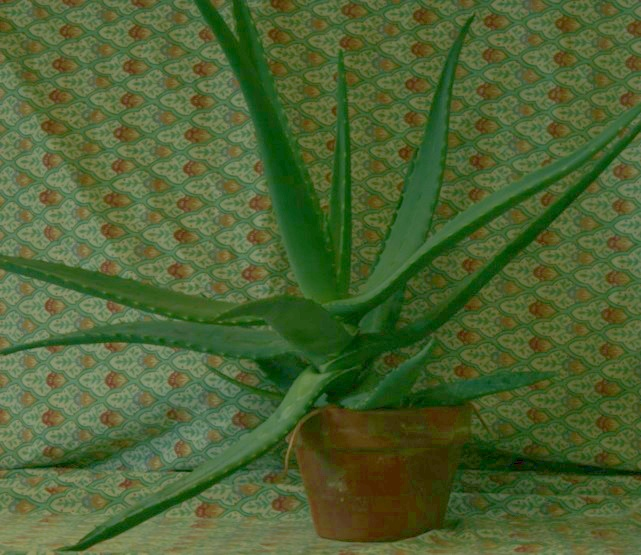 | 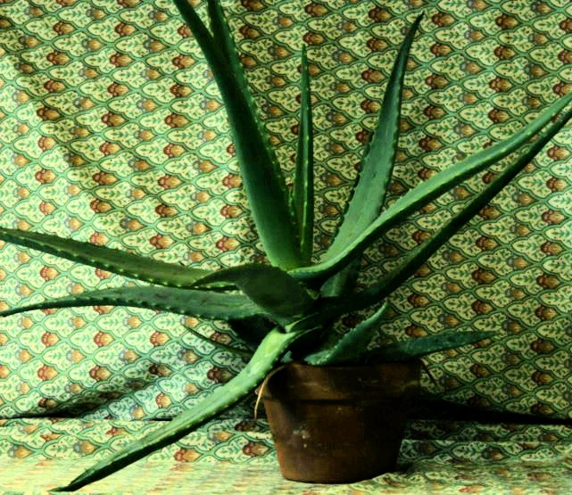 |
| 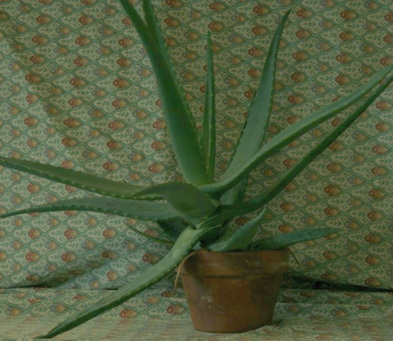 | 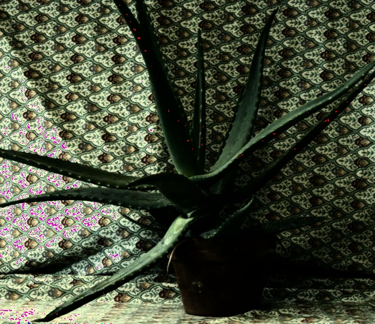 |

## church, $\gamma$ = 0.4

| 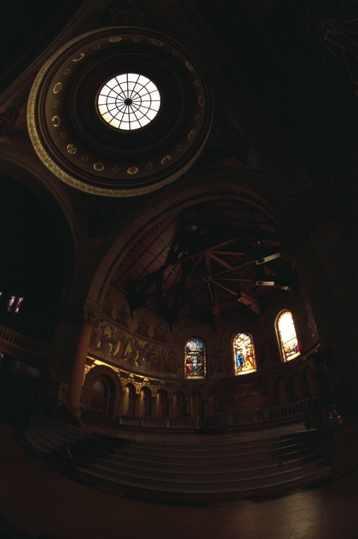                  |                                                         |
| ------------------------------------------------------- | ------------------------------------------------------- |
|  |  |
| 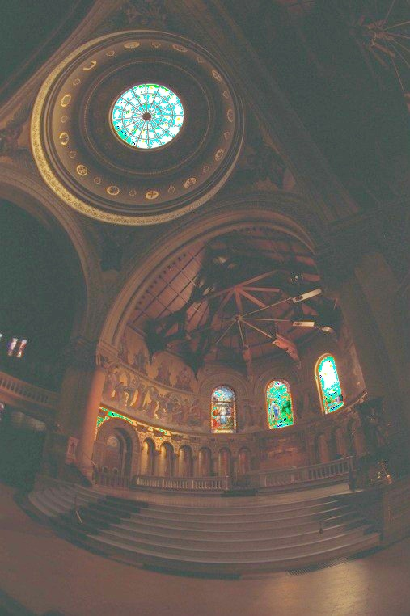 | 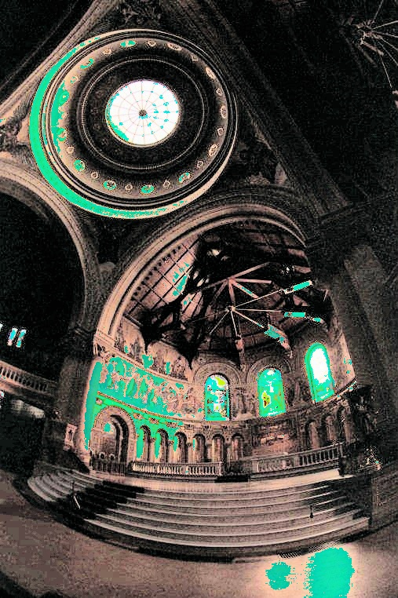       |

## house, $\gamma$ = 2.5

|                   |                                                 |
| ----------------------------------------------------- | ----------------------------------------------- |
| 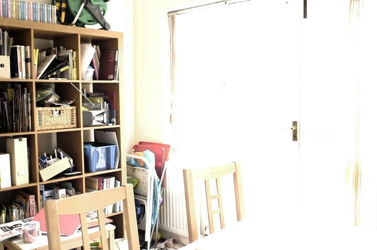 | 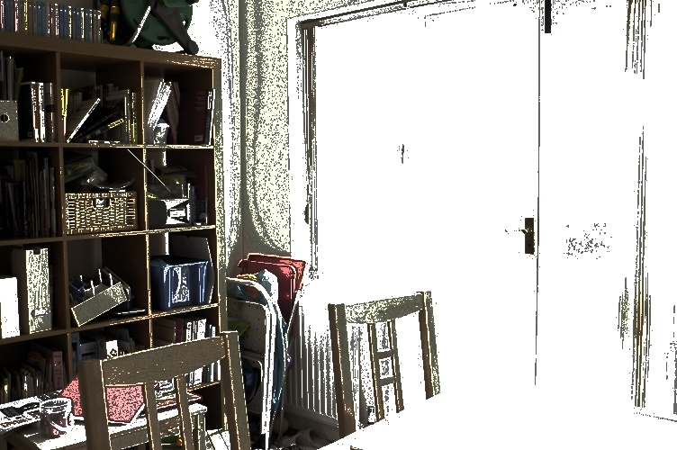 |
| 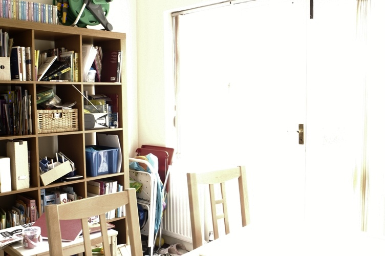 | 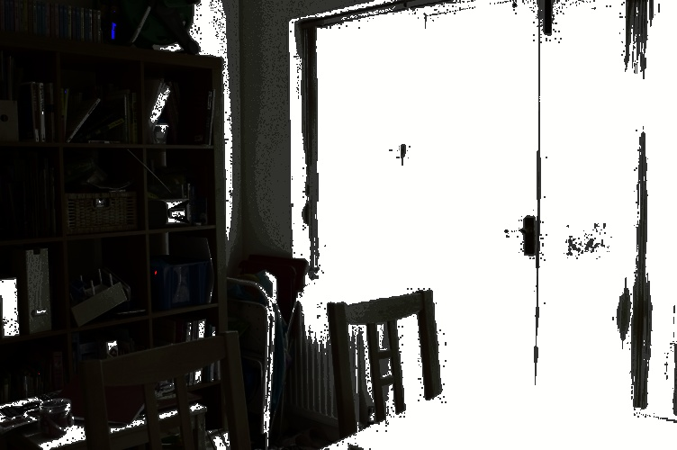 |

## kitchen, $\gamma$ = 2.0

| 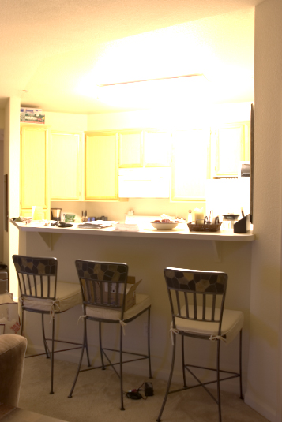                  |                                                     |
| --------------------------------------------------------- | --------------------------------------------------- |
| 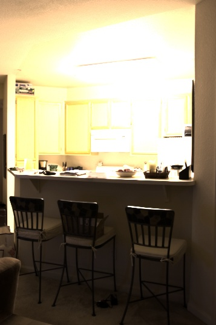 | 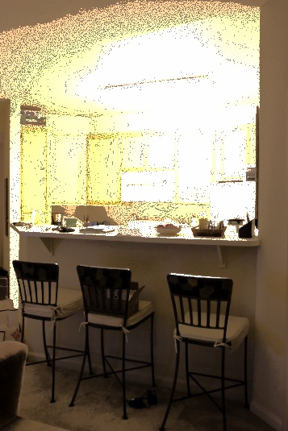 |
| 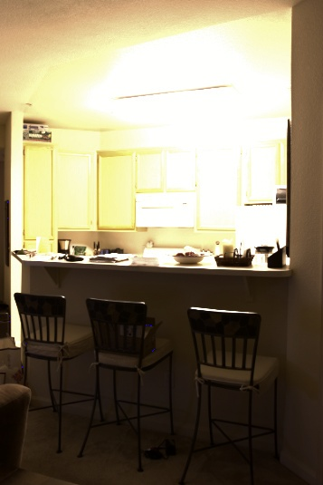 | 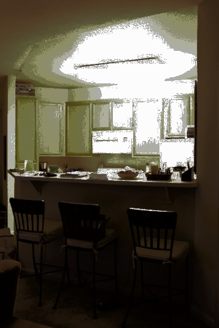 |


# Discussions

- The result will have more color noise with histogram equalization using CIE than that using HSV.


# Reference

- https://www.geeksforgeeks.org/program-change-rgb-color-model-hsv-color-model/
- https://stackoverflow.com/questions/3018313/algorithm-to-convert-rgb-to-hsv-and-hsv-to-rgb-in-range-0-255-for-both
- https://cg2010studio.com/2012/10/02/rgb%E8%88%87cielab%E8%89%B2%E5%BD%A9%E7%A9%BA%E9%96%93%E8%BD%89%E6%8F%9B/
- https://stackoverflow.com/questions/13405956/convert-an-image-rgb-lab-with-python

