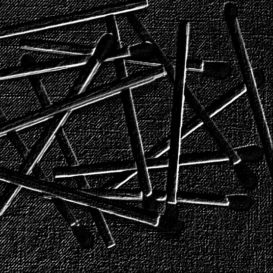

**Image Processing HW04 \- Edge Detection \- CSIE 4B 408410120 鍾博丞**

---

# Date Information

- Due: 2023.01.06
- Last Modified: 2022.12.31


# Environment Requirement

- python 3.5 or newer \- for f-strings `f"Something {variable}"` and type hinting.
- Another requirements are written in `requirements.txt`, just type `pip install -r requirements.txt`  in the terminal. 
  - matplotlib
  - numpy
  - opencv-python == 4.5.5.62 (for auto\-complete working on pycharm)
    - https://stackoverflow.com/questions/73174194/opencv-autocomplete-not-working-on-pycharm
  - tqdm


# Execution

The main python code is `main.py`, type the following command and then you can run the program.

```bash
python main.py
```

There are some parameters in `main.py`.

Note that the program will always save all images in `Img`. 

<font color=#FF9F00>Warning: The program will always ask user whether user want to delete the existing folder `Img` and recreate it or not. The default behavior is **No**. You can only press **Enter** into the console, which also means No.</font>

- `is_show`: Tell the program if you want to show the result on the screen or not. 
  - `True`: Show the result on the screen.
  - `False`: Don't show. Save it only.


All the methods are implemented in `spatial_image_enhancement.py` and import in main as `sie`.

# Technical Description

## Sobel Operator

There are 4 kinds of Sobel operator. We define their names as their degrees.

- sobel_0 = $\begin{bmatrix} -1 & -2 & -1 \\ 0 & 0 & 0 \\ 1 & 2 & 0 \end{bmatrix}$
- sobel_45 = $\begin{bmatrix} -2 & -1 & 0 \\ -1 & 0 & 1 \\ 0 & 1 & 2 \end{bmatrix}$
- sobel_90 = $\begin{bmatrix} -1 & 0 & 1 \\ -2 & 0 & 2 \\ -1 & 0 & 1 \end{bmatrix}$
- sobel_135 = $\begin{bmatrix} 0 & 1 & 2 \\ -1 & 0 & 1 \\ -2 & -1 & 0 \end{bmatrix}$

We have 4 results using the operators shown above and we create the final result by averaging the 4 results.

## Laplacian of a Gaussian (LoG)

We use the example 5 \* 5 mask in Figure 10.14 in textbook.

- LoG = $\begin{bmatrix} 0 & 0 & -1 & 0 & 0 \\ 0 & -1 & -2 & -1 & 0 \\ -1 & -2 & 16 & -2 & -1 \\ 0 & -1 & -2 & -1 & 0 \\ 0 & 0 & -1 & 0 & 0 \end{bmatrix}$

# Experimental results

The order of the permutation is described below.

| Original Image     | LoG            |
| ------------------ | -------------- |
| Sobel_0            | Sobel_45       |
| Sobel_90           | Sobel_135      |
| Final_Sobel_Result | (Remain Blank) |

## image 1

|         |              |
| --------------------------------------------- | ----------------------------------------------- |
|    |    |
|  |  |
|        |                                                 |

## image 2

|         |              |
| --------------------------------------------- | ----------------------------------------------- |
|    |    |
|  |  |
|        |                                                 |

## image 3

|         |              |
| --------------------------------------------- | ----------------------------------------------- |
|    |    |
|  |  |
|        |                                                 |


# Discussions

- The result is pretty great.
- The Sobel operator works better than the LoG.


# Reference

- Digital Image Processing, 4e (Rafael C. Gonzalez): Figure 10.14

