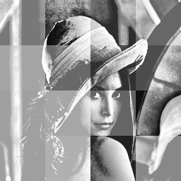
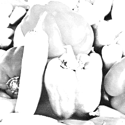
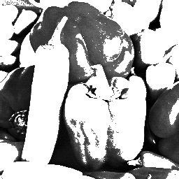

**Introduction to Image Processing HW01 \- Histogram Equalization CSIE 4B 408410120 鍾博丞**

---

Given two gray-level images, enhance the two given images by using the histogram equalization technique: (a) the global approach and (b) the local approach.

 

In the global approach, the histogram equalization technique is directly applied on each given image. In the local approach, each given image is partitioned into 16 “equal-sized” blocks, and then the histogram equalization technique is applied individually on the 16 “equal-sized” blocks.


# Date Information

- Due: 2022.11.08
- Last Modified: 2022.11.08


# Environment Requirement

- python 3.0 or newer \- for f-strings `f"Something {variable}"`.
- Another requirements are written in `requirements.txt`, just type `pip install -r requirements.txt`  in the terminal. 
  - matplotlib
  - numpy
  - opencv-python == 4.5.5.62 (for auto\-complete working on pycharm)
    - https://stackoverflow.com/questions/73174194/opencv-autocomplete-not-working-on-pycharm
  - tqdm


# Execution

The main python code is `main.py`, type the following command and then you can run the program.

```bash
python main.py
```

There are some parameters in `main.py`.

Note that the program will always save all images in `Img`. 

<font color=#FF0000>**Warning: The program will always delete existing folder `Img` and recreate it.**</font>

- `is_show`: Tell the program if you want to show the result on the screen or not. 
  - `True`: Show the result on the screen.
  - `False`: Don't show. Save it only.
- `save_eps`: Tell the program if you want to save the *histograms* by vector (.eps) or bitmap (.png) images.
  - `True`: Vector images (.eps)
  - `False`: Bitmap images (.png), default resolution is 600 dpi.
- `dpi`: The resolution for plotting histogram, default is 600 dpi.


All the methods is implemented in `spatial_image_enhancement.py` and import in main as `sie`.


# Technical Description

## Histogram Equalization

1. Count the intensity value for every pixel by using `np.bincount`.
2. Normalize the intensity value to get the probability mass function.
3. Calculate the cumulative distribution function by using `np.cumsum`.
4. Create the mapping table by the CDF transfer back to [0, 255].
5. Map all pixels to create the new image.


# Experimental results

## Lenna

| Method        | Image                                               |
| ------------- | --------------------------------------------------- |
| original      |                   |
| global histeq |  |
| local histeq  |    |

## Pepper

| Method        | Image                                                  |
| ------------- | ------------------------------------------------------ |
| original      |                   |
| global histeq |  |
| local histeq  |    |


# Discussions

The local histogram equalization technique is **NOT**applied individually on the 16 “equal-sized” blocks.

Instead, it computes the histograms using given size of neighborhoods of each pixel. The pixel then takes the mapping intensity.


# Reference

- https://levelup.gitconnected.com/introduction-to-histogram-equalization-for-digital-image-enhancement-420696db9e43

  

