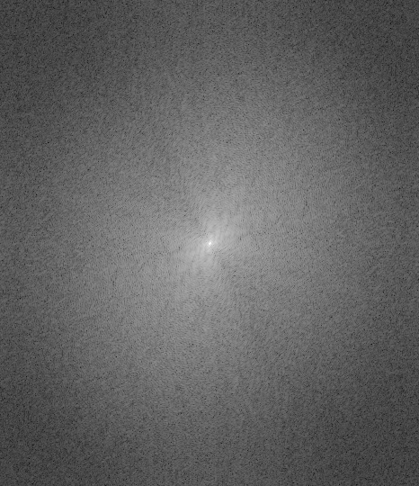
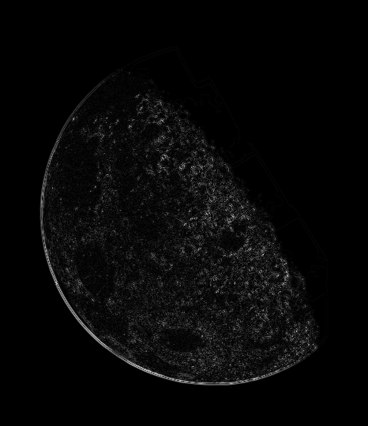
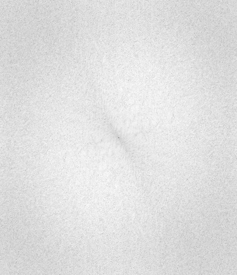
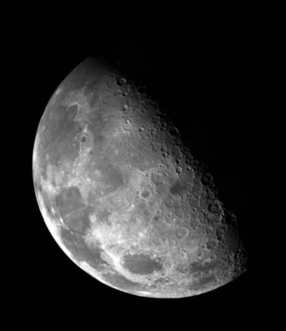
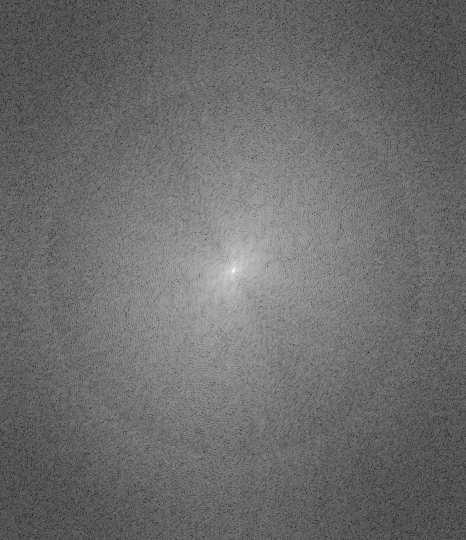
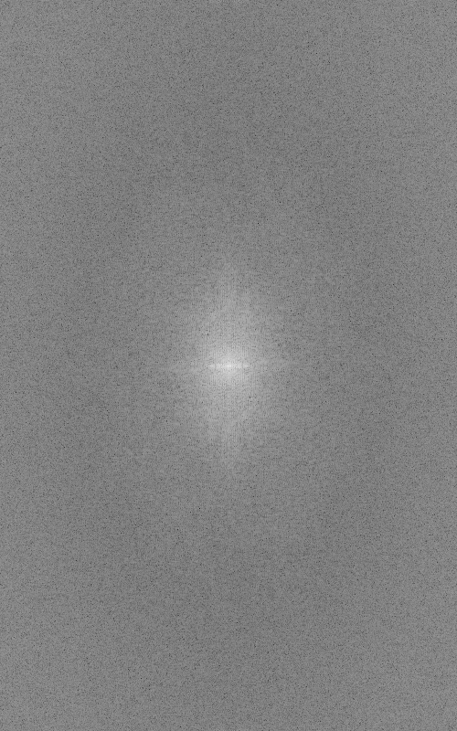
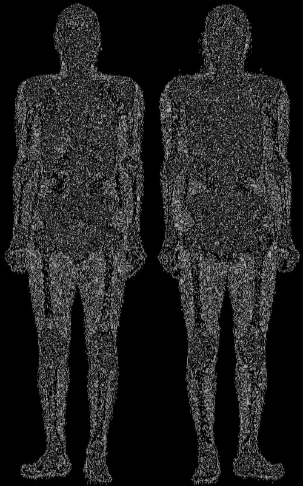
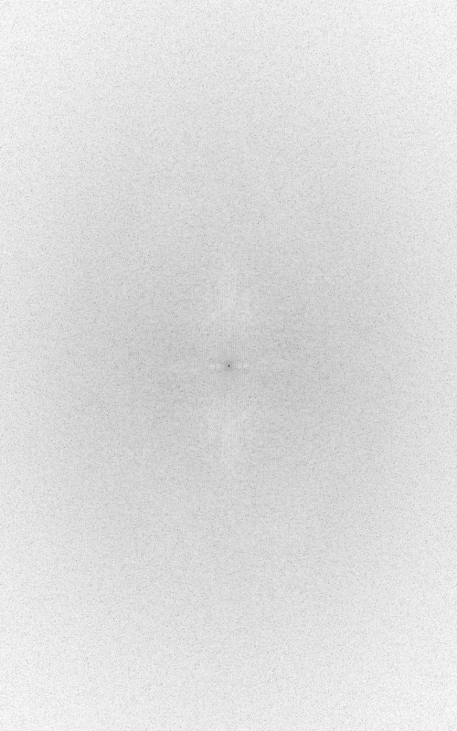
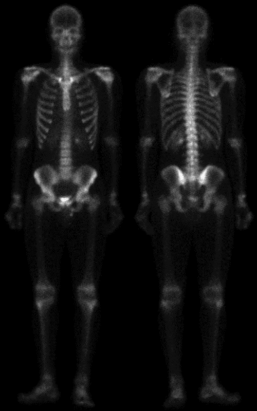
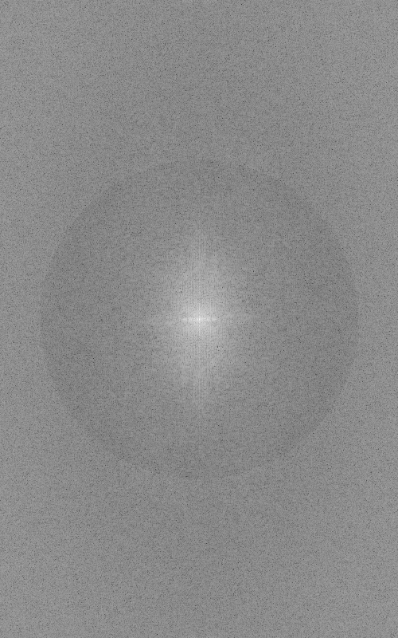

**Introduction to Image Processing HW02 \- Image Sharpening \- CSIE 4B 408410120 鍾博丞**

---

Give two gray-level images, sharpen the two images using the Laplacian operator and high-boost filtering.


# Date Information

- Due: 2022.11.18
- Last Modified: 2022.11.18


# Environment Requirement

- python 3.5 or newer \- for f-strings `f"Something {variable}"` and type hinting.
- Another requirements are written in `requirements.txt`, just type `pip install -r requirements.txt`  in the terminal. 
  - matplotlib
  - numpy
  - opencv-python == 4.5.5.62 (for auto\-complete working on pycharm)
    - https://stackoverflow.com/questions/73174194/opencv-autocomplete-not-working-on-pycharm
  - tqdm


# Execution

The main python code is `main.py`, type the following command and then you can run the program.

```bash
python main.py
```

There are some parameters in `main.py`.

Note that the program will always save all images in `Img`. 

<font color=#FF9F00>Warning: The program will always ask user whether user want to delete the existing folder `Img` and recreate it or not. The default behavior is **No**. You can only press **Enter** into the console, which also means No.</font>

- `is_show`: Tell the program if you want to show the result on the screen or not. 
  - `True`: Show the result on the screen.
  - `False`: Don't show. Save it only.
- `radius_ratio`: This value is set for Ideal Low Pass Filter and Ideal High Pass Filter, determine the ratio of min(height / 2, width / 2).
  - For example, the height M and width N of `skeleton_orig.bmp` are 800 and 500. Therefore, the maximum radius of this image is 500 / 2 = 250.
  - If this value is 0.8, then the radius of these filters is 250 \* 0.8 = 200.

- `high_boost_A`: The constant *A* of the high\-boost filter.
  - $f_{hb}(x,y)=(A-1)f(x,y)+f_{hp}(x,y)$
  - $A \ge 1$


All the methods are implemented in `spatial_image_enhancement.py` and `frequency_image_enhancement.py` and import in main as `sie` and `fie`, respectively.


# Technical Description

## fftshift \- For Shifting the Image Center (M/2, N/2) to (0, 0)

Because of the repeatability of every signal, the shift method $(-1)^{x+y}$ equals to swap both sides cut from center for each axes (dimensions).

If the size is even, then the forward shifting is same as the inverse shifting.

**However, if the size is odd, then we have to determine the cut boundary.**

Here, we determine **ceiling** in forward shifting.

$c_m=\left\lceil \dfrac{M}{2} \right\rceil,\;c_n=\left\lceil \dfrac{N}{2} \right\rceil$


## ifftshift \- For Shifting the Image Center Back to (M/2, N/2)

Here, we determine **floor** in forward shifting when the size is odd.

$c_m=\left\lfloor \dfrac{M}{2} \right\rfloor,\;c_n=\left\lfloor \dfrac{N}{2} \right\rfloor$


## calspec \- Calculate Magnitude Spectrum

- Calculate the magnitude of each complex number.
- Take logarithm of the magnitudes: $\log(x+1)$. We add every magnitudes by 1 to prevent $\log(0)=-\infty$
- Normalize to [0, 1] and then transfer back to [0, 255].


## Laplacian Filter in Frequency Domain

Since $\mathcal{F}(f(x,y))=\dfrac{1}{MN}\displaystyle\sum_{u=0}^{M-1}\sum_{v=0}^{N-1}f(x,y)e^{-j2\pi(ux/M+vy/N)}=F(u,v)$,

then $\mathcal{F}(\dfrac{\part^2 f(x,y)}{\part x^2}+\dfrac{\part^2 f(x,y)}{\part y^2})=F(u,v)(-j2\pi u)^2+F(u,v)(-j2\pi v)^2=-4\pi^2(u^2+v^2)F(u,v)$

Therefore, the Laplacian can be implemented in the frequency domain by using the filter

$H_{laplacaion}(u,v)=-4\pi^2(u^2+v^2)$.


## Unsharp Masking

Sharpening images can be implemented by subtracting a blurred version of an image from the image itself, i.e., unsharp masking

$f_{hp}(x,y)=f(x,y)-f_{lp}(x,y) \Leftrightarrow F_{hp}(u,v)=F(u,v)-F_{lp}(u,v)$

Then, we add the mask to the original.

$f_{unsharp}(x,y)=f(x,y)+f_{hp}(x,y) \Leftrightarrow F_{unsharp}(u,v)=F(u,v)+F_{hp}(u,v)$

We can observe that the two steps can merge to a equation.

$f_{unsharp}(x,y)=2\times f(x,y)-f_{lp}(x,y) \Leftrightarrow F_{unsharp}(u,v)=2\times F(u,v)-F_{lp}(u,v)$


## High-Boost Filtering

High-boost filtering generalizes this by multiplying $f(x,y)$ by a constant $A \ge 1$:

$\begin{aligned} f_{hb}(x,y)&=Af(x,y)-f_{lp}(x,y)\\&=(A-1)f(x,y)+f(x,y)-f_{lp}(x,y)\\&=(A-1)f(x,y)+f_{hp}(x,y)\\F_{hb}(u,v)&=(A-1)F(u,v)+F_{hp}(u,v)\\H_{hb}(u,v)F(u,v)&=(A-1)F(u,v)+H_{hp}(u,v)F(u,v)\\H_{hb}(u,v)&=(A-1)+H_{hp}(u,v)\end{aligned}$

If $A=2$, then it is same as unsharp masking.

We define $A=3$ here.


# Experimental results

## Blurry Moon

| Method              | Image                                                        | Spectrum                                                     |
| ------------------- | ------------------------------------------------------------ | ------------------------------------------------------------ |
| Origin              |                         |  |
| Laplacian Filtering |     |  |
| High-Boost A = 3    |  |  |


## Skeleton Original

| Method              | Image                                                        | Spectrum                                                     |
| ------------------- | ------------------------------------------------------------ | ------------------------------------------------------------ |
| Origin              |                     |  |
| Laplacian Filtering |  |  |
| High-Boost A = 3    |  |  |


# Discussions

- Laplacian sometimes get too many edges. Same as unsharp filtering
- High-boosting tends to get better results.
- We use `np.fft.fft2` and `np.fft.ifft2` here.


# Reference

- Course slides Ch03, Ch04.
- https://geek-docs.com/opencv/opencv-examples/gamma-correction.html
- https://levelup.gitconnected.com/introduction-to-histogram-equalization-for-digital-image-enhancement-420696db9e43
- https://medium.com/analytics-vidhya/2d-convolution-using-python-numpy-43442ff5f381
- https://gist.github.com/bistaumanga/5682774

