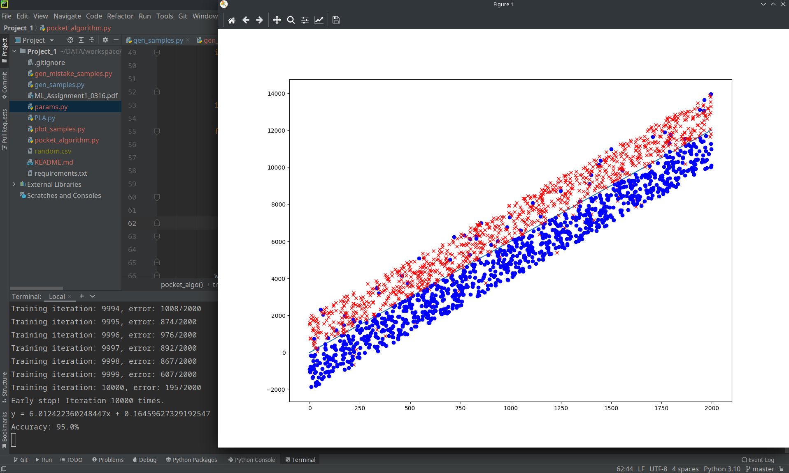

**CCU ML Assignment 1 Perceptron  CSIE 3B 408410120 鍾博丞**

---

# 執行

## 參數調整

所有參數都存放於 `params.py`，可以修改產生多少 samples、多少 iterations 要 early stop、要產生多少錯誤標記的點......等

錯誤標記的數量是分開計算的，也就是，`mistake = 50` 將會產生 50 個錯誤標記的 positive samples、與 50 個錯誤標記的 negative samples

## 環境

因為本程式有使用拼接字串，故請使用 python 版本 3 以上的版本執行

本程式有使用 matplotlib, numpy 這兩個套件，可執行 `pip install -r requirements.txt` 安裝套件

## 產生 samples

調整好 `params.py` 裡面的參數與 .csv 檔的位置後，執行 `python gen_samples.py` 即可產生 csv 檔

## 產生有錯誤標記的 samples

調整好 `params.py` 裡面的參數與 .csv 檔的位置後，執行 `python gen_mistake_samples.py` 即可產生 csv 檔

## 畫出 csv 檔的圖

執行 `python polt_samples.py`，即可根據 `params.py` 裡面的斜率 m 與偏移 b 畫出斜直線，再根據 csv 裡面的資料，將標記為 1 (positive) 的資料點畫成藍色 o、將標記為 -1 (negative) 的資料點畫成紅色 x，並顯示於螢幕上

## 實作 PLA

**產生完 samples 後**，執行 `python PLA.py` 即可，該程式會將訓練過程印在 stderr 上，並於完成時將函數 y = mx + b 印出，同時印出該直線與 dataset 的結果

訓練期間可以按下 Ctrl + C，傳入 SIGINT，程式接收到 KeyboardInterrupt 後，會立刻停止訓練並印出當前結果，須注意，PLA 並**不會紀錄最好的結果**，只有成不成功之分

若迭代超過 `params.py` 的 `early_stop` 的值，訓練也會直接中斷並印出當前結果

## 實作 Pocket Algorithm

**產生完 samples 後**，執行 `python pocket_algorithm.py` 即可，該程式會將訓練過程印在 stderr 上，並於完成時將函數 y = mx + b 印出，同時印出該直線與 dataset 的結果與正確率

訓練期間可以按下 Ctrl + C，傳入 SIGINT，程式接收到 KeyboardInterrupt 後，會立刻停止訓練並印出當前**最佳**結果與正確率

若迭代超過 `params.py` 的 `early_stop` 的值，訓練也會直接中斷並印出當前**最佳**結果與正確率

# 實驗結果

## PLA 在 sample 數量為 30 下的成果

以 y = 6x + 1 產生 samples

| 迭代次數 | 時間 (s) | 斜率 *m* | 偏移 *b* |
| -------- | -------- | -------- | -------- |
| 222      | 0.607    | 5.96     | 0.94     |
| 84       | 0.592    | 5.81     | 1.66     |
| 4        | 0.583    | 6        | 3        |
| 286      | 0.616    | 5.7      | 2.09     |
| 63       | 0.59     | 6        | 2.67     |

## PLA 在 sample 數量為 2000 下的成果

以 y = 6x + 1 產生 samples

| 迭代次數 | 時間 (s) | 斜率 *m* | 偏移 *b* |
| -------- | -------- | -------- | -------- |
| 1816     | 12.596   | 6        | 0.04     |
| 437      | 4.128    | 6        | 0.02     |
| 8779     | 51.653   | 6        | -0.03    |
| 1559     | 10.908   | 5.99     | 0.02     |
| 1506     | 10.21    | 5.99     | 0        |

## Pocket Algorithm 在 sample 數量為 2000 下的成果

以 y = 6x + 1 產生 samples

| 迭代次數 | 時間 (s) | 斜率 *m* | 偏移 *b* |
| -------- | -------- | -------- | -------- |
| 656      | 27.41    | 5.99     | 0        |
| 474      | 22.655   | 5.99     | 0        |
| 1455     | 49.68    | 6        | 0.01     |
| 2284     | 88.366   | 5.99     | 0        |
| 658      | 27.991   | 6        | 0        |

## Pocket Algorithm 在 sample 數量為 2000、錯誤數量為 100 下的成果

以 y = 6x + 1 產生 samples，共 50 個正的標成負的、50 個負的標成正的，early_stop = 10K

最理想的準確率為 (2000 - 100) / 2000 = 95%，Pocket Algorithm 有時真的可以達成

# 結論

其實沒有任何證據能夠顯示如果選了錯誤較少的 weight 去更新，下次的錯誤一定會更少。Pocket Algorithm 最多只能是選擇這次錯誤的最少的點去做更新

如果資料是可以被線性分割的，PLA 與 Pocket Algorithm 並沒有誰優誰劣，誰快誰慢，只是，Pocket Algorithm 可以在一個資料不可被線性分割的資料，找到錯誤率最低的分割法

# 討論

Pocket Algorithm 實作時，不可以設定下次更新的錯誤率一定要比這次的錯誤率低才做更新，這樣很有機會停在某處不更新，不更新一定不會有好結果