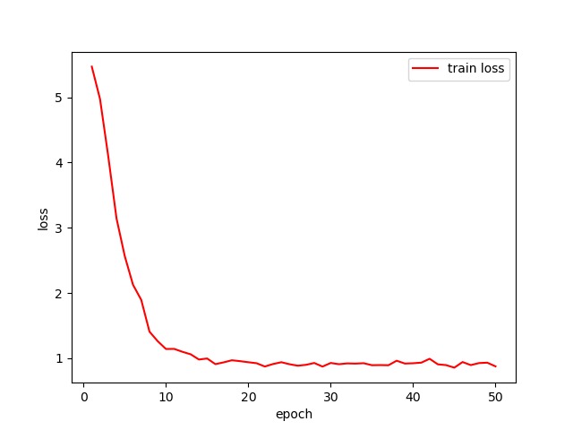
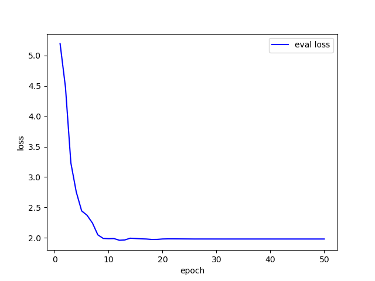
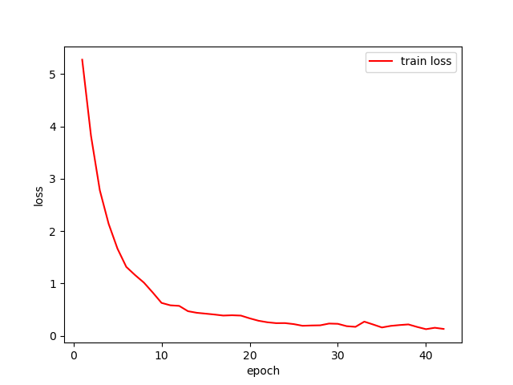
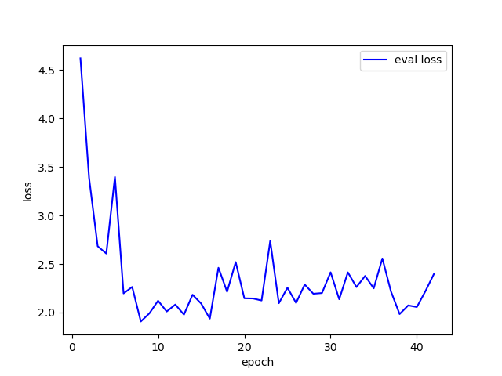

**CCU ML Assignment 2 Convolutional Neural Network  CSIE 3B 408410120 鍾博丞**

---

# 執行

## 參數調整

所有參數都存放於 `hyperparameters.py`，可以修改 epochs 數量、learning rate, batch size, num_workers, momentum.

## 環境

因為本程式有使用拼接字串，故請使用 python 版本 3 以上的版本執行

本程式有使用 **gdown**, matplotlib, numpy, tqdm 這四個套件，可執行 `pip install -r requirements.txt` 安裝套件

**本程式預設使用 GoogleNet**


## 執行

輸入 `python main.py` 即可執行

我有重新整理 AI_CUP 的資料夾放在我的 google drive，因此，請**務必安裝最新版本的 gdown** (有列於 requirements.txt 裡面)

如果想要在 early stop 前停止訓練，可以傳送 SIGINT 給程式，就可以立刻儲存當前狀態並停止程式

Training / validation result 存放於 Loss_Figure 這個資料夾裡面

測試樣本的圖片存放於 Test_Figure 裡面

本程式預設略過 `imshow()`，有需要請自行解除註解


# 實驗結果

 在不加任何 transforms 與不調整 model 架構下 (預設為 AlexNet)，在 num_epochs = 100, lr = 0.001, batch_size = 64 下，得到的結果如下

```
Epoch 9/100
----------
train Loss: 0.2649, Acc: 0.9439
val Loss: 1.8528, Acc: 0.5510
Saving model with Loss: 1.8528 and Acc: 0.5510
```

 之後就是 overfitting，所以超過 early stop 之後，程式就停止了


## data_transforms

第一個加的是水平翻轉

```python
transforms.RandomHorizontalFlip(),
```

得到的結果如下

```
Epoch 9/100
----------
train Loss: 0.3130, Acc: 0.9178
val Loss: 1.8679, Acc: 0.5662
Saving model with Loss: 1.8679 and Acc: 0.5662
```

---

第二個加的是旋轉圖片

```python
transforms.RandomHorizontalFlip(),
transforms.RandomRotation(degrees=(-45, 45), fill=0),
```

得到的結果如下

```
Epoch 11/100
----------
train Loss: 0.4914, Acc: 0.8604
val Loss: 1.7666, Acc: 0.5449
Saving model with Loss: 1.7666 and Acc: 0.5449
```

---

第三個加的是對於亮度、對比度、飽和度的調整

```python
transforms.RandomHorizontalFlip(),
transforms.RandomRotation(degrees=(-45, 45), fill=0),
transforms.ColorJitter(brightness=(0.5, 1.5), contrast=(0.5, 1.5), saturation=(0.5, 1.5), hue=(-0.1, 0.1)),
```

得到的結果如下

```
Epoch 17/100
----------
train Loss: 1.2685, Acc: 0.6438
val Loss: 2.1153, Acc: 0.4444
Saving model with Loss: 2.1153 and Acc: 0.4444
```

可以發現在這樣的 data argumentation 之下， train loss 無法繼續下降，模型不再 overfitting 了


---

第四個加的是隨機讓圖片變成灰階圖片

```
transforms.RandomHorizontalFlip(),
transforms.RandomRotation(degrees=(-45, 45), fill=0),
transforms.ColorJitter(brightness=(0.5, 1.5), contrast=(0.5, 1.5), saturation=(0.5, 1.5), hue=(-0.1, 0.1)),
transforms.RandomGrayscale(),
```

得到的結果如下

```
Epoch 25/100
----------
train Loss: 1.4896, Acc: 0.5819
val Loss: 2.0945, Acc: 0.4612
Saving model with Loss: 2.0945 and Acc: 0.4612
```

---

第五個加的是 normalization

```
transforms.RandomHorizontalFlip(),
transforms.RandomRotation(degrees=(-45, 45), fill=0),
transforms.ColorJitter(brightness=(0.5, 1.5), contrast=(0.5, 1.5), saturation=(0.5, 1.5), hue=(-0.1, 0.1)),
transforms.RandomGrayscale(),
transforms.ToTensor(),
transforms.Normalize(mean=(0.485, 0.456, 0.406), std=(0.229, 0.224, 0.225)),
```

得到的結果如下

```
Epoch 9/100
----------
train Loss: 1.3260, Acc: 0.6471
val Loss: 1.9641, Acc: 0.5266
Saving model with Loss: 1.9641 and Acc: 0.5266
```


## 調整 model 參數

首先，藉由 `print(model_ft)` 看一下 AlexNet 的資訊 (事前有藉由 `model_ft.classifier[6] = nn.Linear(in_features=4096, out_features=219, bias=True)` 改變最後一行的 out_features)

```
AlexNet(
  (features): Sequential(
    (0): Conv2d(3, 64, kernel_size=(11, 11), stride=(4, 4), padding=(2, 2))
    (1): ReLU(inplace=True)
    (2): MaxPool2d(kernel_size=3, stride=2, padding=0, dilation=1, ceil_mode=False)
    (3): Conv2d(64, 192, kernel_size=(5, 5), stride=(1, 1), padding=(2, 2))
    (4): ReLU(inplace=True)
    (5): MaxPool2d(kernel_size=3, stride=2, padding=0, dilation=1, ceil_mode=False)
    (6): Conv2d(192, 384, kernel_size=(3, 3), stride=(1, 1), padding=(1, 1))
    (7): ReLU(inplace=True)
    (8): Conv2d(384, 256, kernel_size=(3, 3), stride=(1, 1), padding=(1, 1))
    (9): ReLU(inplace=True)
    (10): Conv2d(256, 256, kernel_size=(3, 3), stride=(1, 1), padding=(1, 1))
    (11): ReLU(inplace=True)
    (12): MaxPool2d(kernel_size=3, stride=2, padding=0, dilation=1, ceil_mode=False)
  )
  (avgpool): AdaptiveAvgPool2d(output_size=(6, 6))
  (classifier): Sequential(
    (0): Dropout(p=0.5, inplace=False)
    (1): Linear(in_features=9216, out_features=4096, bias=True)
    (2): ReLU(inplace=True)
    (3): Dropout(p=0.5, inplace=False)
    (4): Linear(in_features=4096, out_features=4096, bias=True)
    (5): ReLU(inplace=True)
    (6): Linear(in_features=4096, out_features=219, bias=True)
  )
)
```


### 減少層數

其實藉由剛剛加了 data argumentation 的結果來看，已經很明顯的顯示 AlexNet 層數不足，屬於 model bias 的問題，所以預估減少層數會顯著降低準確率

---

```py
model_ft.features = nn.Sequential(*[model_ft.features[i] for i in range(6)])
model_ft.classifier[1] = nn.Linear(in_features=192 * 6 * 6, out_features=4096, bias=True)
```

減少後的模型架構如下

```
AlexNet(
  (features): Sequential(
    (0): Conv2d(3, 64, kernel_size=(11, 11), stride=(4, 4), padding=(2, 2))
    (1): ReLU(inplace=True)
    (2): MaxPool2d(kernel_size=3, stride=2, padding=0, dilation=1, ceil_mode=False)
    (3): Conv2d(64, 192, kernel_size=(5, 5), stride=(1, 1), padding=(2, 2))
    (4): ReLU(inplace=True)
    (5): MaxPool2d(kernel_size=3, stride=2, padding=0, dilation=1, ceil_mode=False)
  )
  (avgpool): AdaptiveAvgPool2d(output_size=(6, 6))
  (classifier): Sequential(
    (0): Dropout(p=0.5, inplace=False)
    (1): Linear(in_features=6912, out_features=4096, bias=True)
    (2): ReLU(inplace=True)
    (3): Dropout(p=0.5, inplace=False)
    (4): Linear(in_features=4096, out_features=4096, bias=True)
    (5): ReLU(inplace=True)
    (6): Linear(in_features=4096, out_features=219, bias=True)
  )
)
```

得到的結果如下

```
Epoch 27/100
----------
train Loss: 5.3811, Acc: 0.0078
val Loss: 5.3777, Acc: 0.0137
Saving model with Loss: 5.3777 and Acc: 0.0137
```

正如預期的結果，loss 居高不下


### 增加層數

增加層數雖然理論上可以解決 model bias 的問題，但是自己新增的層數並沒有 pre-trained weight data，因此，在本次 dataset 上，219 類中一類只有 10 張圖片的情況下，這是非常不利的

---

```pyth
model_ft.features.append(nn.Conv2d(in_channels=256, out_channels=512, kernel_size=(3, 3), stride=(1, 1), padding=(1, 1)))
model_ft.features.append(nn.ReLU(inplace=True))
model_ft.features.append(nn.MaxPool2d(kernel_size=3, stride=1, padding=0))
model_ft.features.append(nn.Conv2d(in_channels=512, out_channels=1024, kernel_size=(3, 3), stride=(1, 1), padding=(1, 1)))
model_ft.features.append(nn.ReLU(inplace=True))
model_ft.features.append(nn.MaxPool2d(kernel_size=3, stride=1, padding=0))
model_ft.classifier[1] = nn.Linear(in_features=1024 * 6 * 6, out_features=4096, bias=False)
```

增加後的模型架構如下

```
AlexNet(
  (features): Sequential(
    (0): Conv2d(3, 64, kernel_size=(11, 11), stride=(4, 4), padding=(2, 2))
    (1): ReLU(inplace=True)
    (2): MaxPool2d(kernel_size=3, stride=2, padding=0, dilation=1, ceil_mode=False)
    (3): Conv2d(64, 192, kernel_size=(5, 5), stride=(1, 1), padding=(2, 2))
    (4): ReLU(inplace=True)
    (5): MaxPool2d(kernel_size=3, stride=2, padding=0, dilation=1, ceil_mode=False)
    (6): Conv2d(192, 384, kernel_size=(3, 3), stride=(1, 1), padding=(1, 1))
    (7): ReLU(inplace=True)
    (8): Conv2d(384, 256, kernel_size=(3, 3), stride=(1, 1), padding=(1, 1))
    (9): ReLU(inplace=True)
    (10): Conv2d(256, 256, kernel_size=(3, 3), stride=(1, 1), padding=(1, 1))
    (11): ReLU(inplace=True)
    (12): MaxPool2d(kernel_size=3, stride=2, padding=0, dilation=1, ceil_mode=False)
    (13): Conv2d(256, 512, kernel_size=(3, 3), stride=(1, 1), padding=(1, 1))
    (14): ReLU(inplace=True)
    (15): MaxPool2d(kernel_size=3, stride=1, padding=0, dilation=1, ceil_mode=False)
    (16): Conv2d(512, 1024, kernel_size=(3, 3), stride=(1, 1), padding=(1, 1))
    (17): ReLU(inplace=True)
    (18): MaxPool2d(kernel_size=3, stride=1, padding=0, dilation=1, ceil_mode=False)
  )
  (avgpool): AdaptiveAvgPool2d(output_size=(6, 6))
  (classifier): Sequential(
    (0): Dropout(p=0.5, inplace=False)
    (1): Linear(in_features=36864, out_features=4096, bias=False)
    (2): ReLU(inplace=True)
    (3): Dropout(p=0.5, inplace=False)
    (4): Linear(in_features=4096, out_features=4096, bias=True)
    (5): ReLU(inplace=True)
    (6): Linear(in_features=4096, out_features=219, bias=True)
  )
)
```

得到的結果如下

```
Epoch 27/100
----------
train Loss: 5.3889, Acc: 0.0046
val Loss: 5.3890, Acc: 0.0030
Saving model with Loss: 5.3890 and Acc: 0.0030
```

---

第二個增加的想法是，維持所有 classifier 的 pre-train 參數，故增加的層數之最後一層必須符合預設值

```python
model_ft.features.append(nn.Conv2d(in_channels=256, out_channels=512, kernel_size=(3, 3), stride=(1, 1), padding=(1, 1)))
model_ft.features.append(nn.ReLU(inplace=True))
model_ft.features.append(nn.MaxPool2d(kernel_size=3, stride=1, padding=0))
model_ft.features.append(nn.Conv2d(in_channels=512, out_channels=256, kernel_size=(3, 3), stride=(1, 1), padding=(1, 1)))
model_ft.features.append(nn.ReLU(inplace=True))
model_ft.features.append(nn.MaxPool2d(kernel_size=3, stride=1, padding=0))
```

增加後的模型架構如下

```
AlexNet(
  (features): Sequential(
    (0): Conv2d(3, 64, kernel_size=(11, 11), stride=(4, 4), padding=(2, 2))
    (1): ReLU(inplace=True)
    (2): MaxPool2d(kernel_size=3, stride=2, padding=0, dilation=1, ceil_mode=False)
    (3): Conv2d(64, 192, kernel_size=(5, 5), stride=(1, 1), padding=(2, 2))
    (4): ReLU(inplace=True)
    (5): MaxPool2d(kernel_size=3, stride=2, padding=0, dilation=1, ceil_mode=False)
    (6): Conv2d(192, 384, kernel_size=(3, 3), stride=(1, 1), padding=(1, 1))
    (7): ReLU(inplace=True)
    (8): Conv2d(384, 256, kernel_size=(3, 3), stride=(1, 1), padding=(1, 1))
    (9): ReLU(inplace=True)
    (10): Conv2d(256, 256, kernel_size=(3, 3), stride=(1, 1), padding=(1, 1))
    (11): ReLU(inplace=True)
    (12): MaxPool2d(kernel_size=3, stride=2, padding=0, dilation=1, ceil_mode=False)
    (13): Conv2d(256, 512, kernel_size=(3, 3), stride=(1, 1), padding=(1, 1))
    (14): ReLU(inplace=True)
    (15): MaxPool2d(kernel_size=3, stride=1, padding=0, dilation=1, ceil_mode=False)
    (16): Conv2d(512, 256, kernel_size=(3, 3), stride=(1, 1), padding=(1, 1))
    (17): ReLU(inplace=True)
    (18): MaxPool2d(kernel_size=3, stride=1, padding=0, dilation=1, ceil_mode=False)
  )
  (avgpool): AdaptiveAvgPool2d(output_size=(6, 6))
  (classifier): Sequential(
    (0): Dropout(p=0.5, inplace=False)
    (1): Linear(in_features=9216, out_features=4096, bias=True)
    (2): ReLU(inplace=True)
    (3): Dropout(p=0.5, inplace=False)
    (4): Linear(in_features=4096, out_features=4096, bias=True)
    (5): ReLU(inplace=True)
    (6): Linear(in_features=4096, out_features=219, bias=True)
  )
)
```

得到的結果如下

```
Epoch 46/10000
----------
train Loss: 3.0367, Acc: 0.2394
val Loss: 2.6672, Acc: 0.3303
Saving model with Loss: 2.6672 and Acc: 0.3303
```


## 將模型參數的輸出改為機率值

我們以預設的 AlexNet 參數，套用第五種 data argumentation 的方法，加上下面這一行

```python
model_ft.classifier.append(nn.Softmax(dim=0))
```

得到的結果如下

```
Epoch 20/10000
----------
train Loss: 5.3858, Acc: 0.0111
val Loss: 5.3847, Acc: 0.0137
Saving model with Loss: 5.3847 and Acc: 0.0137
```

結果直接變更差，因為 `nn.CrossEntropyLoss()` 已經有做 LogSoftmax 和 NLLLoss 了

https://pytorch.org/docs/stable/generated/torch.nn.CrossEntropyLoss.html

根據以下網站

https://discuss.pytorch.org/t/softmax-cross-entropy-loss/125383

已經有人實測，做 2 次 softmax 會導致每項結果更加平均，造成反效果，故使用 `nn.CrossEntropyLoss()` 不需要額外做 softmax


# 結論

## AlexNet

在做完 data argumentation 之後，就是最好的結果了

```python
optimizer_ft = optim.SGD(model_ft.parameters(), lr=lr, momentum=momentum)
num_epochs = 10000
lr = 0.001
batch_size = 64
early_stop = 1000
momentum = 0.9
```

```
Epoch 9/100
----------
train Loss: 1.3260, Acc: 0.6471
val Loss: 1.9641, Acc: 0.5266
Saving model with Loss: 1.9641 and Acc: 0.5266
```





## ResNet50

以下為參數設定

```python
optimizer_ft = optim.AdamW(model_ft.parameters(), lr=lr, weight_decay=weight_decay)
num_epochs = 10000
lr = 1e-3
batch_size = 64
early_stop = 1000
weight_decay = 1e-5
```

得到的結果如下

```
Epoch 40/10000
----------
train Loss: 0.7675, Acc: 0.7606
val Loss: 2.8185, Acc: 0.4490
```

顯示 overfitting 了


## ResNet34

參數設定同 ResNet50，得到的結果如下

```
Epoch 40/10000
----------
train Loss: 0.4669, Acc: 0.8506
val Loss: 3.3358, Acc: 0.4186
```

顯示 overfitting 了


## ResNet101

參數設定同 ResNet50，得到的結果如下

```
Epoch 23/10000
----------
train Loss: 1.5301, Acc: 0.5369
val Loss: 2.4263, Acc: 0.3805
Saving model with Loss: 2.4263 and Acc: 0.3805
```

```
Epoch 35/10000
----------
train Loss: 0.7261, Acc: 0.7847
val Loss: 2.4903, Acc: 0.4734
```

顯示 overfitting 了


## ResNeXt50_32x4d

參數設定同 ResNet50，得到的結果如下

```
Epoch 18/10000
----------
train Loss: 1.2477, Acc: 0.6321
val Loss: 2.2412, Acc: 0.4551
Saving model with Loss: 2.2412 and Acc: 0.4551
```

```
Epoch 40/10000
----------
train Loss: 0.3581, Acc: 0.8911
val Loss: 2.7435, Acc: 0.5327
```

顯示 overfitting 了


## VGG11

參數設定同 ResNet50，得到的結果如下

```
Epoch 47/10000
----------
train Loss: 2.7629, Acc: 0.2831
val Loss: 3.4695, Acc: 0.1872
Saving model with Loss: 3.4695 and Acc: 0.1872
```

```
Epoch 94/10000
----------
train Loss: 1.5653, Acc: 0.5675
val Loss: 3.9970, Acc: 0.2679
```

顯示 overfitting 了


## GoogleNet

參數設定同 ResNet50，得到的結果如下

```
Epoch 8/10000
----------
train Loss: 1.0168, Acc: 0.7012
val Loss: 1.9079, Acc: 0.5205
Saving model with Loss: 1.9079 and Acc: 0.5205
```

```
Epoch 40/10000
----------
100%|██████████| 24/24 [00:12<00:00,  1.91it/s]
train Loss: 0.1275, Acc: 0.9628
100%|██████████| 11/11 [00:02<00:00,  4.84it/s]
val Loss: 2.0569, Acc: 0.6058
```

顯示 overfitting 了






綜合來看，GoogleNet 似乎更勝一籌，而且其使用的參數也比較少，故**本程式預設使用 GoogleNet**


# 討論

並不一定大的模型效果就會比較好，嘗試過程中也試過 Residual Leaning Algorithm，得到的效果還不錯，ResNet 的進化版 ResNeXt 又更好，沒想到，更輕量化的 GoogleNet 效果是最好的

在本次 dataset 上，219 類中一類只有 10 張圖片的情況下，還是盡量不要動模型本身，否則失去 pre-train 的意義，如果發現 model bias 的問題，就找大一點的 model，如果出現 overfitting 的問題，就找小一點的 model

