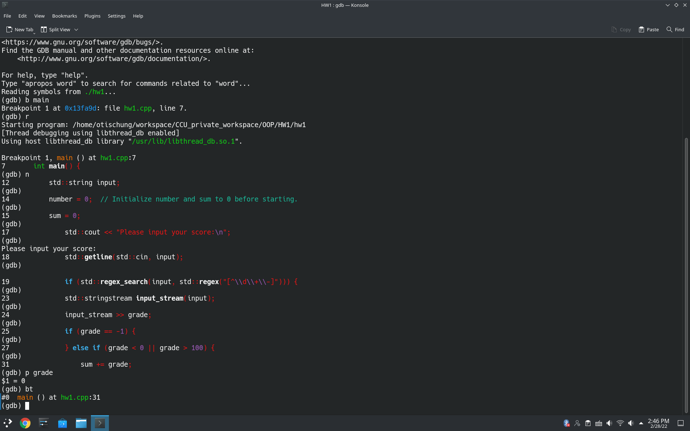
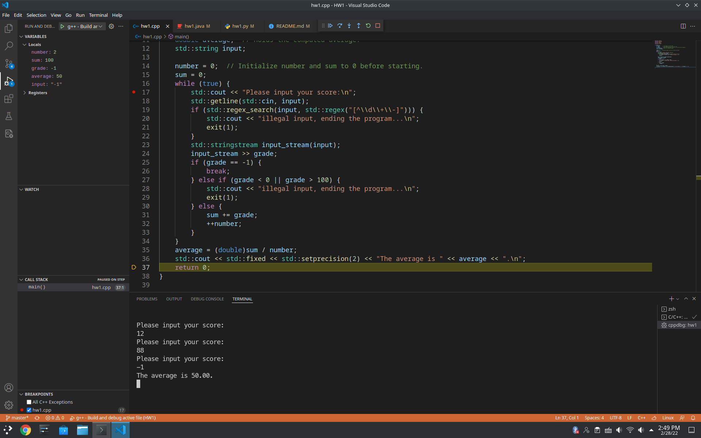
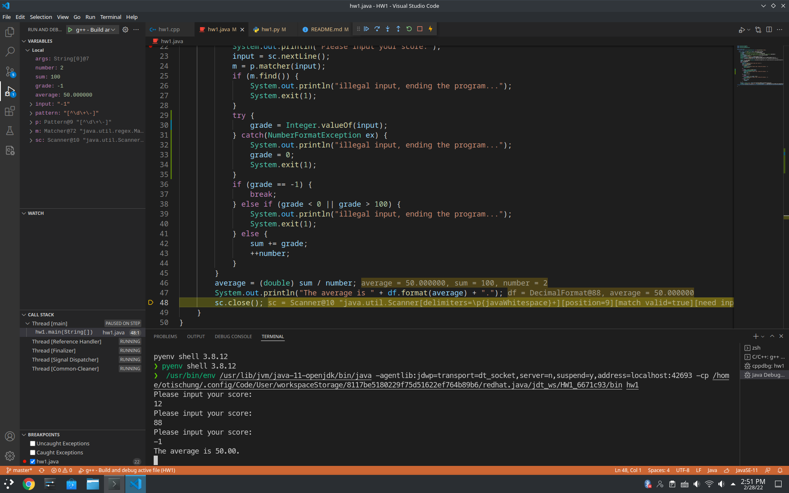
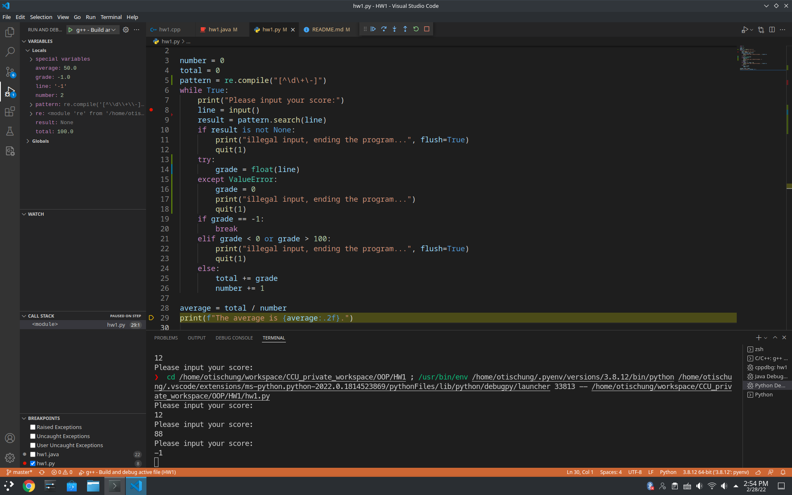

**Object-Oriented Programming Homework 1**

---
## Author Information

Name: 鍾博丞

Student ID: 408410120

E-mail: my072814638@csie.io

## Environment

Operating System: Arch Linux 5.16.10-arch1-1 using KDE plasma

CPU: AMD R9 3900X 12C 24T @ 3.8GHz

RAM: 32GB DDR4 3600MHz (Double channel)

SSD: ADATA SX8200Pro 1TB TLC (Seq. R: 3500MB/s, Seq. W: 3000MB/s, Random R: 390K IOPS, Random W: 380K IOPS)

## Items Implemented

### I/O specification

#### Input:

An integer, -1 means end of the set of scores. Any characters not digits or +, - will be illegal input.

In C++ program, inputs like "1+1", "1-", etc. will use the numbers before first non digits (except the sign). e.g. "12+" is 12, "+12+" is 12, and "++12+" is 0.

In Java and Python program, inputs like "1+1", "1-", etc. will treat as illegal inputs and end the program immediately.

#### Output:

A real number, rounded off to the 2nd decimal place.

### Makefile

By default, `make` compiles both `.cpp` and `.java` files.

## Bonus

### Debugger

Using GDB while writing C++.

Using vscode while writing C++.

Using vscode while writing Java.

Using vscode while writing Python.

## Reference

### Regular Expression (regex)

https://docs.python.org/3/library/re.html

https://ithelp.ithome.com.tw/articles/10197315

https://regex101.com/

