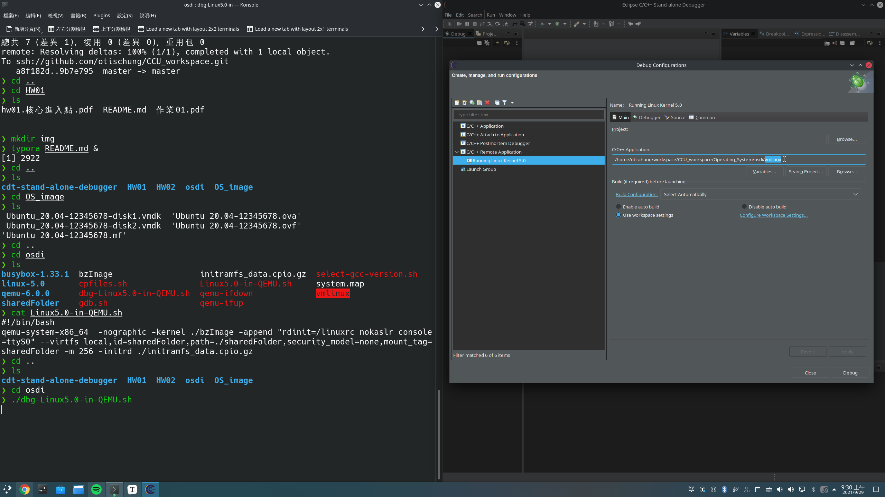
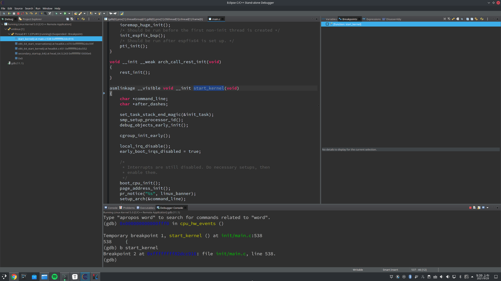
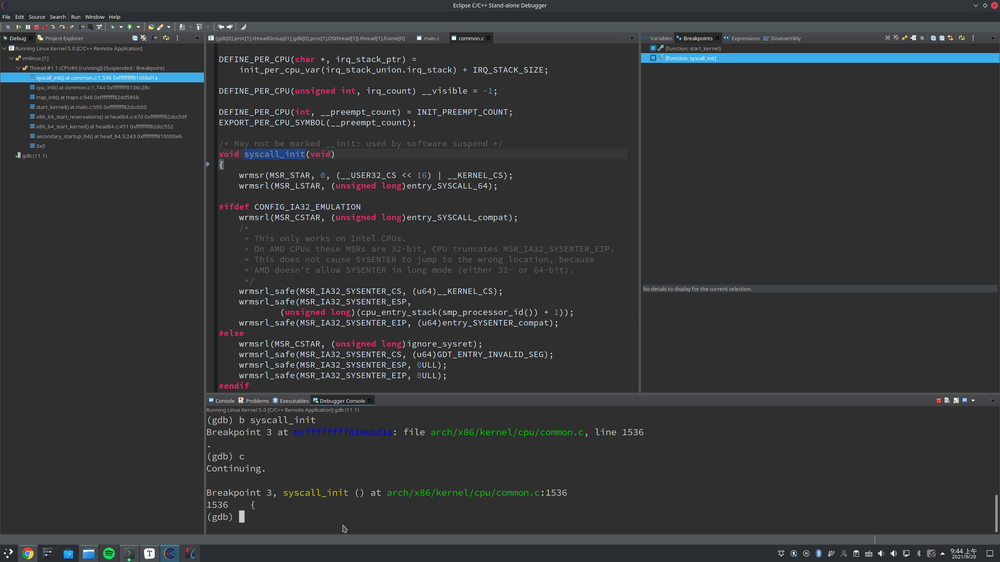
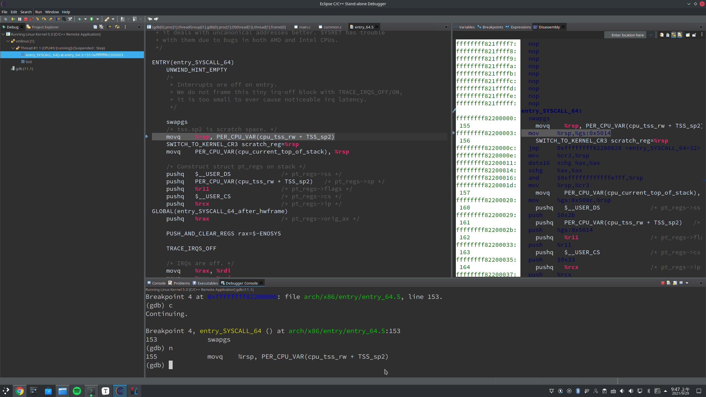
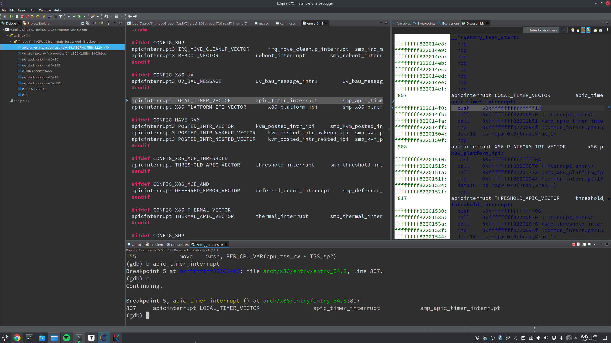
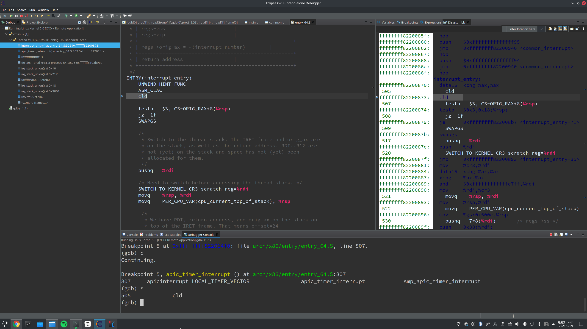
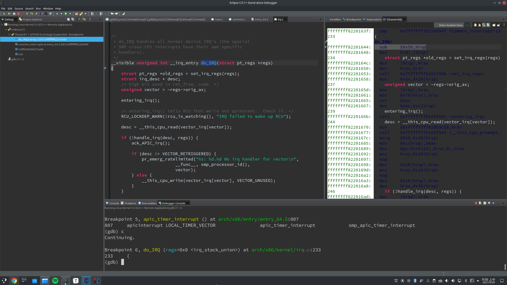
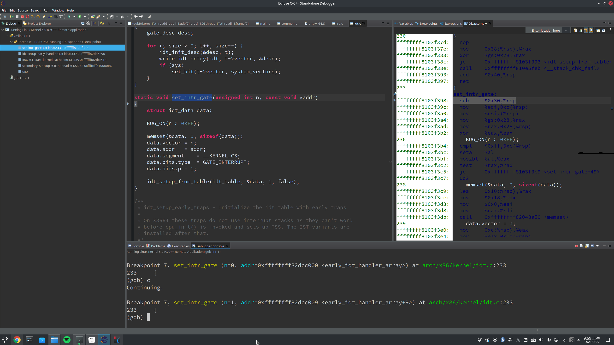

**Operating System Homework 01  資工2B 408410120 鍾博丞**

-----------------------------------------

## 環境配置

Operating System: Arch Linux 5.14.7-arch1-1 using KDE plasma

**CPU: AMD R9 3900X 12C 24T @ 3.8GHz**

RAM: 32GB DDR4 3600MHz (Double channel)

SSD: ADATA SX8200Pro 1TB TLC (Seq. R: 3500MB/s, Seq. W: 3000MB/s, Random R: 451.3K IOPS, Random W: 325.6K IOPS)

## 執行 Linux in QEMU

在 `osdi` 這個資料夾裡面，有一個 `Linux5.0-in-QEMU.sh` 的 shell script，直接執行就可以開機，內容如下

```shell
#!/bin/bash
qemu-system-x86_64  -nographic -kernel ./bzImage -append "rdinit=/linuxrc nokaslr console=ttyS0" --virtfs local,id=sharedFolder,path=./sharedFolder,security_model=none,mount_tag=sharedFolder -m 256 -initrd ./initramfs_data.cpio.gz
```

QEMU 是一個 x86 虛擬機，原本是跑在一個 GUI 上面，`-nographic` 就是不使用 GUI，`-kernel ./bzImage` 表示此 Linux Kernel 是在當前目錄下的 `bzImage` 裡面，`-append "rdinit=/linuxrc nokaslr console=ttyS0"` 是要傳給 Linux Kernel 的，其中 `rdinit=/linuxrc` 是指開機時第一個執行的 user space 的程式是 `linuxrc`，`nokaslr` 是指開機時不要使用 ASLR (Address Space Layout Randomization)，方便我們 debug，`console=ttyS0` 是指 console 要印在 ttys0 這個 serial port，serial port 通常是拿來除錯用的，因為我們使用 QEMU，所以印到 serial port 相當於印在螢幕上，`--virtfs local,id=sharedFolder,path=./sharedFolder,security_model=none,mount_tag=sharedFolder` 就是設定 share folder，`-m 256` 表示虛擬機提供 256MB 的 Memory space，`-initrd ./initramfs_data.cpio.gz` 代表一開始掛載的檔案系統在 `initramfs_data.cpio.gz` 裡面，如果自己解壓縮，可以發現這跟根目錄長得很像

我們可以使用 `cat /proc/version` 或 `uname -a` 得到此 Linux 的版本是 5.0，Distro 是 Running Linux Kernel，這個版本的 Linux 的特色是，它的優化選項是 -O0，也就是沒有進行任何優化。如果有進行優化的話，有些變數 compiler 如果覺得不需要，就不會將它編譯進去，這樣會不利於我們 debug。

在虛擬機有一個 `sharedFolder` (softlink to /mnt/sharedFolder)，在外部 (osdi 資料夾) 也有一個 `sharedFolder`，我們可以在外部寫程式，然後複製進去 `sharedFolder` 裡，就可以使用虛擬機來執行

在 Running Linux Kernel 的 `/lib` 裡面，並沒有任何動態函數庫 (.so file)，例如執行 `printf` 的時候，會需要用到 `libc.so` 的函數庫，此時，我們會需要在編譯時，將動態函數庫複製一份進來，也就是靜態編譯 `--static`

## 除錯 Linux in QEMU

`Linux5.0-in-QEMU.sh` 無法進行 debug，若想 debug，需要執行 `dbg-Linux5.0-in-QEMU.sh`，差別在於最後面多了 `-S -gdb tcp::6666`，即將 serial port (-S) 的訊息，透過 TCP，在 port 6666 上使用 gdb 進行 debug，`tcp::6666` 兩個冒號中間不填入任何 IP address 代表是在 Local host (127.0.0.1) 上執行

執行完之後，會卡住，等待 gdb 連線進來

## 使用 CDT-debugger 除錯 Linux

選擇 Run -> Debug Configurations -> C/C++ Remote Application -> Main，將 `vmlinux` 加入到 debugger 裡面



在 Debugger 裡面，設定 Stop and startup at: start_kernel，可以把 start_kernel 想成 C 語言的 main function，在 Debugger Options -> Connection 裡面，設定 TCP, localhost, port=6666

在 Source -> Path Mapping: New mapping 裡面，新增 /home/shiwulo/osdi 指向自己 osdi 的位置

## 設定中斷點

### start_kernel



### syscall_init


### entry_SYSCALL_64


### apic_timer_interrupt


### interrupt_entry


### do_IRQ


### set_intr_gate

