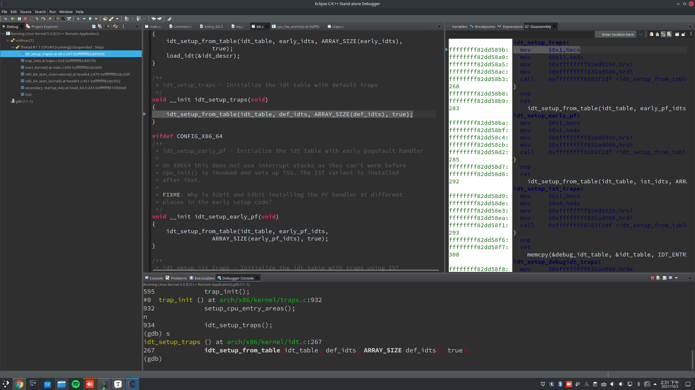

**Operating System Homework 02  資工3B 408410120 鍾博丞**

-----------------------------------------

## 環境配置

Operating System: Arch Linux 5.14.7-arch1-1 using KDE plasma

**CPU: AMD R9 3900X 12C 24T @ 3.8GHz**

RAM: 32GB DDR4 3600MHz (Double channel)

SSD: ADATA SX8200Pro 1TB TLC (Seq. R: 3500MB/s, Seq. W: 3000MB/s, Random R: 451.3K IOPS, Random W: 325.6K IOPS)

## 觀察中斷與中斷向量表

### trap_init


可以發現 `trap_init` 是由 `start_kernel` 所呼叫的，我們看一下 `start_kernel` 裡長什麼樣子


`trap_init` 會出始化中斷向量表 (IVT)，幾乎每個 CPU 都有旗對應的 IVT，例如 [AMD64](https://www.amd.com/system/files/TechDocs/24593.pdf) 所提供的中斷如下

(因為本系統使用 AMD R9 3900X 故使用 AMD64 作舉例)


其中 0 ~ 21 是處理器本身發出的中斷，又稱為 Software interrupt 或 Exception，在 Linux kernel 裡稱為 Trap

我們發現 `tarp_init` 中，有一個 `idt_setup_traps`，會呼叫 `idt_setup_from_table`




Step in 進去可以看到 IVT 的 size = 19


我們反組譯 IVT 裡第一個項目：Integer Divide-By-Zero Exception


### init_IRQ


可以發現 `init_IRQ` 也是由 `start_kernel` 所呼叫的，我們看一下 `start_kernel` 裡長什麼樣子


我們發現在 `irqinit.c` 裡面，有註解這麼一段

> On cpu 0, Assign ISA_IRQ_VECTOR(irq) to IRQ 0..15.
> If these IRQ's are handled by legacy interrupt-controllers like PIC, then this configuration wil likely be static after the boot. If these IRQ's are handled by more mordern controllers like IO-APIC, then this vector space can be freed and re-used dynamically as the irq's migrate etc.

在早期的 x86 處理器，有 0~15 共16 個外部中斷要初始化，以下程式碼就是用來初始化這 16 個中斷的

```c
for (i = 0; i < nr_legacy_irqs(); i++)
	per_cpu(vector_irq, 0)[ISA_IRQ_VECTOR(i)] = irq_to_desc(i);
```

現在的電腦前面也有這些中斷，只是擴充了而已，以下程式碼就是用來初始化新的中斷

```c
x86_init.irqs.intr_init();
```

### native_init_IRQ


從左邊的 call stack，我們可以發現剛剛的 `x86_init.irqs.intr_init` 會呼叫 `native_init_IRQ`

Step in 進去可以看到 IVT 的 nr_legacy_irqs() = 16，證實了有初始化早期的 16 個 IRQs


接著 step in `setup_apic_and_irq_gates`


可以看到 `idt_setup_from_table` 就是用來初始化那 16 個中斷；`set_intr_gate` 就是用來初始化其他新的處理器有的中斷


## 觀察 Serial Port

開始前，先在 gdb 清除所有的 breakpoint

### serial_link_irq_chain


其中有一行如下

```c
ret = request_irq(up->port.irq, serial8250_interrupt,
				  irq_flags, up->port.name, i);
```

request_irq 就是向作業系統註冊中斷，`up->port.irq`  Linux kernel 用組合語言幫我們寫好了，當有中斷發生時，`up->port.irq`  會呼叫用 C 語言寫的 `seral8250_interrupt` 這個函數，就可以啟動我們寫的驅動程式

###  common_interrupt


這裡呼叫了 `interrupt_entry` 與 `do_IRQ` 這兩個函數

`interrupt_entry` 這段組合語言最主要的目的就是把目前的暫存器的內容全部 push 到 stack 裡面


`do_IRQ` 是用 C 語言寫的，do_IRQ handles all normal device IRQ's (the special SMP cross-CPU interrupts have their own specific handlers).


### serial8250_interrupt


值得注意的是，`serial8250_interrupt` 是由 `do_IRQ` 一路呼叫過來的


其中

```c
unsigned vector = ~regs->orig_ax;
```

是指發生中斷時，將中斷向量表裡面的中斷編號記下來，在根據這個編號去找函數指標

### disass irq_entries_start


這裡列的程式碼就是中斷向量表(interrupt vector table 或 interrupt descript table)所指向的程式碼

### *(irq_entries_start+56)


可以看到 ttys0 這個中斷是設定在 0x58 這個位址

接下來，我們可以不斷的輸入「si」(step into next instruction) 直到 `do_IRQ`，觀察作業系統的行為

## 結論

### Linux 如何設定中斷向量

start_kernel -> trap_init -> idt_setup_traps -> idt_setup_from_table

經由上述呼叫過程，將 CPU 內建的中斷處理函數寫入到「中斷向量表」(Interrupt Vector Table)

start_kernel -> init_IRQ -> native_init_IRQ -> setup_apic_and_irq_gates -> set_intr_gate

經由上述呼叫過程，寫入外部中斷

###  Linux 如何從中斷向量的組合語言部分 (Interrupt Service Routine，這裡只討論外部中斷) 跳躍到特定的中斷函數

common_interrupt -> interrupt_entry

```c
/*
 * Interrupt entry helper function.
 *
 * Entry runs with interrupts off. Stack layout at entry:
 * +----------------------------------------------------+
 * | regs->ss						|
 * | regs->rsp						|
 * | regs->eflags					|
 * | regs->cs						|
 * | regs->ip						|
 * +----------------------------------------------------+
 * | regs->orig_ax = ~(interrupt number)		|
 * +----------------------------------------------------+
 * | return address					|
 * +----------------------------------------------------+
 */
```

其中 interrupt_entry 的目的是將所有暫存器 push 到 stack，這部分的重點是『製造堆疊』，堆疊內的資料型態為「pt_regs」,並且將『中斷的「軟體編號」(即「0x58」)』放到 pr_regs 的 orig_ax

其中 do_IRQ 為C語言，這部分的重點是:由於 orig_ax 放的是「中斷的軟體編號」，因此將這個編號作為「中斷向量物件」的索引

這裡節錄一部分 disass irq_entries_start

> irq_entries_start:
> ffffffff82200210:   push    $0x5f
> ffffffff82200212:   jmp     0xffffffff82200940 <common_interrupt>
> ffffffff82200217:   nop     
> ffffffff82200218:   push    $0x5e
> ffffffff8220021a:   jmp     0xffffffff82200940 <common_interrupt>
> ffffffff8220021f:   nop     
> ffffffff82200220:   push    $0x5d
> ffffffff82200222:   jmp     0xffffffff82200940 <common_interrupt>
> ffffffff82200227:   nop     
> ffffffff82200228:   push    $0x5c
> ffffffff8220022a:   jmp     0xffffffff82200940 <common_interrupt>
> ffffffff8220022f:   nop     
> ffffffff82200230:   push    $0x5b
> ffffffff82200232:   jmp     0xffffffff82200940 <common_interrupt>
> ffffffff82200237:   nop     
> ffffffff82200238:   push    $0x5a
> ffffffff8220023a:   jmp     0xffffffff82200940 <common_interrupt>
> ffffffff8220023f:   nop     
> ffffffff82200240:   push    $0x59
> ffffffff82200242:   jmp     0xffffffff82200940 <common_interrupt>
> ffffffff82200247:   nop     
> ffffffff82200248:   push    $0x58
> ffffffff8220024a:   jmp     0xffffffff82200940 <common_interrupt>
> ffffffff8220024f:   nop     
> ffffffff82200250:   push    $0x57
> ffffffff82200252:   jmp     0xffffffff82200940 <common_interrupt>
> ffffffff82200257:   nop     

又由 irq_entries_start+56 得知 serial port 的中斷軟體編號是 0x58

我們可以在虛擬機中輸入以下指令

```bash
cat /proc/interrupts
```

  得到以下輸出


Serial port (ttyS0) 是第 4 號外部中斷，被註冊到 0x58
