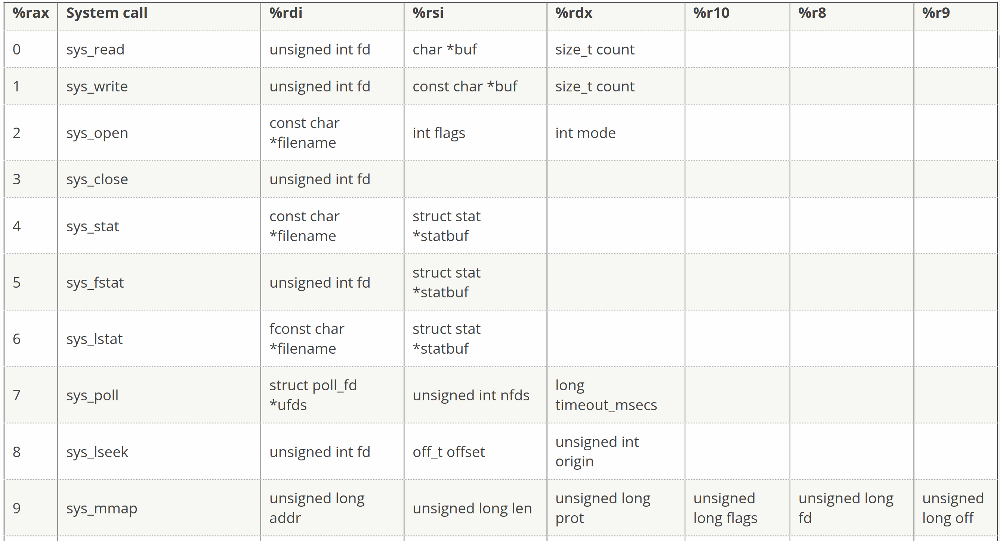

**Operating System Homework 04  資工3B 408410120 鍾博丞**

-----------------------------------------

## 環境配置

Operating System: Arch Linux 5.14.7-arch1-1 using KDE plasma

**CPU: AMD R9 3900X 12C 24T @ 3.8GHz**

RAM: 32GB DDR4 3600MHz (Double channel)

SSD: ADATA SX8200Pro 1TB TLC (Seq. R: 3500MB/s, Seq. W: 3000MB/s, Random R: 451.3K IOPS, Random W: 325.6K IOPS)

## 組合語言的意義

在 [Linux System Call Table](https://blog.rchapman.org/posts/Linux_System_Call_Table_for_x86_64/) 中有提到，read() 這個 system call 是第 0 號，要放在 rax 裡面，file discriptor 要放在 rdi 裡面，指標要放在 rsi 裡面，大小要放在 rdx 裡面，依序填入，最後呼叫 syscall 即可



```c
#include <stdio.h>
#include <string.h>
#include <unistd.h>
int main(int argc, char** argv) {
    char c;
    char *p = &c;

    asm volatile (
        "mov $0, %%rax\n"
        "mov $0, %%rdi\n"
        "mov %0, %%rsi\n"
        "mov $1, %%rdx\n"
        "syscall\n"
        : 
        : "m" (p)
        : "rax", "rdi", "rsi", "rdx"
    );

    printf("你輸入的字元是 '%c'\n", c);
    return 0;
}
```

我們反組譯，節錄一段程式碼

```assembly
#APP
# 8 "stdin_read.c" 1
	mov $0, %rax
	mov $0, %rdi
	mov -16(%rbp), %rsi
	mov $1, %rdx
	syscall
```

我們發現他把變數位置變成 rbp 的偏移位置了

---

最後的壓縮指令

`tar jcvf filename.tar.bz2 target`

