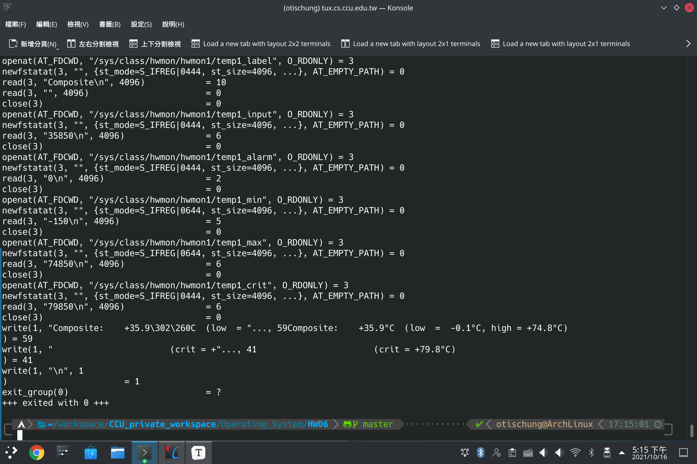
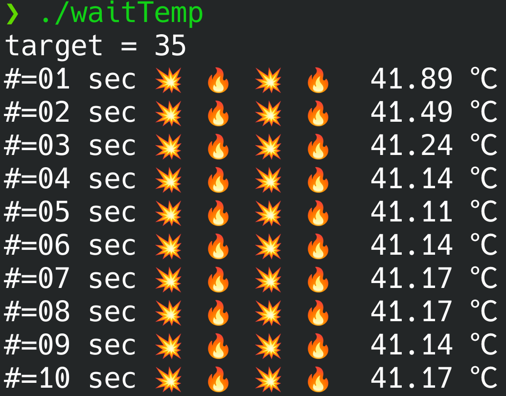

**Operating System Homework 06  資工3B 408410120 鍾博丞**

-----------------------------------------

## 環境配置

Operating System: Arch Linux 5.14.7-arch1-1 using KDE plasma

**CPU: AMD R9 3900X 12C 24T @ 3.8GHz**

RAM: 32GB DDR4 3600MHz (Double channel)

SSD: ADATA SX8200Pro 1TB TLC (Seq. R: 3500MB/s, Seq. W: 3000MB/s, Random R: 451.3K IOPS, Random W: 325.6K IOPS)

## 觀察 sensors

`strace sensors`

這樣就可以得到個別 CPU 最高溫度溫度，進而求出平均溫度了。

---

最後的壓縮指令

`tar jcvf filename.tar.bz2 target`

