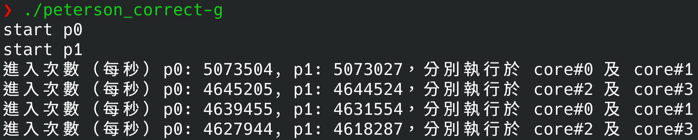

**Operating System Homework 07  資工3B 408410120 鍾博丞**

-----------------------------------------

## 環境配置

Operating System: Arch Linux 5.14.11-arch1-1 using KDE plasma

CPU: Intel(R) Core(TM) i5-7300U CPU @ 2.60GHz

RAM: 4GB DDR4 

SSD: 128G

## Peterson's Solution

`./peterson_trival-g`

`./peterson_trival-O3`

`./peterson_correct-g`

`./peterson_correct-O3`

我們可以發現，`./peterson_trival-g` 與 `./peterson_trival-O3` 都是錯的，因為雙方在設定讓先時 `turn = 0 || turn = 1`，可能會同時動到，導致結果不正確

`./peterson_trival-g` 的速度比 `./peterson_correct-O3` 快，因為要正確執行需要使用 atomic operation，限制編譯器的優化，trivial 是快的，但是執行結果是錯的。
