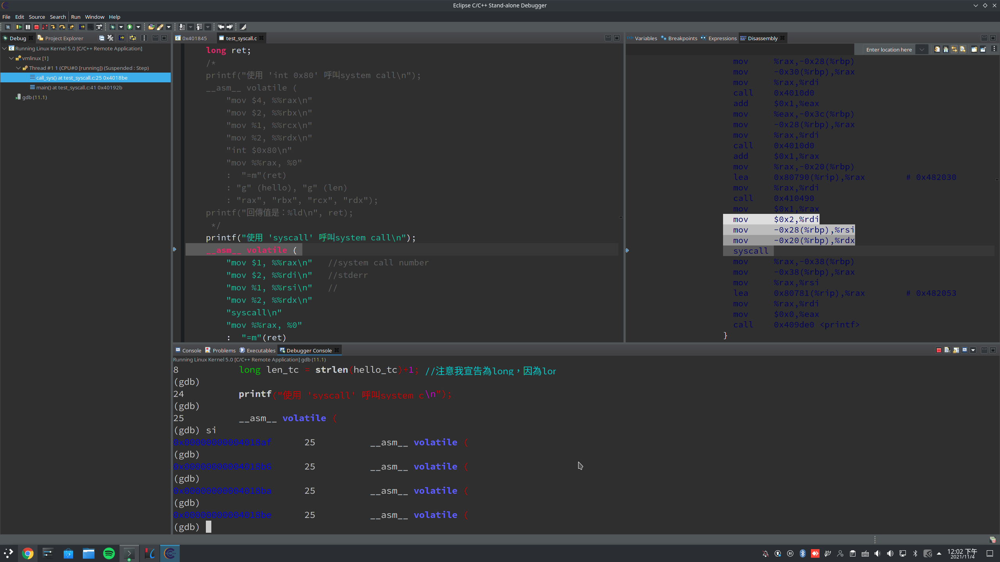
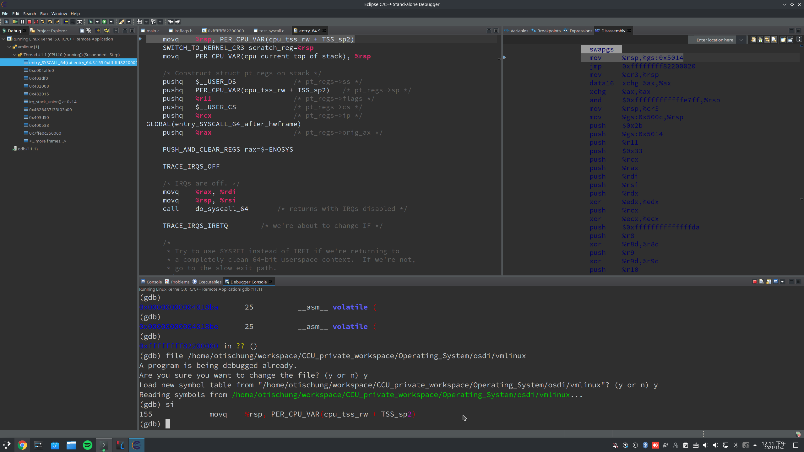

**Operating System Homework 08  資工3B 408410120 鍾博丞**

-----------------------------------------

## 環境配置

Operating System: Arch Linux 5.14.15-arch1-1 using KDE plasma

**CPU: AMD R9 3900X 12C 24T @ 3.8GHz**

RAM: 32GB DDR4 3600MHz (Double channel)

SSD: ADATA SX8200Pro 1TB TLC (Seq. R: 3500MB/s, Seq. W: 3000MB/s, Random R: 451.3K IOPS, Random W: 325.6K IOPS)

## 觀察 user 的程式呼叫 system call

先將 user 的程式放入 `shared_folder` 中，進行靜態編譯，然後進入 debug mode 的虛擬機開啟他，開啟後，程式會印出 `call_sys()` 的位址，在 gdb 中，輸入 `b *(印出來的位址)`，然後回到虛擬機按下 enter 讓他繼續執行，gdb 就會 break 在函數進入點，這時我們輸入

```bash
(gdb) file <location/to/test_syscall>
```

然後使用 n, si 到準備進入 syscall 之前



再按下 si，再輸入

```bash
(gdb) file <location/to/osdi/vmlinux>
```

再按下 si，就能回到 kernel 進行 debug



在 `entry_64.S` 裡面，有一個

```assembly
call do_syscall_64
```

我們 si 進入，會到 `common.c` 裡面

```c
__visible void do_syscall_64(unsigned long nr, struct pt_regs *regs)
{
	struct thread_info *ti;

	enter_from_user_mode();
	local_irq_enable();
	ti = current_thread_info();
	if (READ_ONCE(ti->flags) & _TIF_WORK_SYSCALL_ENTRY)
		nr = syscall_trace_enter(regs);

	/*
	 * NB: Native and x32 syscalls are dispatched from the same
	 * table.  The only functional difference is the x32 bit in
	 * regs->orig_ax, which changes the behavior of some syscalls.
	 */
	nr &= __SYSCALL_MASK;
	if (likely(nr < NR_syscalls)) {
		nr = array_index_nospec(nr, NR_syscalls);
		regs->ax = sys_call_table[nr](regs);
	}

	syscall_return_slowpath(regs);
}
```

在第 9 行裡，我們看到程式將傳進來的 regs 放入 nr 裡面，在第 19 行裡面，將查完 sys_call_table 的結果放入 rax 暫存器裡面，這樣就完成放置 system call 的第一個變數了

---

step in 進去第 19 行，可以在 read_write.c 裡面看到

```c
SYSCALL_DEFINE3(write, unsigned int, fd, const char __user *, buf, size_t, count)
{
	return ksys_write(fd, buf, count);
}
```

進入 ksys_write，可以看到

```c
ssize_t ksys_write(unsigned int fd, const char __user *buf, size_t count)
{
	struct fd f = fdget_pos(fd);
	ssize_t ret = -EBADF;

	if (f.file) {
		loff_t pos = file_pos_read(f.file);
		ret = vfs_write(f.file, buf, count, &pos);
		if (ret >= 0)
			file_pos_write(f.file, pos);
		fdput_pos(f);
	}

	return ret;
}
```

此時傳入的參數為

`ksys_write (fd=2, buf=0x482015 "全世界，你好\n", count=20) at fs/read_write.c:592`

我們看一下第 8 行的 vfs_write

```c
ssize_t vfs_write(struct file *file, const char __user *buf, size_t count, loff_t *pos)
{
	ssize_t ret;

	if (!(file->f_mode & FMODE_WRITE))
		return -EBADF;
	if (!(file->f_mode & FMODE_CAN_WRITE))
		return -EINVAL;
	if (unlikely(!access_ok(buf, count)))
		return -EFAULT;

	ret = rw_verify_area(WRITE, file, pos, count);
	if (!ret) {
		if (count > MAX_RW_COUNT)
			count =  MAX_RW_COUNT;
		file_start_write(file);
		ret = __vfs_write(file, buf, count, pos);
		if (ret > 0) {
			fsnotify_modify(file);
			add_wchar(current, ret);
		}
		inc_syscw(current);
		file_end_write(file);
	}

	return ret;
}
```

我們看一下第 17 行的 __vfs_write

```c
ssize_t __vfs_write(struct file *file, const char __user *p, size_t count,
		    loff_t *pos)
{
	if (file->f_op->write)
		return file->f_op->write(file, p, count, pos);
	else if (file->f_op->write_iter)
		return new_sync_write(file, p, count, pos);
	else
		return -EINVAL;
}
```

return 後，我們也看一下第 23 行的 file_end_write

```c
static inline void file_end_write(struct file *file)
{
	if (!S_ISREG(file_inode(file)->i_mode))
		return;
	__sb_end_write(file_inode(file)->i_sb, SB_FREEZE_WRITE);
}
```

write 也就差不多執行完畢了


---

我的 gdb 切換檔案的備註

```c
file /home/otischung/workspace/CCU_private_workspace/Operating_System/osdi/sharedFolder/hw08-user_to_kernel/test_syscall
file /home/otischung/workspace/CCU_private_workspace/Operating_System/osdi/vmlinux
```

