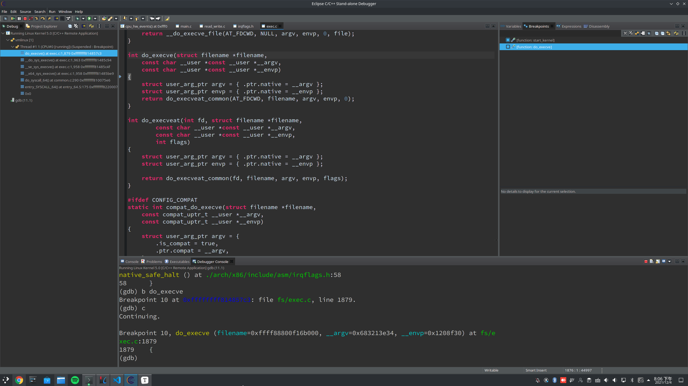

**Operating System Homework 08  資工3B 408410120 鍾博丞**

-----------------------------------------

## 環境配置

Operating System: Arch Linux 5.14.15-arch1-1 using KDE plasma

**CPU: AMD R9 3900X 12C 24T @ 3.8GHz**

RAM: 32GB DDR4 3600MHz (Double channel)

SSD: ADATA SX8200Pro 1TB TLC (Seq. R: 3500MB/s, Seq. W: 3000MB/s, Random R: 451.3K IOPS, Random W: 325.6K IOPS)

## 撰寫程式碼稱之為 myls,在程式碼中使用 execve 系列的任何 libc 函數,載入新的執行檔案(ls)

因程式碼過於簡單，故僅附上程式碼

`myls.c`

```c
#include <unistd.h>

int main() {
    char *const lsargv[] = {"/usr/bin/ls", "-lash", NULL};
    execvp(lsargv[0], lsargv);
}
```

`Makefile`

```makefile
CC?=gcc-11
CFLAGS=-g --static

all: myls

myls: ./myls.c
	${CC} ${CFLAGS} myls.c -o myls

clean: 
	rm myls
```


## 請問作業系統如何載入執行檔案?附上程式碼的截圖,並約略說明

我們先將中斷點設定在 `do_execve`



在 `exec.c` 得到以下程式碼

```c
int do_execve(struct filename *filename, const char __user *const __user *__argv, const char __user *const __user *__envp) {
	struct user_arg_ptr argv = { .ptr.native = __argv };
	struct user_arg_ptr envp = { .ptr.native = __envp };
	return do_execveat_common(AT_FDCWD, filename, argv, envp, 0);
}
```

我們看一下第 4 行的 `do_execveat_common`


在 `exec.c` 得到以下程式碼

```c
static int do_execveat_common(int fd, struct filename *filename, struct user_arg_ptr argv, struct user_arg_ptr envp, int flags) {
	return __do_execve_file(fd, filename, argv, envp, flags, NULL);
}
```

我們看一下第 4 行的 `__do_execve_file`


在 `exec.c` 得到以下程式碼

```c
static int __do_execve_file(int fd, struct filename *filename,
			    struct user_arg_ptr argv,
			    struct user_arg_ptr envp,
			    int flags, struct file *file)
{
	char *pathbuf = NULL;
	struct linux_binprm *bprm;
	struct files_struct *displaced;
	int retval;

	if (IS_ERR(filename))
		return PTR_ERR(filename);

	/*
	 * We move the actual failure in case of RLIMIT_NPROC excess from
	 * set*uid() to execve() because too many poorly written programs
	 * don't check setuid() return code.  Here we additionally recheck
	 * whether NPROC limit is still exceeded.
	 */
	if ((current->flags & PF_NPROC_EXCEEDED) &&
	    atomic_read(&current_user()->processes) > rlimit(RLIMIT_NPROC)) {
		retval = -EAGAIN;
		goto out_ret;
	}

	/* We're below the limit (still or again), so we don't want to make
	 * further execve() calls fail. */
	current->flags &= ~PF_NPROC_EXCEEDED;

	retval = unshare_files(&displaced);
	if (retval)
		goto out_ret;

	retval = -ENOMEM;
	bprm = kzalloc(sizeof(*bprm), GFP_KERNEL);
	if (!bprm)
		goto out_files;

	retval = prepare_bprm_creds(bprm);
	if (retval)
		goto out_free;

	check_unsafe_exec(bprm);
	current->in_execve = 1;

	if (!file)
		file = do_open_execat(fd, filename, flags);
	retval = PTR_ERR(file);
	if (IS_ERR(file))
		goto out_unmark;

	sched_exec();

	bprm->file = file;
	if (!filename) {
		bprm->filename = "none";
	} else if (fd == AT_FDCWD || filename->name[0] == '/') {
		bprm->filename = filename->name;
	} else {
		if (filename->name[0] == '\0')
			pathbuf = kasprintf(GFP_KERNEL, "/dev/fd/%d", fd);
		else
			pathbuf = kasprintf(GFP_KERNEL, "/dev/fd/%d/%s",
					    fd, filename->name);
		if (!pathbuf) {
			retval = -ENOMEM;
			goto out_unmark;
		}
		/*
		 * Record that a name derived from an O_CLOEXEC fd will be
		 * inaccessible after exec. Relies on having exclusive access to
		 * current->files (due to unshare_files above).
		 */
		if (close_on_exec(fd, rcu_dereference_raw(current->files->fdt)))
			bprm->interp_flags |= BINPRM_FLAGS_PATH_INACCESSIBLE;
		bprm->filename = pathbuf;
	}
	bprm->interp = bprm->filename;

	retval = bprm_mm_init(bprm);
	if (retval)
		goto out_unmark;

	retval = prepare_arg_pages(bprm, argv, envp);
	if (retval < 0)
		goto out;

	retval = prepare_binprm(bprm);
	if (retval < 0)
		goto out;

	retval = copy_strings_kernel(1, &bprm->filename, bprm);
	if (retval < 0)
		goto out;

	bprm->exec = bprm->p;
	retval = copy_strings(bprm->envc, envp, bprm);
	if (retval < 0)
		goto out;

	retval = copy_strings(bprm->argc, argv, bprm);
	if (retval < 0)
		goto out;

	would_dump(bprm, bprm->file);

	retval = exec_binprm(bprm);
	if (retval < 0)
		goto out;

	/* execve succeeded */
	current->fs->in_exec = 0;
	current->in_execve = 0;
	membarrier_execve(current);
	rseq_execve(current);
	acct_update_integrals(current);
	task_numa_free(current);
	free_bprm(bprm);
	kfree(pathbuf);
	if (filename)
		putname(filename);
	if (displaced)
		put_files_struct(displaced);
	return retval;

out:
	if (bprm->mm) {
		acct_arg_size(bprm, 0);
		mmput(bprm->mm);
	}

out_unmark:
	current->fs->in_exec = 0;
	current->in_execve = 0;

out_free:
	free_bprm(bprm);
	kfree(pathbuf);

out_files:
	if (displaced)
		reset_files_struct(displaced);
out_ret:
	if (filename)
		putname(filename);
	return retval;
}
```

我們看一下第 88 行的 `prepare_binprm`


在 `exec.c` 得到以下程式碼

```c
/*
 * Fill the binprm structure from the inode.
 * Check permissions, then read the first 128 (BINPRM_BUF_SIZE) bytes
 *
 * This may be called multiple times for binary chains (scripts for example).
 */
int prepare_binprm(struct linux_binprm *bprm) {
	int retval;
	loff_t pos = 0;

	bprm_fill_uid(bprm);

	/* fill in binprm security blob */
	retval = security_bprm_set_creds(bprm);
	if (retval)
		return retval;
	bprm->called_set_creds = 1;

	memset(bprm->buf, 0, BINPRM_BUF_SIZE);
	return kernel_read(bprm->file, bprm->buf, BINPRM_BUF_SIZE, &pos);
}
```

上網查一下這個 binprm 是什麼

```c
/*
* This structure is used to hold the arguments that are used when loading binaries.
*/
struct linux_binprm{
        char buf[BINPRM_BUF_SIZE];
#ifdef CONFIG_MMU
        struct vm_area_struct *vma;
        unsigned long vma_pages;
#else
# define MAX_ARG_PAGES  32
        struct page *page[MAX_ARG_PAGES];
#endif
        struct mm_struct *mm;
        unsigned long p; /* current top of mem */
        unsigned int
                cred_prepared:1,/* true if creds already prepared (multiple
                                 * preps happen for interpreters) */
                cap_effective:1;/* true if has elevated effective capabilities,
                                 * false if not; except for init which inherits
                                 * its parent's caps anyway */
#ifdef __alpha__
        unsigned int taso:1;
#endif
        unsigned int recursion_depth;
        struct file * file;
        struct cred *cred;      /* new credentials */
        int unsafe;             /* how unsafe this exec is (mask of LSM_UNSAFE_*) */
        unsigned int per_clear; /* bits to clear in current->personality */
        int argc, envc;
        const char * filename;  /* Name of binary as seen by procps */
        const char * interp;    /* Name of the binary really executed. Most
                                   of the time same as filename, but could be
                                   different for binfmt_{misc,script} */
        unsigned interp_flags;
        unsigned interp_data;
        unsigned long loader, exec;
};
```

看來只是準備 `execve` 的東西而已

---

再看一下 `__do_execve_file` 第 107 行 `exec_binprm` 是什麼


在 `exec.c` 得到以下程式碼

```c
static int exec_binprm(struct linux_binprm *bprm) {
	pid_t old_pid, old_vpid;
	int ret;

	/* Need to fetch pid before load_binary changes it */
	old_pid = current->pid;
	rcu_read_lock();
	old_vpid = task_pid_nr_ns(current, task_active_pid_ns(current->parent));
	rcu_read_unlock();

	ret = search_binary_handler(bprm);
	if (ret >= 0) {
		audit_bprm(bprm);
		trace_sched_process_exec(current, old_pid, bprm);
		ptrace_event(PTRACE_EVENT_EXEC, old_vpid);
		proc_exec_connector(current);
	}

	return ret;
}
```

我們看一下第 11 行 `search_binary_handler` 在做什麼


在 `exec.c` 得到以下程式碼

```c
/*
 * cycle the list of binary formats handler, until one recognizes the image
 */
int search_binary_handler(struct linux_binprm *bprm)
{
	bool need_retry = IS_ENABLED(CONFIG_MODULES);
	struct linux_binfmt *fmt;
	int retval;

	/* This allows 4 levels of binfmt rewrites before failing hard. */
	if (bprm->recursion_depth > 5)
		return -ELOOP;

	retval = security_bprm_check(bprm);
	if (retval)
		return retval;

	retval = -ENOENT;
 retry:
	read_lock(&binfmt_lock);
	list_for_each_entry(fmt, &formats, lh) {
		if (!try_module_get(fmt->module))
			continue;
		read_unlock(&binfmt_lock);
		bprm->recursion_depth++;
		retval = fmt->load_binary(bprm);
		read_lock(&binfmt_lock);
		put_binfmt(fmt);
		bprm->recursion_depth--;
		if (retval < 0 && !bprm->mm) {
			/* we got to flush_old_exec() and failed after it */
			read_unlock(&binfmt_lock);
			force_sigsegv(SIGSEGV, current);
			return retval;
		}
		if (retval != -ENOEXEC || !bprm->file) {
			read_unlock(&binfmt_lock);
			return retval;
		}
	}
	read_unlock(&binfmt_lock);

	if (need_retry) {
		if (printable(bprm->buf[0]) && printable(bprm->buf[1]) &&
		    printable(bprm->buf[2]) && printable(bprm->buf[3]))
			return retval;
		if (request_module("binfmt-%04x", *(ushort *)(bprm->buf + 2)) < 0)
			return retval;
		need_retry = false;
		goto retry;
	}

	return retval;
}
EXPORT_SYMBOL(search_binary_handler);
```

我們看一下第 26 行 `load_binary`


在 `binfmt_misc.c` 得到以下程式碼

```c
/*
 * the loader itself
 */
static int load_misc_binary(struct linux_binprm *bprm)
{
	Node *fmt;
	struct file *interp_file = NULL;
	int retval;
	int fd_binary = -1;

	retval = -ENOEXEC;
	if (!enabled)
		return retval;

	/* to keep locking time low, we copy the interpreter string */
	read_lock(&entries_lock);
	fmt = check_file(bprm);
	if (fmt)
		dget(fmt->dentry);
	read_unlock(&entries_lock);
	if (!fmt)
		return retval;

	/* Need to be able to load the file after exec */
	retval = -ENOENT;
	if (bprm->interp_flags & BINPRM_FLAGS_PATH_INACCESSIBLE)
		goto ret;

	if (!(fmt->flags & MISC_FMT_PRESERVE_ARGV0)) {
		retval = remove_arg_zero(bprm);
		if (retval)
			goto ret;
	}

	if (fmt->flags & MISC_FMT_OPEN_BINARY) {

		/* if the binary should be opened on behalf of the
		 * interpreter than keep it open and assign descriptor
		 * to it
		 */
		fd_binary = get_unused_fd_flags(0);
		if (fd_binary < 0) {
			retval = fd_binary;
			goto ret;
		}
		fd_install(fd_binary, bprm->file);

		/* if the binary is not readable than enforce mm->dumpable=0
		   regardless of the interpreter's permissions */
		would_dump(bprm, bprm->file);

		allow_write_access(bprm->file);
		bprm->file = NULL;

		/* mark the bprm that fd should be passed to interp */
		bprm->interp_flags |= BINPRM_FLAGS_EXECFD;
		bprm->interp_data = fd_binary;

	} else {
		allow_write_access(bprm->file);
		fput(bprm->file);
		bprm->file = NULL;
	}
	/* make argv[1] be the path to the binary */
	retval = copy_strings_kernel(1, &bprm->interp, bprm);
	if (retval < 0)
		goto error;
	bprm->argc++;

	/* add the interp as argv[0] */
	retval = copy_strings_kernel(1, &fmt->interpreter, bprm);
	if (retval < 0)
		goto error;
	bprm->argc++;

	/* Update interp in case binfmt_script needs it. */
	retval = bprm_change_interp(fmt->interpreter, bprm);
	if (retval < 0)
		goto error;

	if (fmt->flags & MISC_FMT_OPEN_FILE) {
		interp_file = file_clone_open(fmt->interp_file);
		if (!IS_ERR(interp_file))
			deny_write_access(interp_file);
	} else {
		interp_file = open_exec(fmt->interpreter);
	}
	retval = PTR_ERR(interp_file);
	if (IS_ERR(interp_file))
		goto error;

	bprm->file = interp_file;
	if (fmt->flags & MISC_FMT_CREDENTIALS) {
		loff_t pos = 0;

		/*
		 * No need to call prepare_binprm(), it's already been
		 * done.  bprm->buf is stale, update from interp_file.
		 */
		memset(bprm->buf, 0, BINPRM_BUF_SIZE);
		retval = kernel_read(bprm->file, bprm->buf, BINPRM_BUF_SIZE,
				&pos);
	} else
		retval = prepare_binprm(bprm);

	if (retval < 0)
		goto error;

	retval = search_binary_handler(bprm);
	if (retval < 0)
		goto error;

ret:
	dput(fmt->dentry);
	return retval;
error:
	if (fd_binary > 0)
		ksys_close(fd_binary);
	bprm->interp_flags = 0;
	bprm->interp_data = 0;
	goto ret;
}
```

在這之後，`need_retry` 會被設定成 1，所以會一直回到 retry，**直到需要寫 ELF 標頭檔案**，這時 `load_binary` 會跳到 `load_elf_binary` (在 `binfmt_elf.c`)

```c
static int load_elf_binary(struct linux_binprm *bprm)
{
	struct file *interpreter = NULL; /* to shut gcc up */
 	unsigned long load_addr = 0, load_bias = 0;
	int load_addr_set = 0;
	char * elf_interpreter = NULL;
	unsigned long error;
	struct elf_phdr *elf_ppnt, *elf_phdata, *interp_elf_phdata = NULL;
	unsigned long elf_bss, elf_brk;
	int bss_prot = 0;
	int retval, i;
	unsigned long elf_entry;
	unsigned long interp_load_addr = 0;
	unsigned long start_code, end_code, start_data, end_data;
	unsigned long reloc_func_desc __maybe_unused = 0;
	int executable_stack = EXSTACK_DEFAULT;
	struct pt_regs *regs = current_pt_regs();
	struct {
		struct elfhdr elf_ex;
		struct elfhdr interp_elf_ex;
	} *loc;
	struct arch_elf_state arch_state = INIT_ARCH_ELF_STATE;
	loff_t pos;

	loc = kmalloc(sizeof(*loc), GFP_KERNEL);
	if (!loc) {
		retval = -ENOMEM;
		goto out_ret;
	}
	
	/* Get the exec-header */
	loc->elf_ex = *((struct elfhdr *)bprm->buf);

	retval = -ENOEXEC;
	/* First of all, some simple consistency checks */
	if (memcmp(loc->elf_ex.e_ident, ELFMAG, SELFMAG) != 0)
		goto out;

	if (loc->elf_ex.e_type != ET_EXEC && loc->elf_ex.e_type != ET_DYN)
		goto out;
	if (!elf_check_arch(&loc->elf_ex))
		goto out;
	if (elf_check_fdpic(&loc->elf_ex))
		goto out;
	if (!bprm->file->f_op->mmap)
		goto out;

	elf_phdata = load_elf_phdrs(&loc->elf_ex, bprm->file);
	if (!elf_phdata)
		goto out;

	elf_ppnt = elf_phdata;
	elf_bss = 0;
	elf_brk = 0;

	start_code = ~0UL;
	end_code = 0;
	start_data = 0;
	end_data = 0;

	for (i = 0; i < loc->elf_ex.e_phnum; i++) {
		if (elf_ppnt->p_type == PT_INTERP) {
			/* This is the program interpreter used for
			 * shared libraries - for now assume that this
			 * is an a.out format binary
			 */
			retval = -ENOEXEC;
			if (elf_ppnt->p_filesz > PATH_MAX || 
			    elf_ppnt->p_filesz < 2)
				goto out_free_ph;

			retval = -ENOMEM;
			elf_interpreter = kmalloc(elf_ppnt->p_filesz,
						  GFP_KERNEL);
			if (!elf_interpreter)
				goto out_free_ph;

			pos = elf_ppnt->p_offset;
			retval = kernel_read(bprm->file, elf_interpreter,
					     elf_ppnt->p_filesz, &pos);
			if (retval != elf_ppnt->p_filesz) {
				if (retval >= 0)
					retval = -EIO;
				goto out_free_interp;
			}
			/* make sure path is NULL terminated */
			retval = -ENOEXEC;
			if (elf_interpreter[elf_ppnt->p_filesz - 1] != '\0')
				goto out_free_interp;

			interpreter = open_exec(elf_interpreter);
			retval = PTR_ERR(interpreter);
			if (IS_ERR(interpreter))
				goto out_free_interp;

			/*
			 * If the binary is not readable then enforce
			 * mm->dumpable = 0 regardless of the interpreter's
			 * permissions.
			 */
			would_dump(bprm, interpreter);

			/* Get the exec headers */
			pos = 0;
			retval = kernel_read(interpreter, &loc->interp_elf_ex,
					     sizeof(loc->interp_elf_ex), &pos);
			if (retval != sizeof(loc->interp_elf_ex)) {
				if (retval >= 0)
					retval = -EIO;
				goto out_free_dentry;
			}

			break;
		}
		elf_ppnt++;
	}

	elf_ppnt = elf_phdata;
	for (i = 0; i < loc->elf_ex.e_phnum; i++, elf_ppnt++)
		switch (elf_ppnt->p_type) {
		case PT_GNU_STACK:
			if (elf_ppnt->p_flags & PF_X)
				executable_stack = EXSTACK_ENABLE_X;
			else
				executable_stack = EXSTACK_DISABLE_X;
			break;

		case PT_LOPROC ... PT_HIPROC:
			retval = arch_elf_pt_proc(&loc->elf_ex, elf_ppnt,
						  bprm->file, false,
						  &arch_state);
			if (retval)
				goto out_free_dentry;
			break;
		}

	/* Some simple consistency checks for the interpreter */
	if (elf_interpreter) {
		retval = -ELIBBAD;
		/* Not an ELF interpreter */
		if (memcmp(loc->interp_elf_ex.e_ident, ELFMAG, SELFMAG) != 0)
			goto out_free_dentry;
		/* Verify the interpreter has a valid arch */
		if (!elf_check_arch(&loc->interp_elf_ex) ||
		    elf_check_fdpic(&loc->interp_elf_ex))
			goto out_free_dentry;

		/* Load the interpreter program headers */
		interp_elf_phdata = load_elf_phdrs(&loc->interp_elf_ex,
						   interpreter);
		if (!interp_elf_phdata)
			goto out_free_dentry;

		/* Pass PT_LOPROC..PT_HIPROC headers to arch code */
		elf_ppnt = interp_elf_phdata;
		for (i = 0; i < loc->interp_elf_ex.e_phnum; i++, elf_ppnt++)
			switch (elf_ppnt->p_type) {
			case PT_LOPROC ... PT_HIPROC:
				retval = arch_elf_pt_proc(&loc->interp_elf_ex,
							  elf_ppnt, interpreter,
							  true, &arch_state);
				if (retval)
					goto out_free_dentry;
				break;
			}
	}

	/*
	 * Allow arch code to reject the ELF at this point, whilst it's
	 * still possible to return an error to the code that invoked
	 * the exec syscall.
	 */
	retval = arch_check_elf(&loc->elf_ex,
				!!interpreter, &loc->interp_elf_ex,
				&arch_state);
	if (retval)
		goto out_free_dentry;

	/* Flush all traces of the currently running executable */
	retval = flush_old_exec(bprm);
	if (retval)
		goto out_free_dentry;

	/* Do this immediately, since STACK_TOP as used in setup_arg_pages
	   may depend on the personality.  */
	SET_PERSONALITY2(loc->elf_ex, &arch_state);
	if (elf_read_implies_exec(loc->elf_ex, executable_stack))
		current->personality |= READ_IMPLIES_EXEC;

	if (!(current->personality & ADDR_NO_RANDOMIZE) && randomize_va_space)
		current->flags |= PF_RANDOMIZE;

	setup_new_exec(bprm);
	install_exec_creds(bprm);

	/* Do this so that we can load the interpreter, if need be.  We will
	   change some of these later */
	retval = setup_arg_pages(bprm, randomize_stack_top(STACK_TOP),
				 executable_stack);
	if (retval < 0)
		goto out_free_dentry;
	
	current->mm->start_stack = bprm->p;

	/* Now we do a little grungy work by mmapping the ELF image into
	   the correct location in memory. */
	for(i = 0, elf_ppnt = elf_phdata;
	    i < loc->elf_ex.e_phnum; i++, elf_ppnt++) {
		int elf_prot = 0, elf_flags, elf_fixed = MAP_FIXED_NOREPLACE;
		unsigned long k, vaddr;
		unsigned long total_size = 0;

		if (elf_ppnt->p_type != PT_LOAD)
			continue;

		if (unlikely (elf_brk > elf_bss)) {
			unsigned long nbyte;
	            
			/* There was a PT_LOAD segment with p_memsz > p_filesz
			   before this one. Map anonymous pages, if needed,
			   and clear the area.  */
			retval = set_brk(elf_bss + load_bias,
					 elf_brk + load_bias,
					 bss_prot);
			if (retval)
				goto out_free_dentry;
			nbyte = ELF_PAGEOFFSET(elf_bss);
			if (nbyte) {
				nbyte = ELF_MIN_ALIGN - nbyte;
				if (nbyte > elf_brk - elf_bss)
					nbyte = elf_brk - elf_bss;
				if (clear_user((void __user *)elf_bss +
							load_bias, nbyte)) {
					/*
					 * This bss-zeroing can fail if the ELF
					 * file specifies odd protections. So
					 * we don't check the return value
					 */
				}
			}

			/*
			 * Some binaries have overlapping elf segments and then
			 * we have to forcefully map over an existing mapping
			 * e.g. over this newly established brk mapping.
			 */
			elf_fixed = MAP_FIXED;
		}

		if (elf_ppnt->p_flags & PF_R)
			elf_prot |= PROT_READ;
		if (elf_ppnt->p_flags & PF_W)
			elf_prot |= PROT_WRITE;
		if (elf_ppnt->p_flags & PF_X)
			elf_prot |= PROT_EXEC;

		elf_flags = MAP_PRIVATE | MAP_DENYWRITE | MAP_EXECUTABLE;

		vaddr = elf_ppnt->p_vaddr;
		/*
		 * If we are loading ET_EXEC or we have already performed
		 * the ET_DYN load_addr calculations, proceed normally.
		 */
		if (loc->elf_ex.e_type == ET_EXEC || load_addr_set) {
			elf_flags |= elf_fixed;
		} else if (loc->elf_ex.e_type == ET_DYN) {
			/*
			 * This logic is run once for the first LOAD Program
			 * Header for ET_DYN binaries to calculate the
			 * randomization (load_bias) for all the LOAD
			 * Program Headers, and to calculate the entire
			 * size of the ELF mapping (total_size). (Note that
			 * load_addr_set is set to true later once the
			 * initial mapping is performed.)
			 *
			 * There are effectively two types of ET_DYN
			 * binaries: programs (i.e. PIE: ET_DYN with INTERP)
			 * and loaders (ET_DYN without INTERP, since they
			 * _are_ the ELF interpreter). The loaders must
			 * be loaded away from programs since the program
			 * may otherwise collide with the loader (especially
			 * for ET_EXEC which does not have a randomized
			 * position). For example to handle invocations of
			 * "./ld.so someprog" to test out a new version of
			 * the loader, the subsequent program that the
			 * loader loads must avoid the loader itself, so
			 * they cannot share the same load range. Sufficient
			 * room for the brk must be allocated with the
			 * loader as well, since brk must be available with
			 * the loader.
			 *
			 * Therefore, programs are loaded offset from
			 * ELF_ET_DYN_BASE and loaders are loaded into the
			 * independently randomized mmap region (0 load_bias
			 * without MAP_FIXED).
			 */
			if (elf_interpreter) {
				load_bias = ELF_ET_DYN_BASE;
				if (current->flags & PF_RANDOMIZE)
					load_bias += arch_mmap_rnd();
				elf_flags |= elf_fixed;
			} else
				load_bias = 0;

			/*
			 * Since load_bias is used for all subsequent loading
			 * calculations, we must lower it by the first vaddr
			 * so that the remaining calculations based on the
			 * ELF vaddrs will be correctly offset. The result
			 * is then page aligned.
			 */
			load_bias = ELF_PAGESTART(load_bias - vaddr);

			total_size = total_mapping_size(elf_phdata,
							loc->elf_ex.e_phnum);
			if (!total_size) {
				retval = -EINVAL;
				goto out_free_dentry;
			}
		}

		error = elf_map(bprm->file, load_bias + vaddr, elf_ppnt,
				elf_prot, elf_flags, total_size);
		if (BAD_ADDR(error)) {
			retval = IS_ERR((void *)error) ?
				PTR_ERR((void*)error) : -EINVAL;
			goto out_free_dentry;
		}

		if (!load_addr_set) {
			load_addr_set = 1;
			load_addr = (elf_ppnt->p_vaddr - elf_ppnt->p_offset);
			if (loc->elf_ex.e_type == ET_DYN) {
				load_bias += error -
				             ELF_PAGESTART(load_bias + vaddr);
				load_addr += load_bias;
				reloc_func_desc = load_bias;
			}
		}
		k = elf_ppnt->p_vaddr;
		if (k < start_code)
			start_code = k;
		if (start_data < k)
			start_data = k;

		/*
		 * Check to see if the section's size will overflow the
		 * allowed task size. Note that p_filesz must always be
		 * <= p_memsz so it is only necessary to check p_memsz.
		 */
		if (BAD_ADDR(k) || elf_ppnt->p_filesz > elf_ppnt->p_memsz ||
		    elf_ppnt->p_memsz > TASK_SIZE ||
		    TASK_SIZE - elf_ppnt->p_memsz < k) {
			/* set_brk can never work. Avoid overflows. */
			retval = -EINVAL;
			goto out_free_dentry;
		}

		k = elf_ppnt->p_vaddr + elf_ppnt->p_filesz;

		if (k > elf_bss)
			elf_bss = k;
		if ((elf_ppnt->p_flags & PF_X) && end_code < k)
			end_code = k;
		if (end_data < k)
			end_data = k;
		k = elf_ppnt->p_vaddr + elf_ppnt->p_memsz;
		if (k > elf_brk) {
			bss_prot = elf_prot;
			elf_brk = k;
		}
	}

	loc->elf_ex.e_entry += load_bias;
	elf_bss += load_bias;
	elf_brk += load_bias;
	start_code += load_bias;
	end_code += load_bias;
	start_data += load_bias;
	end_data += load_bias;

	/* Calling set_brk effectively mmaps the pages that we need
	 * for the bss and break sections.  We must do this before
	 * mapping in the interpreter, to make sure it doesn't wind
	 * up getting placed where the bss needs to go.
	 */
	retval = set_brk(elf_bss, elf_brk, bss_prot);
	if (retval)
		goto out_free_dentry;
	if (likely(elf_bss != elf_brk) && unlikely(padzero(elf_bss))) {
		retval = -EFAULT; /* Nobody gets to see this, but.. */
		goto out_free_dentry;
	}

	if (elf_interpreter) {
		unsigned long interp_map_addr = 0;

		elf_entry = load_elf_interp(&loc->interp_elf_ex,
					    interpreter,
					    &interp_map_addr,
					    load_bias, interp_elf_phdata);
		if (!IS_ERR((void *)elf_entry)) {
			/*
			 * load_elf_interp() returns relocation
			 * adjustment
			 */
			interp_load_addr = elf_entry;
			elf_entry += loc->interp_elf_ex.e_entry;
		}
		if (BAD_ADDR(elf_entry)) {
			retval = IS_ERR((void *)elf_entry) ?
					(int)elf_entry : -EINVAL;
			goto out_free_dentry;
		}
		reloc_func_desc = interp_load_addr;

		allow_write_access(interpreter);
		fput(interpreter);
		kfree(elf_interpreter);
	} else {
		elf_entry = loc->elf_ex.e_entry;
		if (BAD_ADDR(elf_entry)) {
			retval = -EINVAL;
			goto out_free_dentry;
		}
	}

	kfree(interp_elf_phdata);
	kfree(elf_phdata);

	set_binfmt(&elf_format);

#ifdef ARCH_HAS_SETUP_ADDITIONAL_PAGES
	retval = arch_setup_additional_pages(bprm, !!elf_interpreter);
	if (retval < 0)
		goto out;
#endif /* ARCH_HAS_SETUP_ADDITIONAL_PAGES */

	retval = create_elf_tables(bprm, &loc->elf_ex,
			  load_addr, interp_load_addr);
	if (retval < 0)
		goto out;
	/* N.B. passed_fileno might not be initialized? */
	current->mm->end_code = end_code;
	current->mm->start_code = start_code;
	current->mm->start_data = start_data;
	current->mm->end_data = end_data;
	current->mm->start_stack = bprm->p;

	if ((current->flags & PF_RANDOMIZE) && (randomize_va_space > 1)) {
		current->mm->brk = current->mm->start_brk =
			arch_randomize_brk(current->mm);
#ifdef compat_brk_randomized
		current->brk_randomized = 1;
#endif
	}

	if (current->personality & MMAP_PAGE_ZERO) {
		/* Why this, you ask???  Well SVr4 maps page 0 as read-only,
		   and some applications "depend" upon this behavior.
		   Since we do not have the power to recompile these, we
		   emulate the SVr4 behavior. Sigh. */
		error = vm_mmap(NULL, 0, PAGE_SIZE, PROT_READ | PROT_EXEC,
				MAP_FIXED | MAP_PRIVATE, 0);
	}

#ifdef ELF_PLAT_INIT
	/*
	 * The ABI may specify that certain registers be set up in special
	 * ways (on i386 %edx is the address of a DT_FINI function, for
	 * example.  In addition, it may also specify (eg, PowerPC64 ELF)
	 * that the e_entry field is the address of the function descriptor
	 * for the startup routine, rather than the address of the startup
	 * routine itself.  This macro performs whatever initialization to
	 * the regs structure is required as well as any relocations to the
	 * function descriptor entries when executing dynamically links apps.
	 */
	ELF_PLAT_INIT(regs, reloc_func_desc);
#endif

	finalize_exec(bprm);
	start_thread(regs, elf_entry, bprm->p);
	retval = 0;
out:
	kfree(loc);
out_ret:
	return retval;

	/* error cleanup */
out_free_dentry:
	kfree(interp_elf_phdata);
	allow_write_access(interpreter);
	if (interpreter)
		fput(interpreter);
out_free_interp:
	kfree(elf_interpreter);
out_free_ph:
	kfree(elf_phdata);
	goto out;
}
```

其中第 180 行的 `flush_old_exec` 就是清除現在執行的程式的 trace

我們看一下第 193 行的 `setup_new_exec`

```c
void setup_new_exec(struct linux_binprm * bprm)
{
	/*
	 * Once here, prepare_binrpm() will not be called any more, so
	 * the final state of setuid/setgid/fscaps can be merged into the
	 * secureexec flag.
	 */
	bprm->secureexec |= bprm->cap_elevated;

	if (bprm->secureexec) {
		/* Make sure parent cannot signal privileged process. */
		current->pdeath_signal = 0;

		/*
		 * For secureexec, reset the stack limit to sane default to
		 * avoid bad behavior from the prior rlimits. This has to
		 * happen before arch_pick_mmap_layout(), which examines
		 * RLIMIT_STACK, but after the point of no return to avoid
		 * needing to clean up the change on failure.
		 */
		if (bprm->rlim_stack.rlim_cur > _STK_LIM)
			bprm->rlim_stack.rlim_cur = _STK_LIM;
	}

	arch_pick_mmap_layout(current->mm, &bprm->rlim_stack);

	current->sas_ss_sp = current->sas_ss_size = 0;

	/*
	 * Figure out dumpability. Note that this checking only of current
	 * is wrong, but userspace depends on it. This should be testing
	 * bprm->secureexec instead.
	 */
	if (bprm->interp_flags & BINPRM_FLAGS_ENFORCE_NONDUMP ||
	    !(uid_eq(current_euid(), current_uid()) &&
	      gid_eq(current_egid(), current_gid())))
		set_dumpable(current->mm, suid_dumpable);
	else
		set_dumpable(current->mm, SUID_DUMP_USER);

	arch_setup_new_exec();
	perf_event_exec();
	__set_task_comm(current, kbasename(bprm->filename), true);

	/* Set the new mm task size. We have to do that late because it may
	 * depend on TIF_32BIT which is only updated in flush_thread() on
	 * some architectures like powerpc
	 */
	current->mm->task_size = TASK_SIZE;

	/* An exec changes our domain. We are no longer part of the thread
	   group */
	current->self_exec_id++;
	flush_signal_handlers(current, 0);
}
```

可以發現最後**清除 thread group 和 signal handlers**

我們看一下第 194 行的 `install_exec_creds`

```c
/*
 * install the new credentials for this executable
 */
void install_exec_creds(struct linux_binprm *bprm)
{
	security_bprm_committing_creds(bprm);

	commit_creds(bprm->cred);
	bprm->cred = NULL;

	/*
	 * Disable monitoring for regular users
	 * when executing setuid binaries. Must
	 * wait until new credentials are committed
	 * by commit_creds() above
	 */
	if (get_dumpable(current->mm) != SUID_DUMP_USER)
		perf_event_exit_task(current);
	/*
	 * cred_guard_mutex must be held at least to this point to prevent
	 * ptrace_attach() from altering our determination of the task's
	 * credentials; any time after this it may be unlocked.
	 */
	security_bprm_committed_creds(bprm);
	mutex_unlock(&current->signal->cred_guard_mutex);
}
EXPORT_SYMBOL(install_exec_creds);
```

---

## 總結

在 `fs/exec.c` 下的 `do_execve` 執行 `do_execveat_common`，在 `__do_execve_file` 裡面的 unshare_files 隔離 parent/child process 的 file discribe table，接著回傳**二進位程式結構 (bprm)**，`check_unsafe_exec` 檢查執行 `bprm` 這件事情是否足夠安全，設定 `current->in_execve = 1;` ，開啟了由參數傳入的這個檔案

`prepare_binprm` 正式將 `bprm` 結構設定好，然後根據指定的檔案載入 ELF 的標頭，`exec_binprm` 執行新程式，設定 argv[0] 和 argv 之後設定 ELF

##  請問作業系統是否立即載入執行檔案到記憶體中?

否，由上述執行步驟，程式會先檢查執行權限、環境變數......等資料，才會寫入 bprm


[A good expression of the details of execve()](https://ithelp.ithome.com.tw/articles/10186812)
