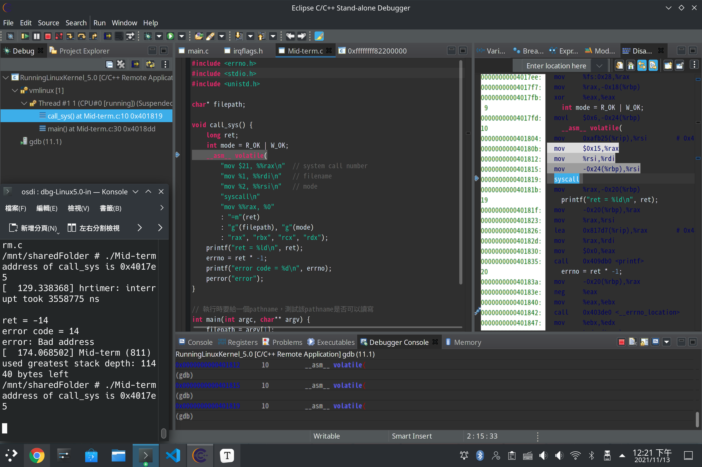
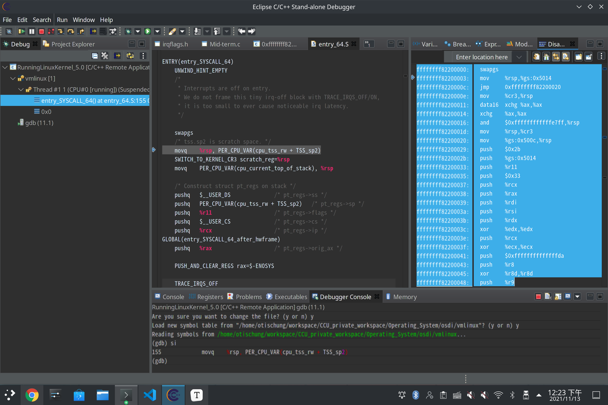

**Operating System Midterm Exam 2021.11.13  資工3B 408410120 鍾博丞**

-----------------------------------------

## 設定中斷點在 test_syscall 發出 system call 之前

為了方便，我將 filename 改為在執行目錄底下的 Makefile，這樣我就不用在 GDB 裡面輸入 argv[1]




## 使用單步追蹤（si），直到 syscall 後




## 請說明 Linux kernel 如何用 RAX 暫存器判斷要呼叫 哪個 Linux 內部的函數，請說明該函數的名稱

在 entry_64.S 裡，有這麼一段程式碼

```ass
ENTRY(entry_SYSCALL_64)
	UNWIND_HINT_EMPTY
	/*
	 * Interrupts are off on entry.
	 * We do not frame this tiny irq-off block with TRACE_IRQS_OFF/ON,
	 * it is too small to ever cause noticeable irq latency.
	 */

	swapgs
	/* tss.sp2 is scratch space. */
	movq	%rsp, PER_CPU_VAR(cpu_tss_rw + TSS_sp2)
	SWITCH_TO_KERNEL_CR3 scratch_reg=%rsp
	movq	PER_CPU_VAR(cpu_current_top_of_stack), %rsp

	/* Construct struct pt_regs on stack */
	pushq	$__USER_DS				/* pt_regs->ss */
	pushq	PER_CPU_VAR(cpu_tss_rw + TSS_sp2)	/* pt_regs->sp */
	pushq	%r11					/* pt_regs->flags */
	pushq	$__USER_CS				/* pt_regs->cs */
	pushq	%rcx					/* pt_regs->ip */
GLOBAL(entry_SYSCALL_64_after_hwframe)
	pushq	%rax					/* pt_regs->orig_ax */

	PUSH_AND_CLEAR_REGS rax=$-ENOSYS

	TRACE_IRQS_OFF

	/* IRQs are off. */
	movq	%rax, %rdi
	movq	%rsp, %rsi
	call	do_syscall_64		/* returns with IRQs disabled */
```

我們觀察一下第 31 行的 do_syscall_64，可以發現在 common.c 裡，有這麼一段程式碼

```c
__visible void do_syscall_64(unsigned long nr, struct pt_regs *regs)
{
	struct thread_info *ti;

	enter_from_user_mode();
	local_irq_enable();
	ti = current_thread_info();
	if (READ_ONCE(ti->flags) & _TIF_WORK_SYSCALL_ENTRY)
		nr = syscall_trace_enter(regs);

	/*
	 * NB: Native and x32 syscalls are dispatched from the same
	 * table.  The only functional difference is the x32 bit in
	 * regs->orig_ax, which changes the behavior of some syscalls.
	 */
	nr &= __SYSCALL_MASK;
	if (likely(nr < NR_syscalls)) {
		nr = array_index_nospec(nr, NR_syscalls);
		regs->ax = sys_call_table[nr](regs);
	}

	syscall_return_slowpath(regs);
}
```

其中第 9 行的  `nr = syscall_trace_enter(regs);`，我們看到程式將傳進來的 regs 放入 nr 裡面，在第 19 行裡面，將查完 sys_call_table 的結果放入 rax 暫存器裡面，這樣就完成放置 system call 的第一個變數了

---

step in 進去第 19 行，可以在 open.c 裡看到以下程式碼

```c
SYSCALL_DEFINE2(access, const char __user *, filename, int, mode)
{
	return do_faccessat(AT_FDCWD, filename, mode);
}
```

step in 進去第 3 行，可以在 open.c 裡看到以下程式碼

```c
/*
 * access() needs to use the real uid/gid, not the effective uid/gid.
 * We do this by temporarily clearing all FS-related capabilities and
 * switching the fsuid/fsgid around to the real ones.
 */
long do_faccessat(int dfd, const char __user *filename, int mode)
{
	const struct cred *old_cred;
	struct cred *override_cred;
	struct path path;
	struct inode *inode;
	int res;
	unsigned int lookup_flags = LOOKUP_FOLLOW;

	if (mode & ~S_IRWXO)	/* where's F_OK, X_OK, W_OK, R_OK? */
		return -EINVAL;

	override_cred = prepare_creds();
	if (!override_cred)
		return -ENOMEM;

	override_cred->fsuid = override_cred->uid;
	override_cred->fsgid = override_cred->gid;

	if (!issecure(SECURE_NO_SETUID_FIXUP)) {
		/* Clear the capabilities if we switch to a non-root user */
		kuid_t root_uid = make_kuid(override_cred->user_ns, 0);
		if (!uid_eq(override_cred->uid, root_uid))
			cap_clear(override_cred->cap_effective);
		else
			override_cred->cap_effective =
				override_cred->cap_permitted;
	}

	old_cred = override_creds(override_cred);
retry:
	res = user_path_at(dfd, filename, lookup_flags, &path);
	if (res)
		goto out;

	inode = d_backing_inode(path.dentry);

	if ((mode & MAY_EXEC) && S_ISREG(inode->i_mode)) {
		/*
		 * MAY_EXEC on regular files is denied if the fs is mounted
		 * with the "noexec" flag.
		 */
		res = -EACCES;
		if (path_noexec(&path))
			goto out_path_release;
	}

	res = inode_permission(inode, mode | MAY_ACCESS);
	/* SuS v2 requires we report a read only fs too */
	if (res || !(mode & S_IWOTH) || special_file(inode->i_mode))
		goto out_path_release;
	/*
	 * This is a rare case where using __mnt_is_readonly()
	 * is OK without a mnt_want/drop_write() pair.  Since
	 * no actual write to the fs is performed here, we do
	 * not need to telegraph to that to anyone.
	 *
	 * By doing this, we accept that this access is
	 * inherently racy and know that the fs may change
	 * state before we even see this result.
	 */
	if (__mnt_is_readonly(path.mnt))
		res = -EROFS;

out_path_release:
	path_put(&path);
	if (retry_estale(res, lookup_flags)) {
		lookup_flags |= LOOKUP_REVAL;
		goto retry;
	}
out:
	revert_creds(old_cred);
	put_cred(override_cred);
	return res;
}
```

可以發現，該程式在第 15 行時檢查 mode 是 F_OK, X_OK, W_OK, R_OK，故推斷**第 21 號 system call 是 access**


## 請用 50~200 個「有意義的文字」大致說明作業系 統如何處理該 system call

在第 37 行時 `user_path_at` 這個函數檢查 filename 的權限並將結果寫回 res (result)，我們 step in，發現在 namei.h 裡有一段程式碼

```c
static inline int user_path_at(int dfd, const char __user *name, unsigned flags,
		 struct path *path)
{
	return user_path_at_empty(dfd, name, flags, path, NULL);
}
```

再次 step in，發現在 namei.h 裡有一段程式碼

```c
int user_path_at_empty(int dfd, const char __user *name, unsigned flags,
		 struct path *path, int *empty)
{
	return filename_lookup(dfd, getname_flags(name, flags, empty),
			       flags, path, NULL);
}
```

在 namei.c 裡，找到以下程式碼

```c
static int filename_lookup(int dfd, struct filename *name, unsigned flags,
			   struct path *path, struct path *root)
{
	int retval;
	struct nameidata nd;
	if (IS_ERR(name))
		return PTR_ERR(name);
	if (unlikely(root)) {
		nd.root = *root;
		flags |= LOOKUP_ROOT;
	}
	set_nameidata(&nd, dfd, name);
	retval = path_lookupat(&nd, flags | LOOKUP_RCU, path);
	if (unlikely(retval == -ECHILD))
		retval = path_lookupat(&nd, flags, path);
	if (unlikely(retval == -ESTALE))
		retval = path_lookupat(&nd, flags | LOOKUP_REVAL, path);

	if (likely(!retval))
		audit_inode(name, path->dentry, flags & LOOKUP_PARENT);
	restore_nameidata();
	putname(name);
	return retval;
}
```

我們繼續追蹤第 13 行 `path_lookupat`，可以在 namei.c 裡，找到以下程式碼

```c
/* Returns 0 and nd will be valid on success; Retuns error, otherwise. */
static int path_lookupat(struct nameidata *nd, unsigned flags, struct path *path)
{
	const char *s = path_init(nd, flags);
	int err;

	if (unlikely(flags & LOOKUP_DOWN) && !IS_ERR(s)) {
		err = handle_lookup_down(nd);
		if (unlikely(err < 0))
			s = ERR_PTR(err);
	}

	while (!(err = link_path_walk(s, nd))
		&& ((err = lookup_last(nd)) > 0)) {
		s = trailing_symlink(nd);
	}
	if (!err)
		err = complete_walk(nd);

	if (!err && nd->flags & LOOKUP_DIRECTORY)
		if (!d_can_lookup(nd->path.dentry))
			err = -ENOTDIR;
	if (!err) {
		*path = nd->path;
		nd->path.mnt = NULL;
		nd->path.dentry = NULL;
	}
	terminate_walk(nd);
	return err;
}
```

所以我們已經知道，如果該 filename 的權限符合的話，就會 return 0，所以在 `do_faccessat` 裡面的第 37 行 `res = user_path_at(dfd, filename, lookup_flags, &path);` 會 return 0

---

接下來，看看 `do_faccessat` 第 53 行 `res = inode_permission(inode, mode | MAY_ACCESS);` 裡面是什麼，我們 step in 進去看，看到在 `namei.c` 裡面有以下程式碼

```c
int inode_permission(struct inode *inode, int mask)
{
	int retval;

	retval = sb_permission(inode->i_sb, inode, mask);
	if (retval)
		return retval;

	if (unlikely(mask & MAY_WRITE)) {
		/*
		 * Nobody gets write access to an immutable file.
		 */
		if (IS_IMMUTABLE(inode))
			return -EPERM;

		/*
		 * Updating mtime will likely cause i_uid and i_gid to be
		 * written back improperly if their true value is unknown
		 * to the vfs.
		 */
		if (HAS_UNMAPPED_ID(inode))
			return -EACCES;
	}

	retval = do_inode_permission(inode, mask);
	if (retval)
		return retval;

	retval = devcgroup_inode_permission(inode, mask);
	if (retval)
		return retval;

	return security_inode_permission(inode, mask);
}
```

我們看一下第 5 行的 `sb_permission`，可以看到在 namei.c 裡有以下程式碼

```c
/**
 * sb_permission - Check superblock-level permissions
 * @sb: Superblock of inode to check permission on
 * @inode: Inode to check permission on
 * @mask: Right to check for (%MAY_READ, %MAY_WRITE, %MAY_EXEC)
 *
 * Separate out file-system wide checks from inode-specific permission checks.
 */
static int sb_permission(struct super_block *sb, struct inode *inode, int mask)
{
	if (unlikely(mask & MAY_WRITE)) {
		umode_t mode = inode->i_mode;

		/* Nobody gets write access to a read-only fs. */
		if (sb_rdonly(sb) && (S_ISREG(mode) || S_ISDIR(mode) || S_ISLNK(mode)))
			return -EROFS;
	}
	return 0;
}
```

可以發現，只要 permission 符合，就 return 0


我們看一下 `inode_permission` 第 25 行的 `do_inode_permission`，可以看到在 namei.c 裡有以下程式碼

```c
/*
 * We _really_ want to just do "generic_permission()" without
 * even looking at the inode->i_op values. So we keep a cache
 * flag in inode->i_opflags, that says "this has not special
 * permission function, use the fast case".
 */
static inline int do_inode_permission(struct inode *inode, int mask)
{
	if (unlikely(!(inode->i_opflags & IOP_FASTPERM))) {
		if (likely(inode->i_op->permission))
			return inode->i_op->permission(inode, mask);

		/* This gets set once for the inode lifetime */
		spin_lock(&inode->i_lock);
		inode->i_opflags |= IOP_FASTPERM;
		spin_unlock(&inode->i_lock);
	}
	return generic_permission(inode, mask);
}
```

我們看一下第 18 行的 `generic_permission`，可以看到在 namei.c 裡有以下程式碼

```c
/**
 * generic_permission -  check for access rights on a Posix-like filesystem
 * @inode:	inode to check access rights for
 * @mask:	right to check for (%MAY_READ, %MAY_WRITE, %MAY_EXEC, ...)
 *
 * Used to check for read/write/execute permissions on a file.
 * We use "fsuid" for this, letting us set arbitrary permissions
 * for filesystem access without changing the "normal" uids which
 * are used for other things.
 *
 * generic_permission is rcu-walk aware. It returns -ECHILD in case an rcu-walk
 * request cannot be satisfied (eg. requires blocking or too much complexity).
 * It would then be called again in ref-walk mode.
 */
int generic_permission(struct inode *inode, int mask)
{
	int ret;

	/*
	 * Do the basic permission checks.
	 */
	ret = acl_permission_check(inode, mask);
	if (ret != -EACCES)
		return ret;

	if (S_ISDIR(inode->i_mode)) {
		/* DACs are overridable for directories */
		if (!(mask & MAY_WRITE))
			if (capable_wrt_inode_uidgid(inode,
						     CAP_DAC_READ_SEARCH))
				return 0;
		if (capable_wrt_inode_uidgid(inode, CAP_DAC_OVERRIDE))
			return 0;
		return -EACCES;
	}

	/*
	 * Searching includes executable on directories, else just read.
	 */
	mask &= MAY_READ | MAY_WRITE | MAY_EXEC;
	if (mask == MAY_READ)
		if (capable_wrt_inode_uidgid(inode, CAP_DAC_READ_SEARCH))
			return 0;
	/*
	 * Read/write DACs are always overridable.
	 * Executable DACs are overridable when there is
	 * at least one exec bit set.
	 */
	if (!(mask & MAY_EXEC) || (inode->i_mode & S_IXUGO))
		if (capable_wrt_inode_uidgid(inode, CAP_DAC_OVERRIDE))
			return 0;

	return -EACCES;
}
```

可以發現這裡有檢查 ACL 的權限，如果全部權限符合，就會進入第 51 行的 `return 0`

最後，看一下 `inode_permission` 第 33 行最後 return 的 `security_inode_permission`，我們在 `security.c` 裡找到以下程式碼

```c
int security_inode_permission(struct inode *inode, int mask)
{
	if (unlikely(IS_PRIVATE(inode)))
		return 0;
	return call_int_hook(inode_permission, 0, inode, mask);
}
```

我們看一下第 5 行的 `call_int_hook`，我們在 `hooks.c` 裡找到以下程式碼

```c
static int selinux_inode_permission(struct inode *inode, int mask)
{
	const struct cred *cred = current_cred();
	u32 perms;
	bool from_access;
	unsigned flags = mask & MAY_NOT_BLOCK;
	struct inode_security_struct *isec;
	u32 sid;
	struct av_decision avd;
	int rc, rc2;
	u32 audited, denied;

	from_access = mask & MAY_ACCESS;
	mask &= (MAY_READ|MAY_WRITE|MAY_EXEC|MAY_APPEND);

	/* No permission to check.  Existence test. */
	if (!mask)
		return 0;

	validate_creds(cred);

	if (unlikely(IS_PRIVATE(inode)))
		return 0;

	perms = file_mask_to_av(inode->i_mode, mask);

	sid = cred_sid(cred);
	isec = inode_security_rcu(inode, flags & MAY_NOT_BLOCK);
	if (IS_ERR(isec))
		return PTR_ERR(isec);

	rc = avc_has_perm_noaudit(&selinux_state,
				  sid, isec->sid, isec->sclass, perms, 0, &avd);
	audited = avc_audit_required(perms, &avd, rc,
				     from_access ? FILE__AUDIT_ACCESS : 0,
				     &denied);
	if (likely(!audited))
		return rc;

	rc2 = audit_inode_permission(inode, perms, audited, denied, rc, flags);
	if (rc2)
		return rc2;
	return rc;
}
```

至此，所有權限檢查完畢， 若權限都吻合，`open.c` 裡面 `do_faccessat` 裡的 `inode_permission` 會 return 0


