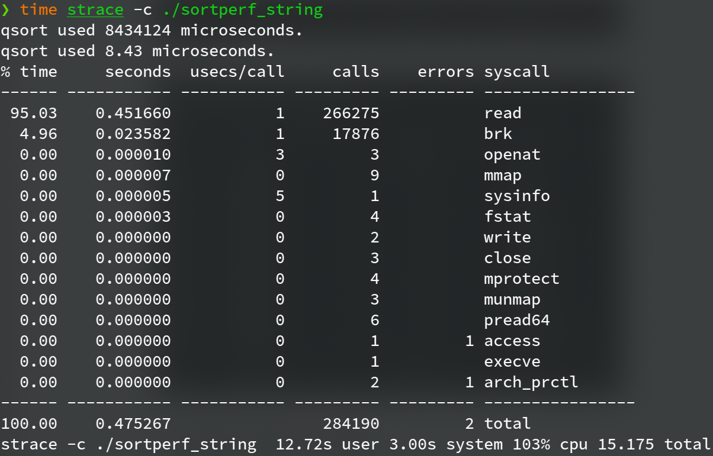

**Programming Design Homework 01  資工2B 408410120 鍾博丞**

-----------------------------------------

## 環境配置

Operating System: Ubuntu 20.04 LTS using KDE plasma

**CPU: AMD R9 3900X 12C 24T @ 3.8GHz**

RAM: 32GB DDR4 3600MHz (Double channel)

SSD: WD Black 256G WDS256G1X0C TLC (Seq. R: 2050MB/s, Seq. W: 700MB/s, Random R: 170K IOPS, Random W: 130K IOPS)

## A. 操作方法

在 sortperf.c 裡，有接收 argv[0] 的參數作為要排序的方法，若直接執行 sortperf，將直接使用內建的 qsort 函式完成排序，執行 `make` 時，將自動產生 heapsort, mergesort, quicksort 共三個指向主程式 sortperf.c 的 symbolic link，使用者只需執行對應名稱的 symbolic link 即可使用該方法進行排序，舉例，執行 `./heapsort` 就可以使用 heapsort 進行排序

同樣的，在 sortperf_string.c 裡，也有相對應的 symbolic link


執行 `make gen` 時，會自動執行亂數產生器並使用 strace 顯示出總共呼叫多少以及哪些 system call

```bash
time strace -c ./random_string_generater
Malloc time: 809093 us (equal 0.809093 sec)
Generate random string time: 20951939 us (equal 20.951939 sec)
Write to file time: 3429998 us (equal 3.429998 sec)
% time     seconds  usecs/call     calls    errors syscall
------ ----------- ----------- --------- --------- ----------------
 96.77    0.739523           2    266249           write
  3.23    0.024687           1     17876           brk
  0.00    0.000003           0         5           fstat
  0.00    0.000000           0         2           read
  0.00    0.000000           0         4         1 close
  0.00    0.000000           0        14           mmap
  0.00    0.000000           0         5           mprotect
  0.00    0.000000           0         1           munmap
  0.00    0.000000           0         2           rt_sigaction
  0.00    0.000000           0         1           rt_sigprocmask
  0.00    0.000000           0         8           pread64
  0.00    0.000000           0         1         1 access
  0.00    0.000000           0         1           execve
  0.00    0.000000           0         2         1 arch_prctl
  0.00    0.000000           0         1           set_tid_address
  0.00    0.000000           0         4           openat
  0.00    0.000000           0         1           set_robust_list
  0.00    0.000000           0         1           prlimit64
------ ----------- ----------- --------- --------- ----------------
100.00    0.764213                284178         3 total

real    0m25.249s
user    0m22.464s
sys     0m3.231s

time strace -c ./random_int_generater
Malloc time: 77 us (equal 0.000077 sec)
Generate random string time: 104485 us (equal 0.104485 sec)
Write to file time: 1482024 us (equal 1.482024 sec)
% time     seconds  usecs/call     calls    errors syscall
------ ----------- ----------- --------- --------- ----------------
 99.99    0.037884           0     42941           write
  0.01    0.000003           1         3           close
  0.00    0.000000           0         1           read
  0.00    0.000000           0         4           fstat
  0.00    0.000000           0         8           mmap
  0.00    0.000000           0         4           mprotect
  0.00    0.000000           0         1           munmap
  0.00    0.000000           0         3           brk
  0.00    0.000000           0         6           pread64
  0.00    0.000000           0         1         1 access
  0.00    0.000000           0         1           execve
  0.00    0.000000           0         2         1 arch_prctl
  0.00    0.000000           0         3           openat
------ ----------- ----------- --------- --------- ----------------
100.00    0.037887                 42978         2 total

real    0m1.592s
user    0m1.174s
sys     0m0.503s
```


執行 `make clean` 時，將刪除所有執行檔和 symbolic link，不包含測試資料，因為測試資料量高達 2^24 (約 16.7M) 筆資料，生成所需耗費的資源與時間都較大

欲刪除測試資料，可執行 `make clean_gen`


## B. 亂數資料生成方法

int 亂數較為簡單，主要生成方法為

```c
arr = (int *)malloc(ARRSIZE * sizeof(int));
for (i = 0; i < ARRSIZE; ++i) {
    arr[i] = rand();
}
```

string 亂數較為複雜，首先 malloc 2^24 個 char * array，然後再對每個指標 malloc 128 bytes 的空間，再利用亂數產生不同長度的英數字混合字串˙

```c
arr = (char **)malloc(ARRSIZE * sizeof(char *));
for (int i = 0; i < ARRSIZE; ++i) {
    arr[i] = (char *)malloc(128 * sizeof(char)); 
}
for (i = 0; i < ARRSIZE; ++i) {
    lineLen = rand() % 125 + 2;
    for (j = 0; j < lineLen; ++j) {
        // 生成英數字混合字串
    }
    arr[i][j] = '\n';
}
```


## C. 演算法實作及複雜度

### 1. Merge Sort

Merge sort 使用 recursive call 形成 call stack，達成 divide，而最後使用 merge 函數將兩區域排序，達成 conquer，merge 函數會 malloc 出左陣列和右陣列，抄完之後再依照大小回推到原本的陣列，完成之後 free 掉兩個陣列

Time complexity: $O(n \cdot \rm lg \it n\rm)$

Space complexity: $O(n)$ 


### 2. Quick Sort

這裡採用第一個元素當作 pivot 進行分堆，由於沒有使用中位數，故若遇到較為極端的例子，例如為一反序陣列，這時 quick sort 會非常慢

如果是 worst case，會有 $n-1$ 次 recursive call，故需執行

$$\sum_{i=0}^n (n-i) = n^2 - \frac{n(n+1)}{2}$$

次操作

Quick sort 為一種 inplace 的排序，故計算空間複雜度時，會以產生多少 call stack 作為參考，如果是 worst case，會有 $n-1$ 次 recursive call

Average time complexity: $O(n \cdot \rm lg \it n \rm)$

Worst time complexity: $O(n^2)$

Average space complexity: $O(\rm lg \it n \rm)$

Worst space complexity: $O(n)$


### 3. Heap Sort

首先對於每一個元素做 shift down，產生 Max heap，然後依序將第一個元素與最後一個元素對調，heap size - 1，然後對於第一個元素做 shift down，直到 heap size = 1 即完成排序

Heap sort 為一種 inplace 的排序，故計算空間複雜度時，會以產生多少 call stack 作為參考，對於第一個元素做 shift down，使用的 call stack 會是整個 heap tree 的高度

Time complexity: $O(n \cdot \rm lg \it n \rm)$

Space complexity: $O(\rm lg \it n \rm)$ 


## D. 測量結果

### 1. 2^24 (約16.7M) 筆 *<font color=#FF0000>int</font>* 資料

#### (1) qsort


#### (2) mergesort


#### (3) quicksort


#### (4) heapsort


### 2. 2^24 (約16.7M) 筆 *<font color=#FF0000>string</font>* 資料

每筆字長度介於 2 ~ 128 字元 (包含 \0)，其長度也是亂數產生

#### (1) qsort



#### (2) mergesort


#### (3) quicksort


#### (4) heapsort


## E. 結論

OS 在 malloc 記憶體時，較大的空間會以 mmap 的方式分配，較小空間會以 brk 的方式 malloc

```c
void *mmap(void *addr, size_t length, int prot, int flags, int fd, off_t offset);
int brk(void *addr);
```

<font color=#FF0000>**mmap**</font>()  creates  a  new  mapping  in the virtual address space of the calling process.  The starting address for the new mapping is  specified  in  <font color=#008000>**addr**</font>.  The <font color=#008000>**length**</font> argument specifies the length of the mapping (which must be greater than 0). 

If <font color=#008000>**addr**</font> is NULL, then the kernel chooses the  (page-aligned)  address at  which  to create the mapping; this is the most portable method of creating a new mapping.  If <font color=#008000>**addr**</font> is not NULL, then the  kernel  takes it as a hint about where to place the mapping; on Linux, the kernel will pick a nearby page boundary (but always above or equal to the value specified by <font color=#008000>**/proc/sys/vm/mmap_min_addr**)</font> and attempt to create the mapping there.  If another mapping already exists there, the kernel picks a new address that may or may not depend on the hint. The address of the new mapping is returned as the result of the call. 

The contents of a file mapping (as opposed to an  anonymous  mapping; see <font color=#FF0000>**MAP_ANONYMOUS**</font> below), are initialized using <font color=#008000>**length**</font> bytes starting at offset <font color=#008000>**offset**</font> in the file (or other object)  referred  to by the file descriptor  <font color=#008000>**fd**</font>.  <font color=#008000>**offset**</font> must be a multiple of the page size as returned by <font color=#008000>**sysconf(_SC_PAGE_SIZE)**</font>. 

After the <font color=#FF0000>**mmap**</font>() call has returned, the file descriptor, <font color=#008000>**fd**</font>,  can be closed immediately without invalidating the mapping.

尤其從字串的排序就可以知道，要分配 arr$[2^{24}] [128]$，需要 mmap 9 次 ($2^{24}$) 而 brk 17876 次 (對於每個 char * 分配 128 bytes)，而排序最花時間的當然就是 read 元素進行比較


隨便取一種排序方法，`sudo perf top -e branch-instructions` 就可以證明這一切了


## F. Reference

4102150_02 System Programming, instouctor: Prof. Si-Wu Lo

Linux manual page

---------------------------------------------------------

最後的壓縮指令 
`tar jcvf filename.tar.bz2 target`