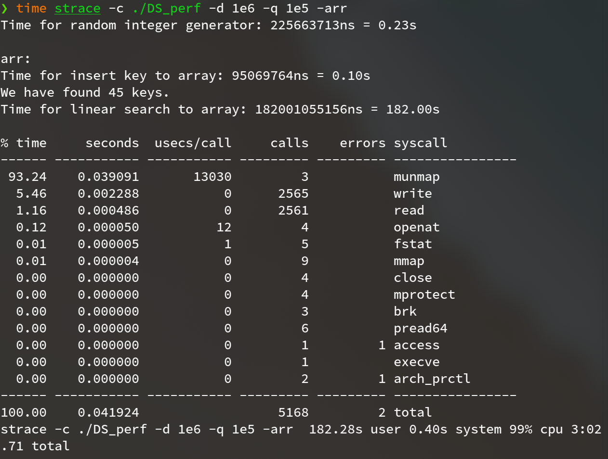
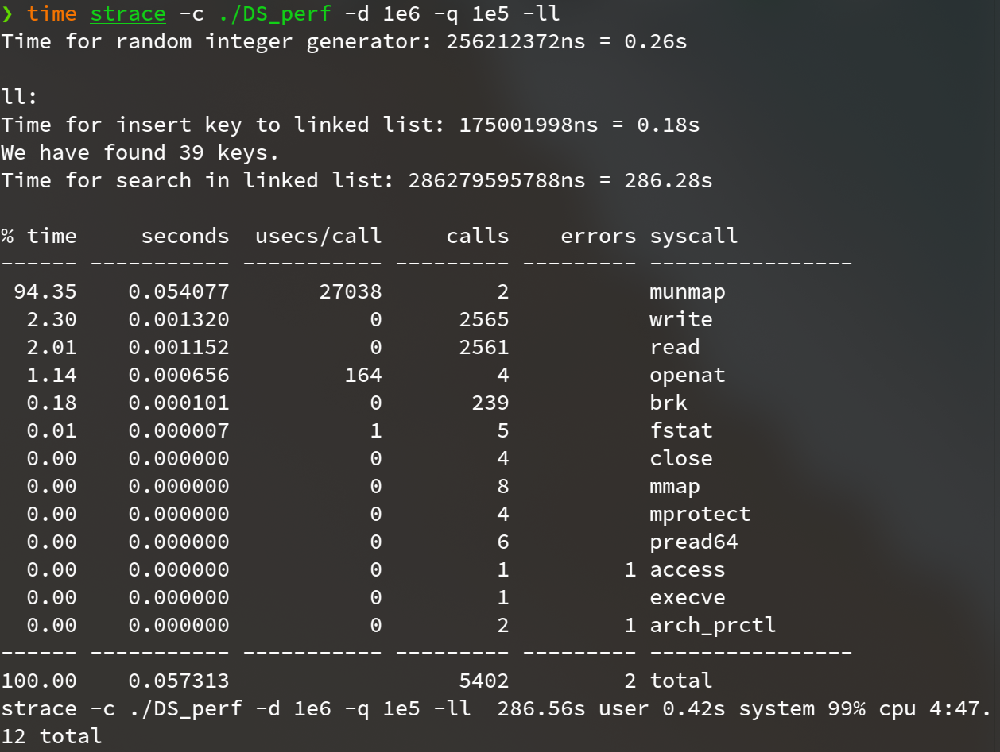
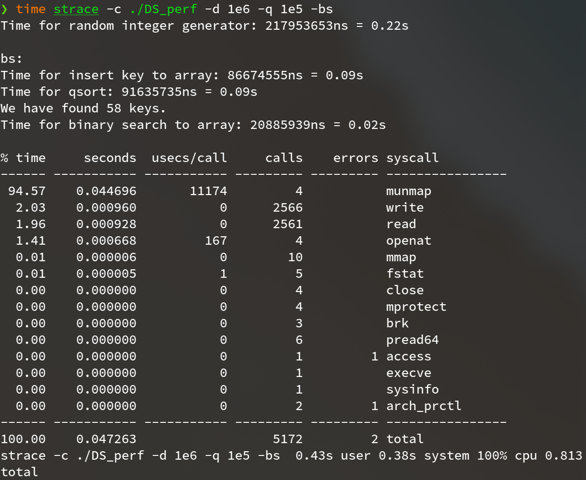
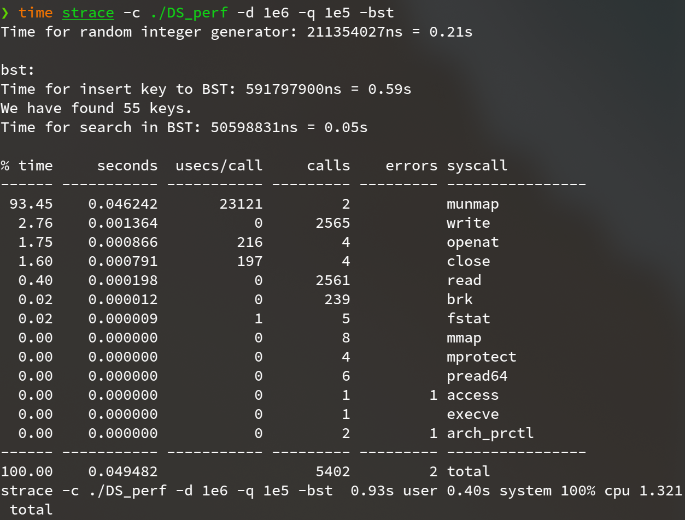
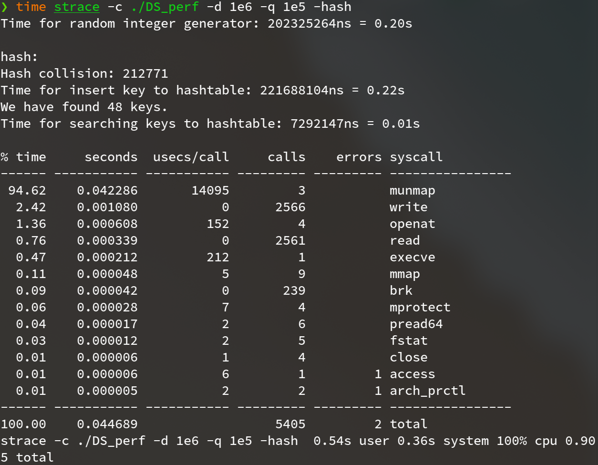

**Programming Design Homework 02  資工2B 408410120 鍾博丞**

-----------------------------------------

## 環境配置

Operating System: Ubuntu 20.04 LTS using KDE plasma

**CPU: AMD R9 3900X 12C 24T @ 3.8GHz**

RAM: 32GB DDR4 3600MHz (Double channel)

SSD: WD Black 256G WDS256G1X0C TLC (Seq. R: 2050MB/s, Seq. W: 700MB/s, Random R: 170K IOPS, Random W: 130K IOPS)

## Github Link

https://reurl.cc/AgVqNE

## A. 操作方法

DS_perf 每次都會生成給定大小的 int 資料，故執行此程式時，建議 RAM 有 8GB 或以上，否則很容易使 swap space 被填滿，造成 CPU 使用大量的時間做 I/O，甚至會直接被 OS kill 掉

DS_perf 最少需接收 6 個參數

`./DS_perf -d <N> -q <M> [-arr] [-ll] [-bst] [-bs] [-hash]`

產生 N 筆唯一的資料，注意大小不要太過於接近 INT_MAX = 2,147,483,647，否則產生效率會非常低，下面將詳細說明為何會如此

產生 M 筆資料進行查詢

N 與 M 支援科學記號，即 $10^6$ 可寫作 1e6, 1E6, 1e+6, 1E+6 四種寫法，其他數字以此類推

至少選擇一種方法

## B. 亂數資料生成方法

已知 rand() 產生的值介於 0 ~ INT_MAX，故產生一個大小為 INT_MAX 的 bool array，初始值設定為 false，之後每次產生亂數時檢查該數有沒有出現過，若沒有，則在該亂數的 index 位置設為 true，若有，則重新產生，直到沒有碰撞為止

故而，產生越多筆資料，碰撞機率會越大，建議 N 設定為 1e6 即可

其實，還有一種方法，就是先產生連續的整數，然後像洗牌一樣，隨機挑選兩個不同的 index 做交換，只是這樣做的話，很難保證 Binary Search Tree 的平衡，所以在這裡不採用此方法

## C. 演算法實作及複雜度

### 1. Linear Search (-arr) 

直接依序將產生的亂數填入陣列，每次搜尋都需走訪陣列中的所有元素

Time complexity: $O(n\rm)$

### 2. Linked list (-ll)

直接依序將產生的亂數填入每一個 node，然後插入在頭端，所以填入完成後會是反序的，每次搜尋都需走訪 linked list 中的所有元素

與陣列相比，因為資料不連續，每次走訪都需查詢 next 在哪裡，故 linked list search 會比 array linear search 來的慢

Time complexity: $O(n\rm)$

### 3. Binary Search (-bs)

將產生的亂數填入陣列後，做 qsort

Time complexity: $O(\rm lg \it n \rm)$ 

### 4. Binary Search Tree (-bst)

直接依序將產生的亂數填入每一個 node，然後依照 BST 的規則，插入在左邊或右邊

雖然 in-order traversal 就等同於已經排序完成，且假設其平衡狀態接近 AVL，但是與 array 中的 binary search 比較，多出了查詢下一個節點的時間，故 BST search 會比 array binary search 來的慢

Time complexity: $O(\rm lg \it n \rm)$ 

### 5. Hash (-hash)

將產生的亂數以下列非線性函數做轉換，並開一個比資料量兩倍大的陣列，假設為 2N

$hash(x) = (x - 2^{30})^2 \rm mod \  2 \it N$

產生出該 key 的 address，然後將 key 填入 Node 裡，並將該 address 的內容指向該 Node，若未來發生 collison，則以 linked list 接在其後面

兩倍大的陣列搭配非線性的 hash function，可預期其碰撞機率應該很低

Time complexity: $O(1)$ 

## D. 測量結果

### ./DS_perf -d 1e6 -q 1e4 -arr -ll -bs -bst -hash

#### (1) Linear Search

#### (2)  Linked list

#### (3) Binary Search

#### (4) Binary Search Tree

#### (5) Hash

## E. 結論

## F. Reference

Myself

