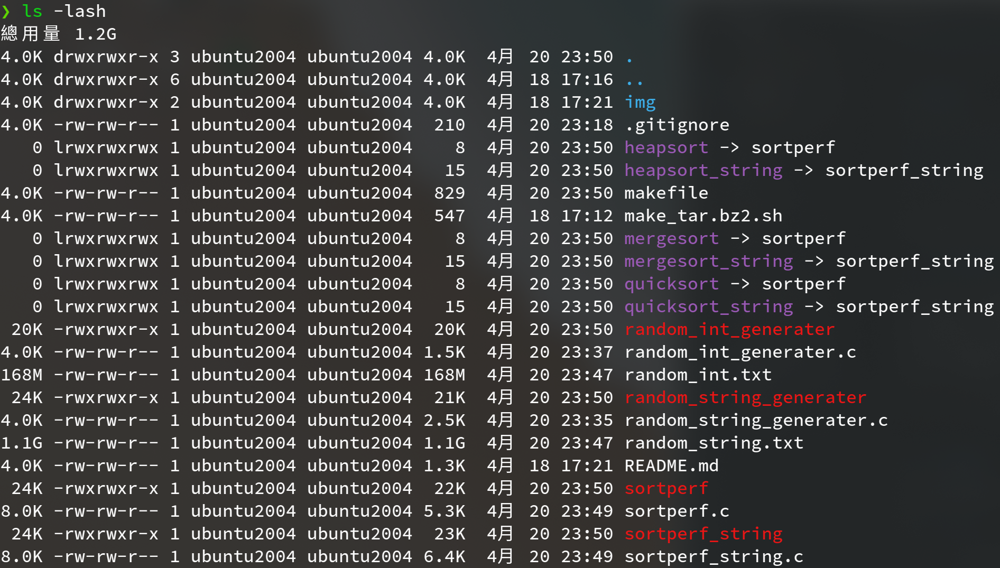
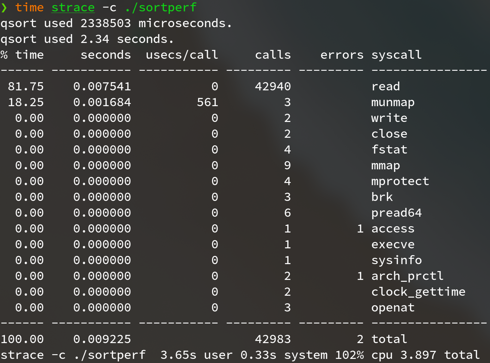

**Programming Design Homework 02  資工2B 408410120 鍾博丞**

-----------------------------------------

## 環境配置

Operating System: Ubuntu 20.04 LTS using KDE plasma

**CPU: AMD R9 3900X 12C 24T @ 3.8GHz**

RAM: 32GB DDR4 3600MHz (Double channel)

SSD: WD Black 256G WDS256G1X0C TLC (Seq. R: 2050MB/s, Seq. W: 700MB/s, Random R: 170K IOPS, Random W: 130K IOPS)

## A. 操作方法

在 sortperf.c 裡，有接收 argv[0] 的參數作為要排序的方法，若直接執行 sortperf，將直接使用內建的 qsort 函式完成排序，執行 `make` 時，將自動產生 heapsort, mergesort, quicksort 共三個指向主程式 sortperf.c 的 symbolic link，使用者只需執行對應名稱的 symbolic link 即可使用該方法進行排序，舉例，執行 `./heapsort` 就可以使用 heapsort 進行排序

同樣的，在 sortperf_string.c 裡，也有相對應的 symbolic link



執行 `make gen` 時，會自動執行亂數產生器並使用 strace 顯示出總共呼叫多少以及哪些 system call

```bash
time strace -c ./random_string_generater
Malloc time: 809093 us (equal 0.809093 sec)
Generate random string time: 20951939 us (equal 20.951939 sec)
Write to file time: 3429998 us (equal 3.429998 sec)
% time     seconds  usecs/call     calls    errors syscall
------ ----------- ----------- --------- --------- ----------------
 96.77    0.739523           2    266249           write
  3.23    0.024687           1     17876           brk
  0.00    0.000003           0         5           fstat
  0.00    0.000000           0         2           read
  0.00    0.000000           0         4         1 close
  0.00    0.000000           0        14           mmap
  0.00    0.000000           0         5           mprotect
  0.00    0.000000           0         1           munmap
  0.00    0.000000           0         2           rt_sigaction
  0.00    0.000000           0         1           rt_sigprocmask
  0.00    0.000000           0         8           pread64
  0.00    0.000000           0         1         1 access
  0.00    0.000000           0         1           execve
  0.00    0.000000           0         2         1 arch_prctl
  0.00    0.000000           0         1           set_tid_address
  0.00    0.000000           0         4           openat
  0.00    0.000000           0         1           set_robust_list
  0.00    0.000000           0         1           prlimit64
------ ----------- ----------- --------- --------- ----------------
100.00    0.764213                284178         3 total

real    0m25.249s
user    0m22.464s
sys     0m3.231s

time strace -c ./random_int_generater
Malloc time: 77 us (equal 0.000077 sec)
Generate random string time: 104485 us (equal 0.104485 sec)
Write to file time: 1482024 us (equal 1.482024 sec)
% time     seconds  usecs/call     calls    errors syscall
------ ----------- ----------- --------- --------- ----------------
 99.99    0.037884           0     42941           write
  0.01    0.000003           1         3           close
  0.00    0.000000           0         1           read
  0.00    0.000000           0         4           fstat
  0.00    0.000000           0         8           mmap
  0.00    0.000000           0         4           mprotect
  0.00    0.000000           0         1           munmap
  0.00    0.000000           0         3           brk
  0.00    0.000000           0         6           pread64
  0.00    0.000000           0         1         1 access
  0.00    0.000000           0         1           execve
  0.00    0.000000           0         2         1 arch_prctl
  0.00    0.000000           0         3           openat
------ ----------- ----------- --------- --------- ----------------
100.00    0.037887                 42978         2 total

real    0m1.592s
user    0m1.174s
sys     0m0.503s
```


執行 `make clean` 時，將刪除所有執行檔和 symbolic link，不包含測試資料，因為測試資料量高達 2^24 (約 16.7M) 筆資料，生成所需耗費的資源與時間都較大

欲刪除測試資料，可執行 `make clean_gen`

## B. 亂數資料生成方法

int 亂數較為簡單，主要生成方法為

```c
arr = (int *)malloc(ARRSIZE * sizeof(int));
for (i = 0; i < ARRSIZE; ++i) {
    arr[i] = rand();
}
```

string 亂數較為複雜，首先 malloc 2^24 個 char * array，然後再對每個指標 malloc 128 bytes 的空間，再利用亂數產生不同長度的英數字混合字串˙

```c
arr = (char **)malloc(ARRSIZE * sizeof(char *));
for (int i = 0; i < ARRSIZE; ++i) {
    arr[i] = (char *)malloc(128 * sizeof(char)); 
}
for (i = 0; i < ARRSIZE; ++i) {
    lineLen = rand() % 125 + 2;
    for (j = 0; j < lineLen; ++j) {
        // 生成英數字混合字串
    }
    arr[i][j] = '\n';
}
```


## C. 測量結果

### 1. 2^24 (約16.7M) 筆 *<font color=#FF0000>int</font>* 資料

#### (1) qsort



#### (2) mergesort


#### (3) quicksort


#### (4) heapsort


---------------------------------------------------------

最後的壓縮指令 
`tar jcvf filename.tar.bz2 target`