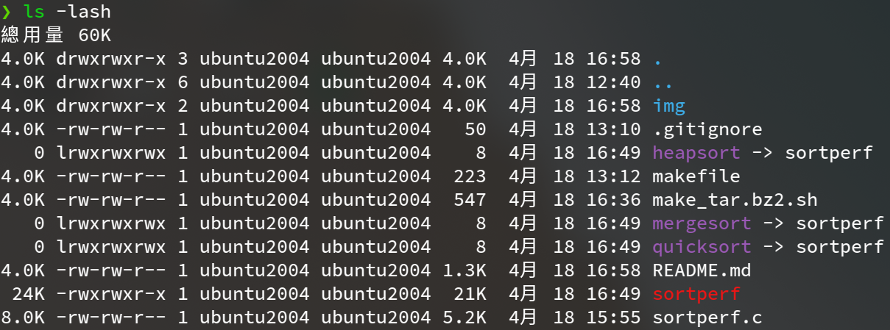
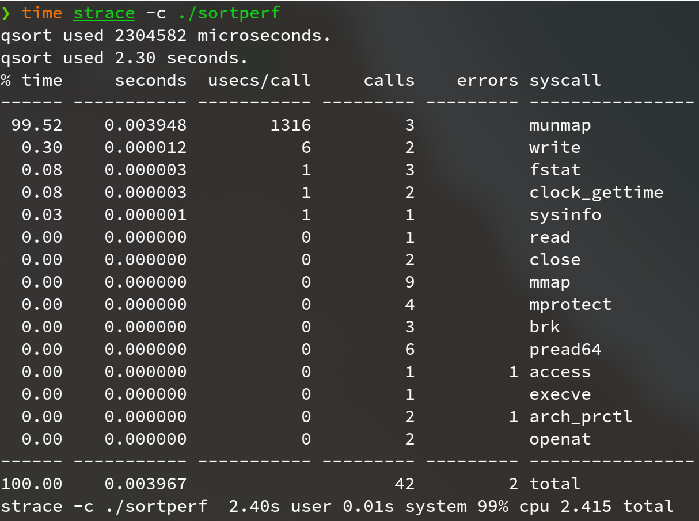
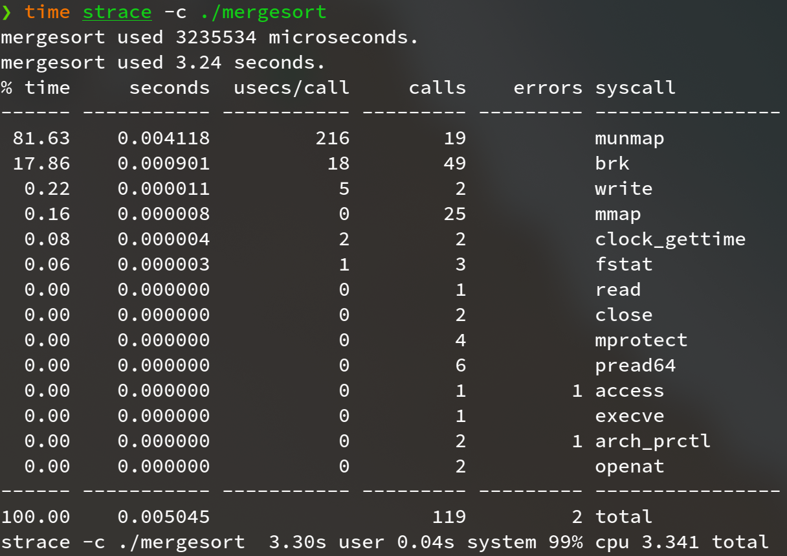
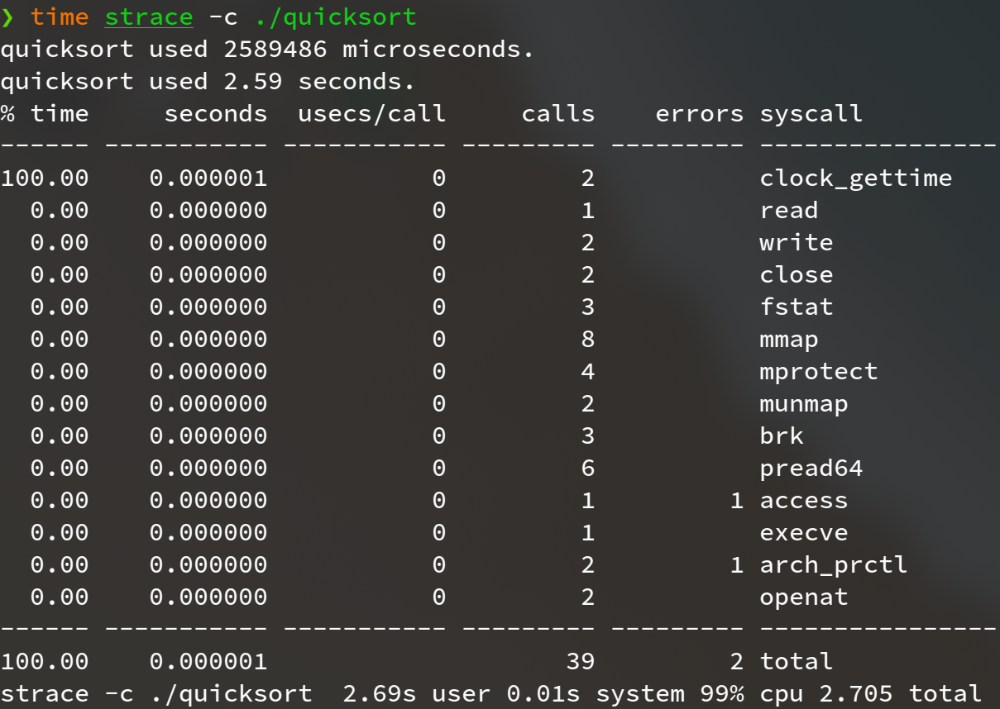

**Programming Design Homework 02  資工2B 408410120 鍾博丞**

-----------------------------------------

## 環境配置

Operating System: Ubuntu 20.04 LTS using KDE plasma

**CPU: AMD R9 3900X 12C 24T @ 3.8GHz**

RAM: 32GB DDR4 3600MHz (Double channel)

SSD: WD Black 256G WDS256G1X0C TLC (Seq. R: 2050MB/s, Seq. W: 700MB/s, Random R: 170K IOPS, Random W: 130K IOPS)

## A. 本次實作方法

在 sortperf.c 裡，有接收 argv[0] 的參數作為要排序的方法，若直接執行 sortperf，將直接使用內建的 qsort 函式完成排序，執行 `make` 時，將自動產生 heapsort, mergesort, quicksort 共三個指向主程式 sortperf.c 的 symbolic link，使用者只需執行對應名稱的 symbolic link 即可使用該方法進行排序，舉例，執行 `./heapsort` 就可以使用 heapsort 進行排序

## B. 測量結果

本次測資為隨機產生的 2^24 (約16.7M) 筆 int 資料，進行排序

### 1. qsort

### 2. mergesort

### 3. quicksort

### 4. heapsort

---------------------------------------------------------

最後的壓縮指令 
`tar jcvf filename.tar.bz2 target`