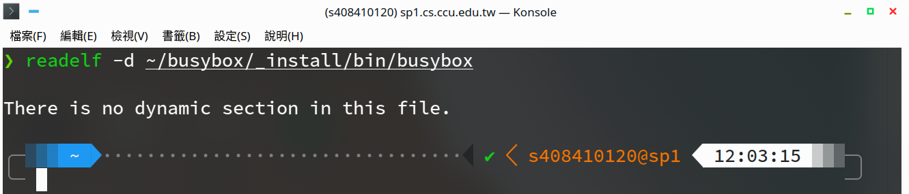

**System Programming Homework 06  資工2B 408410120 鍾博丞**

-----------------------------------------

## 環境配置

### A. TWCC Virtual Machine

Operating System: Ubuntu 20.04.2 LTS

**CPU: Intel Xeon Processor 32T (Skylake, IBRS)**

RAM: 256GB

### B. My Personal Computer

Operating System: Ubuntu 20.04 LTS using KDE plasma

**CPU: AMD R9 3900X 12C 24T @ 3.8GHz**

RAM: 32GB DDR4 3600MHz (Double channel)

SSD: WD Black 256G WDS256G1X0C TLC (Seq. R: 2050MB/s, Seq. W: 700MB/s, Random R: 170K IOPS, Random W: 130K IOPS)

## 執行與測試結果

### A. Install busybox

```bash=
sudo apt-get install libncurses5-dev
git clone https://git.busybox.net/busybox/
cd busybox
make -j defconfig
make -j menuconfig
```

執行 menuconfig 時要注意 console 大小
> It must be at least 19 lines by 80 columns.

選擇 settings (press Enter)

選擇 Build static binary (no shared libs) (press space or y)

選擇 Additional CFLAGS (press enter)，輸入 -g -z lazy (press enter)

儲存離開

```bash=
make -j
make -j install
```

這樣就完成 busybox 的編譯安裝了，其實，編譯安裝 linux kernel 也是差不多的步驟喔

這個時候，他會自動提示你

> You will probably need to make your busybox binary setuid root to ensure all configured applets will work properly.

所以我們要執行以下指令

```bash=
sudo chroot ~/busybox/_install/ ash
```

但是，我使用教授所提供的 TWCC virtual machine，並沒有 sudo 權限，所以網路上有人提供以下解法

```bash=
unshare -r bash -c 'chroot ~/busybox/_install/ ash'
```
reference:
https://serverfault.com/questions/135599/ubuntu-can-non-root-user-run-process-in-chroot-jail

這樣就可以進來了，測試一下是沒有問題的，如同本作業要求，所有檔名為 Linux 程式 (i.e. ls, cd, pwd, ...) 的 symbolic link 全部都是指向 busybox 這個主程式的


要離開 busybox 就輸入 `exit` 就可以了


接著測試剛剛我們所選擇的 Build static binary 有沒有成功



結果成功，顯示沒有任何動態連結函數庫


我們再看看 TWCC Virtual Machine 上的 ls 有沒有動態連結函數庫


結果是有的，並且我們可以發現它需要 `libselinux.so.1` 和 `libc.so.6` 這兩個函式庫

在這個例子中，我們也可以使用 `objdump -d /usr/bin/ls` ，反組譯 ls 這個執行檔


#### 為什麼我們需要 busybox?

Embedded system 不像一般筆電、桌機、伺服器......等，有著很大的 RAM 與 Secondary storage，它的容量很有限，我們不可能把整套 OS 塞進去，所以，我們需要精簡功能，將我們需要的功能弄進去就可以了

Busybox 最大的特點就是它只有**一個**可執行檔 (在這個例子就是 busybox)，然後建立我們所需的功能的名稱的 symbolic link 到這個執行檔，如此一來省去了每個執行檔必需有的檔頭 (特別是 [ELF](https://zh.wikipedia.org/wiki/可執行與可鏈接格式) 的可執行檔)，這也讓Busybox不需要函式庫便可達成程式碼共享

---------------------------------------------------------


### B. Implement myBusybox

執行 `make` 後，所有 symbolic link 和執行檔 myBusybox 都會在 **bin 的資料夾內**，`cd` 進去就可以了

因為是放在其他資料夾，為了避免 link path 錯誤，所以使用 *絕對路徑* 產生 symbolic link


In makefile

```makefile
SHELL = /bin/bash
CC = gcc
CFLAGS = -g -z lazy -pthread
SRC = $(wildcard *.c)
EXE = $(patsubst %.c, %, $(SRC))

all: ${EXE}

%:	%.c
	mkdir -p ./bin
	${CC} ${CFLAGS} $@.c -o ./bin/$@
	ln -s ${PWD}/bin/$@ ./bin/cp
	ln -s ${PWD}/bin/$@ ./bin/ls
	ln -s ${PWD}/bin/$@ ./bin/cat
	ln -s ${PWD}/bin/$@ ./bin/chown

clean:
	rm -f ./bin/*
```


檢查一下是可以成功執行的


---------------------------------------------------------

最後的壓縮指令 
`tar jcvf filename.tar.bz2 target`