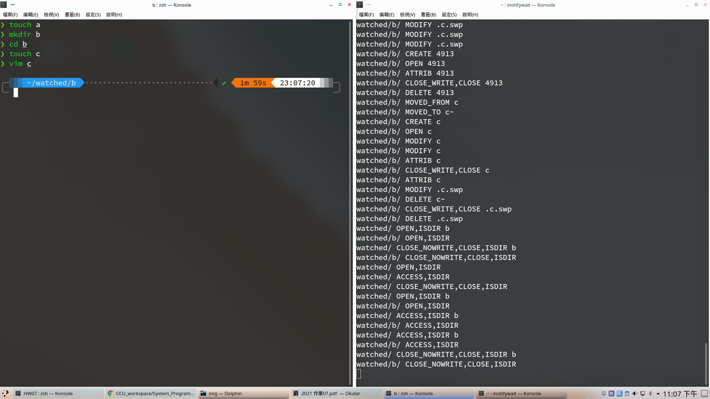
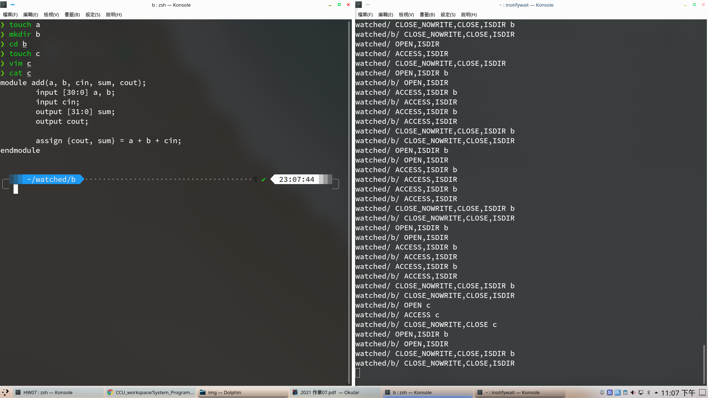

**System Programming Homework 07  資工2B 408410120 鍾博丞**

-----------------------------------------

## 環境配置

Operating System: Ubuntu 20.04 LTS using KDE plasma

**CPU: AMD R9 3900X 12C 24T @ 3.8GHz**

RAM: 32GB DDR4 3600MHz (Double channel)

SSD: WD Black 256G WDS256G1X0C TLC (Seq. R: 2050MB/s, Seq. W: 700MB/s, Random R: 170K IOPS, Random W: 130K IOPS)

## 一、使用 inotifywait 試用 inotify

### A. touch a


### B. mkdir b


### C. cd b


### D. touch c


### E. vim c


### F. :wq



### G. cat c



### H. echo hello

這裡我多加了 // 註解掉 hello，以免破壞 verilog 架構


### I. sudo inotifywait -m -r /
.png)


## 二、執行與測試結果

本次作業我寫了兩種版本

### A. 使用 stat (watchFile.c)

struct stat 裡就有 st_atime, st_mtime, st_ctime 了 (詳見 `man 2 stat`)，這樣就可以讀出修改時間了

以下為執行結果：

```bash=
Modified:       Sat Apr 17 22:08:58 2021
Last modified:  Sat Apr 17 22:07:47 2021

1234567890
abcdefg
121315341534
```

### B. 使用 inotify (watchFile_using_inotify.c)

這是使用教授給的 pseudo code 做修改的，有別於我印出檔案內容的方法是直接使用 `system(cat ...);` ，教授使用的是把檔案指標指向該檔案，然後使用 fgets 印出。只是這樣的話每次印完後指標都會指向 EOF，所以要用 fseek，類似 lseek 的用法，將檔案指標移向開頭

```c
fseek(fp, 0, SEEK_SET);
```

只是，使用 inotify 可以監控到很多細節 (詳見 `man 7 inotify`)，每一次修改其實都有 modify, open, modify, "close_write,close" 四次改動，所以在印出結果的時候也會因此重複列印

以下為執行結果：

```bash=
這次修改時間：2021-04-17 22:07:43, 上次修改時間：2021-04-17 22:05:32

這次修改時間：2021-04-17 22:07:43, 上次修改時間：2021-04-17 22:07:43
1234567890
abcdefg
121315341534

這次修改時間：2021-04-17 22:07:43, 上次修改時間：2021-04-17 22:07:43
1234567890
abcdefg
121315341534
```

列印了三次

---------------------------------------------------------

最後的壓縮指令 
`tar jcvf filename.tar.bz2 target`