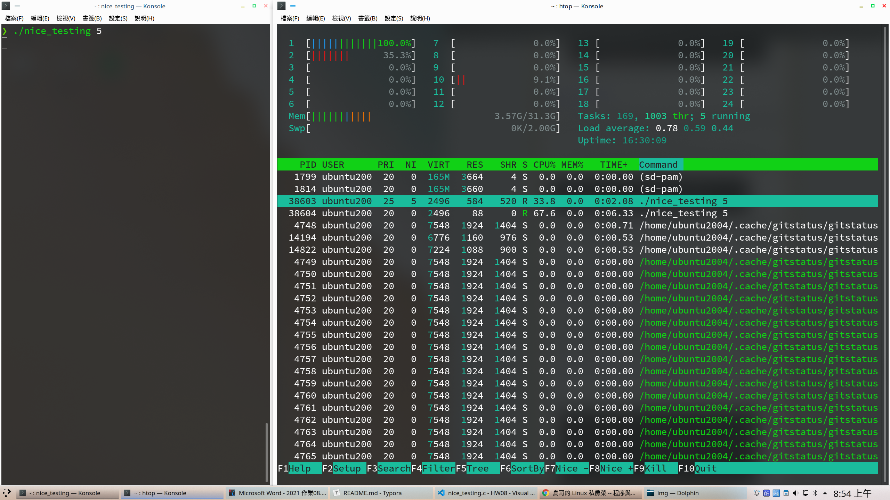
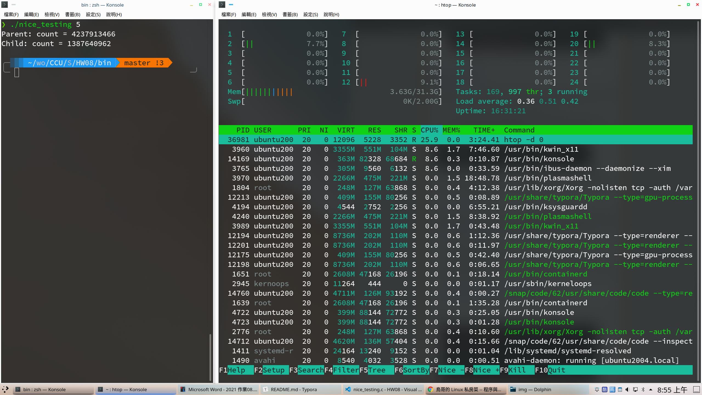
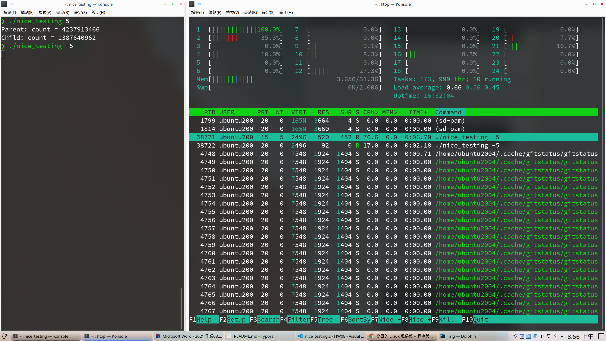
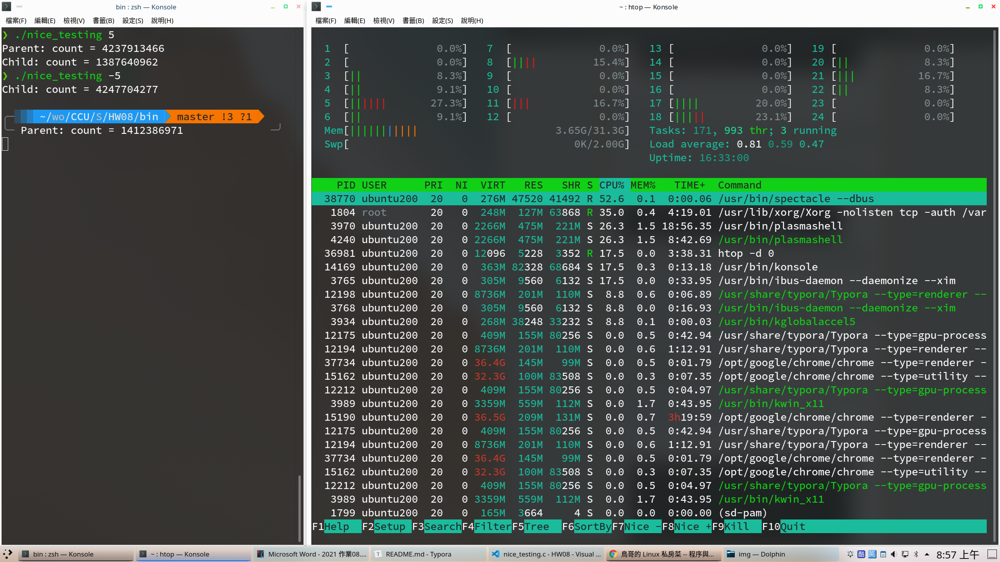
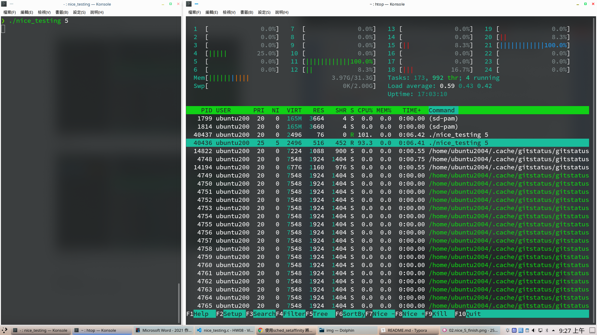
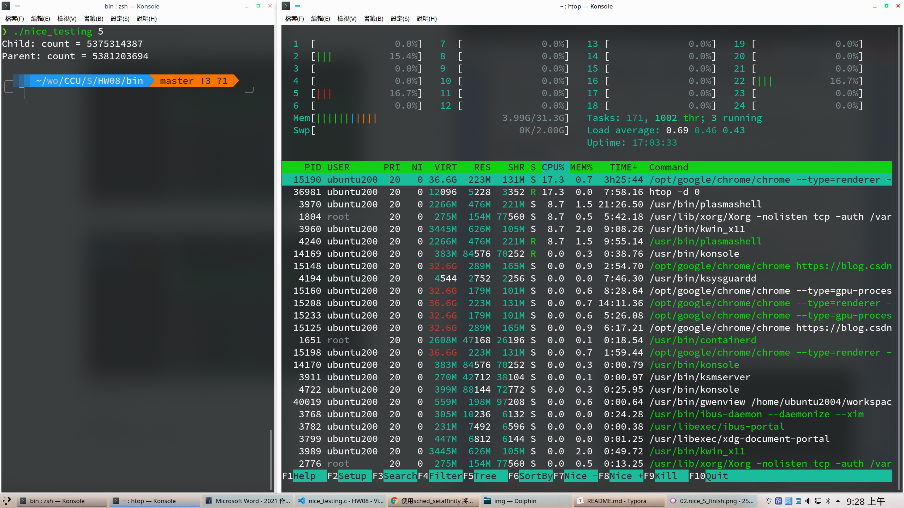

**System Programming Homework 08  資工2B 408410120 鍾博丞**

-----------------------------------------

## 環境配置

Operating System: Ubuntu 20.04 LTS using KDE plasma

**CPU: AMD R9 3900X 12C 24T @ 3.8GHz**

RAM: 32GB DDR4 3600MHz (Double channel)

SSD: WD Black 256G WDS256G1X0C TLC (Seq. R: 2050MB/s, Seq. W: 700MB/s, Random R: 170K IOPS, Random W: 130K IOPS)

## Set Capabilities (setcap)

在之前的作業裡，我們使用 setuid 的方法，讓執行者拿到擁有者的權限，例如修改密碼的程式，那就是讓執行者拿到 root 權限

但是，這會產生一個很大的問題，如果說這個程式碼有安全性漏洞，那麼駭客就可以透過這個 setuid 的程式，直接拿到他不該拿到的權限，尤其是 super user 的權限


所以，在新版的 Linux 裡 (since kernel version 2.2)，可以將 super user 的權限「部分」給予某個應用程式,藉由 capabilities，可以讓 Linux 的權限設定更為細緻，進而增加系統的安全性

我們可以從 `man 7 capabilities` 裡看到各種權限的設定，這裡條列 3 種作為參考


**CAP_CHOWN**

Make arbitrary changes to file UIDs and GIDs

**CAP_SETUID**

Make arbitrary manipulations of process UIDs

**CAP_SETGID**

Make  arbitrary manipulations of process GIDs and supplementary GID list


以上三個都是之前作業有使用過的，例如 sudo chown \<user id\> \<file\>，int setuid(uid_t uid)，int setgid(gid_t gid)，這些以往都要搭配 sudo 給予這個程式 root 的所有權限，但現在透過這些 capabilities，我們只給予這個程式 root 的部份權限

用法如下

```bash
sudo setcap CAP_CHOWN+ep <file>
```

+e: Effective: 執行這個檔案的時候，所設定的權限有效

+p: Permitted: 無論這個 process 是誰 fork 出來的，都立即賦予他這項權限


## nice

現在的 CPU 和 OS 都支援多工處理，那麼，在 CPU scheduling 裡，會根據每個工作的優先執行序 (priority) 來判斷誰比較重要優先完成，在 Linux 系統中，每個 process 都會擁有一個所謂的『優先執行序 (priority)』的屬性，我們可以用 htop 來看，PRI 就是這支程式的 priority 值，NI 就是這個 process 的 nice 的偏移值，priority 的值越低，優先度越高

一般使用者只可以降低屬於自己的 process 的優先程度，也就是 nice 值只能是正數 (0 <= N <= 19)，而 root 可以提高某一 process 的優先程度 (-20 <= N <= 19)，這個時候，我們就可以用 set capabilities (**CAP_SYS_NICE**) 賦予這個程式在 **nice 設定的 root 權限**


這裡有透過綁定 CPU thread 來達成目的，我們將這個程式設定為只運作在 CPU 0 上

```c
#define _GNU_SOURCE
#include <unistd.h>
#include <sched.h>
long cputhreads;  // The amount of threads of CPU
cpu_set_t mask;  // The set of the CPU threads.
cputhreads = sysconf(_SC_NPROCESSORS_CONF);
CPU_ZERO(&mask);
CPU_SET(0, &mask);
// CPU_SET(1, &mask);
success = sched_setaffinity(0, sizeof(mask), &mask);
if (success != 0) {
    perror("setaffinity failed");
    return 1;
}
```

這支程式有使用 signal，接收 alarm 的 signal，設定為 10 秒後程式結束

這個程式會一直加一個全域變數的值，我們就利用這個值判斷誰的優先權比較高


我們來看看 `./nice_testing 5` 的結果，可以看到此程式真的只有運作在 CPU 0



執行結果如下



每提高一個優先度，程式執行效率可以提升 1.25 倍，故 parent 執行效率是 child 的 $1.25^5=3.051757813$ 倍

我們實際將兩數相除，可得 3.054041755 倍，誤差為 7.48e-4


我們來看看 `./nice_testing -5` 的結果



執行結果如下



我們實際將兩數相除，可得 3.007464926 倍，誤差為 1.45e-2


如果我們不指定 CPU，則 OS 會自動分配 2 個較為閒置的 CPU 做運算，可以看到 CPU 10, 20 在運作



執行結果如下



可以看到兩個數值相當接近，且兩數相加之總和約是之前單核執行時的 2 倍 (1.9121 倍) 


根據測試結果，設定 CPU 的程式碼可以放在 fork 之後，但**要在 ++count 之前，不可在 ++count 之後**，否則運作時會跟沒有設定的結果一樣

---------------------------------------------------------

最後的壓縮指令 
`tar jcvf filename.tar.bz2 target`

