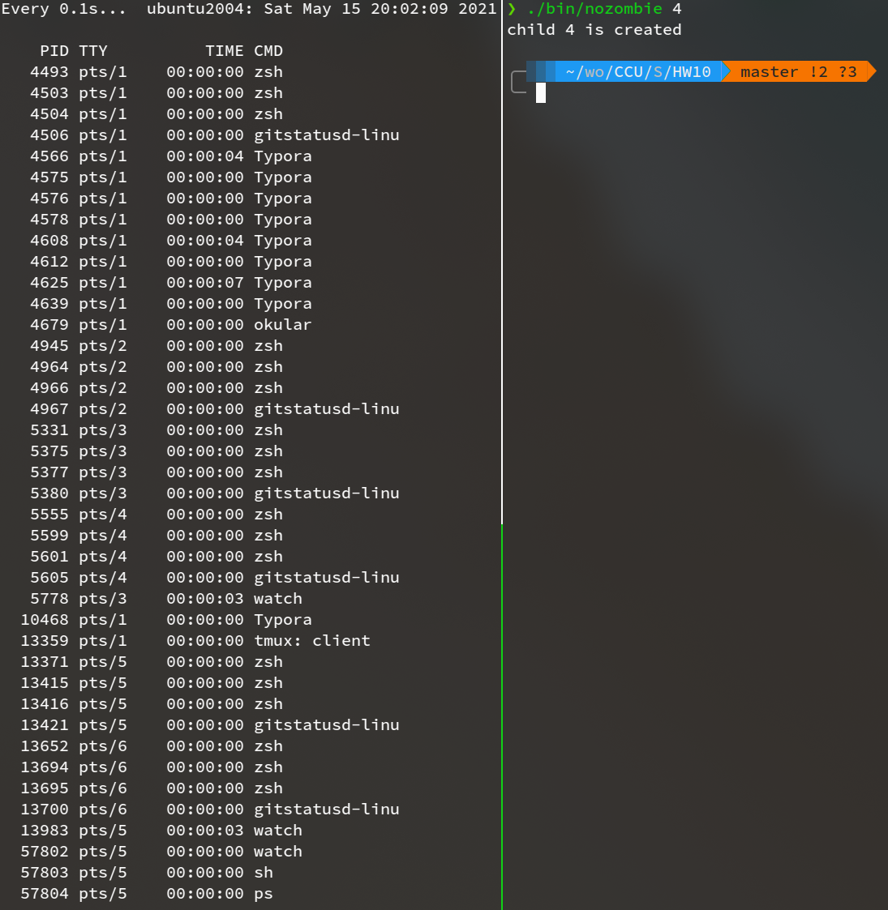

**System Programming Homework 10  資工2B 408410120 鍾博丞**

-----------------------------------------

## 環境配置

Operating System: Ubuntu 20.04 LTS using KDE plasma

**CPU: AMD R9 3900X 12C 24T @ 3.8GHz**

RAM: 32GB DDR4 3600MHz (Double channel)

SSD: WD Black 256G WDS256G1X0C TLC (Seq. R: 2050MB/s, Seq. W: 700MB/s, Random R: 170K IOPS, Random W: 130K IOPS)

## 執行與測試結果

### zombie

執行 `./bin/zombie` 會看到 10 個 zombie，使用 `watch -n 0.1 ps -a` 即可持續觀察 process 狀態

而 zombie 確實是殺不掉的

一定要等到 parent process 結束後，這些 zombie 才會由 systemd 回收

### nozombie

執行 `./bin/nozombie` ，確實每個產生的 child 結束後，都有被 parent wait() 回收掉

在程式結束後，使用 `watch -n 0.1 ps -a` 確實看不到任何 zombie

grep 一下，真的沒有

## Linux task_struct (Process Control Block)

測量結果，大小為 **6016 bytes**

有關詳細的資訊可以執行 `man slabinfo` 就可以看到

## 辛棄疾

辛棄疾生於[金國](https://zh.wikipedia.org/wiki/金國)，少年抗金歸[宋](https://zh.wikipedia.org/wiki/宋朝)，曾任[江西](https://zh.wikipedia.org/wiki/江西)[安撫使](https://zh.wikipedia.org/wiki/安撫使)、[福建](https://zh.wikipedia.org/wiki/福建)安撫使等職，因歸正人的身份，辛棄疾也始終未能得到[南宋](https://zh.wikipedia.org/wiki/南宋)朝廷的重用以及實現他北伐的夙願

http://m.deskcity.org/bizhi/220788.html

人生真的很多事情是身不由己的，那種力不從心的孤獨感，我幾乎是每天晚上都有這種感覺

我自己也常常晚上自己一個人到高處，倚著欄杆，眺望著遠方...

---------------------------------------------------------

最後的壓縮指令 
`tar jcvf filename.tar.bz2 target`

