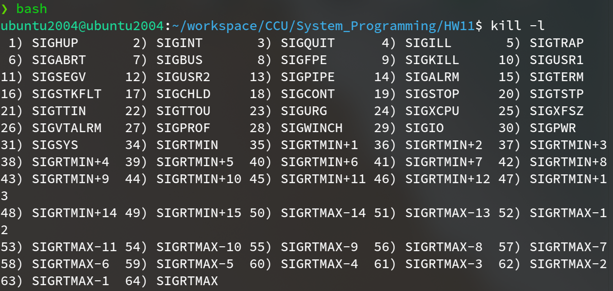
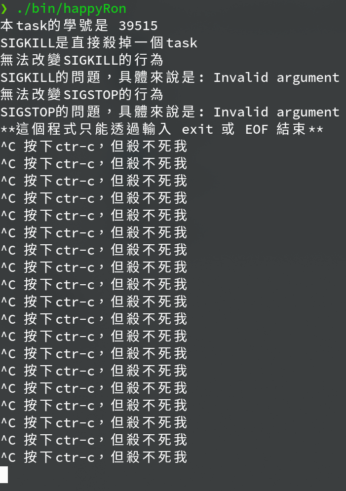
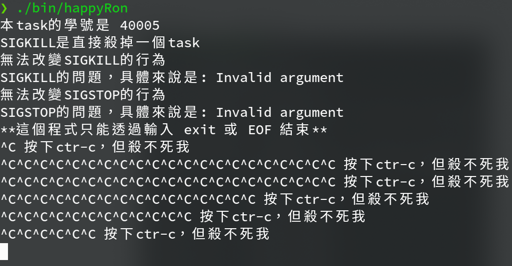
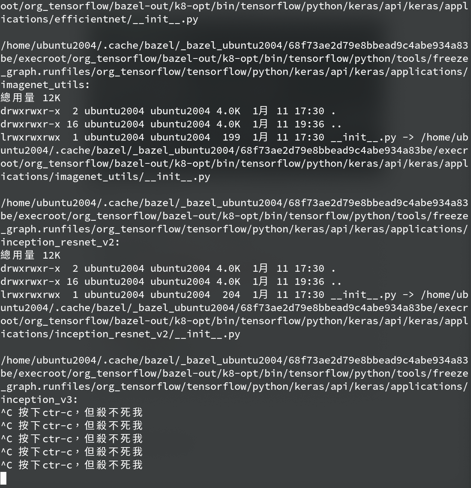
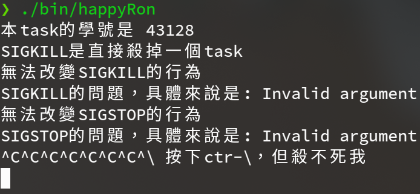
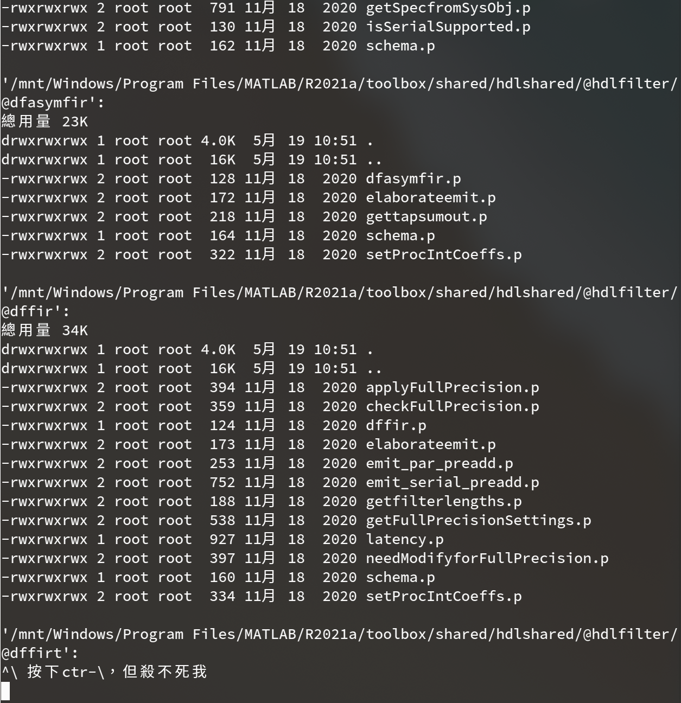

**System Programming Homework 11  資工2B 408410120 鍾博丞**

-----------------------------------------

## 環境配置

Operating System: Ubuntu 20.04 LTS using KDE plasma

**CPU: AMD R9 3900X 12C 24T @ 3.8GHz**

RAM: 32GB DDR4 3600MHz (Double channel)

SSD: WD Black 256G WDS256G1X0C TLC (Seq. R: 2050MB/s, Seq. W: 700MB/s, Random R: 170K IOPS, Random W: 130K IOPS)

## Signal

在 UNIX 裡，signal 是 IPC (Inter-Process Communication) 的一種方式，它是一種 **asynchronous** notification，當一個 signal 送給一個 process，OS 會中斷這個 process 的控制流程，然後來處理這個 signal


我們先來看有哪些 Linux 上有哪些 signal



可以看到 1~31 號是已經定義的，且是不可靠的信號 (信號可能會被丟棄，稍後會提到)，34~64 是使用者自定義的，是可靠的信號


這些已定義的 signal，大部分可以讓 process 接起來，由 programmer 自行決定如何處理，如果沒有特別處理，那就執行預設的動作

但是，No.9: SIGKILL, No.19: SIGSTOP 是不可以被 process 接起來的

No.9: SIGKILL 是用來結束這個 process 的

No.19: SIGSTOP 是用來暫停這個 process 的

有的時候程式太多，每個程式就會有部份程式碼被丟進 swap 空間裡，當 CPU 需要該 page 時，會發生 page fault，CPU 會花費大量的時間做 paging，將 page 從 swap 空間存回來，這個現象稱為 **thrashing**，使得 CPU 使用率大幅降低

此時，系統管理員就會需要這兩項工具，停止 thrashing，因此，這兩個 signal 至關重要，不可以被修改

No.2: SIGINT 預設是用來結束一個 process，其對應的控制終端 (常為鍵盤) 的組合鍵為 Ctrl+C

No.3: SIGQUIT 預設是用來結束一個 process，並將該 process 在 RAM 中的資訊存到硬碟裡 (core dumped)，其對應的組合鍵為 Ctrl+\

No.20: SIGTSTP 預設會將一個 process 暫停 (suspend) 並推到 background 執行，其對應的組合鍵為 Ctrl+Z


## Intercepting and Handling Signals

我們可以利用 signal() 的函數自己重新定義此程式接收到 signal 的動作

```c
#include <signal.h>
typedef void (*sighandler_t)(int);
sighandler_t signal(int signum, sighandler_t handler);
```

例如：我們將程式插入以下函數

```c
signal(SIGINT, sighandler);
```

並將 sighandler 宣告如下

```c
void sighandler(int signo) {
    if (signo == SIGINT) printf(" 按下ctr-c，但殺不死我\n");
}
```

當我們快速的連續按下 Ctrl + C，會看到以下情況



如果按下 10 次 Ctrl + C，會看到 10 次 Ctrl + C，但這只是因為我們的 sighandler 很簡短，printf() 一下子就執行完畢了

如果，我們將 sighandler 加上 `sleep(10);`，會看到以下情況



會發現，第一個 ^C 被接起來，第二個 pending 在外面，第三個以後直接丟棄，等到 10 秒後 sighandler 執行完畢後再讓 pending 的 signal 接起來，這就是所謂的**不可靠的信號**


接著，我們看看 signal 在 fork() 之後，child 能不能繼承 parent 的設定，我們讓 child 執行 execvp() 變成 ls

```c
char *const lsargv[] = { "ls", "/", "-alhR", NULL};
int child_pid = fork();
if (child_pid == 0) {    //child
    printf("child：child準備執行execv('ls')，等一下試著按下ctr-c\n");
    printf("child：如果按下ctr-c無法終止，試著按下ctr-\\\n");
    printf("child：按下輸入鍵以後開始\n");
    char c = getchar();
    execvp(lsargv[0], lsargv);
} else {    //parent
    printf("chld的pid是 %d\n", child_pid);
    signal(SIGCHLD, SIG_IGN);
    // 讓parent執行一個無窮迴圈
    while (fgets(input, 1024, stdin) != NULL) {
        if (input[strlen(input) - 1] == '\n')
            input[strlen(input) - 1] =  '\0';
        if (!strcmp(input, "exit")) break;
        else continue;
    }
}
```

在 child 執行 ls 時，我們按下 ^C，結果真的讓 ls 停下來了，代表 signal 的設定在 execve() 之後會回到初始狀態




如果將 main() 裡接收 SIGINT 的 function 改為

```c
signal(SIGINT, SIG_IGN);
```

那麼，就只會印出 ^C，沒有其他的動作，執行結果如下



不過呢，在這種情況下讓 child execve() 執行 ls，卻**真的可以讓 ls 不能被 ^C 中斷**



在 `man 7 signal` 中有提到

> A  child created via <font color=#FF0000>**fork**</font>(2) inherits a copy of its parent's signal dispositions. During an <font color=#FF0000>**execve**</font>(2), the dispositions of handled signals are reset to the default; the dispositions of <font color=#FF0000>ignored signals</font> are left <font color=#FF0000>unchanged.</font>


## The Pros and Cons of Signal

嵌入式程式可能會發現訊號對於行程間通訊很有用，因為訊號的計算和記憶體占用很小，但是，由於 race condition，對於處理 asynchronous 的 signal，就有著致命弱點，例如，如果要在 sighandler 裡使用 non-reentrant (e.g. malloc, printf)，面對 signal 再 signal 的情況下，也就是處理第一個 signal 時，中間又來一個 signal，就很有機會發生不可預期的錯誤，programmer 必須自己使用 sigprocmask() 來阻斷其他 signal 的傳入

---------------------------------------------------------

最後的壓縮指令 
`tar jcvf filename.tar.bz2 target`

