**System Programming Homework 12  資工2B 408410120 鍾博丞**

-----------------------------------------

## 環境配置

Operating System: Ubuntu 20.04 LTS using KDE plasma

**CPU: AMD R9 3900X 12C 24T @ 3.8GHz**

RAM: 32GB DDR4 3600MHz (Double channel)

SSD: WD Black 256G WDS256G1X0C TLC (Seq. R: 2050MB/s, Seq. W: 700MB/s, Random R: 170K IOPS, Random W: 130K IOPS)


## 執行動機與部份程式碼

將原本系統開啟的 stdin, stdout, stderr 關閉後重新以不同形式開啟，觀察 printf (stdin), getchar (stdout)，與 execve 成 ls 後其 stdout, stderr 的結果會如何

(1) 將 stdin 指向 /dev/null，在類Unix系統中，/dev/null，或稱空設備，是一個特殊的設備文件，它丟棄一切寫入其中的數據 (但報告寫入操作成功)，讀取它則會立即得到一個EOF。

```c
newin = freopen("/dev/null", "R+", stdin);          // 1️⃣ newin = 0x0
```

(2) 將 stdout 指向工作目錄中的檔案 stdout.log 並將其行為記錄下來

```c
newout = freopen("./stdout.log", "w+", stdout);     // 2️⃣
```

(3) 將 stderr 指向工作目錄中的檔案 stderr.log 並將其行為記錄下來

```c
newerr = freopen("./stderr.log", "w+", stderr);     // 3️⃣
```

(4) 使用 printf 試試看

(5) 使用 getchar 試試看

```c
for (int i = 0; i < 10; ++i) {
    printf("%d: hello\n", i);                       // 4️⃣
    // fflush(newout);
    c = getchar();                                  // 5️⃣ 
}
```

(6) 設定忽略 SIGHUP (signal hang up)

```c
signal(SIGHUP, SIG_IGN);                            // 6️⃣
```

(7) 將本程式 execve 成 ls

```c
execlp("ls", "ls", "/", "-R", NULL);                // 7️⃣
```


## 執行與測試結果

**直接執行**

對於 (5) 的 getchar 會立刻得到 EOF，所以使用者不需在 terminal 上額外輸入，(4), (5) 所在的迴圈會自動跑完

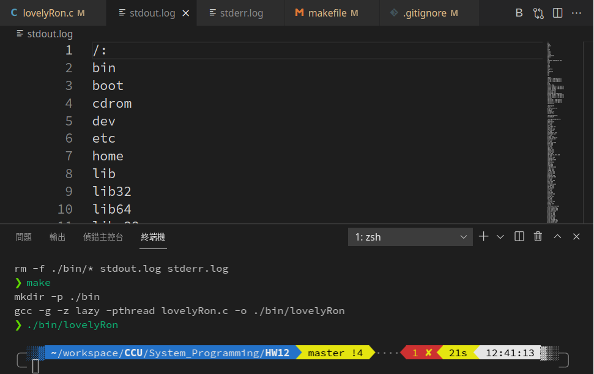

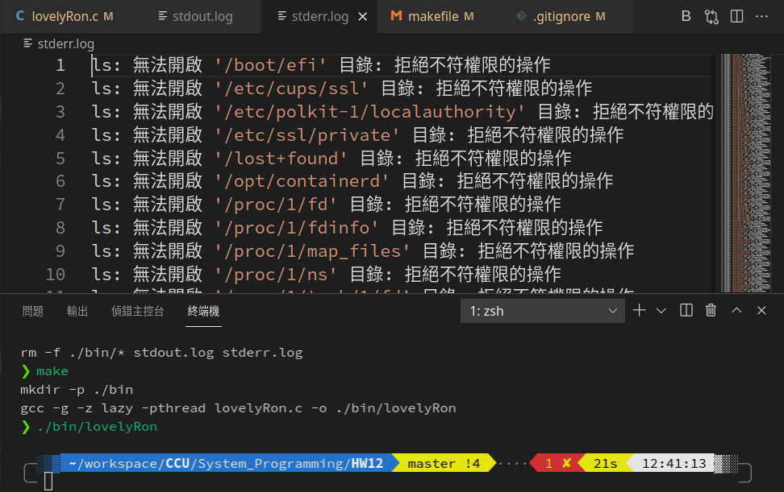

有發現 log 檔怪怪的嗎？稍後會做進一步說明


**將 (1) 註解掉，維持正常 stdin**

使用者需要真的輸入 10 個字元才能離開迴圈

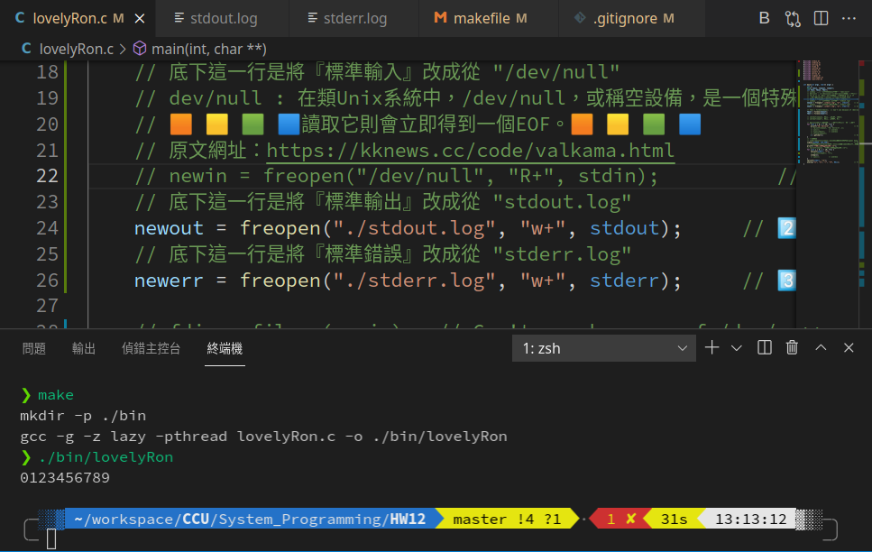


**將 (2) 註解掉，維持正常 stdout**

會將正確訊息印到螢幕上，將錯誤訊息寫到 stderr.log 裡面


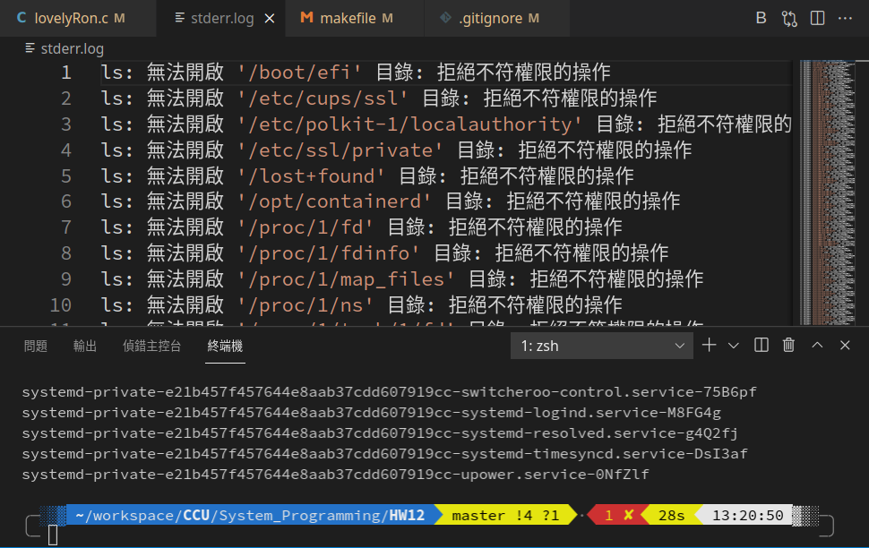


**將 (3) 註解掉，維持正常 stderr**

會將錯誤訊息印到螢幕上，將正確訊息寫到 stdout.log 裡面

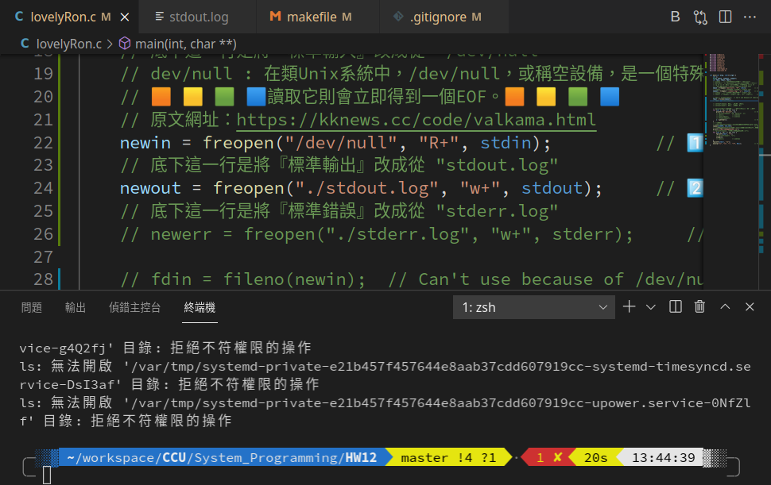

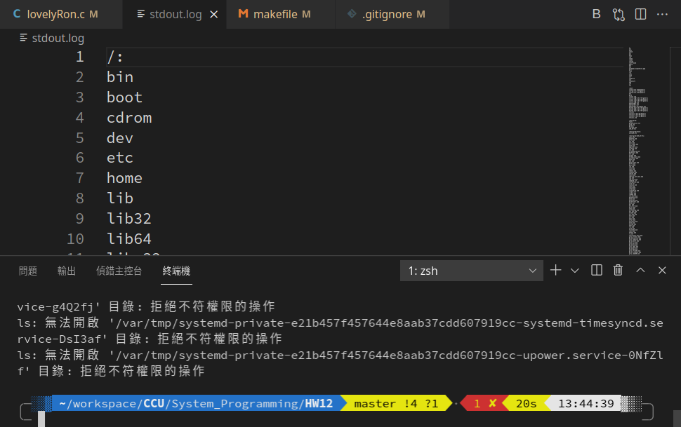


接著測試 (6)，在測試之前，為了讓狀態顯示明顯，將 (2), (3) 註解，並設定關閉視窗會有破碎特效 (KDE 特效)，可以截圖截到關閉視窗的那一瞬間

**將 (6) 註解掉，維持正常 SIGHUP 停止程式的行為**

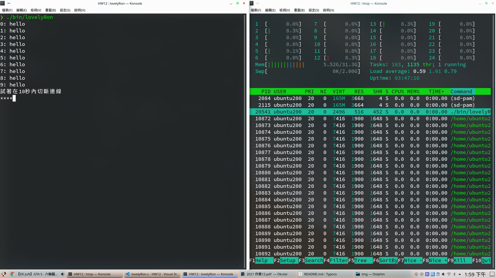

下圖可以由 htop 看到 ./bin/lovelyRon 已不存在

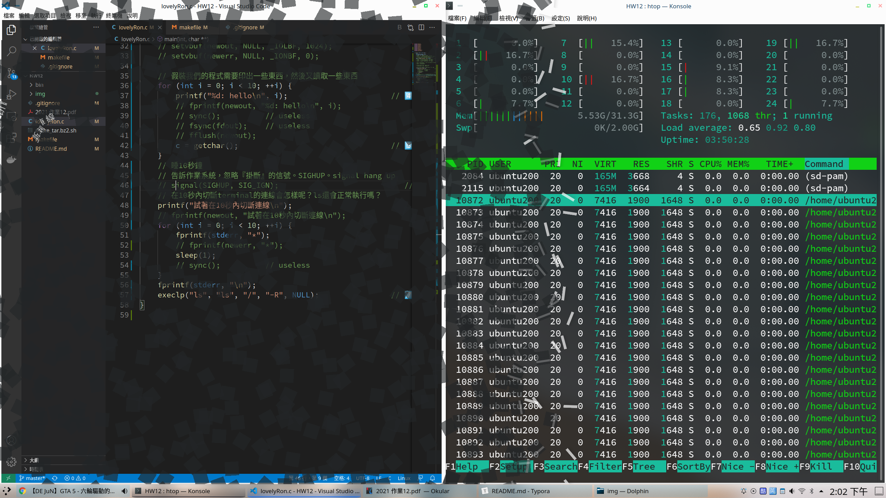


**當 (6) 存在時**，收到 SIGHUP 則忽略

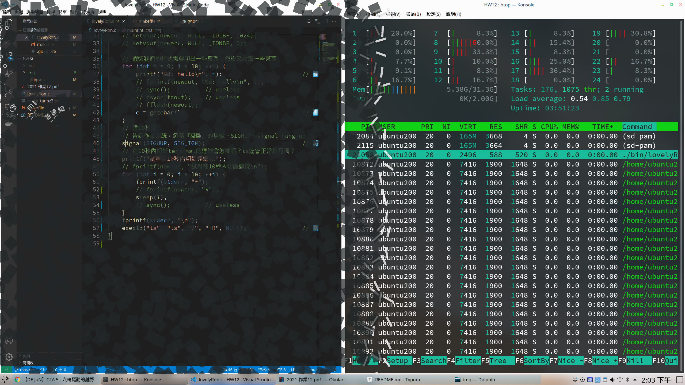


對於 (7) 的 execlp，註解掉 (1), (2), (3), (6) 影響不大，差別只有印出訊息的位置不同，以及收到 SIGHUP 會不會停止而已。在前一次的作業裡，已經證實 SIGIGN 在 execve 後會被保留

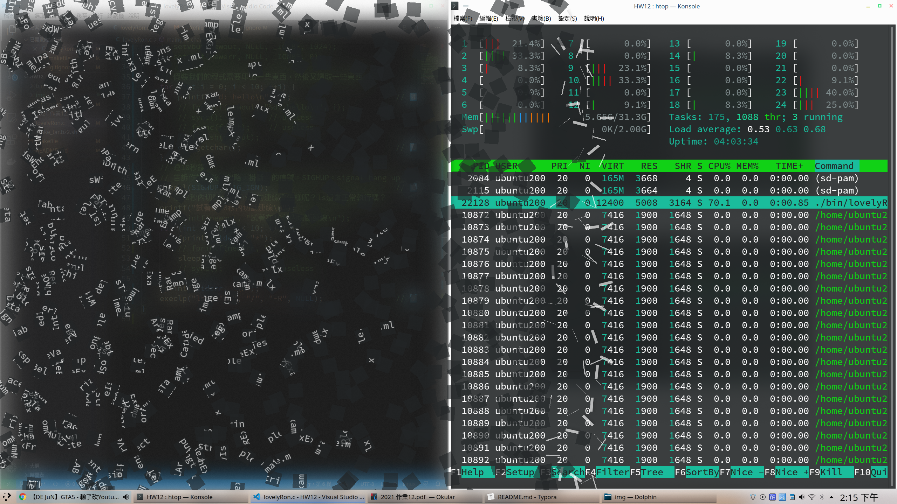


## freopen 的特性

fopen 和 freopen 都預設 4096 bytes 的 _IOFBF，故當 reopen stdout, stderr 之後，我們在 stdout.log 裡的 0-9: hello, 試著在10秒內切斷連線Orz；以及 stderr.log 的 * 都不會被印出來，因為存入字元尚未達到 4096 bytes，就被 execlp 成 ls 了

要解決這個問題，有兩種方法

#### setvbuf

```c
setvbuf(newout, NULL, _IOLBF, 1024);
setvbuf(newerr, NULL, _IONBF, 0);
```

設定完之後，新的 stdout 和 stderr 的行為就會比較像我們所熟悉的了


#### fflush(FILE *)

在每次 printf 之後都加上 `fflush(newout)`，每次 fprintf(stderr, "*"); 之後都加上 `fflush(newerr)` 就可以解決這個問題，只是這個作法比較麻煩


#### 執行結果

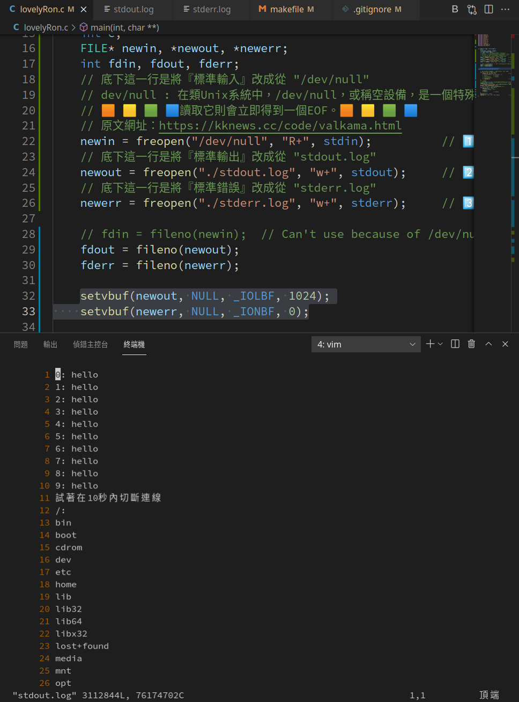

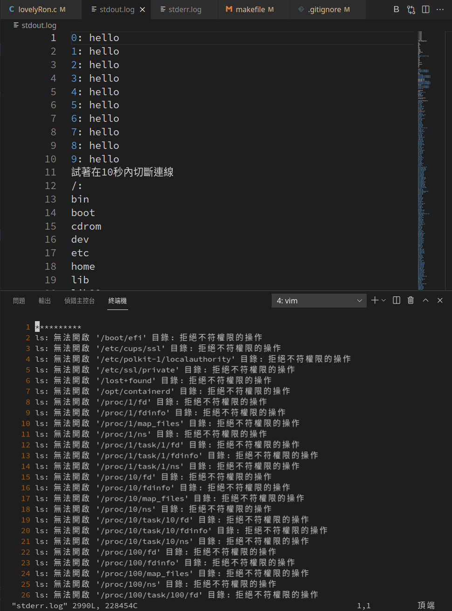

