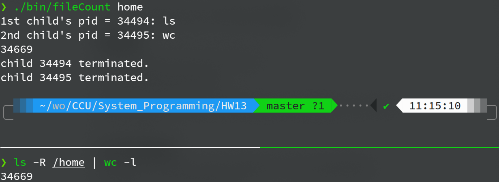
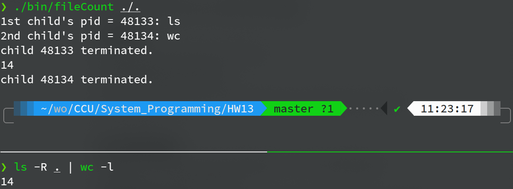
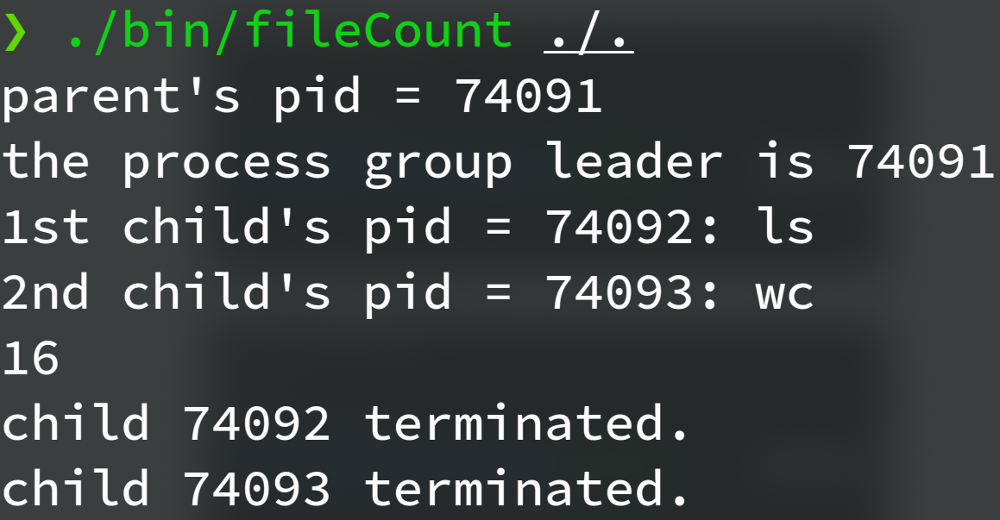

**System Programming Homework 13  資工2B 408410120 鍾博丞**

-----------------------------------------

## 環境配置

Operating System: Ubuntu 20.04 LTS using KDE plasma

**CPU: AMD R9 3900X 12C 24T @ 3.8GHz**

RAM: 32GB DDR4 3600MHz (Double channel)

SSD: WD Black 256G WDS256G1X0C TLC (Seq. R: 2050MB/s, Seq. W: 700MB/s, Random R: 170K IOPS, Random W: 130K IOPS)

## 執行與測試結果

本程式有對於 argv[1] 做輸入檢查，如果不是 / 開頭則自動加入 /，即執行 ls 的路徑皆為絕對路徑

**A.** 我們使用兩個 terminal 檢查執行結果是否正確

使用絕對路徑的執行結果如下

若不特別指定絕對路徑，則以絕對路徑計算

若需使用相對路徑，則必須加 ./ 才行

**B.** 收到 SIGINT 會終止 fileCount, ls, wc 三個程式

zsh 創造了 fileCount 並將 process group leader 自動設定為 fileCount，ls, wc 皆為 fileCount 所創造，故此三支程式皆為同一個 process group，故**不需要做額外的設定**，parent (fileCount) 收到 SIGINT 就會結束 process group 裡所有的程式

使用者可以使用 `watch -n 0.1 ps -a` 觀察按下 ^C 的瞬間是否同時殺掉三個程式

---------------------------------------------------------

最後的壓縮指令 
`tar jcvf filename.tar.bz2 target`

